```mermaid
graph TD
    A[🏗️ Cache Key v1] -->|Used| B[✅ Build Faster]
    B -->|Week passes| C[📆 Cache Key v2]
    C -->|Rebuilds cache| D[💾 Store New Snapshot]
    D -->|Used Next Week| E[⚡ Performance Restored]
```

# 🚀 Advanced Cache Key Strategies & Conditional Cache Updates

> **Goal:**  
> Build cache keys that are **unique when necessary**, **reusable when safe**, and **automatically invalidated** when dependencies or environments change.

Because if you get cache keys wrong, you either:

- **Miss caches** (and waste time re-installing everything) 💸
- Or **reuse stale caches** (and break your builds) 💥

So let’s make you a cache master 🧙‍♂️.

---

## ⚙️ The Anatomy of a Cache Key

A cache key defines **what conditions make a cache reusable**.
In real projects, you don’t just cache by OS — you cache by a combination of:

<div align="center" style="background-color: #141a19ff;color: #a8a5a5ff; border-radius: 10px; border: 2px solid">

| Factor                      | Example                   | Why it matters                           |
| --------------------------- | ------------------------- | ---------------------------------------- |
| **OS**                      | `ubuntu-latest`           | Linux vs Windows builds differ           |
| **Tool version**            | `node16`                  | Node 16 cache ≠ Node 18 cache            |
| **Dependency lock file**    | `package-lock.json`       | Different versions mean different caches |
| **Environment**             | `staging` vs `production` | Build contexts differ                    |
| **Architecture / Platform** | `x64` vs `arm64`          | Different binary outputs                 |

</div>

---

Let’s make it visual 👇

```mermaid
graph TD
    A[🧩 OS: Ubuntu] --> K
    B[🪄 Tool: Node.js 18] --> K
    C[📦 Lockfile: package-lock.json hash] --> K
    D[🏷️ Environment: prod] --> K
    K[[🔑 Cache Key: ubuntu-node18-prod-<hash>]]
```

<div align="center" style="background:#343739ff; border-radius:20px">



</div>

The hash ensures your cache refreshes automatically when dependencies change.

---

## 🧠 Smart Cache Key Examples

### Example 1 – Node.js

```yaml
key: ${{ runner.os }}-node-${{ matrix.node-version }}-${{ hashFiles('**/package-lock.json') }}
```

Here we combine:

- OS
- Node version (from matrix)
- Lockfile hash

This avoids cross-contamination across Node versions.

---

### Example 2 – .NET with Multiple Environments

```yaml
key: ${{ runner.os }}-nuget-${{ hashFiles('**/packages.lock.json') }}-${{ github.ref_name }}
```

This ensures separate caches for each branch (or environment).
So your `main` and `feature/login` caches won’t fight each other.

---

### Example 3 – Python (With Restore Fallback)

```yaml
key: ${{ runner.os }}-pip-${{ hashFiles('**/requirements.txt') }}
restore-keys: |
  ${{ runner.os }}-pip-
```

If the `requirements.txt` changes, you lose exact match but can restore older caches with the prefix `ubuntu-pip-`.

---

## 🎯 Conditional Cache Updates

Sometimes you don’t want to _always_ save a cache — only when:

- A previous step succeeded
- A file changed
- A condition met (e.g., branch is main)

You can use **`if:` expressions**.

```yaml
- name: Save cache only on main branch
  if: github.ref == 'refs/heads/main'
  uses: actions/cache@v4
  with:
    path: ~/.npm
    key: main-${{ hashFiles('**/package-lock.json') }}
```

This avoids polluting cache storage with temporary dev builds.

---

## 🧮 Conditional Invalidation Trick (Dynamic Hash Mix)

You can also **mix multiple hashes** for layered cache invalidation:

```yaml
key: ${{ runner.os }}-build-${{ hashFiles('**/package-lock.json', '**/*.js') }}
```

If _either_ dependency or source code changes, cache invalidates.
It’s like telling GitHub:

> “If my code or my dependencies change, rebuild cache — otherwise, reuse it.”

---

## 🔄 Incremental Cache Key Pattern

Sometimes you want a **fallback chain** of cache versions:

```yaml
key: build-v3-${{ hashFiles('**/package-lock.json') }}
restore-keys: |
  build-v3-
  build-v2-
  build-v1-
```

✅ If v3 doesn’t exist, GitHub tries v2 → then v1.
Perfect for progressive cache evolution without losing history.

---

## 🧩 Per-Job Cache Key (Dynamic Per Matrix)

When using **matrix builds**, you need per-matrix cache isolation.

```yaml
strategy:
  matrix:
    node: [16, 18, 20]

steps:
  - uses: actions/cache@v4
    with:
      path: ~/.npm
      key: npm-${{ matrix.node }}-${{ hashFiles('**/package-lock.json') }}
```

Each Node version gets its own cache — super clean.

---

## ⚗️ Conditional Restore Using Job Outputs

You can dynamically **pass a cache key** from one job to another.

```yaml
jobs:
  prepare:
    runs-on: ubuntu-latest
    outputs:
      cache-key: ${{ steps.compute.outputs.key }}
    steps:
      - id: compute
        run: echo "key=$(date +%Y%m%d)" >> $GITHUB_OUTPUT

  build:
    needs: prepare
    runs-on: ubuntu-latest
    steps:
      - uses: actions/cache@v4
        with:
          path: ~/.m2/repository
          key: ${{ needs.prepare.outputs.cache-key }}
```

**Why it’s cool:** You can make cache keys **context-aware** (e.g., by date or artifact version).

---

## ⚡ Conditional Cache Updates (Dynamic Logic)

### Example – Only Save Cache if Dependencies Changed

You can detect lockfile changes and decide to update cache.

```yaml
- name: Detect dependency changes
  id: deps
  run: |
    if git diff --name-only HEAD^ | grep package-lock.json; then
      echo "changed=true" >> $GITHUB_OUTPUT
    else
      echo "changed=false" >> $GITHUB_OUTPUT
    fi

- name: Save cache
  if: steps.deps.outputs.changed == 'true'
  uses: actions/cache@v4
  with:
    path: ~/.npm
    key: deps-${{ hashFiles('**/package-lock.json') }}
```

💡 **Result:** Cache only updates when it’s worth updating — not every build.

---

## 🧱 Multi-Layer Caching Strategy (Speed + Stability)

The **two-layer cache model** combines persistent base dependencies + short-term build cache:

```yaml
- name: Restore base dependencies
  uses: actions/cache@v4
  with:
    path: ~/.npm
    key: deps-${{ hashFiles('**/package-lock.json') }}
    restore-keys: deps-

- name: Restore build artifacts
  uses: actions/cache@v4
  with:
    path: build/
    key: build-${{ github.run_id }}
    restore-keys: build-
```

- **Layer 1:** Long-lived dependency cache
- **Layer 2:** Temporary build cache for speed

This setup balances **freshness** and **performance** beautifully.

---

## 🧹 Cache Rotation Strategy (Avoiding Storage Overload)

Since caches expire after **7 days** of inactivity, you can force rotation by embedding a **date**:

```yaml
key: ${{ runner.os }}-npm-${{ hashFiles('**/package-lock.json') }}-${{ github.run_id }}
```

or a **rolling week key:**

```yaml
key: week-${{ (github.run_number % 7) }}-${{ hashFiles('**/package-lock.json') }}
```

So every week, caches rotate automatically 🔄.

---

<div align="center" style="background:#343739ff; border-radius:20px">



</div>

---

## 🧠 Pro Tips

<div align="center" style="background-color: #141a19ff;color: #a8a5a5ff; border-radius: 10px; border: 2px solid">

| 💡 Tip                                 | Description                                                         |
| -------------------------------------- | ------------------------------------------------------------------- |
| Use hashFiles() on deterministic files | Like `package-lock.json`, `requirements.txt`, etc.                  |
| Mix multiple contexts                  | OS + tool version + branch                                          |
| Always use restore-keys                | It gives partial fallback when keys slightly differ                 |
| Avoid volatile identifiers             | Don’t use `github.run_id` unless you want a one-time cache          |
| Separate caches by job or matrix       | Prevent corruption between builds                                   |
| Log hit/miss                           | Use `${{ steps.cache.outputs.cache-hit }}` to monitor effectiveness |

</div>

---

## ⚡ Pro Example: Multi-Platform Node Build

```yaml
strategy:
  matrix:
    os: [ubuntu-latest, windows-latest]
    node: [16, 18]

steps:
  - uses: actions/checkout@v4

  - name: Cache node modules
    uses: actions/cache@v4
    with:
      path: ~/.npm
      key: ${{ matrix.os }}-node${{ matrix.node }}-${{ hashFiles('**/package-lock.json') }}
      restore-keys: |
        ${{ matrix.os }}-node${{ matrix.node }}-
        ${{ matrix.os }}-
```

This builds **four caches**, one per environment, and reuses them intelligently across runs.

---

## 🧩 Debugging Advanced Cache Flows

Add a debug step to log whether your cache hit:

```yaml
- name: Cache check
  run: echo "Cache hit? ${{ steps.cache.outputs.cache-hit }}"
```

If it prints `true`, your pipeline is flying 🚀
If it’s `false`, time to review your key logic.

---

## 📘 Summary

<div align="center" style="background-color: #141a19ff;color: #a8a5a5ff; border-radius: 10px; border: 2px solid">

| Concept                 | Description                                         |
| ----------------------- | --------------------------------------------------- |
| **Cache Key Design**    | Defines reuse conditions (OS, deps, tool, etc.)     |
| **Dynamic Hashes**      | Automatically invalidate when files change          |
| **Conditional Updates** | Save cache only when meaningful changes occur       |
| **Layered Caches**      | Combine short-term & long-term for best performance |
| **Fallback Keys**       | Partial matches to avoid full misses                |
| **Rotation Strategy**   | Keep caches fresh without manual cleanup            |

</div>

---

### 🧩 Final Thought

> Caching is not just about saving time — it’s about **thinking predictively**.
> A smart cache key means your workflow _knows when to trust yesterday’s work and when to rebuild_.

If your cache keys are too static, you’ll debug “weird old results.” 
If they’re too dynamic, you’ll never get a cache hit.

The art is in the balance ⚖️ — and now, you’ve got the mastery to tune it like a pro.
