```mermaid
graph TD
    A["🧱 Dockerfile Layers"] -->|Build| B["🐳 Local Layer Cache"]
    B -->|Runner ends| C["💣 Cache lost"]
    C -->|Use actions/cache| D["💾 GitHub Cache Storage"]
    D -->|Next run| E["🚀 Restored Cache"]
```

```mermaid
sequenceDiagram
    participant G as 🧑‍💻 GitHub Action
    participant R as 🐳 Docker Buildx
    participant C as 🏷️ Container Registry (GHCR)

    G->>R: Start Build
    R->>C: 🔍 Fetch cache (cache-from)
    alt Cache hit
        C-->>R: ✅ Layer restored
    else Cache miss
        R->>C: 🚧 Build new layers
        R->>C: 💾 Push cache (cache-to)
    end
    R-->>G: 🚀 Image built
```

```mermaid
graph TD
    A["🧱 Local Cache (actions/cache)"] --> B["🐳 Buildx"]
    B -->|Optional| C["🏷️ Registry Cache (GHCR/ECR)"]
    C --> D["🚀 Multi-platform Builds"]
    D --> E["⏱️ 80% Faster Docker CI"]
```

# 🐳 Caching for Docker Builds in GitHub Actions

> **Official Definition (simplified):**  
> Docker layer caching reuses previously built image layers so that unchanged layers don’t need to rebuild or re-download during subsequent runs.

Translation:

> Docker cache = “Don’t rebuild what hasn’t changed, genius.” 😎

---

## ⚙️ Why Docker Cache Matters

Every Dockerfile command (`FROM`, `RUN`, `COPY`, etc.) creates a **layer**.  
When you rebuild an image, Docker only rebuilds layers that changed — **if** it still has the previous layers available.

But in GitHub Actions, runners are ephemeral (they disappear after each run).  
So your precious Docker cache 💀 dies with them... unless you **save it manually**.

---

<div align="center" style="background:#343739ff; border-radius:20px">



</div>

---

## 🧩 Option 1 — Caching with `actions/cache`

The most universal approach: store Docker’s build cache directory in GitHub’s cache storage.

### Example

```yaml
jobs:
  build:
    runs-on: ubuntu-latest
    steps:
      - uses: actions/checkout@v4

      - name: Cache Docker layers
        uses: actions/cache@v4
        with:
          path: /tmp/.buildx-cache
          key: ${{ runner.os }}-buildx-${{ github.sha }}
          restore-keys: |
            ${{ runner.os }}-buildx-

      - name: Set up Docker Buildx
        uses: docker/setup-buildx-action@v3

      - name: Build and push image
        uses: docker/build-push-action@v6
        with:
          context: .
          push: false
          cache-from: type=local,src=/tmp/.buildx-cache
          cache-to: type=local,dest=/tmp/.buildx-cache-new,mode=max

      - name: Move new cache
        run: |
          rm -rf /tmp/.buildx-cache
          mv /tmp/.buildx-cache-new /tmp/.buildx-cache
```

### How it works

- **`actions/cache`** stores `/tmp/.buildx-cache` between runs.
- Buildx uses it as a **local cache source** and writes updates to `cache-to`.
- You then replace the old cache with the new one for next runs.

---

## ⚡ Option 2 — BuildKit + Registry Cache (Recommended for Teams)

> 💡 Best for multi-runner pipelines or shared caches across environments.

Instead of local cache directories, Docker can **push cache layers to a container registry** like GitHub Container Registry (GHCR), AWS ECR, or Azure ACR.

### Example (GHCR)

```yaml
- name: Set up Docker Buildx
  uses: docker/setup-buildx-action@v3

- name: Build and push image with registry cache
  uses: docker/build-push-action@v6
  with:
    context: .
    push: true
    tags: ghcr.io/${{ github.repository }}:latest
    cache-from: type=registry,ref=ghcr.io/${{ github.repository }}:buildcache
    cache-to: type=registry,ref=ghcr.io/${{ github.repository }}:buildcache,mode=max
```

### Explanation

- `cache-from`: pulls previous build layers from GHCR.
- `cache-to`: pushes new cache layers after build.
- `mode=max`: keeps all layers possible (great for shared pipelines).

---

<div align="center" style="background:#343739ff; border-radius:20px">



</div>

---

## 🧠 Layer Caching Best Practices

<div align="center" style="background-color: #141a19ff;color: #a8a5a5ff; border-radius: 10px; border: 2px solid">

| Layer                     | Cachable? | Notes                                                |
| ------------------------- | --------- | ---------------------------------------------------- |
| `FROM` base image         | ✅        | Cached if same tag & digest                          |
| `RUN apt-get install ...` | ✅        | Cache invalidates when package list changes          |
| `COPY package.json`       | ✅        | Keep dependency files separate for faster caching    |
| `COPY . .`                | ⚠️        | Avoid copying entire repo early (breaks cache often) |
| `RUN npm install`         | ✅        | Depends on previous `COPY` layer                     |

</div>

### Example of Cache-Friendly Dockerfile

```dockerfile
FROM node:18
WORKDIR /app

# 1️⃣ Copy only dependency files first
COPY package*.json ./

# 2️⃣ Install dependencies
RUN npm ci

# 3️⃣ Copy remaining files
COPY . .

CMD ["npm", "start"]
```

> 💡 Keep `COPY . .` at the bottom — otherwise, any code change invalidates all previous layers.

---

## 🧮 Combining Cache + Artifact

You can pair cache and artifacts for **hybrid optimization**:

```yaml
- name: Cache Docker layers
  uses: actions/cache@v4
  with:
    path: /tmp/.buildx-cache
    key: ${{ runner.os }}-docker-${{ github.sha }}

- name: Upload build results
  uses: actions/upload-artifact@v4
  with:
    name: built-image
    path: ./dist
```

- Cache → saves layer data between builds.
- Artifact → saves compiled image or binaries between jobs.

---

## 🔁 Multi-Platform Build Caching (amd64 + arm64)

If you’re building for multiple architectures:

```yaml
- name: Build multi-platform image
  uses: docker/build-push-action@v6
  with:
    context: .
    platforms: linux/amd64,linux/arm64
    push: true
    tags: ghcr.io/${{ github.repository }}:latest
    cache-from: type=registry,ref=ghcr.io/${{ github.repository }}:cache
    cache-to: type=registry,ref=ghcr.io/${{ github.repository }}:cache,mode=max
```

✅ **BuildKit** automatically manages cache per platform.
✅ Speeds up both architectures in future runs.

---

## 🧱 Shared Cache Between Branches

To reuse caches between branches:

```yaml
cache-from: type=registry,ref=ghcr.io/${{ github.repository }}:buildcache-${{ github.base_ref || 'main' }}
cache-to: type=registry,ref=ghcr.io/${{ github.repository }}:buildcache-${{ github.ref_name }},mode=max
```

That means:

- Each branch maintains its own cache
- But fallbacks to the `main` branch cache when available 🪄

---

## 🧩 Cache Invalidation Strategy

<div align="center" style="background-color: #141a19ff;color: #a8a5a5ff; border-radius: 10px; border: 2px solid">

| Strategy                | Method                                 | When to Use                           |
| ----------------------- | -------------------------------------- | ------------------------------------- |
| **SHA key**             | Use `${{ github.sha }}`                | Forces rebuild for every commit       |
| **Lockfile hash**       | `hashFiles('package-lock.json')`       | Best for dependency-driven rebuilds   |
| **Weekly rotation**     | Include `${{ github.run_number % 7 }}` | Keeps cache fresh                     |
| **Registry digest tag** | Use base image digest                  | When rebuilding on base image updates |

</div>

---

## 🧠 Debugging Docker Cache

Add verbosity to inspect cache hits/misses:

```yaml
- name: Debug cache
  run: docker buildx build . --progress=plain
```

or use:

```yaml
- name: Check buildx state
  run: docker buildx du
```

---

## 🧹 Cleaning Cache in GHCR

If GHCR storage grows large:

```bash
gh api repos/<owner>/<repo>/packages/container/<package>/versions | jq '.[].id' | xargs -I {} gh api -X DELETE repos/<owner>/<repo>/packages/container/<package>/versions/{}
```

---

<div align="center" style="background:#343739ff; border-radius:20px">



</div>

---

## 📘 Summary Table

| Feature                    | Local Cache (`actions/cache`) | Registry Cache (BuildKit)     |
| -------------------------- | ----------------------------- | ----------------------------- |
| **Scope**                  | Per-runner                    | Global (shared)               |
| **Persistence**            | 7 days (GitHub cache)         | Permanent (in registry)       |
| **Performance**            | Very fast restore             | Depends on network            |
| **Multi-platform support** | ❌ No                         | ✅ Yes                        |
| **Recommended for**        | Small projects                | Enterprise CI/CD              |
| **Example tool**           | `actions/cache@v4`            | `docker/build-push-action@v6` |

---

### 🧩 Final Thought

> Docker caching is like remembering what you cooked yesterday —
> if the ingredients haven’t changed, why re-chop all the onions again? 🧅

Whether you use **actions/cache** or **registry-based caching**,
the principle is the same: **avoid rebuilding layers unnecessarily**.

Combined with smart cache keys and matrix builds,
your pipelines will go from _“pulling all dependencies again?!”_ → to _“instant builds in under a minute.”_

---

Would you like me to continue next with **🧠 Topic: Self-hosted Runners + Persistent Docker Caching (Advanced Build Environments)** — where I’ll show how to use persistent disks or volume mounts to keep Docker cache across builds automatically (no manual actions/cache steps)?
