```mermaid
graph TD
    A["👨‍💻 Dev pushes code"]
    B["🏗️ Build Job #1"]
    C["🏗️ Build Job #2"]
    D["🚦 Concurrency Group"]

    A --> B
    A --> C
    B --> D
    C --> D
    D -->|"Keeps only 1 active"| B
```

```mermaid
sequenceDiagram
    participant Dev as 👩‍💻 Dev pushes commits
    participant Queue as ⚙️ GitHub Queue
    participant Job1 as 🏗️ Job #1
    participant Job2 as 🏗️ Job #2
    participant Job3 as 🏗️ Job #3

    Dev->>Queue: push commit 1
    Dev->>Queue: push commit 2
    Dev->>Queue: push commit 3
    Queue->>Job1: Start Job #1
    Queue->>Job2: Cancel Job #1, start Job #2
    Queue->>Job3: Cancel Job #2, start Job #3
```

```mermaid
graph TD
    A["🏗️ Workflow Run 1"]
    B["🏗️ Workflow Run 2"]
    C["🏗️ Workflow Run 3"]
    D["🚦 Concurrency Group: deploy-prod"]

    A --> D
    B --> D
    C --> D
    D -->|"Only 1 active at a time"| A
```

# ⚙️ **GitHub Actions Job Concurrency**

## 📘 Official Definition

> **Concurrency** in GitHub Actions controls how many workflow runs can execute simultaneously in a given scope.
>
> It ensures that **only one run of a specific type (e.g., branch, environment, service)** is active at a time — older runs can be **canceled** or **queued** automatically.

In other words:

> It’s your workflow’s “traffic controller” 🦺 that prevents two jobs from clashing when they modify the same resource.

---

<div align="center" style="background:#343739ff; border-radius:20px">



</div>

---

## 🎯 Why We Need Concurrency

Without concurrency control, this can happen 👇

- You push multiple commits rapidly to `main`.
- Each push triggers a new workflow run.
- All of them **build** and **deploy** at the same time 🤯
- Result: race conditions, broken environments, or half-deployed systems.

Concurrency prevents that mess.

It allows you to:

- Cancel outdated runs automatically
- Prevent overlapping deploys
- Control resources when you have limited runners

---

## 🧩 Syntax

You add concurrency at either **workflow** or **job** level:

```yaml
concurrency:
  group: <string>
  cancel-in-progress: <boolean>
```

---

### Example 1 — Basic Concurrency

```yaml
name: 🚀 Deploy

on:
  push:
    branches: [main]

concurrency:
  group: production-deploy
  cancel-in-progress: true

jobs:
  deploy:
    runs-on: ubuntu-latest
    steps:
      - run: echo "Deploying production..."
```

🧠 What happens:

- If a new commit comes to `main` while another deploy is running,
  → the **previous one gets canceled** (`cancel-in-progress: true`).
- Only one job in the **group “production-deploy”** runs at a time.

✅ Ideal for production or staging deployments.

---

### Example 2 — Dynamic Group Names

You can make concurrency smarter using **expressions**:

```yaml
concurrency:
  group: deploy-${{ github.ref }}
  cancel-in-progress: true
```

💡 This creates unique concurrency groups per branch or environment:

<div align="center" style="background:#343739ff; border-radius:20px">

| Branch | Concurrency Group      |
| ------ | ---------------------- |
| main   | deploy-refs/heads/main |
| dev    | deploy-refs/heads/dev  |

</div>

---

Now, `main` and `dev` can deploy independently, but **only one deploy per branch** at a time.

---

<div align="center" style="background:#343739ff; border-radius:20px">


</div>

---

### Example 3 — Per Job Concurrency

You can also define concurrency at the **job level**, not globally:

```yaml
jobs:
  build:
    runs-on: ubuntu-latest
    concurrency:
      group: build-${{ github.ref }}
      cancel-in-progress: true
    steps:
      - run: npm ci && npm run build

  deploy:
    runs-on: ubuntu-latest
    concurrency:
      group: deploy-${{ github.environment }}
      cancel-in-progress: false
    steps:
      - run: ./deploy.sh
```

✅ Different jobs can have different concurrency behavior:

- Build → cancels older builds per branch
- Deploy → queued, never canceled (safe for production rollouts)

---

## 🧠 Example 4 — Concurrency per Environment

```yaml
jobs:
  deploy:
    environment: production
    concurrency:
      group: production-deploy
      cancel-in-progress: false
```

🧩 GitHub automatically enforces concurrency for **environments** (like “staging”, “prod”)
but setting it explicitly gives you more control.

---

## 🧱 Example 5 — Combining with Matrix Strategy

Let’s say you have a matrix build:

```yaml
jobs:
  build:
    strategy:
      matrix:
        node: [16, 18, 20]
    concurrency:
      group: build-${{ matrix.node }}
      cancel-in-progress: true
    runs-on: ubuntu-latest
    steps:
      - run: echo "Building Node ${{ matrix.node }}"
```

🧩 Each Node version will run in its own concurrency group:

- build-16
- build-18
- build-20

They run **independently** without blocking each other.

---

## 💣 Example 6 — Without Concurrency (Chaos Mode 😈)

```yaml
on:
  push:
    branches: [main]

jobs:
  deploy:
    runs-on: ubuntu-latest
    steps:
      - run: ./deploy.sh
```

You push 3 commits quickly:

- 3 deploys start simultaneously
- The newest may finish first, and the oldest overwrites it
- Production now runs an older build 🚨

Concurrency fixes this instantly.

---

<div align="center" style="background:#343739ff; border-radius:20px">



</div>

---

## 🧠 Advanced Tip — Use Context Variables for Smart Groups

Dynamic concurrency group example:

```yaml
concurrency:
  group: ${{ github.workflow }}-${{ github.event.pull_request.number || github.ref }}
  cancel-in-progress: true
```

✅ Each PR gets its own concurrency group.
So builds for different PRs don’t block each other — but each PR cancels its own previous run when updated.

---

## ⚙️ Example 7 — Queued (Instead of Canceled)

You can keep older runs waiting until the current one finishes:

```yaml
concurrency:
  group: nightly-builds
  cancel-in-progress: false
```

🕓 Meaning:

- If a run is active, new runs are **queued**.
- When the first one finishes, the next starts.

Best for **nightly jobs**, **batch processing**, or **non-destructive updates**.

---

## 🧭 Real-World Use Cases

<div align="center" style="background:#343739ff; border-radius:20px">

| Use Case             | Concurrency Setup                                   | Why                                  |
| -------------------- | --------------------------------------------------- | ------------------------------------ |
| Production Deploy    | `cancel-in-progress: true`                          | Prevents overlapping deploys         |
| Branch Build         | `group: build-${{ github.ref }}`                    | Each branch has isolated concurrency |
| PR Validation        | `group: pr-${{ github.event.pull_request.number }}` | Cancels outdated PR checks           |
| Nightly Jobs         | `cancel-in-progress: false`                         | Queue next after completion          |
| Environment Rollouts | `group: deploy-${{ github.environment }}`           | One deploy per environment           |

</div>

---

## 💬 TL;DR by Your Human Mentor

> Think of **concurrency** like a “bouncer” at your CI/CD nightclub 🍸.
>
> It lets one workflow in, and if another shows up too soon — either makes it wait (queued) or kicks it out (cancel-in-progress).
>
> Use it to prevent:
>
> - double deployments 🧨
> - wasted builds 💸
> - chaos in shared environments 🌪️

When used properly, it keeps your pipelines **disciplined, efficient, and predictable**.

---

<div align="center" style="background:#343739ff; border-radius:20px">



</div>

---

## ✅ Summary Table

<div align="center" style="background:#343739ff; border-radius:20px">

| Property             | Description                                                              |
| -------------------- | ------------------------------------------------------------------------ |
| `group`              | Defines which runs belong to the same concurrency group                  |
| `cancel-in-progress` | Cancels running jobs when a new one in the same group starts             |
| `queued behavior`    | When `false`, new runs wait until current one completes                  |
| **Scope**            | Can be defined at workflow or job level                                  |
| **Dynamic Values**   | Supports `${{ github.ref }}`, `${{ github.workflow }}`, PR numbers, etc. |
| **Main Benefit**     | Prevents overlapping or duplicate runs in CI/CD pipelines                |

</div>

---

Would you like me to continue next with “Concurrency + Deployment Protection Rules” (how concurrency interacts with environments, approvals, and protection gates)?
