```mermaid
sequenceDiagram
    participant G as 🧑‍💻 GitHub Runner
    participant A as 🔐 docker/login-action
    participant R as 🐳 Docker Registry (e.g., Docker Hub)

    G->>A: Execute action with username & token
    A->>R: POST /v2/login (Basic Auth)
    R-->>A: 200 OK (session token)
    A-->>G: Logged in ✅
    G->>R: docker push / pull (authenticated)
```

```mermaid
graph TD
    A["🔐 docker/login-action@v3"] --> B["🐳 Authenticated Session"]
    B --> C["🚀 docker/build-push-action"]
    C --> D["📦 Private Registry (GHCR, ACR, etc.)"]
    D --> E["✅ Image Pushed Successfully"]
```

# 🐳 `docker/login-action` — The Key to Private Docker Registries

> **Official Definition:**  
> The `docker/login-action` action logs into a Docker registry using credentials so that you can push, pull, or build images that require authentication inside a GitHub Actions workflow.

In human terms:

> It’s like giving your workflow the “keys” to the Docker registry so it can publish or pull images — without you manually typing `docker login` in every build. 🔑

---

## ⚙️ Why We Need It

By default, GitHub-hosted runners run in a **clean, unauthenticated** environment.
So if you try to push or pull from a private registry:

```bash
docker push ghcr.io/username/myapp:latest
```

you’ll get:

```ini
denied: permission denied, unable to access resource
```

That’s where this little hero comes in:

```yaml
- uses: docker/login-action@v3
```

It securely logs into your registry using credentials from secrets — and keeps them **ephemeral and encrypted** during runtime.

---

## 🧩 Basic Syntax

```yaml
- name: Login to Docker Hub
  uses: docker/login-action@v3
  with:
    username: ${{ secrets.DOCKERHUB_USERNAME }}
    password: ${{ secrets.DOCKERHUB_TOKEN }}
```

After this step:

- Every `docker build`, `docker push`, or `docker pull` command in your workflow will use that authenticated session.
- You don’t need to call `docker login` manually again.

---

<div align="center" style="background:#343739ff; border-radius:20px">



</div>

---

## 🧱 Supported Registries

<div align="center" style="background:#343739ff; border-radius:20px">

| Registry                             | `registry:` value                             | Required credentials                                  |
| ------------------------------------ | --------------------------------------------- | ----------------------------------------------------- |
| **Docker Hub**                       | `docker.io` _(default)_                       | `username` + `token`                                  |
| **GitHub Container Registry (GHCR)** | `ghcr.io`                                     | `${{ github.actor }}` + `${{ secrets.GITHUB_TOKEN }}` |
| **AWS ECR**                          | `aws_account_id.dkr.ecr.region.amazonaws.com` | AWS creds or token                                    |
| **Azure ACR**                        | `<registry>.azurecr.io`                       | `username` + `password` or service principal          |
| **Google GCR / Artifact Registry**   | `gcr.io` / `<region>-docker.pkg.dev`          | JSON key as password                                  |
| **Private registries**               | Custom domain                                 | Any valid credentials                                 |

</div>

---

## 🧩 Example — Docker Hub (Classic)

```yaml
- name: Login to Docker Hub
  uses: docker/login-action@v3
  with:
    username: ${{ secrets.DOCKERHUB_USERNAME }}
    password: ${{ secrets.DOCKERHUB_TOKEN }}
```

> **Tip:** Always use a **token**, not your Docker Hub password!
> Tokens can be generated under [Docker Hub → Account Settings → Security → Access Tokens](https://hub.docker.com/settings/security).

---

## 🧩 Example — GitHub Container Registry (GHCR)

GitHub makes this incredibly easy since it supports your repo’s built-in token:

```yaml
- name: Login to GitHub Container Registry
  uses: docker/login-action@v3
  with:
    registry: ghcr.io
    username: ${{ github.actor }}
    password: ${{ secrets.GITHUB_TOKEN }}
```

✅ This automatically gives permission to push to:

```ini
ghcr.io/<owner>/<repo>/<image-name>
```

---

## 🧩 Example — AWS ECR (Elastic Container Registry)

If you use ECR, you don’t need to pass static creds — just use `aws-actions/configure-aws-credentials`.

```yaml
- name: Configure AWS credentials
  uses: aws-actions/configure-aws-credentials@v4
  with:
    role-to-assume: arn:aws:iam::<account-id>:role/CI-CD-Role
    aws-region: us-east-1

- name: Login to Amazon ECR
  uses: docker/login-action@v3
  with:
    registry: <account-id>.dkr.ecr.us-east-1.amazonaws.com
```

This automatically uses the credentials configured by AWS action above — no password needed. 🔒

---

## 🧩 Example — Azure Container Registry (ACR)

```yaml
- name: Login to Azure Container Registry
  uses: docker/login-action@v3
  with:
    registry: myregistry.azurecr.io
    username: ${{ secrets.AZURE_ACR_USERNAME }}
    password: ${{ secrets.AZURE_ACR_PASSWORD }}
```

You can also use a **service principal** with Contributor access on your ACR.

---

## 🧩 Example — Google Artifact Registry

```yaml
- name: Login to Google Artifact Registry
  uses: docker/login-action@v3
  with:
    registry: us-central1-docker.pkg.dev
    username: _json_key
    password: ${{ secrets.GCP_SERVICE_ACCOUNT_KEY }}
```

Here the entire JSON key of the GCP service account is stored as a GitHub secret.

---

## 🔄 Multiple Logins (Multi-Registry Projects)

If your workflow pushes to multiple registries, just chain multiple login steps:

```yaml
- name: Login to Docker Hub
  uses: docker/login-action@v3
  with:
    username: ${{ secrets.DOCKERHUB_USERNAME }}
    password: ${{ secrets.DOCKERHUB_TOKEN }}

- name: Login to GHCR
  uses: docker/login-action@v3
  with:
    registry: ghcr.io
    username: ${{ github.actor }}
    password: ${{ secrets.GITHUB_TOKEN }}
```

The action handles multiple credentials internally — each login persists for the job’s duration.

---

## 🧠 Behavior Details

<div align="center" style="background:#343739ff; border-radius:20px">

| Behavior             | Explanation                                                        |
| -------------------- | ------------------------------------------------------------------ |
| **Session Scope**    | Login applies to the current job (each job runs in a fresh VM)     |
| **Password Storage** | Stored temporarily in the Docker config at `~/.docker/config.json` |
| **Security**         | Credentials are masked in logs                                     |
| **Token Expiration** | Depends on registry (GitHub Token = job-lifetime)                  |
| **Logout**           | Happens automatically when job ends                                |

</div>

---

## 🧩 Logout Manually (Optional)

You can explicitly log out (useful for self-hosted runners):

```yaml
- name: Logout from Docker
  run: docker logout ghcr.io
```

---

## 🧠 Common Real-World Patterns

### Pattern 1 — Private Base Image Access

If your base image is private:

```yaml
FROM ghcr.io/myorg/baseimage:latest
```

You must log in _before_ `docker build`:

```yaml
- uses: docker/login-action@v3
  with:
    registry: ghcr.io
    username: ${{ github.actor }}
    password: ${{ secrets.GITHUB_TOKEN }}
- run: docker build -t myimage .
```

---

### Pattern 2 — CI/CD Push After Build

```yaml
- uses: docker/build-push-action@v6
  with:
    push: true
    tags: ghcr.io/${{ github.repository }}:latest
```

Since login is already done, this push works seamlessly. ✅

---

### Pattern 3 — Combine Login + Cache

Combine with caching for ultimate efficiency:

```yaml
- uses: docker/login-action@v3
  with:
    registry: ghcr.io
    username: ${{ github.actor }}
    password: ${{ secrets.GITHUB_TOKEN }}

- uses: docker/build-push-action@v6
  with:
    push: true
    cache-from: type=registry,ref=ghcr.io/${{ github.repository }}:cache
    cache-to: type=registry,ref=ghcr.io/${{ github.repository }}:cache,mode=max
```

---

<div align="center" style="background:#343739ff; border-radius:20px">



</div>

---

## 🧠 Best Practices

<div align="center" style="background:#343739ff; border-radius:20px">

| Tip                                         | Why                                                  |
| ------------------------------------------- | ---------------------------------------------------- |
| Use **tokens** not passwords                | Passwords can expire or rotate                       |
| Always use `${{ secrets.* }}`               | Never hardcode credentials                           |
| Prefer **registry cache** for Docker builds | Faster + persistent                                  |
| Limit secret scopes                         | Avoid organization-wide tokens for single repo       |
| Log in early                                | Run `docker/login-action` before any build/push/pull |
| Use GHCR for GitHub Projects                | Built-in permissions and automatic token             |

</div>

---

## 📘 Summary Table

<div align="center" style="background:#343739ff; border-radius:20px">

| Property                 | Description                             |
| ------------------------ | --------------------------------------- |
| **Action name**          | `docker/login-action@v3`                |
| **Purpose**              | Authenticate to Docker registry         |
| **Input fields**         | `registry`, `username`, `password`      |
| **Default registry**     | Docker Hub (`docker.io`)                |
| **Output**               | Authenticated session for `docker` CLI  |
| **Supported registries** | Docker Hub, GHCR, ACR, ECR, GCR, custom |
| **Logout**               | Auto on job end                         |

</div>

---

### 🧩 Final Thought

> Think of `docker/login-action` as your registry’s bouncer pass.  
> Without it, your workflow is just a random guy at the club door saying, “Hey, can I push this image?” 😅  
> With it, your builds glide right in like VIP.
