```mermaid
sequenceDiagram
    participant G as 🧑‍💻 GitHub Runner
    participant L as 🔐 docker/login-action
    participant B as ⚙️ docker/build-push-action
    participant R as 🐳 Registry (e.g., GHCR / DockerHub)

    G->>L: Login with registry credentials
    L-->>G: Session authenticated
    G->>B: Build image using BuildKit
    B->>R: Push image tag(s)
    R-->>B: 200 OK ✅
    B-->>G: Build + Push complete
```

# 🐳 `docker/build-push-action` — The Powerhouse of Docker CI/CD

> **Official Definition:**  
> The [`docker/build-push-action`](https://github.com/docker/build-push-action) builds and optionally pushes Docker images using [BuildKit](https://docs.docker.com/build/buildkit/) (the modern high-performance builder engine by Docker).

---

## ⚙️ **Why We Need It**

Normally, in your local machine, you’d run:

```bash
docker build -t myapp:latest .
docker push myapp:latest
```

In GitHub Actions, you can automate this with a single YAML step — **more efficient**, **cache-friendly**, and **secure**.

Without it:

- You’d need multiple `run:` steps with `docker build` + `docker push` commands.
- You’d lose **caching**, **multi-platform**, and **BuildKit** optimizations.
- Your workflow would be **slow** and **repetitive**.

So, instead, we use this action 👇

---

## 🧩 **Basic Example — Build + Push**

```yaml
- name: Build and Push Docker Image
  uses: docker/build-push-action@v6
  with:
    context: .
    file: ./Dockerfile
    push: true
    tags: ghcr.io/${{ github.repository }}:latest
```

💡 **How it works:**

1. It uses the source code from the repo.
2. Builds a Docker image.
3. Tags it (in this case, `:latest`).
4. Pushes it to the registry you’re logged into (thanks to `docker/login-action`).

---

<div align="center" style="background:#343739ff; border-radius:20px">



</div>

---

## 🧠 **Parameters Breakdown (Simplified)**

<div align="center" style="background:#343739ff; border-radius:20px">

| Parameter        | Description                                                                    |
| ---------------- | ------------------------------------------------------------------------------ |
| **`context`**    | Build context directory (default: `.`)                                         |
| **`file`**       | Path to the Dockerfile                                                         |
| **`push`**       | `true` = push image to registry                                                |
| **`load`**       | `true` = load image into local Docker daemon (useful for testing, not pushing) |
| **`tags`**       | One or more tags separated by commas                                           |
| **`build-args`** | Build arguments passed to Dockerfile                                           |
| **`target`**     | Target stage (for multi-stage builds)                                          |
| **`cache-from`** | Use existing images or layers for cache                                        |
| **`cache-to`**   | Export built cache for future builds                                           |
| **`platforms`**  | Multi-platform support (e.g., `linux/amd64,linux/arm64`)                       |
| **`labels`**     | Add metadata to image                                                          |
| **`secrets`**    | Pass secrets to the build securely                                             |
| **`pull`**       | Always pull latest base image before build                                     |

</div>

---

## ✍🏻 **Example — Multi-Tag Build**

Tagging multiple versions in one go (best practice for CI):

```yaml
- name: Build and Push with Multiple Tags
  uses: docker/build-push-action@v6
  with:
    context: .
    push: true
    tags: |
      ghcr.io/${{ github.repository }}:latest
      ghcr.io/${{ github.repository }}:${{ github.sha }}
```

💡 This gives you:

- `:latest` → for deployments
- `:<commit-sha>` → for traceability (audit/debugging)

---

## ✍🏻 **Example — Use Cache for Faster Builds**

```yaml
- uses: docker/build-push-action@v6
  with:
    context: .
    push: true
    tags: ghcr.io/${{ github.repository }}:latest
    cache-from: type=registry,ref=ghcr.io/${{ github.repository }}:cache
    cache-to: type=registry,ref=ghcr.io/${{ github.repository }}:cache,mode=max
```

🧠 What happens:

- Before building, it pulls cached layers from the registry.
- After building, it uploads updated layers.
- Next build = ⚡ instant speed.

---

## ✍🏻 **Example — Build Only (No Push)**

```yaml
- name: Build without pushing
  uses: docker/build-push-action@v6
  with:
    context: .
    push: false
    load: true
    tags: myapp:test
```

Use this pattern in CI pipelines for tests before deployment.

---

## ✍🏻 **Example — Build Args**

You can dynamically pass build-time variables:

```yaml
- uses: docker/build-push-action@v6
  with:
    context: .
    push: true
    build-args: |
      NODE_ENV=production
      VERSION=${{ github.run_number }}
```

Equivalent to:

```bash
docker build --build-arg NODE_ENV=production --build-arg VERSION=123 .
```

---

## ✍🏻 **Example — Multi-Stage Build Target**

If your Dockerfile has multiple stages:

```Dockerfile
FROM node:18 AS build
RUN npm ci && npm run build

FROM nginx:alpine
COPY --from=build /app/dist /usr/share/nginx/html
```

You can build only the first stage (useful for testing):

```yaml
- uses: docker/build-push-action@v6
  with:
    target: build
    load: true
```

---

## ✍🏻 **Example — Multi-Platform Build 🦾**

Build once → run anywhere (ARM, AMD64, etc.):

```yaml
- name: Build multi-platform image
  uses: docker/setup-buildx-action@v3

- uses: docker/build-push-action@v6
  with:
    push: true
    platforms: linux/amd64,linux/arm64
    tags: ghcr.io/${{ github.repository }}:latest
```

This uses **Buildx** — a high-performance builder that can cross-compile for different architectures.

---

## ✍🏻 **Example — Add Labels (Metadata)**

```yaml
- uses: docker/build-push-action@v6
  with:
    push: true
    tags: ghcr.io/${{ github.repository }}:latest
    labels: |
      org.opencontainers.image.source=${{ github.repositoryUrl }}
      org.opencontainers.image.created=${{ github.run_id }}
```

These labels appear when someone inspects the image (`docker inspect`), providing helpful metadata for traceability.

---

## ✍🏻 **Example — Secrets in Build (Securely)**

Never use `build-args` for secrets — use `secrets` instead:

```yaml
- uses: docker/build-push-action@v6
  with:
    push: true
    tags: ghcr.io/${{ github.repository }}:latest
    secrets: |
      GITHUB_TOKEN=${{ secrets.GITHUB_TOKEN }}
      NPM_TOKEN=${{ secrets.NPM_TOKEN }}
```

Inside your Dockerfile:

```Dockerfile
# syntax=docker/dockerfile:1.4
RUN --mount=type=secret,id=NPM_TOKEN \
    npm config set //registry.npmjs.org/:_authToken=$(cat /run/secrets/NPM_TOKEN)
```

🧠 The secret never gets stored in the image — only used during build.

---

## 🧠 **How Caching + Buildx + Login Work Together**

```mermaid
graph TD
    A["🧑‍💻 Developer Pushes Code"] --> B["⚙️ GitHub Actions Workflow"]
    B --> C["🔐 docker/login-action"]
    C --> D["🐳 docker/build-push-action"]
    D --> E["🧱 BuildKit builds layers"]
    E --> F["🧰 Cache-to / Cache-from registry"]
    F --> G["☁️ Push final image to GHCR / DockerHub"]
```

<div align="center" style="background:#343739ff; border-radius:20px">



</div>

---

## 🧩 **Advanced Tagging Strategy (for real CI/CD)**

```yaml
- name: Build & Push CI Tags
  uses: docker/build-push-action@v6
  with:
    push: true
    tags: |
      ghcr.io/${{ github.repository }}:${{ github.ref_name }}
      ghcr.io/${{ github.repository }}:${{ github.sha }}
      ghcr.io/${{ github.repository }}:latest
```

This gives:

- `:main` → for branch
- `:commit-sha` → for traceability
- `:latest` → for production or default pulls

---

## 🧠 **Best Practices**

<div align="center" style="background:#343739ff; border-radius:20px">

| Practice                                          | Why it matters                         |
| ------------------------------------------------- | -------------------------------------- |
| Use `@v6`                                         | Latest, most secure version            |
| Always cache                                      | Saves huge build time                  |
| Separate `login` & `build` steps                  | Cleaner workflows                      |
| Tag with `commit-sha` or version                  | Reproducibility                        |
| Add labels                                        | For traceability in container metadata |
| Use `secrets` not `build-args` for sensitive data | Security best practice                 |
| Use Buildx for multi-arch                         | Faster + portable builds               |

</div>

---

## 📘 **Summary Table**

<div align="center" style="background:#343739ff; border-radius:20px">

| Feature        | Supported | Example                              |
| -------------- | --------- | ------------------------------------ |
| Multi-Stage    | ✅        | `target: build`                      |
| Multi-Arch     | ✅        | `platforms: linux/amd64,linux/arm64` |
| Caching        | ✅        | `cache-from` / `cache-to`            |
| Secrets        | ✅        | `secrets:` block                     |
| Labels         | ✅        | `labels:` block                      |
| Push           | ✅        | `push: true`                         |
| Local Load     | ✅        | `load: true`                         |
| OCI Compliance | ✅        | Labels & metadata                    |

</div>

---

## 🧩 **TL;DR Summary**

> 🚀 `docker/build-push-action` is your all-in-one CI/CD tool for building, caching, tagging, and pushing Docker images — powered by BuildKit and integrated seamlessly with GitHub Actions.

It’s the **“heart”** of modern container pipelines — lightweight, fast, and secure.
