```mermaid
graph TD
    A["🔐 docker/login-action"] --> B["⚙️ docker/build-push-action"]
    B --> C["🐳 GHCR (Image Registry)"]
    C --> D["🚀 Deploy Staging"]
    D --> E["🧑‍💼 Manual Approval"]
    E --> F["🚀 Deploy Production"]
    F --> G["📊 Monitor / Rollback"]
```

# 🚀 End-to-End Docker CI/CD Workflow in GitHub Actions

> **Official Definition:**  
> A _Continuous Integration and Continuous Deployment (CI/CD)_ pipeline automates your code lifecycle — from build to test to deployment — ensuring every commit can safely and quickly make it to production.

In our Docker world:

> GitHub Actions becomes your **build factory**, **image publisher**, and **deployment director**, all rolled into one.

---

## 🌊 Overview of the Full Flow

```mermaid
graph TD
    A["💻 Developer pushes code to GitHub"] --> B["🧩 GitHub Actions Workflow"]
    B --> C["🔐 docker/login-action (Authenticate)"]
    C --> D["⚙️ docker/build-push-action (Build + Tag + Cache)"]
    D --> E["🐳 Push Image to GHCR / DockerHub"]
    E --> F["☁️ Deploy Image to Environment (Staging/Prod)"]
    F --> G["🔍 Monitor + Rollback if needed"]
```

<div align="center" style="background:#343739ff; border-radius:20px">



</div>

---

## 🧠 Conceptually — The 4 Pillars of Docker CI/CD

<div align="center" style="background:#343739ff; border-radius:20px">

| Stage               | Tool/Action                                                         | Purpose                                     |
| ------------------- | ------------------------------------------------------------------- | ------------------------------------------- |
| 🧩 **Login**        | `docker/login-action`                                               | Authenticate to registry                    |
| ⚙️ **Build & Push** | `docker/build-push-action`                                          | Build image, cache layers, push to registry |
| 🧪 **Test**         | `run:` / custom job                                                 | Validate build and image health             |
| 🚀 **Deploy**       | `ssh-action`, `kubectl`, `docker-compose`, or `GitHub Environments` | Ship the container to target infra          |

</div>

---

## 🏗️ Full Example — Staging + Production Workflow

Let’s walk through a **real-world** example:
You have a Node.js app you want to:

- Build & test on **every push**
- Push the Docker image to GHCR
- Auto-deploy to **staging**
- Manually approve **production** release

---

### 🧩 `.github/workflows/docker-ci.yml`

```yaml
name: 🐳 Docker CI/CD Pipeline

on:
  push:
    branches:
      - main
      - staging

jobs:
  build:
    name: 🔧 Build & Push Image
    runs-on: ubuntu-latest

    steps:
      - name: 🧭 Checkout Code
        uses: actions/checkout@v4

      - name: 🔐 Login to GitHub Container Registry
        uses: docker/login-action@v3
        with:
          registry: ghcr.io
          username: ${{ github.actor }}
          password: ${{ secrets.GITHUB_TOKEN }}

      - name: 🧱 Build & Push Docker Image
        uses: docker/build-push-action@v6
        with:
          context: .
          push: true
          tags: |
            ghcr.io/${{ github.repository }}:${{ github.sha }}
            ghcr.io/${{ github.repository }}:latest
          cache-from: type=registry,ref=ghcr.io/${{ github.repository }}:cache
          cache-to: type=registry,ref=ghcr.io/${{ github.repository }}:cache,mode=max

      - name: 🧪 Test Container Locally
        run: |
          docker run --rm ghcr.io/${{ github.repository }}:latest npm test
```

✅ This builds, caches, and pushes your image automatically for every push to `main` or `staging`.

---

## 🧩 Stage 2 — Deploy to Staging (Auto)

We’ll use a simple SSH action (though you could use Kubernetes, ECS, or Azure Web Apps).

```yaml
deploy_staging:
  name: 🚀 Deploy to Staging
  needs: build
  runs-on: ubuntu-latest
  environment: staging

  steps:
    - name: 🔐 Connect to Server
      uses: appleboy/ssh-action@v0.1.10
      with:
        host: ${{ secrets.STAGING_HOST }}
        username: ${{ secrets.STAGING_USER }}
        key: ${{ secrets.STAGING_KEY }}
        script: |
          docker pull ghcr.io/${{ github.repository }}:latest
          docker stop myapp || true
          docker rm myapp || true
          docker run -d --name myapp -p 80:3000 ghcr.io/${{ github.repository }}:latest
```

💡 **`needs: build`** ensures this deploy job runs _only_ after the image has been built and pushed.

---

## 🧩 Stage 3 — Deploy to Production (Manual Approval)

Now let’s make it safe — using **Environments with approvals**.

```yaml
deploy_prod:
  name: 🚀 Deploy to Production
  needs: build
  runs-on: ubuntu-latest
  environment:
    name: production
    url: https://myapp.example.com

  steps:
    - name: 🔐 Connect to Production Server
      uses: appleboy/ssh-action@v0.1.10
      with:
        host: ${{ secrets.PROD_HOST }}
        username: ${{ secrets.PROD_USER }}
        key: ${{ secrets.PROD_KEY }}
        script: |
          docker pull ghcr.io/${{ github.repository }}:latest
          docker stop myapp || true
          docker rm myapp || true
          docker run -d --name myapp -p 80:3000 ghcr.io/${{ github.repository }}:latest
```

In GitHub → **Settings → Environments → Production**,
✅ you can enable **required reviewer approvals** so only authorized users trigger this step.

---

## ⚙️ How It Works (Under the Hood)

```mermaid
sequenceDiagram
    participant D as 🧑‍💻 Developer
    participant GH as 🧩 GitHub Actions
    participant REG as 🐳 GHCR Registry
    participant ST as ☁️ Staging Server
    participant PR as ☁️ Production Server

    D->>GH: Push code to main branch
    GH->>GH: Run build job (login + build + push)
    GH->>REG: Push Docker image
    GH->>ST: Auto-deploy to staging
    ST-->>GH: Success ✅
    GH->>PR: Await manual approval (Environment gate)
    PR-->>GH: Deploy after approval 🚀
```

<div align="center" style="background:#343739ff; border-radius:20px">



</div>

---

## 🧠 Additions for Real Pipelines

<div align="center" style="background:#343739ff; border-radius:20px">

| Feature                    | Tool                                  | Purpose                     |
| -------------------------- | ------------------------------------- | --------------------------- |
| 🧾 **Image Versioning**    | `${{ github.run_number }}`            | Incremental tags like `v42` |
| 🧪 **Container Tests**     | `docker run` or `pytest`              | Validate image after build  |
| 📦 **Artifact Sharing**    | `actions/upload-artifact`             | Store logs or configs       |
| 🧠 **Conditional Deploys** | `if: github.ref == 'refs/heads/main'` | Only deploy from main       |
| 🧩 **Notifications**       | Slack/Teams action                    | Post build/deploy updates   |
| 🕓 **Cache Expiry**        | `docker/metadata-action`              | Auto-clean old tags         |

</div>

---

## 🧩 Adding Metadata (Pro Tip)

You can add Git commit info, repo name, etc. to image labels automatically using `docker/metadata-action`.

```yaml
- name: Generate image metadata
  id: meta
  uses: docker/metadata-action@v5
  with:
    images: ghcr.io/${{ github.repository }}

- name: Build and push
  uses: docker/build-push-action@v6
  with:
    context: .
    push: true
    tags: ${{ steps.meta.outputs.tags }}
    labels: ${{ steps.meta.outputs.labels }}
```

💡 It auto-generates semantic tags like:

```ini
:main
:v1.2.3
:sha-abc123
```

---

## 🧩 Example Output Summary

<div align="center" style="background:#343739ff; border-radius:20px">

| Stage               | Status               | Description                |
| ------------------- | -------------------- | -------------------------- |
| 🔧 Build            | ✅ Success           | Image built with cache     |
| 🐳 Push             | ✅ Success           | Image pushed to GHCR       |
| 🚀 Deploy (Staging) | ✅ Success           | Deployed automatically     |
| 🚀 Deploy (Prod)    | ⏳ Awaiting Approval | Protected environment gate |

</div>

---

## 🧠 Best Practices (From Real-World CI/CD Pipelines)

<div align="center" style="background:#343739ff; border-radius:20px">

| Category         | Best Practice                                              | Why                                |
| ---------------- | ---------------------------------------------------------- | ---------------------------------- |
| **Security**     | Use `${{ secrets.GITHUB_TOKEN }}` or tokens scoped to repo | Prevent leaks                      |
| **Performance**  | Enable layer caching (`cache-to` / `cache-from`)           | Faster builds                      |
| **Safety**       | Add environment approval gates                             | Prevent accidental prod deploys    |
| **Traceability** | Tag with commit SHA & version                              | Track every deployment             |
| **Consistency**  | Use Buildx multi-arch                                      | Avoid “works on my machine” issues |
| **Monitoring**   | Add post-deploy health checks                              | Catch failures early               |

</div>

---

<div align="center" style="background:#343739ff; border-radius:20px">



</div>

---

## 📘 TL;DR Summary

> The full Docker CI/CD pipeline in GitHub Actions is not just “build and push.” 
> It’s a **well-choreographed automation** that:
>
> - Logs into the registry 🔐
> - Builds and caches efficiently ⚙️
> - Tags intelligently 🏷️
> - Deploys safely to environments 🚀
> - Awaits approval for production ✅
