```mermaid
graph TD
    A[💻 OS: Ubuntu]
    B[🧩 Lang: Node]
    C[📦 Lockfile hash]
    D[🔑 Key: ubuntu-node-<hash>]
    A --> D
    B --> D
    C --> D
```

# 🧱 Matrix Caching Strategies in GitHub Actions

_Because waiting for 8 parallel builds to each reinstall dependencies is just… uncivilized._

---

## ⚙️ The Big Idea

When your workflow uses a **matrix** (for example, testing across multiple OSs, Node versions, or languages), GitHub runs jobs in **parallel**.
Without a strategy, each job will:

1. Reinstall dependencies from scratch 😩
2. Download the same files 8 times 😭
3. Waste precious minutes and bandwidth 🕒

The solution? → **Matrix-Aware Caching**

> **Goal:**
> Make every matrix job reuse the correct cached dependencies — not too shared (corruption), not too isolated (waste).

---

<div align="center" style="background:#343739ff; border-radius:20px">



</div>

```mermaid
graph TD
    subgraph Matrix Jobs
        A1["🧩 Ubuntu + Node16"]
        A2["🧩 Ubuntu + Node18"]
        A3["🧩 Windows + Node16"]
        A4["🧩 Windows + Node18"]
    end

    B["💾 Cache Storage (Shared Layer)"]

    A1 -->|Cache Key: ubuntu-node16| B
    A2 -->|Cache Key: ubuntu-node18| B
    A3 -->|Cache Key: windows-node16| B
    A4 -->|Cache Key: windows-node18| B
```

Each matrix job gets its **own unique cache**, but they all live under one **shared cache layer**.

---

## 🧩 Typical Matrix Definition

Let’s start simple:

```yaml
strategy:
  matrix:
    os: [ubuntu-latest, windows-latest]
    node: [16, 18]
```

This expands to **4 jobs in parallel:**

<div align="center" style="background-color: #141a19ff;color: #a8a5a5ff; border-radius: 10px; border: 2px solid">

| OS             | Node version |
| -------------- | ------------ |
| ubuntu-latest  | 16           |
| ubuntu-latest  | 18           |
| windows-latest | 16           |
| windows-latest | 18           |

</div>

Now let’s cache dependencies correctly for each combo.

---

## ⚡ Example: Per-Matrix Node.js Cache

```yaml
jobs:
  build:
    runs-on: ${{ matrix.os }}
    strategy:
      matrix:
        os: [ubuntu-latest, windows-latest]
        node: [16, 18]

    steps:
      - uses: actions/checkout@v4

      - name: Setup Node.js
        uses: actions/setup-node@v4
        with:
          node-version: ${{ matrix.node }}

      - name: Cache node_modules
        uses: actions/cache@v4
        with:
          path: ~/.npm
          key: ${{ runner.os }}-node${{ matrix.node }}-${{ hashFiles('**/package-lock.json') }}
          restore-keys: |
            ${{ runner.os }}-node${{ matrix.node }}-
            ${{ runner.os }}-
```

🧠 Each build gets:

- Its own cache (`ubuntu-node16`, `ubuntu-node18`, etc.)
- Automatic fallback using `restore-keys` (for minor version mismatches)

**No cache collisions. No wasted downloads.**

---

## 🧠 Cross-Language Matrix Example (Node + Python)

Let’s say you’re testing a polyglot app (frontend in Node, backend in Python).

```yaml
strategy:
  matrix:
    language: [node, python]

steps:
  - uses: actions/checkout@v4

  - name: Cache Dependencies
    uses: actions/cache@v4
    with:
      path: |
        ${{ matrix.language == 'node' && '~/.npm' || '' }}
        ${{ matrix.language == 'python' && '~/.cache/pip' || '' }}
      key: ${{ matrix.language }}-${{ hashFiles(matrix.language == 'node' && '**/package-lock.json' || '**/requirements.txt') }}
      restore-keys: ${{ matrix.language }}-
```

✅ Each language gets its **own isolated cache** based on dependency lockfile.  
This pattern scales to **any mix of ecosystems** — Node + .NET + Java + Python.

---

## 🔁 Shared Cache for Build Layers (Hybrid Pattern)

Sometimes multiple matrix jobs share _common_ layers (like large toolchains or Docker images).
You can create a **shared cache key** for them all.

```yaml
- name: Cache base Docker layers
  uses: actions/cache@v4
  with:
    path: ~/.docker/layers
    key: docker-base-${{ hashFiles('Dockerfile') }}
```

Then each matrix job restores it before building its own app-specific layer.

👉 Saves minutes on multi-platform Docker builds!

---

## 💡 Combine Matrix Variables in Keys

Include both OS and language/tool version in your key:

```yaml
key: ${{ runner.os }}-${{ matrix.language }}-${{ matrix.version }}-${{ hashFiles('**/lockfile*') }}
```

That’s the **holy trinity** of isolation:

- OS-level
- Language version
- Dependency fingerprint

No cross-pollination between platforms.

---

<div align="center" style="background:#343739ff; border-radius:20px">



</div>

---

## 🧮 Combining Multiple Caches Per Job

You can stack multiple caches in one matrix job.
Example: caching both npm and Cypress test binaries.

```yaml
- name: Cache npm dependencies
  uses: actions/cache@v4
  with:
    path: ~/.npm
    key: ${{ runner.os }}-node-${{ matrix.node }}-${{ hashFiles('**/package-lock.json') }}

- name: Cache Cypress
  uses: actions/cache@v4
  with:
    path: ~/.cache/Cypress
    key: ${{ runner.os }}-cypress-${{ hashFiles('**/package-lock.json') }}
```

💎 Caching multiple directories is faster than rebuilding tools each time.

---

## 🧱 Sharing Cache Between Dependent Jobs

If your build job produces dependencies that test jobs reuse (e.g., compiled code, .NET packages), you can share cache keys through **outputs**.

```yaml
jobs:
  build:
    runs-on: ubuntu-latest
    outputs:
      cache-key: ${{ steps.compute.outputs.cache-key }}
    steps:
      - id: compute
        run: echo "cache-key=${{ runner.os }}-${{ hashFiles('**/package-lock.json') }}" >> $GITHUB_OUTPUT

  test:
    needs: build
    runs-on: ubuntu-latest
    steps:
      - uses: actions/cache@v4
        with:
          path: ~/.npm
          key: ${{ needs.build.outputs.cache-key }}
```

✅ Now both build and test share the same cache key = no rebuilds between jobs.

---

## 🧠 Advanced Pattern: Cross-Platform Reuse with Normalized Keys

If your dependencies are identical across OSs, you can “normalize” cache keys to reuse caches across all runners.

```yaml
key: universal-node-${{ hashFiles('**/package-lock.json') }}
```

But careful ⚠️ — this only works for **pure JS** dependencies.
Compiled binaries (e.g., native modules, .NET DLLs) will break across OS boundaries.

---

## 🧹 Cleaning Up Matrix Caches

If you change matrix dimensions often (like adding/removing OSs), old caches pile up.
Use the REST API to clean programmatically:

```bash
gh api repos/<owner>/<repo>/actions/caches --paginate | jq '.actions_caches[] | .id' | xargs -I {} gh api -X DELETE repos/<owner>/<repo>/actions/caches/{}
```

Or delete manually from your repo’s **Actions → Caches** tab.

---

## 📊 Visualization — Multi-Layer Matrix Cache Flow

```mermaid
graph TD
    subgraph "🔹 Matrix Jobs"
      A1["Ubuntu + Node16"]
      A2["Ubuntu + Node18"]
      A3["Windows + Node16"]
      A4["Windows + Node18"]
    end

    subgraph "💾 Cache Storage"
      B1["npm (per version)"]
      B2["Cypress (shared)"]
    end

    A1 --> B1
    A2 --> B1
    A3 --> B1
    A4 --> B1
    A1 --> B2
    A2 --> B2
    A3 --> B2
    A4 --> B2
```

<div align="center" style="background:#343739ff; border-radius:20px">



</div>

This pattern is used in **real enterprise pipelines** to cut builds from 20+ minutes to <5 minutes. 🚀

---

## 🧠 Best Practices Summary

<div align="center" style="background-color: #141a19ff;color: #a8a5a5ff; border-radius: 10px; border: 2px solid">

| Tip                                      | Explanation                                 |
| ---------------------------------------- | ------------------------------------------- |
| 🔑 Use both OS + tool + lockfile in keys | Ensures proper isolation                    |
| 🧩 Always use restore-keys               | Allows graceful fallback                    |
| ⚙️ Use per-matrix cache keys             | Prevent cross-contamination                 |
| 🧱 Stack multiple caches                 | For different tools (npm, pip, Docker)      |
| 🧮 Share cache keys via job outputs      | Reuse across dependent jobs                 |
| 🧼 Rotate caches periodically            | Prevents bloat and stale content            |
| 🚫 Avoid over-sharing                    | Never reuse caches between incompatible OSs |

</div>

---

## 📘 Summary

<div align="center" style="background-color: #141a19ff;color: #a8a5a5ff; border-radius: 10px; border: 2px solid">

| Concept                  | Description                                            |
| ------------------------ | ------------------------------------------------------ |
| **Matrix caching**       | Strategy for efficient caching across parallel builds  |
| **Per-matrix isolation** | Ensures each combination gets its correct dependencies |
| **Shared caching**       | Speeds up multi-language or Docker workflows           |
| **Cross-job reuse**      | Passes cache keys between jobs                         |
| **Cache layering**       | Combines long-term deps + short-term builds            |
| **Best balance**         | Fast reuse + safe isolation                            |

</div>

---

### 🧩 Final Thought

Matrix caching is where **automation becomes orchestration**.  
Your pipeline is no longer a set of random jobs — it’s a coordinated orchestra 🎻 
Each instrument (job) plays fast, in tune, and never repeats the same boring note (downloading dependencies).

Once you master this, you’ll feel that GitHub Actions isn’t “just a CI tool”…  
It’s your **build performance engine**. 💥
