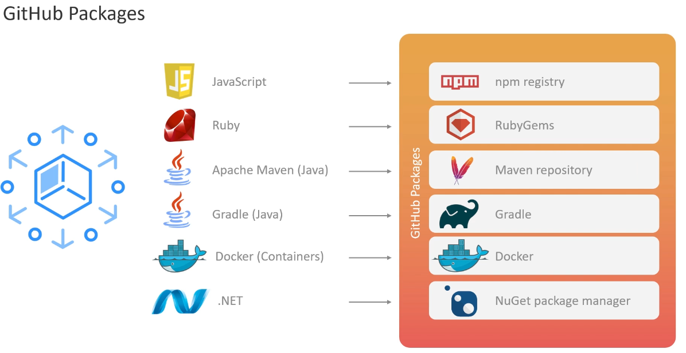
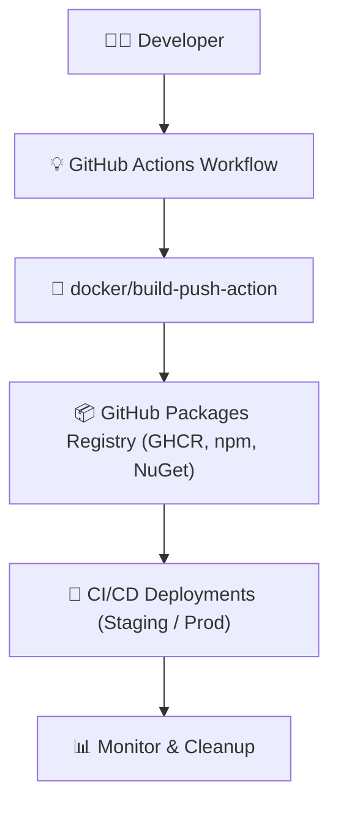

# 📦 GitHub Packages — Your Universal Package Registry

> **Official Definition:**  
> GitHub Packages is a **software package hosting service** that allows you to host and manage packages and container images right next to your source code — supporting multiple package ecosystems like **Docker, npm, Maven, NuGet, RubyGems, and more.**

In simpler terms:

> It’s like your private **mini Docker Hub + npm registry + NuGet Gallery** — all securely scoped to your GitHub organization or repository.

---

<div align="center" style="background-color:#fff; border-radius: 10px; border: 2px solid">
   
</div>

---

## 🎯 Why It Exists

Before Packages, developers often had to:

- 🐳 Publish Docker images to Docker Hub
- 📦 Push npm modules to npmjs.com
- 💾 Deploy NuGet packages to nuget.org

That meant **multiple accounts, tokens, and disconnected visibility.**  
GitHub Packages unifies them: one platform, one token, one permissions system — all under GitHub.

---

## 🧠 Key Benefits

<div align="center" style="background:#343739ff; border-radius:20px">

| Benefit                              | Description                                                  |
| ------------------------------------ | ------------------------------------------------------------ |
| 🔐 **Unified Authentication**        | Uses the same `GITHUB_TOKEN` or PAT (Personal Access Token). |
| 🔁 **Integrated with Actions**       | Push and pull packages from workflows.                       |
| 🧱 **Supports Multiple Ecosystems**  | Docker, npm, NuGet, Maven, RubyGems, Gradle.                 |
| 👁️ **Repository-Scoped Permissions** | Access controlled by repo visibility (public/private).       |
| 🧹 **Retention Policies**            | Configurable for unused or old versions.                     |
| 🧩 **Versioning & Metadata**         | Track builds, commits, and dependencies.                     |

</div>

---

## ⚙️ Supported Package Types

<div align="center" style="background-color:#fff; border-radius: 10px; border: 2px solid">
   
</div>

---

<div align="center" style="background:#343739ff; border-radius:20px">

| Ecosystem        | Registry URL              | Example Command                       |
| ---------------- | ------------------------- | ------------------------------------- |
| **Docker**       | `ghcr.io`                 | `docker push ghcr.io/OWNER/IMAGE:TAG` |
| **npm**          | `npm.pkg.github.com`      | `npm publish`                         |
| **Maven**        | `maven.pkg.github.com`    | `mvn deploy`                          |
| **NuGet (.NET)** | `nuget.pkg.github.com`    | `dotnet nuget push`                   |
| **RubyGems**     | `rubygems.pkg.github.com` | `gem push`                            |
| **Gradle**       | `maven.pkg.github.com`    | `gradle publish`                      |

</div>

---

## 🧩 Example: Publishing Docker Image to GitHub Packages (GHCR)

```yaml
name: 🐳 Build & Push to GHCR
on: [push]

jobs:
  build:
    runs-on: ubuntu-latest
    steps:
      - name: 🧭 Checkout code
        uses: actions/checkout@v4

      - name: 🔐 Login to GitHub Container Registry
        uses: docker/login-action@v3
        with:
          registry: ghcr.io
          username: ${{ github.actor }}
          password: ${{ secrets.GITHUB_TOKEN }}

      - name: ⚙️ Build and push Docker image
        uses: docker/build-push-action@v6
        with:
          push: true
          tags: |
            ghcr.io/${{ github.repository }}:latest
            ghcr.io/${{ github.repository }}:${{ github.sha }}
```

🧠 This workflow builds your app and pushes it as a **Docker image** directly into your GitHub Packages registry — `ghcr.io`.

---

## 🔐 Authentication in GitHub Packages

Authentication depends on **who** and **what** is accessing:

<div align="center" style="background:#343739ff; border-radius:20px">

| Context                      | Token                         | Scope Needed                                         | Notes                         |
| ---------------------------- | ----------------------------- | ---------------------------------------------------- | ----------------------------- |
| **From GitHub Actions**      | `${{ secrets.GITHUB_TOKEN }}` | `write:packages`, `read:packages`                    | Auto-generated; safest method |
| **From local machine (CLI)** | Personal Access Token (PAT)   | `write:packages`, `delete:packages`, `read:packages` | Used for manual publishing    |
| **For Docker**               | `docker/login-action`         | N/A                                                  | Uses token automatically      |

</div>

---

Example login (manual CLI):

```bash
echo $TOKEN | docker login ghcr.io -u USERNAME --password-stdin
```

---

## 🧩 Example: Publishing npm Package to GitHub Packages

`.github/workflows/publish-npm.yml`:

```yaml
name: 📦 Publish npm package
on:
  push:
    branches: [main]

jobs:
  publish:
    runs-on: ubuntu-latest
    permissions:
      contents: read
      packages: write
    steps:
      - uses: actions/checkout@v4

      - name: 🧩 Configure npm for GitHub Packages
        run: |
          echo "@OWNER:registry=https://npm.pkg.github.com" >> ~/.npmrc
          echo "//npm.pkg.github.com/:_authToken=${{ secrets.GITHUB_TOKEN }}" >> ~/.npmrc

      - name: 🚀 Publish package
        run: npm publish
```

And your `package.json` should contain:

```json
{
  "name": "@OWNER/my-awesome-lib",
  "version": "1.0.0",
  "publishConfig": {
    "registry": "https://npm.pkg.github.com"
  }
}
```

💡 This publishes directly to `https://github.com/OWNER?tab=packages`.

---

## 🧩 Example: Using NuGet (.NET) with GitHub Packages

```bash
dotnet nuget add source \
  --username USERNAME \
  --password TOKEN \
  --store-password-in-clear-text \
  --name github "https://nuget.pkg.github.com/OWNER/index.json"
```

Then push your package:

```bash
dotnet nuget push MyApp.1.0.0.nupkg --source github
```

---

## 📦 Retention & Cleanup Policy

GitHub automatically cleans up **old or untagged** package versions to save space.

<div align="center" style="background:#343739ff; border-radius:20px">

| Policy                | Description                                                                                     |
| --------------------- | ----------------------------------------------------------------------------------------------- |
| **Retention Period**  | Packages not downloaded or updated in 90 days are subject to deletion _(configurable per org)_. |
| **Untagged Versions** | Images or packages not referenced by a tag can be auto-deleted.                                 |
| **Manual Cleanup**    | You can delete individual versions through the web UI or API.                                   |
| **API Cleanup**       | REST API supports bulk deletion by tag, age, or version range.                                  |

</div>

---

> 🧠 Pro tip: Combine cleanup automation with GitHub Actions to auto-remove outdated image tags after each deployment.

---

## 🧩 Example: Automated Cleanup

```yaml
name: 🧹 Cleanup Old Packages
on:
  schedule:
    - cron: "0 3 * * 0" # Every Sunday

jobs:
  cleanup:
    runs-on: ubuntu-latest
    steps:
      - name: 🧽 Delete untagged packages
        uses: actions/delete-package-versions@v5
        with:
          package-name: "myapp"
          package-type: "container"
          min-versions-to-keep: 3
```

💡 Keeps your registry clean — retains only the latest three versions.

---

## 🧩 Permissions & Access Control

<div align="center" style="background:#343739ff; border-radius:20px">

| Repo Visibility        | Who Can Access Packages               |
| ---------------------- | ------------------------------------- |
| **Public Repo**        | Anyone (public read)                  |
| **Private Repo**       | Only users with repo read access      |
| **Org-Level Packages** | Controlled by org roles & teams       |
| **Granular Access**    | You can override defaults per package |

</div>

---

## 🧠 Relationship Between GitHub Packages, Artifacts & Releases

<div align="center" style="background:#343739ff; border-radius:20px">

| Concept       | Scope            | Visibility     | Purpose                                 |
| ------------- | ---------------- | -------------- | --------------------------------------- |
| **Artifacts** | Per workflow run | Temporary      | Store build outputs (e.g. test reports) |
| **Packages**  | Per repo/org     | Persistent     | Host versioned packages or images       |
| **Releases**  | Per repo         | Public/Private | Attach binary assets for human download |

</div>

---

🧩 TL;DR:

- **Artifacts** are short-lived and used for pipeline transfer.
- **Packages** are long-lived and used for dependency consumption.
- **Releases** are for end users.

---

## 🧱 Best Practices

<div align="center" style="background:#343739ff; border-radius:20px">

| Area            | Best Practice                                                       |
| --------------- | ------------------------------------------------------------------- |
| 🔐 Security     | Use `GITHUB_TOKEN` wherever possible                                |
| 📦 Versioning   | Always tag versions semantically (`v1.0.0`, `v1.0.1`)               |
| 🧰 Retention    | Enable cleanup for untagged or stale packages                       |
| 🏗️ CI/CD        | Combine `build-push-action` + Packages registry                     |
| 🧩 Integration  | Use GitHub Environments for deploy secrets                          |
| 📊 Traceability | Add metadata labels linking to commit or issue                      |
| ⚙️ Caching      | Store Docker layers or npm cache as artifacts to speed up next runs |

</div>

---

<div align="center" style="background:#343739ff; border-radius:20px">



</div>

---

## 💬 Human TL;DR

> GitHub Packages is your **central warehouse** for all artifacts that need to live beyond a single pipeline — whether it’s Docker images, npm libs, or .NET packages.  
> Think of it as **Docker Hub + npm + NuGet** but integrated, secured, and version-controlled under your GitHub account.
