```mermaid
graph TD
    A["💻 Repo A (Frontend)"] --> B["⚙️ Reusable build.yml"]
    C["💻 Repo B (Backend)"] --> B
    D["💻 Repo C (Mobile)"] --> B
    B --> E["🚀 Shared Build Logic (one source of truth)"]
```

```mermaid
sequenceDiagram
    participant M as 🧩 main.yml
    participant R as 🔧 build.yml (reusable)
    participant A as ⚙️ Actions Runner

    M->>R: Call reusable workflow with inputs + secrets
    R->>A: Executes build steps
    A-->>R: Returns status (success/failure)
    R-->>M: Outputs back to main workflow
```

```mermaid
graph TD
    A["📁 Org .github repo"] --> B["🧩 Reusable Workflows (build.yml, test.yml, deploy.yml)"]
    B --> C["🏗️ App Repo 1"]
    B --> D["🚀 App Repo 2"]
    B --> E["🔬 App Repo 3"]
    C & D & E --> F["🎯 Unified CI/CD Standards"]
```

# 🧩 Introduction to Reusable Workflows in GitHub Actions

## ⚙️ Official Definition

> A **reusable workflow** is a workflow that can be called by other workflows using the `workflow_call` event.
> It allows you to define CI/CD logic **once** and **reuse it** across multiple repositories, teams, or environments.

---

<div align="center" style="background-color:#fff; border-radius: 10px; border: 2px solid">
   
</div>

---

## 💡 Why Reusable Workflows Exist

Before reusable workflows, large orgs had a **nightmare**:

- Every repo had to duplicate the same `build.yml` or `test.yml`.
- Updating logic (e.g., new build step) meant editing **dozens of files** manually.
- CI/CD was inconsistent across teams.

Reusable workflows fix that.
They let you **centralize** logic like this:

```ini
.github/
└── workflows/
    ├── build.yml       ← reusable build logic
    ├── test.yml        ← reusable test logic
    └── deploy.yml      ← reusable deploy logic
```

Then other repos (or workflows in the same repo) simply **call** these workflows like functions. 🎯

---

<div align="center" style="background:#343739ff; border-radius:20px">



</div>

---

## 🧠 Think of It Like This:

- **Composite Action:** like a **function** (a small reusable step group).
- **Reusable Workflow:** like a **module** (a full pipeline that can include jobs, actions, and steps).

<div align="center" style="background:#343739ff; border-radius:20px">

| Concept               | Purpose                            | Scope                       |
| --------------------- | ---------------------------------- | --------------------------- |
| **Action**            | Reuse small steps or scripts       | Within a single job         |
| **Reusable Workflow** | Reuse entire workflows (multi-job) | Across repositories or orgs |

</div>

---

## 🧱 Basic Structure

Here’s the simplest form of a reusable workflow:

📄 `.github/workflows/build.yml`

```yaml
name: 🔧 Reusable Build Workflow

on:
  workflow_call:
    inputs:
      node-version:
        required: true
        type: string
    secrets:
      TOKEN:
        required: true

jobs:
  build:
    runs-on: ubuntu-latest
    steps:
      - uses: actions/checkout@v4
      - name: Setup Node.js
        uses: actions/setup-node@v4
        with:
          node-version: ${{ inputs.node-version }}
      - name: Install and Build
        run: |
          npm ci
          npm run build
```

Let’s decode it:

<div align="center" style="background:#343739ff; border-radius:20px">

| Key                 | Meaning                                                      |
| ------------------- | ------------------------------------------------------------ |
| `on: workflow_call` | Marks this as reusable — it won’t run on push/pull by itself |
| `inputs`            | Variables that can be passed by the caller                   |
| `secrets`           | Secure values required from caller                           |
| `jobs`              | The actual workflow logic (can have multiple jobs)           |

</div>

---

## 🔗 How You Call It (From Another Workflow)

📄 `.github/workflows/main.yml`

```yaml
name: 🧩 Main CI

on:
  push:
    branches: [main]

jobs:
  use-build-workflow:
    uses: ./.github/workflows/build.yml
    with:
      node-version: 18
    secrets:
      TOKEN: ${{ secrets.MY_GITHUB_TOKEN }}
```

🧠 That’s it — one line (`uses: ./.github/workflows/build.yml`) replaces an entire CI definition!

---

<div align="center" style="background:#343739ff; border-radius:20px">



</div>

---

## 🔍 Where You Can Store Reusable Workflows

<div align="center" style="background:#343739ff; border-radius:20px">

| Location                     | Scope                       | Example Reference                                       |
| ---------------------------- | --------------------------- | ------------------------------------------------------- |
| **Same repo**                | For internal reuse          | `uses: ./.github/workflows/build.yml`                   |
| **Org-level `.github` repo** | Shared across all org repos | `uses: my-org/.github/.github/workflows/build.yml@main` |
| **Another repo**             | Shared across projects      | `uses: my-org/devops/.github/workflows/test.yml@v2`     |

</div>

---

This is what makes them **super scalable** in enterprise setups.

---

## 🧩 When to Use vs. When Not To

<div align="center" style="background:#343739ff; border-radius:20px">

| Use Reusable Workflows When…                      | Avoid When…                                   |
| ------------------------------------------------- | --------------------------------------------- |
| You want to reuse logic across repos              | Workflow is unique to a project               |
| You have multiple environments (dev, stage, prod) | Only one pipeline exists                      |
| You need parameterized builds/tests               | Steps depend heavily on repo-specific context |
| You maintain org-wide CI standards                | Prototype or one-off builds                   |

</div>

---

## ⚙️ Permissions and Security

Reusable workflows use **the caller’s permissions** by default — this is great for security.
You can control it via the `permissions:` block.

```yaml
permissions:
  contents: read
  packages: write
  id-token: write
```

When calling across repos, ensure the caller has access to the target workflow repo.

---

## 💬 Human TL;DR

> Reusable workflows are like shared **pipeline templates**.  
> Instead of copy-pasting your CI logic across 10 repos, you define it once and call it everywhere — clean, consistent, and scalable.  
> They turn GitHub Actions into a proper **DevOps architecture layer**.

---

<div align="center" style="background:#343739ff; border-radius:20px">



</div>
