```mermaid
sequenceDiagram
    participant Caller as 🧩 main.yml
    participant Reusable as 🔧 build.yml
    participant Runner as ⚙️ GitHub Runner

    Caller->>Reusable: Pass inputs + secrets
    Reusable->>Runner: Run build steps
    Runner-->>Reusable: Output artifact name
    Reusable-->>Caller: Return output (build-artifact)
    Caller->>Runner: Use output in next job
```

# ⚙️ **Reusable Workflow Structure**

## 📘 Official Definition

> A **reusable workflow structure** defines how a workflow can receive data (`inputs`), access secure credentials (`secrets`), and return results (`outputs`) when invoked by another workflow via `workflow_call`.

In short, we’re designing **interfaces** between workflows — think of them as _APIs for your CI/CD_.

---

## 🧩 Anatomy of a Reusable Workflow

Here’s the basic skeleton — the “API contract” of a reusable workflow.

📄 `.github/workflows/build.yml`

```yaml
name: 🔧 Reusable Build Workflow

on:
  workflow_call:
    inputs:
      node-version:
        required: true
        type: string
      environment:
        required: false
        type: string
        default: "dev"
    secrets:
      TOKEN:
        required: true
    outputs:
      build-artifact:
        description: "The name of the build artifact"
        value: ${{ jobs.build.outputs.artifact-name }}

jobs:
  build:
    runs-on: ubuntu-latest
    outputs:
      artifact-name: ${{ steps.build.outputs.artifact }}
    steps:
      - uses: actions/checkout@v4

      - name: 🏗️ Build app
        id: build
        run: |
          echo "myapp-${{ inputs.environment }}" > artifact.txt
          echo "artifact=myapp-${{ inputs.environment }}" >> $GITHUB_OUTPUT

      - name: 📦 Upload Artifact
        uses: actions/upload-artifact@v4
        with:
          name: ${{ steps.build.outputs.artifact }}
          path: artifact.txt
```

---

## 🧠 Let’s Decode It Like Engineers

<div align="center" style="background:#343739ff; border-radius:20px">

| Section               | Description                                                 |
| --------------------- | ----------------------------------------------------------- |
| `on: workflow_call`   | Defines it as reusable                                      |
| `inputs`              | Parameters passed from the caller (like function arguments) |
| `secrets`             | Secure values injected by the caller (like API tokens)      |
| `outputs`             | Values the reusable workflow returns to the caller          |
| `jobs`                | Contains the logic you want to share                        |
| `outputs` (under job) | Connects internal job results to global workflow outputs    |

</div>

---

## 🧪 How a Caller Workflow Uses It

📄 `.github/workflows/main.yml`

```yaml
name: 🧩 Main Workflow

on:
  push:
    branches: [ main ]

jobs:
  call-build:
    uses: ./.github/workflows/build.yml
    with:
      node-version: 20
      environment: "staging"
    secrets:
      TOKEN: ${{ secrets.MY_TOKEN }}

  show-result:
    runs-on: ubuntu-latest
    needs: call-build
    steps:
      - name: 📢 Show returned artifact name
        run: echo "Artifact name: ${{ needs.call-build.outputs.build-artifact }}"
```

---

<div align="center" style="background:#343739ff; border-radius:20px">



</div>

---

## 🧱 Inputs — Your Workflow’s “Function Parameters”

Inputs make your workflow flexible and configurable.

### ✅ Supported Input Types

<div align="center" style="background:#343739ff; border-radius:20px">

| Type      | Example   | Description                 |
| --------- | --------- | --------------------------- |
| `string`  | `"prod"`  | Default type                |
| `boolean` | `true`    | True/false toggles          |
| `number`  | `42`      | Used for numeric parameters |
| `choice`  | See below | Limit options (advanced)    |

</div>

### 🧩 Example of Choice Inputs

```yaml
inputs:
  environment:
    type: choice
    options:
      - dev
      - staging
      - prod
    default: dev
```

This helps enforce controlled environments across teams.

---

## 🔐 Secrets — Injecting Secure Credentials

Secrets are **not hardcoded**; they must be passed explicitly from the caller.

```yaml
on:
  workflow_call:
    secrets:
      TOKEN:
        required: true
```

Caller:

```yaml
jobs:
  call-workflow:
    uses: ./.github/workflows/build.yml
    secrets:
      TOKEN: ${{ secrets.PERSONAL_ACCESS_TOKEN }}
```

🧠 You can’t access organization-level secrets _inside reusable workflows_ unless they’re passed from the caller — this is a deliberate security boundary.

---

## 🧾 Outputs — Returning Values Like a Pro

You can output anything:

- a build artifact name
- a version string
- a computed tag
- test results summary

Here’s how the data flows 👇

```mermaid
graph TD
    A["🏗️ Step Output (GITHUB_OUTPUT)"] --> B["📦 Job Outputs"]
    B --> C["🧩 Workflow Outputs"]
    C --> D["🚀 Caller Workflow"]
```

<div align="center" style="background:#343739ff; border-radius:20px">



</div>

---

### 📦 Example Flow in Code

1️⃣ Inside your step:

```bash
echo "version=1.2.3" >> $GITHUB_OUTPUT
```

2️⃣ Expose it at job level:

```yaml
outputs:
  version: ${{ steps.build.outputs.version }}
```

3️⃣ Expose it at workflow level:

```yaml
outputs:
  app-version:
    value: ${{ jobs.build.outputs.version }}
```

4️⃣ Use it in caller:

```yaml
run: echo "App version is ${{ needs.build.outputs.app-version }}"
```

---

## 🧰 Putting It All Together (Mini Real Example)

Let’s simulate a company pipeline:

- Build workflow (shared)
- Deployment workflow (calls build and uses its output)

📄 `.github/workflows/build.yml`

```yaml
on:
  workflow_call:
    outputs:
      image-tag:
        value: ${{ jobs.build.outputs.tag }}

jobs:
  build:
    runs-on: ubuntu-latest
    outputs:
      tag: ${{ steps.set.outputs.tag }}
    steps:
      - id: set
        run: echo "tag=v1.0.${{ github.run_number }}" >> $GITHUB_OUTPUT
```

📄 `.github/workflows/deploy.yml`

```yaml
jobs:
  call-build:
    uses: ./.github/workflows/build.yml

  deploy:
    needs: call-build
    runs-on: ubuntu-latest
    steps:
      - name: 🚀 Deploy using tag
        run: echo "Deploying version ${{ needs.call-build.outputs.image-tag }}"
```

Result ➡️ “Deploying version v1.0.25”

---

## 🧠 Real-World Analogy

Reusable workflows are like **microservices for CI/CD**:

- Inputs = API parameters
- Outputs = Response payload
- Secrets = Auth headers
- Jobs = Implementation logic

They make pipelines modular, maintainable, and scalable across repos.

---

## ✅ Summary: Reusable Workflow Blueprint

<div align="center" style="background:#343739ff; border-radius:20px">

| Concept         | Purpose                    | Example                          |
| --------------- | -------------------------- | -------------------------------- |
| `inputs`        | Pass dynamic configuration | `node-version`, `env`            |
| `secrets`       | Pass credentials securely  | `TOKEN`, `AWS_KEY`               |
| `outputs`       | Return computed results    | artifact name, version           |
| `workflow_call` | Makes it callable          | entry point of reusable workflow |

</div>
