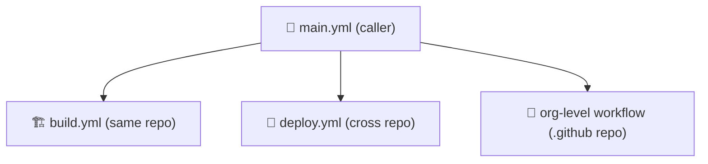
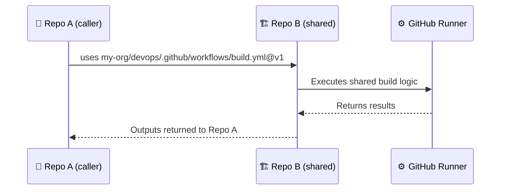
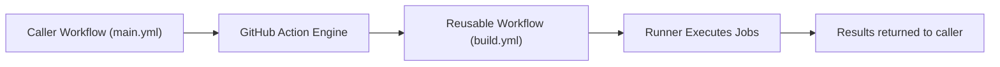

# 🧭 **Calling a Reusable Workflow (Same Repo, Cross Repo & Org-Level)**

## 📘 Official Definition

> You can call a reusable workflow using the `uses:` keyword inside a job.  
> The reference can be:
>
> - **local** (via `./`),
>   - eg. `./.github/workflows/build.yml`
> - **remote** (via repo path),
>   - eg. `myorg/myrepo/.github/workflows/build.yml`
> - **organization-wide** (via `.github` repository)
>   - ,eg `.github/workflows/build.yml`.

Think of it like calling a shared “library function” in programming.
You just import it using the correct path or reference tag.

---

## 🧩 Syntax Overview

```yaml
jobs:
  <job_id>:
    uses: <owner>/<repo>/.github/workflows/<workflow_file>@<ref>
```

Or for local workflows:

```yaml
jobs:
  <job_id>:
    uses: ./.github/workflows/<workflow_file>
```

---

<div align="center" style="background:#343739ff; border-radius:20px">



</div>

---

## 🏠 1. Calling a Reusable Workflow in the **Same Repository**

This is the simplest and most common case — ideal for monorepos or internal pipelines.

📁 **Repository Structure**

```ini
.github/
├── workflows/
│   ├── build.yml       ← reusable workflow
│   └── main.yml        ← calling workflow
```

📄 **main.yml**

```yaml
name: 🧩 Local Call Example

on:
  push:
    branches: [main]

jobs:
  build-job:
    uses: ./.github/workflows/build.yml
    with:
      node-version: 20
    secrets:
      TOKEN: ${{ secrets.MY_TOKEN }}
```

### ✅ Key Notes

- No `@ref` is needed (because it’s local).
- You can use relative paths (`./.github/workflows/...`).
- Great for keeping your repo modular but self-contained.

---

## 🌐 2. Calling a Workflow from **Another Repository**

Now we level up — this allows teams to share a common workflow across projects.

📁 **Reference Syntax**

```yaml
uses: <owner>/<repo>/.github/workflows/<workflow_file>@<ref>
```

Example:

```yaml
jobs:
  shared-build:
    uses: my-org/devops/.github/workflows/build.yml@main
    with:
      node-version: 18
    secrets:
      TOKEN: ${{ secrets.ORG_ACCESS_TOKEN }}
```

### 💡 Parameters Explained

<div align="center" style="background:#343739ff; border-radius:20px">

| Field                   | Meaning                                                               |
| ----------------------- | --------------------------------------------------------------------- |
| `<owner>`               | Organization or user name                                             |
| `<repo>`                | Repository name containing workflow                                   |
| `.github/workflows/...` | Path to workflow file                                                 |
| `@<ref>`                | Branch, tag, or commit SHA (recommended: tag or SHA for immutability) |

</div>

### 🧠 Best Practice

Use a **version tag or commit SHA** instead of `@main`:

```yaml
uses: my-org/devops/.github/workflows/build.yml@v1.0.0
```

➡️ This ensures your pipeline doesn’t break if someone updates the reusable workflow’s `main` branch.

---

<div align="center" style="background:#343739ff; border-radius:20px">



</div>

---

## 🏢 3. Calling a Reusable Workflow from an **Org-Level `.github` Repository**

GitHub offers a special **`.github` repository** at the organization level
— a hidden gem for large enterprises 🏢.

📁 **Example structure**

```ini
my-org/.github/
└── workflows/
    ├── build.yml
    ├── test.yml
    └── deploy.yml
```

These workflows become **globally available** to all repositories under the org.

📄 **Caller Example**

```yaml
jobs:
  org-build:
    uses: my-org/.github/.github/workflows/build.yml@v1
    with:
      node-version: 18
    secrets:
      TOKEN: ${{ secrets.ORG_DEPLOY_TOKEN }}
```

This means you can:

- Standardize CI/CD logic across all teams
- Update logic in one place
- Avoid repo-specific duplication

---

## 🔒 Permissions Required

Calling reusable workflows across repos or orgs **requires permission**.

- The **caller** must have **read access** to the reusable workflow’s repo.
- The workflow file must exist in a **public repo** (or private with same org).
- The reusable workflow must be in **default branch** unless you specify a ref.

**Cross-repo calling does _not_ work across organizations** unless the reusable repo is public.

---

## 🧠 How GitHub Executes This (Under the Hood)

<div align="center" style="background:#343739ff; border-radius:20px">



</div>

GitHub essentially **imports** the reusable workflow definition,  
executes it within the caller’s permission context,  
and returns outputs + statuses back to the parent.

---

## ⚙️ Combining Inputs, Secrets, and Outputs Across Scopes

Here’s a _cross-repo_ example with everything combined 👇

📄 **caller.yml (in app repo)**

```yaml
jobs:
  build:
    uses: my-org/devops/.github/workflows/build.yml@v2
    with:
      environment: prod
    secrets:
      DEPLOY_TOKEN: ${{ secrets.MY_DEPLOY_TOKEN }}

  deploy:
    needs: build
    runs-on: ubuntu-latest
    steps:
      - run: echo "Deploying artifact ${{ needs.build.outputs.build-artifact }}"
```

📄 **reusable build.yml (in devops repo)**

```yaml
on:
  workflow_call:
    inputs:
      environment:
        required: true
        type: string
    secrets:
      DEPLOY_TOKEN:
        required: true
    outputs:
      build-artifact:
        value: ${{ jobs.build.outputs.artifact }}
```

---

## 🧱 Versioning Strategy (Best Practices)

<div align="center" style="background:#343739ff; border-radius:20px">

| Approach       | Description                | Example          |
| -------------- | -------------------------- | ---------------- |
| **Branch ref** | Uses a branch (not stable) | `@main`          |
| **Tag ref**    | Stable reference           | `@v1`, `@v2.3.0` |
| **Commit SHA** | Immutable (most secure)    | `@a1b2c3d4`      |

</div>

---

✅ Use **tags** for versioned workflows  
✅ Pin to **SHAs** for high-security environments  
⚠️ Avoid `@main` for production workflows

---

## 🧩 Pro Tip — Combine with Workflow Dispatch

You can also manually trigger reusable workflows from the caller by chaining `workflow_dispatch` events.  
This is useful for environment promotion pipelines (e.g., staging → prod).

---

## 💬 Real-World Example: Centralized Build System

**Scenario:**  
Your company has 50 microservices.  
All need the same build + test workflow.

📁 **Org-level `.github` repo**

```ini
workflows/
├── build.yml
└── test.yml
```

📄 **Each service repo uses:**

```yaml
jobs:
  build:
    uses: my-org/.github/.github/workflows/build.yml@v1
    with:
      node-version: 18
```

Boom 💥 — instant org-wide CI/CD standardization.

---

## ✅ Summary: Workflow Calling Scopes

<div align="center" style="background:#343739ff; border-radius:20px">

| Scope      | Syntax                                       | Use Case                   |
| ---------- | -------------------------------------------- | -------------------------- |
| Same repo  | `uses: ./.github/workflows/...`              | Modular monorepo           |
| Cross repo | `uses: org/repo/.github/workflows/...@v1`    | Shared between teams       |
| Org-level  | `uses: org/.github/.github/workflows/...@v1` | Enterprise standardization |

</div>
