```mermaid
graph TD
    A["📦 main.yml (caller)"]
    B["🧩 build.yml (reusable)"]
    C["🚀 deploy.yml (reusable)"]
    A -->|inputs & secrets| B
    B -->|"outputs (artifact, tag)"| A
    A -->|pass outputs to next| C
```

```mermaid
graph LR
    A["🧩 main.yml"]
    B["🏗️ build.yml"]
    C["🧪 test.yml"]
    A -->|calls| B
    B -->|outputs artifact| A
    A -->|passes artifact| C
```

# ⚙️ **Passing Inputs, Secrets, and Outputs Between Reusable Workflows**

## 📘 Official Definition

> Workflows that call other reusable workflows can **pass inputs and secrets** to them and **receive outputs** back, enabling modular and interconnected automation pipelines.

Think of it as the “parameter passing” and “return values” mechanism of GitHub Actions workflows — essential for chaining builds, tests, deployments, etc.

---

<div align="center" style="background:#343739ff; border-radius:20px">



</div>

---

## 🧱 Basic Data Flow Model

Here’s how data moves between levels 👇

<div align="center" style="background:#343739ff; border-radius:20px">

| Direction         | Mechanism                         | Example                              |
| ----------------- | --------------------------------- | ------------------------------------ |
| Caller ➜ Reusable | - `with:`</br> - `secrets:`       | with: </br> &nbsp; node-version: 18  |
| Reusable ➜ Caller | - `outputs:`                      | outputs: </br> &nbsp; build-artifact |
| Between Jobs      | - `needs.<job_id>.outputs.<name>` | `${{ needs.build.outputs.tag }}`     |

</div>

&nbsp;

---

## 🧩 Example 1: Passing Inputs & Secrets into a Reusable Workflow

Let’s start simple — you have a **main workflow** that triggers a **build reusable workflow**.

📄 `.github/workflows/build.yml`

```yaml
on:
  workflow_call:
    inputs:
      node-version:
        type: string
        required: true
      environment:
        type: string
        required: true
    secrets:
      DEPLOY_TOKEN:
        required: true

jobs:
  build:
    runs-on: ubuntu-latest
    steps:
      - uses: actions/setup-node@v4
        with:
          node-version: ${{ inputs.node-version }}
      - name: 🏗️ Build for environment
        run: echo "Building for ${{ inputs.environment }}..."
      - name: 🔐 Use deploy token
        run: echo "Using token: ${{ secrets.DEPLOY_TOKEN:0:4 }}..."
```

📄 `.github/workflows/main.yml`

```yaml
name: 🧩 Main Caller Workflow

on:
  push:
    branches: [main]

jobs:
  call-build:
    uses: ./.github/workflows/build.yml
    with:
      node-version: 20
      environment: "production"
    secrets:
      DEPLOY_TOKEN: ${{ secrets.MY_DEPLOY_TOKEN }}
```

✅ Result:

- Inputs (`node-version`, `environment`) passed dynamically
- Secret injected securely from caller

---

## 🧠 How Secrets Behave (Important!)

- Reusable workflows **cannot access** secrets defined globally or at the org level — they must be explicitly passed.
- The secret **never echoes** in logs.
- You can pass **different secrets** for different environments easily.

---

## 🧩 Example 2: Returning Outputs from a Reusable Workflow

Now let’s make the build workflow return a value (like an image tag or artifact name).

📄 **Reusable: `.github/workflows/build.yml`**

```yaml
on:
  workflow_call:
    outputs:
      image-tag:
        description: "Generated image tag"
        value: ${{ jobs.build.outputs.tag }}

jobs:
  build:
    runs-on: ubuntu-latest
    outputs:
      tag: ${{ steps.tag.outputs.value }}
    steps:
      - id: tag
        run: |
          TAG="v1.${{ github.run_number }}"
          echo "value=$TAG" >> $GITHUB_OUTPUT
          echo "Generated tag: $TAG"
```

📄 **Caller: `.github/workflows/main.yml`**

```yaml
jobs:
  call-build:
    uses: ./.github/workflows/build.yml

  use-output:
    runs-on: ubuntu-latest
    needs: call-build
    steps:
      - run: echo "🚀 Deploying image: ${{ needs.call-build.outputs.image-tag }}"
```

✅ Output in logs:

```ini
🚀 Deploying image: v1.57
```

---

## 🧩 Example 3: Passing Outputs Between Multiple Reusable Workflows

This is how **multi-layered pipelines** communicate 👇

📁 Structure:

```ini
.github/workflows/
├── build.yml
├── test.yml
└── main.yml
```

### build.yml (Reusable)

```yaml
on:
  workflow_call:
    outputs:
      artifact-name:
        value: ${{ jobs.build.outputs.artifact }}

jobs:
  build:
    runs-on: ubuntu-latest
    outputs:
      artifact: ${{ steps.artifact.outputs.name }}
    steps:
      - id: artifact
        run: echo "name=myapp.zip" >> $GITHUB_OUTPUT
```

### test.yml (Reusable)

```yaml
on:
  workflow_call:
    inputs:
      artifact-name:
        type: string
        required: true

jobs:
  test:
    runs-on: ubuntu-latest
    steps:
      - run: echo "Testing ${{ inputs.artifact-name }}"
```

### main.yml (Caller)

```yaml
jobs:
  build:
    uses: ./.github/workflows/build.yml

  test:
    uses: ./.github/workflows/test.yml
    needs: build
    with:
      artifact-name: ${{ needs.build.outputs.artifact-name }}
```

✅ Output:

```ini
Testing myapp.zip
```

🎯 You just built a **modular two-stage CI** using reusable workflows!

---

<div align="center" style="background:#343739ff; border-radius:20px">



</div>

---

## 🔐 Example 4: Passing Secrets Across Layers

Sometimes you’ll have multiple reusable workflows that all need credentials — for instance, a **build**, **scan**, and **deploy** stage.

📄 **main.yml**

```yaml
jobs:
  build:
    uses: ./.github/workflows/build.yml
    secrets:
      TOKEN: ${{ secrets.MY_TOKEN }}

  deploy:
    uses: ./.github/workflows/deploy.yml
    needs: build
    secrets:
      TOKEN: ${{ secrets.MY_TOKEN }}
    with:
      image-tag: ${{ needs.build.outputs.image-tag }}
```

📄 **deploy.yml**

```yaml
on:
  workflow_call:
    inputs:
      image-tag:
        required: true
        type: string
    secrets:
      TOKEN:
        required: true

jobs:
  deploy:
    runs-on: ubuntu-latest
    steps:
      - run: echo "Deploying image ${{ inputs.image-tag }} with token ${{ secrets.TOKEN:0:4 }}"
```

✅ All secrets are securely scoped — they **never flow automatically**, you must **explicitly forward them**.

---

## 🧩 Example 5: Chaining Reusable Workflows with Outputs and Conditional Logic

Let’s see a **real mini pipeline**:  
Build → Test → Deploy  
Each reusable, fully modular.

📁 Structure:

```ini
.github/workflows/
├── build.yml
├── test.yml
├── deploy.yml
└── main.yml
```

📄 **main.yml**

```yaml
on: [push]

jobs:
  build:
    uses: ./.github/workflows/build.yml

  test:
    uses: ./.github/workflows/test.yml
    needs: build
    with:
      artifact-name: ${{ needs.build.outputs.artifact }}
    if: success()

  deploy:
    uses: ./.github/workflows/deploy.yml
    needs: [build, test]
    with:
      artifact-name: ${{ needs.build.outputs.artifact }}
    if: ${{ needs.test.result == 'success' }}
```

💡 You just orchestrated a **conditional multi-stage pipeline** using reusable workflows — each acting like a microservice.

---

## 🧠 Common Gotchas

<div align="center" style="background:#343739ff; border-radius:20px">

| Issue                  | Cause                                   | Fix                                        |
| ---------------------- | --------------------------------------- | ------------------------------------------ |
| Output not found       | Didn’t map job output → workflow output | Add `outputs:` at both levels              |
| Secret not accessible  | Not explicitly passed                   | Pass under `secrets:`                      |
| Input missing          | Forgot `required: true`                 | Add required flag                          |
| Wrong output reference | Used job ID instead of workflow name    | Use `${{ needs.<job_id>.outputs.<name> }}` |

</div>

---

## 🧾 Summary Table

<div align="center" style="background:#343739ff; border-radius:20px">

| Type       | Direction         | Declaration                | Usage                            |
| ---------- | ----------------- | -------------------------- | -------------------------------- |
| **Input**  | Caller ➜ Workflow | `on.workflow_call.inputs`  | `${{ inputs.name }}`             |
| **Secret** | Caller ➜ Workflow | `on.workflow_call.secrets` | `${{ secrets.NAME }}`            |
| **Output** | Workflow ➜ Caller | `on.workflow_call.outputs` | `${{ needs.job.outputs.value }}` |

</div>

---

## 💬 TL;DR by Your Human Mentor

> Think of reusable workflows like **pipes in a factory** 🏭
>
> - `inputs` are the raw materials,
> - `secrets` are the keys to the supply room,
> - `outputs` are the finished products rolling out the other end.
>   Connect them in the right order and — boom 💥 — you’ve got yourself a self-healing CI/CD machine.
