```mermaid
graph TD
    A["🧩 Caller Workflow"]
    B1["🏗️ Reusable Workflow (Node 16)"]
    B2["🏗️ Reusable Workflow (Node 18)"]
    B3["🏗️ Reusable Workflow (Node 20)"]

    A --> B1
    A --> B2
    A --> B3
    B1 & B2 & B3 --> C["⚙️ Matrix Execution in Parallel"]
```

```mermaid
sequenceDiagram
    participant Caller as 🧩 main.yml
    participant Runner as ⚙️ GitHub Runner
    participant Build as 🏗️ Reusable Workflow

    loop For each Node version (16,18,20)
        Caller->>Build: Call reusable workflow with node-version
        Build->>Runner: Run build steps
        Runner-->>Build: Return build logs
        Build-->>Caller: Complete one matrix job
    end
```

```mermaid
graph TD
    A["🧩 Caller (main.yml)"]
    B1["🧱 Reusable build.yml → env: dev"]
    B2["🧱 Reusable build.yml → env: staging"]
    B3["🧱 Reusable build.yml → env: prod"]

    A --> B1
    A --> B2
    A --> B3
    B1 & B2 & B3 --> C["🚀 Multi-env deploys in parallel"]
```

# ⚙️ Using Matrix Strategy with Reusable Workflows

## 📘 Official Definition

> A **matrix strategy** allows you to define multiple configurations (like different environments, OS versions, or runtimes) and run jobs in parallel for each one.
>
> When combined with **reusable workflows**, it lets you reuse the same workflow for many test/build variations dynamically.

---

<div align="center" style="background:#343739ff; border-radius:20px">



</div>

---

## 🧱 Why Use Matrix with Reusable Workflows?

Let’s say your reusable workflow defines how to build a Node.js app.
But you want to:

- Test on **multiple Node versions**
- Run on **different OSes**
- Deploy to **multiple environments**

Instead of writing 10 jobs manually — you use a **matrix**.

---

## 🧩 Example 1: Local Reusable Workflow + Matrix in Caller

📄 `.github/workflows/build.yml` (Reusable)

```yaml
name: 🔧 Reusable Build Workflow

on:
  workflow_call:
    inputs:
      node-version:
        required: true
        type: string

jobs:
  build:
    runs-on: ubuntu-latest
    steps:
      - uses: actions/setup-node@v4
        with:
          node-version: ${{ inputs.node-version }}
      - name: 🏗️ Build
        run: |
          echo "Building with Node ${{ inputs.node-version }}"
```

📄 `.github/workflows/main.yml` (Caller)

```yaml
name: 🧩 Matrix Example

on:
  push:
    branches: [main]

jobs:
  matrix-build:
    strategy:
      matrix:
        node-version: [16, 18, 20]
    uses: ./.github/workflows/build.yml
    with:
      node-version: ${{ matrix.node-version }}
```

✅ Result:
Three builds run **in parallel**:

```ini
Building with Node 16
Building with Node 18
Building with Node 20
```

Boom 💥 — you just parallelized your reusable workflow across environments.

---

<div align="center" style="background:#343739ff; border-radius:20px">



</div>

---

## 🧠 Example 2: Multi-Dimension Matrix (OS × Node Version)

📄 **main.yml**

```yaml
name: 🧩 Multi-Dimension Matrix

on: [push]

jobs:
  build-matrix:
    strategy:
      matrix:
        os: [ubuntu-latest, windows-latest]
        node: [16, 18]
    uses: ./.github/workflows/build.yml
    with:
      node-version: ${{ matrix.node }}
    runs-on: ${{ matrix.os }}
```

🧩 What Happens:

| OS             | Node |
| -------------- | ---- |
| ubuntu-latest  | 16   |
| ubuntu-latest  | 18   |
| windows-latest | 16   |
| windows-latest | 18   |

4 builds run simultaneously ⚙️

---

## 💡 Pro Tip: Control Parallelism

By default, matrix runs **all combinations in parallel**.
You can **limit concurrency**:

```yaml
strategy:
  matrix:
    node: [16, 18, 20]
  max-parallel: 2
```

This runs 2 jobs at a time — great for managing runner costs.

---

## 🧩 Example 3: Returning Outputs per Matrix Job

You can collect **outputs** from each matrix execution and use them later.

📄 **Reusable Workflow**

```yaml
on:
  workflow_call:
    inputs:
      node-version:
        required: true
        type: string
    outputs:
      build-name:
        value: ${{ jobs.build.outputs.name }}

jobs:
  build:
    runs-on: ubuntu-latest
    outputs:
      name: ${{ steps.name.outputs.value }}
    steps:
      - id: name
        run: |
          echo "value=app-node${{ inputs.node-version }}" >> $GITHUB_OUTPUT
```

📄 **Caller Workflow**

```yaml
jobs:
  matrix-build:
    strategy:
      matrix:
        node-version: [16, 18, 20]
    uses: ./.github/workflows/build.yml
    with:
      node-version: ${{ matrix.node-version }}

  collect:
    runs-on: ubuntu-latest
    needs: matrix-build
    steps:
      - run: |
          echo "✅ Build outputs collected!"
          echo "${{ toJson(needs.matrix-build.outputs) }}"
```

✅ Output Example:

```json
{
  "16": { "build-name": "app-node16" },
  "18": { "build-name": "app-node18" },
  "20": { "build-name": "app-node20" }
}
```

---

## 🧩 Example 4: Cross-Repo Matrix with Reusable Workflow

You can even call reusable workflows **from another repo** in a matrix — it scales beautifully.

```yaml
jobs:
  build:
    strategy:
      matrix:
        environment: [dev, staging, prod]
    uses: my-org/devops/.github/workflows/deploy.yml@v2
    with:
      environment: ${{ matrix.environment }}
    secrets:
      TOKEN: ${{ secrets.ORG_TOKEN }}
```

🎯 Perfect for org-wide deployment pipelines:

- Each environment runs in parallel
- Reusable deploy logic stays centralized

---

## 🧠 Understanding Execution Context

<div align="center" style="background:#343739ff; border-radius:20px">

| Concept                     | Description                                   |
| --------------------------- | --------------------------------------------- |
| `matrix.<var>`              | Represents one combination of the matrix      |
| `${{ matrix.os }}`          | Used inside the reusable workflow’s `runs-on` |
| `${{ matrix.node }}`        | Passed as input to reusable workflow          |
| `${{ strategy.job-index }}` | (Optional) index of job in matrix             |

</div>

---

> Each job is **isolated** — they don’t share the workspace, context, or outputs unless you explicitly aggregate them later.

---

## 🧱 Example 5: Dynamic Matrix Inputs from JSON

Sometimes you want to generate your matrix dynamically (e.g., from an API or script).

```yaml
jobs:
  generate-matrix:
    runs-on: ubuntu-latest
    outputs:
      matrix: ${{ steps.generate.outputs.matrix }}
    steps:
      - id: generate
        run: |
          echo 'matrix={"environment":["dev","qa","prod"]}' >> $GITHUB_OUTPUT

  build:
    needs: generate-matrix
    strategy:
      matrix: ${{ fromJson(needs.generate-matrix.outputs.matrix) }}
    uses: ./.github/workflows/build.yml
    with:
      environment: ${{ matrix.environment }}
```

💡 This lets you build a **fully dynamic pipeline** controlled by runtime data.

---

## 🧰 Common Mistakes and Fixes

<div align="center" style="background:#343739ff; border-radius:20px">

| Issue                           | Cause                                                  | Fix                                          |
| ------------------------------- | ------------------------------------------------------ | -------------------------------------------- |
| Workflow fails to expand matrix | Invalid syntax or `fromJson` missing                   | Ensure proper JSON format                    |
| Outputs not available           | Reusable workflow didn’t define workflow-level outputs | Add `on.workflow_call.outputs`               |
| All jobs share same config      | Forgot to use `matrix.var` in inputs                   | Use `${{ matrix.var }}` for parameterization |
| Too many parallel jobs          | No `max-parallel` set                                  | Add concurrency limits                       |

</div>

---

## 🧩 Real-World Example — Multi-Env Deployments

Imagine a DevOps org pipeline that builds Docker images for all environments in parallel:

```yaml
jobs:
  deploy:
    strategy:
      matrix:
        env: [dev, staging, prod]
    uses: my-org/.github/.github/workflows/deploy.yml@v1
    with:
      environment: ${{ matrix.env }}
    secrets:
      TOKEN: ${{ secrets.DEPLOY_TOKEN }}
```

✅ Results:

```ini
Deploying to dev 🚀
Deploying to staging 🚀
Deploying to prod 🚀
```

3 environments deployed simultaneously using one shared workflow 💯

---

<div align="center" style="background:#343739ff; border-radius:20px">



</div>

---

## ✅ Summary

<div align="center" style="background:#343739ff; border-radius:20px">

| Concept               | Description                                               |
| --------------------- | --------------------------------------------------------- |
| **Matrix**            | Runs jobs in parallel with variable combinations          |
| **Reusable workflow** | Shared build/test/deploy logic                            |
| **Combination**       | Modular + parallel pipelines                              |
| **Use cases**         | Multi-OS builds, multi-version testing, multi-env deploys |
| **Bonus**             | Dynamic JSON-based matrices for adaptive workflows        |

</div>

---

## 💬 TL;DR by Your Human Mentor

> Matrix + reusable workflows = _parallel universes of CI/CD_.  
> Each job gets its own dimension (Node version, OS, or environment) but shares one brain — your reusable workflow.
>
> Congratulations, you’ve officially become a **CI/CD multiverse architect. 🧠✨**
