```mermaid
graph TD
    A["👩‍💻 Dev pushes code to Repo A (API)"]
    B["🏗️ Build Workflow (Reusable)"]
    C["🧪 Test Workflow (Reusable)"]
    D["🚀 Deploy Workflow (Reusable)"]
    E["🔔 Notify Workflow (Reusable)"]
    F["💬 Slack / Teams Notification"]

    A --> B --> C --> D --> E --> F
```

```mermaid
sequenceDiagram
    participant Dev as 👨‍💻 Developer
    participant Repo as 📦 api-service
    participant GH as ⚙️ GitHub Actions
    participant Shared as 🏗️ .github Repo

    Dev->>Repo: push main
    Repo->>Shared: uses build.yml
    Shared-->>Repo: Build artifact
    Repo->>Shared: uses test.yml
    Shared-->>Repo: Test result = passed
    Repo->>Shared: uses deploy.yml
    Shared-->>Repo: Deploy success
    Repo->>Shared: uses notify.yml
    Shared-->>Repo: Slack notification ✅
```

```mermaid
graph TD
    Dev["👩‍💻 Developer Push"]
    Build["🏗️ Build Workflow"]
    Test["🧪 Test Workflow"]
    Deploy["🚀 Deploy Workflow"]
    Notify["🔔 Notify Workflow"]
    Slack["💬 Slack Notification"]

    Dev --> Build --> Test --> Deploy --> Notify --> Slack
    classDef animate stroke-dasharray: 8,5,stroke-dashoffset: 900,animation: dash 25s linear infinite;
    class Dev,Build,Test,Deploy,Notify,Slack animate
```

# 🚀 End-to-End Example: Modular, Multi-Repo CI/CD Pipeline Using Reusable Workflows

## 🎯 Goal

We’ll design a full CI/CD architecture with **three repositories** and **centralized workflows**, allowing every team to reuse common build, test, deploy, and notify logic without code duplication.

---

<div align="center" style="background:#343739ff; border-radius:20px">



</div>

---

## 🧱 Project Architecture Overview

<div align="center" style="background:#343739ff; border-radius:20px">

| Repository         | Purpose                  | Contains                                            |
| ------------------ | ------------------------ | --------------------------------------------------- |
| **`.github`**      | Central shared workflows | `build.yml`, `test.yml`, `deploy.yml`, `notify.yml` |
| **`webapp`**       | Frontend app             | Calls reusable workflows                            |
| **`api-service`**  | Backend API              | Calls reusable workflows                            |
| **`infra-deploy`** | Infrastructure as Code   | Calls deploy workflow with environment matrix       |

</div>

---

## 🏗️ Step 1 — The Shared Workflow Repository (`acme-org/.github`)

### 🧩 build.yml

```yaml
name: 🏗️ Build Reusable Workflow

on:
  workflow_call:
    inputs:
      node-version:
        required: true
        type: string
    secrets:
      GITHUB_TOKEN:
        required: true

jobs:
  build:
    runs-on: ubuntu-latest
    steps:
      - uses: actions/checkout@v4

      - name: Setup Node
        uses: actions/setup-node@v4
        with:
          node-version: ${{ inputs.node-version }}
          cache: npm

      - name: Install & Build
        run: |
          npm ci
          npm run build

      - name: 📦 Upload Artifact
        uses: actions/upload-artifact@v4
        with:
          name: build-${{ github.run_id }}
          path: dist/
```

---

### 🧩 test.yml

```yaml
name: 🧪 Test Reusable Workflow

on:
  workflow_call:
    secrets:
      GITHUB_TOKEN:
        required: true
    outputs:
      test-result:
        value: ${{ jobs.test.outputs.result }}

jobs:
  test:
    runs-on: ubuntu-latest
    outputs:
      result: ${{ steps.tests.outputs.result }}
    steps:
      - uses: actions/checkout@v4

      - name: Run Unit Tests
        id: tests
        run: |
          npm test -- --json --outputFile=report.json
          echo "result=passed" >> $GITHUB_OUTPUT
```

---

### 🧩 deploy.yml

```yaml
name: 🚀 Deploy Reusable Workflow

on:
  workflow_call:
    inputs:
      environment:
        required: true
        type: string
    secrets:
      DEPLOY_KEY:
        required: true

jobs:
  deploy:
    runs-on: ubuntu-latest
    environment: ${{ inputs.environment }}
    steps:
      - uses: actions/download-artifact@v4
        with:
          name: build-${{ github.run_id }}

      - name: Deploy to Environment
        run: |
          echo "Deploying to ${{ inputs.environment }}"
          echo "Using key: ${{ secrets.DEPLOY_KEY:0:4 }}***"
```

---

### 🧩 notify.yml

```yaml
name: 🔔 Notify Reusable Workflow

on:
  workflow_call:
    inputs:
      status:
        required: true
        type: string

jobs:
  notify:
    runs-on: ubuntu-latest
    steps:
      - name: Send Slack Message
        run: |
          echo "Deployment ${{ inputs.status }} ✅"
```

---

## 🧩 Step 2 — The API Service Repo (`acme-org/api-service`)

📄 `.github/workflows/main.yml`

```yaml
name: 🧩 API Service CI/CD

on:
  push:
    branches: [main]

jobs:
  build:
    uses: acme-org/.github/.github/workflows/build.yml@v2
    with:
      node-version: 20
    secrets:
      GITHUB_TOKEN: ${{ secrets.GITHUB_TOKEN }}

  test:
    needs: build
    uses: acme-org/.github/.github/workflows/test.yml@v2
    secrets:
      GITHUB_TOKEN: ${{ secrets.GITHUB_TOKEN }}

  deploy:
    needs: test
    if: ${{ needs.test.outputs.test-result == 'passed' }}
    uses: acme-org/.github/.github/workflows/deploy.yml@v2
    with:
      environment: production
    secrets:
      DEPLOY_KEY: ${{ secrets.PROD_DEPLOY_KEY }}

  notify:
    needs: [deploy]
    uses: acme-org/.github/.github/workflows/notify.yml@v2
    with:
      status: success
```

✅ **Pipeline Flow:**

```ini
build → test → deploy → notify
```

Each job calls a separate **reusable workflow** — clean, modular, and composable.

---

<div align="center" style="background:#343739ff; border-radius:20px">



</div>

---

## ⚙️ Step 3 — Multi-Environment Matrix Example (Infrastructure Repo)

📄 `acme-org/infra-deploy/.github/workflows/deploy-matrix.yml`

```yaml
name: 🏗️ Infra Deploy Matrix

on:
  workflow_dispatch:

jobs:
  deploy:
    strategy:
      matrix:
        env: [dev, staging, prod]
    uses: acme-org/.github/.github/workflows/deploy.yml@v2
    with:
      environment: ${{ matrix.env }}
    secrets:
      DEPLOY_KEY: ${{ secrets.ORG_DEPLOY_KEY }}
```

✅ This deploys to all environments **in parallel**, powered by the same shared workflow.

---

## 🧠 Step 4 — Handling Outputs Between Workflows

You can chain workflows by passing outputs through:

```yaml
build:
  uses: acme-org/.github/.github/workflows/build.yml@v2
  outputs:
    artifact: ${{ steps.build.outputs.artifact }}

deploy:
  needs: build
  uses: acme-org/.github/.github/workflows/deploy.yml@v2
  with:
    artifact-path: ${{ needs.build.outputs.artifact }}
```

---

## 🧰 Step 5 — Example: Cache, Artifact, and Conditional Deploy

Let’s spice it up 😏

```yaml
jobs:
  build:
    uses: acme-org/.github/.github/workflows/build.yml@v2
    with:
      node-version: 20
    secrets:
      GITHUB_TOKEN: ${{ secrets.GITHUB_TOKEN }}

  deploy:
    needs: build
    if: github.ref == 'refs/heads/main'
    uses: acme-org/.github/.github/workflows/deploy.yml@v2
    with:
      environment: prod
    secrets:
      DEPLOY_KEY: ${{ secrets.PROD_DEPLOY_KEY }}
```

💡 Only deploys from `main` branch.
Artifacts and caching handled automatically via the shared logic.

---

## 🧩 Step 6 — Visualizing the Complete System

```mermaid
graph TD
    subgraph ORG["🏢 acme-org"]
        GH["🧱 .github (Shared Workflows)"]
        API["📦 api-service"]
        WEB["🌐 webapp"]
        INFRA["🏗️ infra-deploy"]
    end

    API -->|uses build.yml| GH
    API -->|uses test.yml| GH
    API -->|uses deploy.yml| GH
    API -->|uses notify.yml| GH

    WEB -->|uses build.yml| GH
    WEB -->|uses test.yml| GH

    INFRA -->|uses deploy.yml| GH
```

<div align="center" style="background:#343739ff; border-radius:20px">



</div>

Everything flows through the central `.github` repo — all pipelines inherit the same **quality, security, and deployment rules**.

---

## 🔐 Step 7 — Governance with CODEOWNERS

In the `.github` repo:

```ini
# Only DevOps Team can modify shared workflows
.github/workflows/* @acme-org/devops-team
```

Ensures no one can modify core pipelines casually — strong governance ✅

---

## 🌍 Step 8 — Notifications Integration

In `notify.yml`, you can extend to:

- Send Slack / Teams messages
- Create GitHub issue on failure
- Post webhook to monitoring service

Example:

```yaml
- name: Notify Slack
  uses: slackapi/slack-github-action@v2
  with:
    payload: |
      {
        "text": "✅ Deployment to ${{ inputs.status }} succeeded!"
      }
  env:
    SLACK_WEBHOOK_URL: ${{ secrets.SLACK_WEBHOOK }}
```

---

## 🧭 Step 9 — Version Control for Reusable Workflows

Tag each stable version:

```bash
git tag v1
git push origin v1
```

Then use:

```yaml
uses: acme-org/.github/.github/workflows/build.yml@v1
```

When you upgrade something (e.g., Node 21 or new cache logic), just:

```bash
git tag v2
```

💡 The entire org upgrades by switching `@v1` → `@v2`.

---

## ✅ Benefits of This Architecture

<div align="center" style="background:#343739ff; border-radius:20px">

| Benefit          | Description                                        |
| ---------------- | -------------------------------------------------- |
| **Consistency**  | Every repo follows same build/test/deploy pattern  |
| **Simplicity**   | No need to maintain duplicate YAMLs                |
| **Scalability**  | Adding new services is effortless                  |
| **Security**     | Centralized secret and permission management       |
| **Auditability** | All workflow changes go through `.github` repo PRs |
| **Speed**        | Parallel, cached, artifact-based execution         |

</div>

---

## 💬 TL;DR by Your Human Mentor

> You’ve officially built a **multi-repo GitHub Actions platform**.  
> Each repo just _calls a workflow_ — the same way a frontend calls an API.
>
> Reusable workflows are your DevOps microservices — composable, versioned, secure, and fast.
>
> 🎓 Congrats, you’re now thinking like a **GitHub Actions Architect**. 🧠⚙️

---

<div align="center" style="background:#343739ff; border-radius:20px">



</div>
