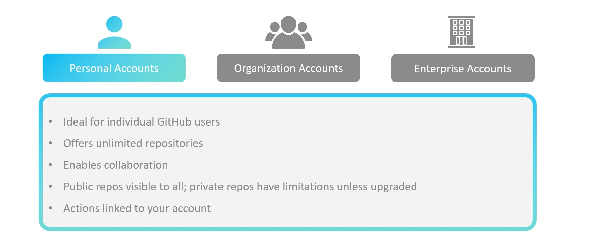
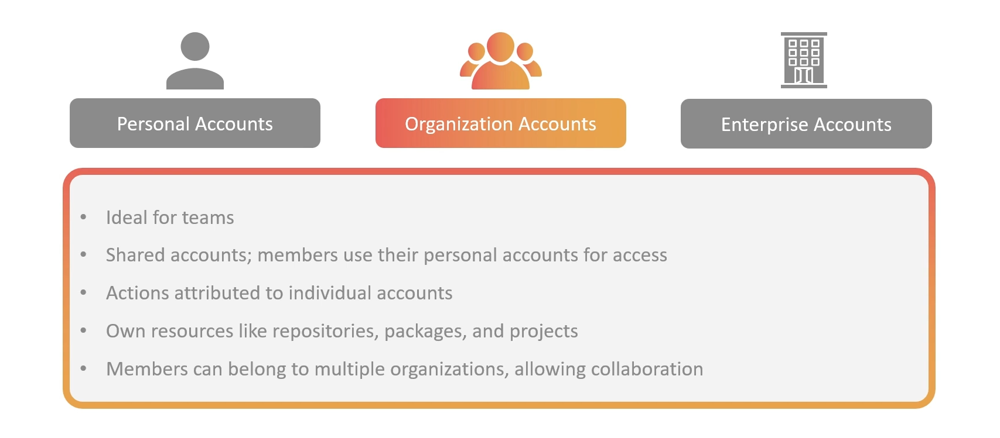
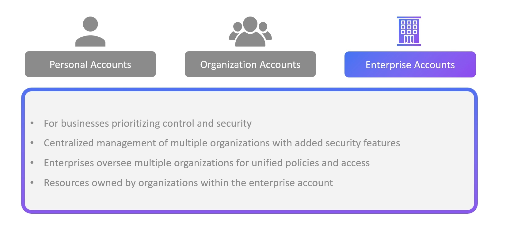
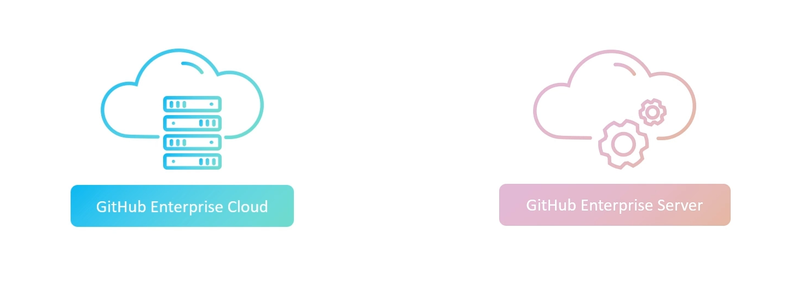
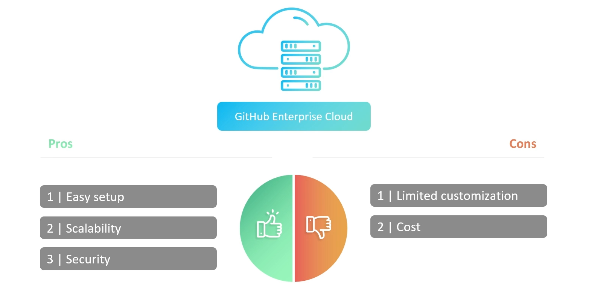
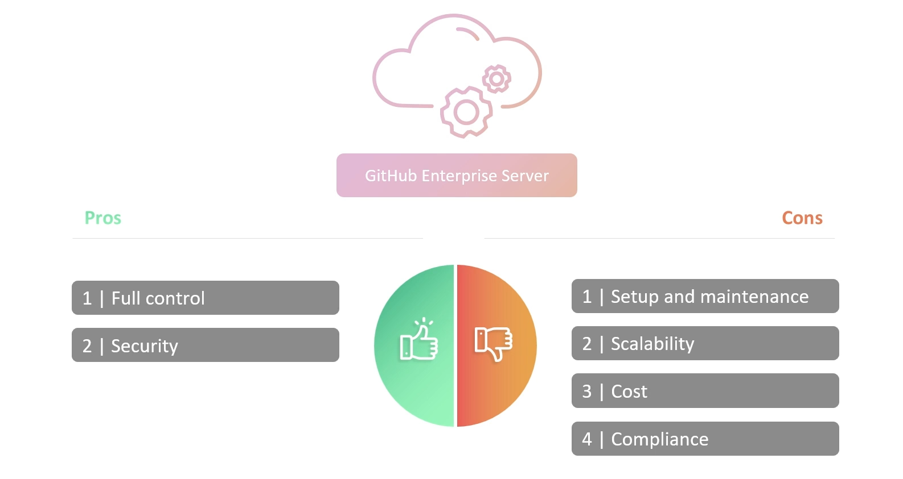

# 🐈‍⬛ GitHub Account Types

GitHub has a **hierarchy of account types**. Think of it like this:

- **Personal Account** → your identity
- **Organization** → a team space
- **Enterprise** → a parent container managing multiple organizations (for big companies)

Let’s break everything down clearly.

---

## 👤 1. Personal Accounts

<div align="center" style="background-color:#fff; border-radius: 10px; border: 2px solid">
  
</div>

### ✔️ What it is

- Your **personal GitHub identity**. Every user must have one.

### ✔️ What you can do

- Create repositories
- Contribute to any organization
- Manage your own settings, tokens, SSH keys
- Create private or public projects

### ✔️ Billing

- You can pay for:

  - GitHub Pro
  - Copilot plan
  - Packages storage
  - Actions minutes

### ✔️ Typical Use Case

- Developers, students, freelancers, or employees contributing to company repos.

---

## 🧑‍🤝‍🧑 2. Organization Accounts

<div align="center" style="background-color:#fff; border-radius: 10px; border: 2px solid">
  
</div>

### ✔️ What it is

- An **organization is a shared workspace** owned by a team or a company.

### ✔️ Who controls it?

- **Admins**
  → manage members, teams, access, billing.

- **Members**
  → collaborate on repos inside the org.

### ✔️ Features

- Team-based access control
- Role-based permissions
- Repository-level controls
- Security policies (e.g., branch protection, SSO)
- Billing managed at org level
- Integrations like CI/CD, apps, SAML/SSO

### ✔️ Use Case

- Companies, teams, open-source groups managing shared code.

---

## 🏢 3. Enterprise Accounts

<div align="center" style="background-color:#fff; border-radius: 10px; border: 2px solid">
  
</div>

### ✔️ What it is

- A **top-level account** for large companies that need:

  - Multiple organizations under one umbrella
  - Centralized billing
  - Centralized security + policy enforcement
  - Compliance & audit features

Enterprise Accounts **do not contain repos directly** → they contain **organizations**.

### ✔️ Why companies use it

- Manage 10–1000 organizations
- Apply global security rules
- Monitor usage across orgs
- Use SAML/SSO enforcement
- Enterprise-wide audit logs

---

## 🏛️ Enterprise Account Types

- GitHub offers **two types of Enterprise environments**, depending on where you want to run GitHub:

---

<div align="center" style="background-color:#fff; border-radius: 10px; border: 2px solid">
  
</div>

---

## ☁️ 1. GitHub Enterprise Cloud (GHEC)

<div align="center" style="background-color:#fff; border-radius: 10px; border: 2px solid">
  
</div>

### ✔️ What it is

- GitHub’s **cloud-hosted** enterprise platform  
  (You use github.com but with enterprise features).

### ✔️ Key Features

- Hosted by GitHub
- No infrastructure required
- Enterprise SSO (Azure AD / Okta / Entra ID)
- IP allow lists
- Auditing & compliance tools
- Enterprise-wide policy enforcement
- GitHub Advanced Security features

### ✔️ Good For

- Companies that want **full SaaS**, zero maintenance, global scale.

---

## 🖥️ 2. GitHub Enterprise Server (GHES)

<div align="center" style="background-color:#fff; border-radius: 10px; border: 2px solid">
  
</div>

### ✔️ What it is

- **Self-hosted GitHub** running on your infrastructure.

- Can be deployed on:

  - AWS
  - Azure
  - GCP
  - On-prem servers
  - VMware

### ✔️ Key Features

- Full control over data (data residency)
- Integrates with internal network and security tools
- Self-managed upgrades, patches, backup
- Full GitHub features but isolated

### ✔️ Good For

- Companies that need:

  - Strict compliance
  - Internal-only networks
  - Self-hosted infrastructure
  - Full control over data

---

## 🆚 Quick Comparison: Cloud vs Server

<div align="center">

| Feature        | Enterprise Cloud      | Enterprise Server    |
| -------------- | --------------------- | -------------------- |
| Hosting        | Managed by GitHub     | Self-hosted          |
| Maintenance    | None                  | Your responsibility  |
| Data Residency | Global GitHub regions | Your datacenter      |
| Access         | Internet              | Internal/VPN         |
| Upgrades       | Automatic             | Manual               |
| Best For       | Most modern companies | Regulated industries |

</div>

---

## 🔗 How They Connect Together

Here’s the **hierarchy**:

```ini
Enterprise Account
   ├── Organization 1
   │       ├── Teams
   │       ├── Members
   │       └── Repositories
   ├── Organization 2
   └── Organization 3
```

Every developer inside any org uses their **Personal Account**.

---

## 🎯 Summary Cheat Sheet

- **Personal Account** → YOU
- **Organization** → shared team workspace
- **Enterprise Account** → company-level management over many organizations
- **Enterprise Cloud** → hosted by GitHub
- **Enterprise Server** → self-hosted GitHub instance
