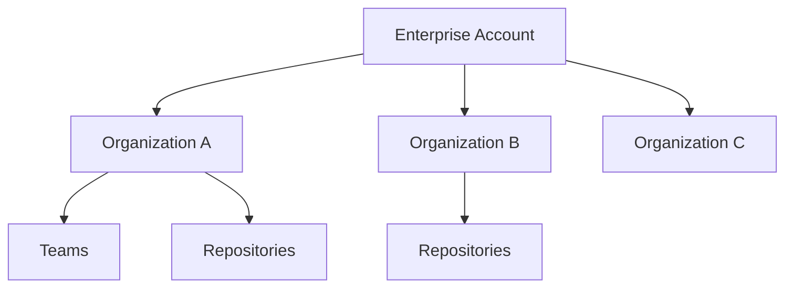

# ☁️ GitHub Enterprise Cloud (GHEC) — Full Detailed Explanation

## ⭐ What is GitHub Enterprise Cloud?

GitHub Enterprise Cloud is **GitHub's enterprise-grade SaaS (cloud-hosted) offering** that gives companies:

- **Unlimited organizations under one enterprise account**
- **Centralized billing**
- **Enterprise-wide security & compliance**
- **SAML/SSO enforcement (Azure AD / Okta / Entra ID)**
- **Advanced security features (secret scanning, code scanning)**
- **Audit logs across all organizations**
- **Policy governance**
- **IP allow lists**
- **Enterprise-wsdide identity & permission management**
- **Compliance certifications (SOC 2, FedRAMP, etc.)**

In simple words:

> **GHEC = GitHub.com with enterprise controls.
> Zero maintenance, full SaaS, global scale.**

Companies like Microsoft, Google, Uber, and Netflix all use GHEC.asdasda

---

## 🏢 GHEC Hierarchy (How Everything Fits Together)

Let’s visualize:



- You **create an Enterprise Account**.
- Inside the enterprise, you can create **one or many organizations**.
- Each organization contains:

  - Teams
  - Repositories
  - Members

Users still log in with **their personal GitHub account**, but access is controlled by enterprise-wide policies.

---

## 🔐 Key Features (Why Companies Use GHEC)

### 1. **SAML Single Sign-On (SSO)**

Connect GitHub with your identity provider:

- Azure AD / Entra ID
- Okta
- Ping
- OneLogin

Admins can enforce:

- **Mandatory SSO login**
- **SCIM (Automated user provisioning/deprovisioning)**

---

### 2. **Enterprise-wide Security**

Includes:

- Security policies across all organizations
- Required two-factor auth
- Secret scanning
- Code scanning
- Dependency alerts
- Audit logs
- Organization management rules
- IP allow lists (restrict access only from certain IPs)

---

### 3. **Centralized Billing**

One invoice for:

- GitHub licenses
- Actions minutes
- Packages storage
- Copilot
- GitHub Advanced Security

---

### 4. **Shared Policies**

Apply global rules like:

- Member permissions
- Repository creation restrictions
- App/Integration usage
- Enforce branch protection

---

### 5. **Enterprise Insights**

Advanced analytics on:

- Contributors
- Pull requests
- Security issues
- Build usage
- Repos across all orgs

---

### 6. **Unlimited Organizations**

Companies can structure like:

- Org for each department
- Org per business unit
- Org for contractors vs employees
- Separate development orgs

---

## 🛠️ How to Create a GitHub Enterprise Cloud Account (Step-by-Step)

## Step 1 — Go to GitHub Enterprise Signup

Visit:

➡️ **[https://github.com/enterprise](https://github.com/enterprise)**

Select **GitHub Enterprise Cloud**.

You will be asked to:

- Sign in with your **personal GitHub account**
- Provide **company name**
- Provide **billing email**
- Choose **plan** (Enterprise plan or free trial)

---

## Step 2 — Create Your Enterprise Account

You will enter:

- Enterprise Name
- Enterprise Slug (URL)
  Example:
  `https://github.com/enterprises/mycompany`

After this, GitHub creates an **Enterprise Account container**.

---

## Step 3 — Create/Link Organizations Under the Enterprise

You have two choices:

### ✔️ Option A: Create New Organization

Inside the enterprise view:

- Go to **Organizations**
- Click **New Organization**
- Choose plan (it inherits Enterprise plan)
- Assign owners

### ✔️ Option B: Add Existing Organization

If your company already has an org:

- Go to Enterprise → **Settings → Organizations → Add Organization**
- Owners of the existing org must approve the transfer.

Once added:

- Billing moves to the enterprise
- Security policies can be enforced from the top

---

## Step 4 — Configure Enterprise Authentication (SSO + SCIM)

Important for companies.

### Steps:

1. Enterprise → **Settings**
2. Select **Authentication Security**
3. Choose **SAML Single Sign-On**
4. Pick identity provider:

   - Azure AD (most common)
   - Okta
   - Ping

5. Configure SAML metadata
6. Optional: Enable **SCIM provisioning**

Now users must:

- Sign into GitHub using company credentials

Admins can block GitHub access unless the user is a member of the enterprise.

---

## Step 5 — Configure Enterprise Policies

Under:
**Enterprise → Settings → Policies**

You can control:

### Repository Policies

- Who can create repos
- Default visibility (private/public/internal)
- Allow/forbid fork
- Require branch protection

### Security Policies

- Require 2FA
- Enforce secret scanning
- Block insecure apps
- Force dependency reviews

### Billing Policies

- Actions usage controls
- Copilot seat assignment
- Packages storage

---

## Step 6 — Invite Members

Admins can:

- Invite users directly
- Add teams from SSO IdP if SCIM is enabled
- Grant **Enterprise Owner**, **Billing Manager**, or **Member** role

---

## 🧪 How to Use GitHub Enterprise Cloud (Daily Workflow)

Once GHEC is set up:

## 🔹 Developers Log In Using SSO

Then they get access to:

- Organizations
- Teams
- Repositories

---

## 🔹 Repositories & Collaboration Work the Same

GHEC does NOT change Git commands.

Developers still run:

```bash
git clone
git pull
git commit
git push
```

Nothing changes for them.

---

## 🔹 Organizations Enforce Policies

Admins can:

- Make all repositories **private by default**
- Require pull request reviews
- Enable Protected Branches
- Restrict who can merge
- Limit Actions usage

---

## 🔹 Enterprise-Level Audit Logging

Admins can view:

- All user logins
- Repo access events
- PR activity
- Security events
- SSH key usage

---

## 🔹 Enterprise-Wide GitHub Actions Controls

Admins can limit:

- Which actions can run (Marketplace / internal only)
- Self-hosted runner policies
- Actions minutes per organization
- Billing limits
- Required workflow approvals

---

## 📦 GitHub Advanced Security (GHEC Feature)

Enterprises can enable:

- Code scanning (SAST)
- Secret scanning (detect leaked API keys)
- Dependency scanning
- Push protection (block pushes with secrets)

This is **not included by default** — it's an add-on.

---

## 💵 Billing Model for GHEC

### Paying for:

| Item                  | Description                         |
| --------------------- | ----------------------------------- |
| **Enterprise seat**   | Every user counts as 1 seat         |
| **Actions minutes**   | Linux, Windows, Mac pricing differs |
| **Packages storage**  | Container and package storage       |
| **Copilot**           | Optional add-on                     |
| **Advanced Security** | Optional add-on                     |

Billing is:

- Monthly or annual
- Per user seat
- Centralized (one invoice)

---

## 🎯 Real Example: Typical Enterprise Setup

**Company: "TechCorp"!**

```ini
Enterprise: techcorp-enterprise
    ├── Organization: techcorp-backend
    ├── Organization: techcorp-frontend
    ├── Organization: techcorp-mobile
    ├── Organization: techcorp-devops
    └── Organization: techcorp-contractors
```

All users authenticate using Azure AD SSO.

Audit logs and security policies apply to all.

---

## 🧭 When Should a Company Use GitHub Enterprise Cloud?

### Ideal for:

- SaaS-first companies
- Companies that want zero maintenance
- Distributed teams around the world
- Teams using GitHub Actions heavily
- Companies that want advanced security & compliance

### Not ideal for:

- Companies needing to keep code **inside their own network**
  (They should use GitHub Enterprise Server instead)

---

## 📝 Summary

| Feature                  | Enterprise Cloud       |
| ------------------------ | ---------------------- |
| Host                     | GitHub.com             |
| Maintenance              | None                   |
| SSO                      | Yes                    |
| SCIM                     | Yes                    |
| Unlimited Orgs           | Yes                    |
| Enterprise Audit Logs    | Yes                    |
| Central Billing          | Yes                    |
| GitHub Advanced Security | Optional               |
| Best for                 | Modern cloud companies |
