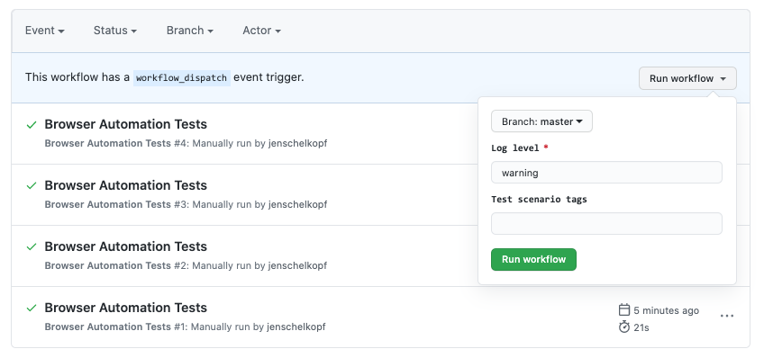

# 👋🏻 **workflow_dispatch**

## 🧩 What Is `workflow_dispatch`?

It’s a special trigger that lets you **run a workflow on demand**, instead of waiting for a `push`, `pull_request`, or `schedule` event.

### 🔧 Syntax

```yaml
on:
  workflow_dispatch:
```

This adds a **"Run workflow"** button in the GitHub Actions tab.

---

<div align="center" style="background-color:#fff; border-radius: 10px; border: 2px solid">
   
</div>

--

## 🧪 Example: Manual Deploy Workflow

```yaml
name: Manual Deploy

on:
  workflow_dispatch:
    inputs:
      environment:
        description: 'Target environment'
        required: true
        default: 'staging'
      version:
        description: 'Version to deploy'
        required: false

jobs:
  deploy:
    runs-on: ubuntu-latest
    steps:
      - run: echo "Deploying to ${{ github.event.inputs.environment }}"
      - run: echo "Version: ${{ github.event.inputs.version }}"
```

### ✅ Behavior:

- Adds a UI form with `environment` and `version` fields
- You can trigger it manually from the GitHub UI
- Inputs are passed into the workflow via `github.event.inputs`

---

## 🔐 Use Cases

| Use Case              | Description                                           |
| --------------------- | ----------------------------------------------------- |
| **Manual deployment** | Trigger deploys to staging/prod with input            |
| **Hotfixes**          | Run a patch pipeline without pushing code             |
| **Backfills**         | Trigger data jobs for a specific date/version         |
| **Debugging**         | Manually test workflows without creating fake commits |
| **Release tagging**   | Trigger a release pipeline with a version input       |

---

## 🧠 Summary

| Feature             | Purpose                        |
| ------------------- | ------------------------------ |
| `workflow_dispatch` | Manual trigger for workflows   |
| Supports inputs     | Yes (via `inputs:` block)      |
| UI button           | Appears in Actions tab         |
| API support         | Yes — can trigger via REST API |

---

## ⁉️ Question

If you **don’t include `workflow_dispatch`** in your GitHub Actions workflow, then:

### ❌ You **cannot trigger it manually** from the GitHub UI or API.

That means:

- No **“Run workflow”** button in the Actions tab
- No way to pass **custom inputs** (like environment or version)
- No ability to **trigger it on demand** — it will only run based on other events like `push`, `pull_request`, or `schedule`

---

## 🧪 Example: No `workflow_dispatch`

```yaml
on:
  push:
    branches: [main]
```

This workflow will run **only when code is pushed to `main`**. You cannot run it manually.

---

## ✅ Example: With `workflow_dispatch`

```yaml
on:
  push:
    branches: [main]
  workflow_dispatch:
```

Now you can:

- Push to `main` → triggers automatically
- Go to Actions tab → click “Run workflow” manually

---

## 🧠 Summary

| Scenario                       | Manual Trigger Possible?      |
| ------------------------------ | ----------------------------- |
| `on: push` only                | ❌ No                         |
| `on: workflow_dispatch` only   | ✅ Yes                        |
| `on: push + workflow_dispatch` | ✅ Yes (both auto and manual) |
