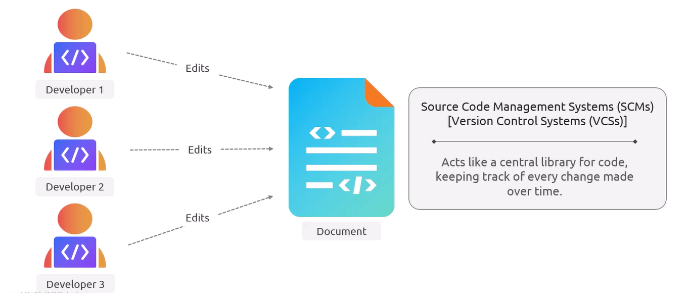
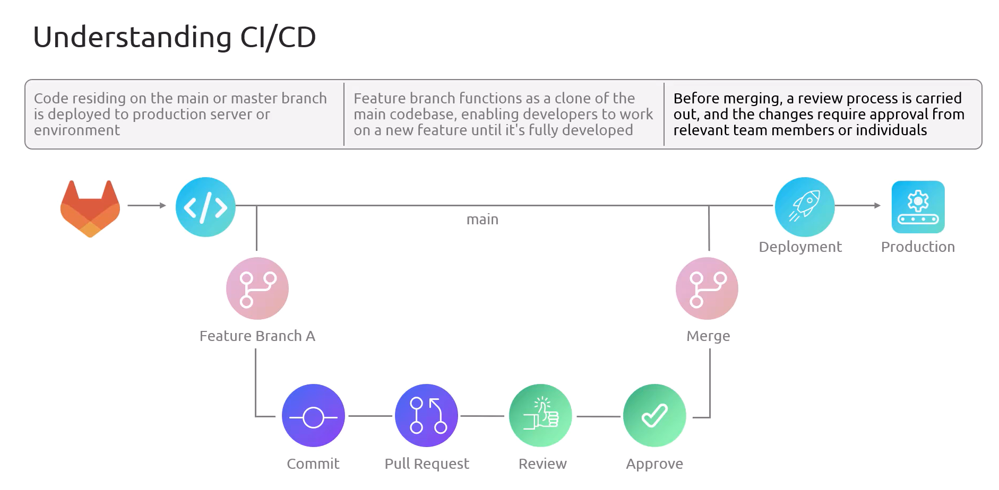
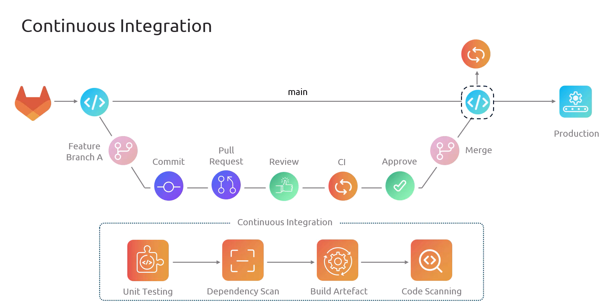
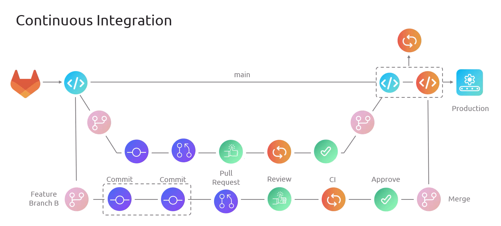
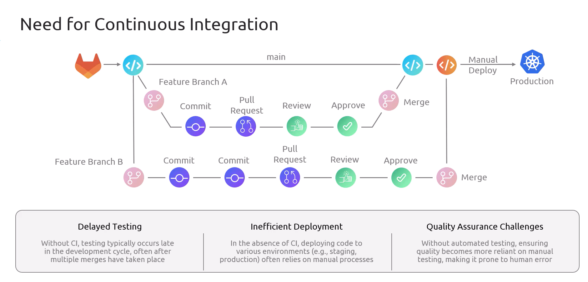
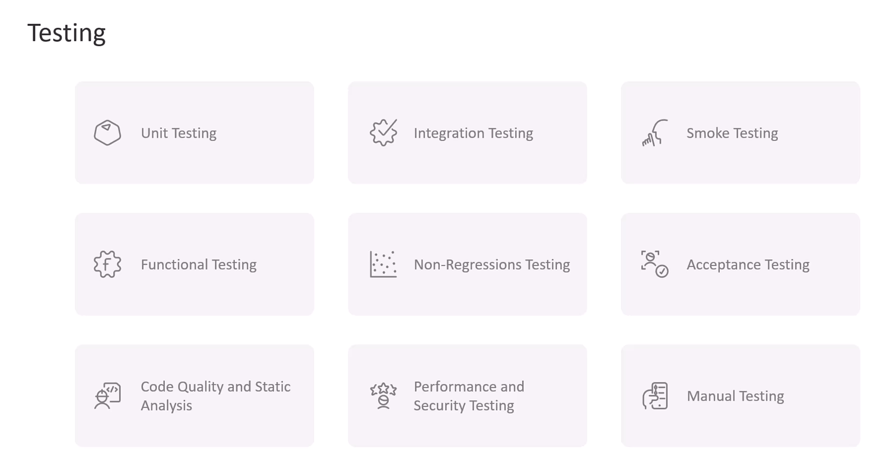
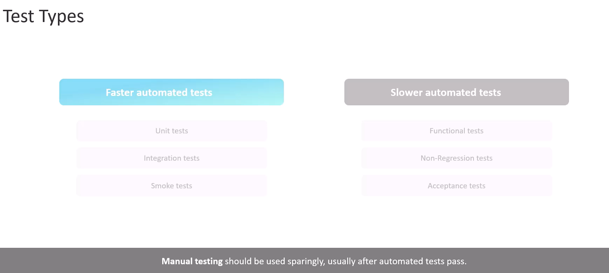
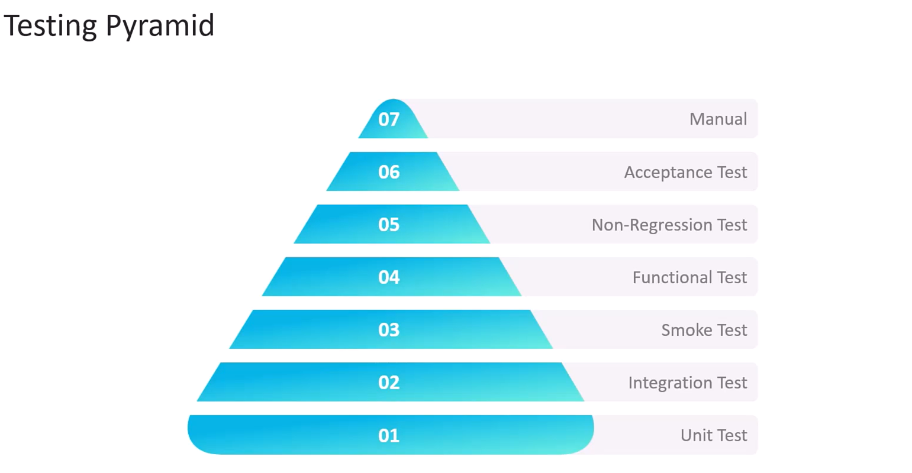
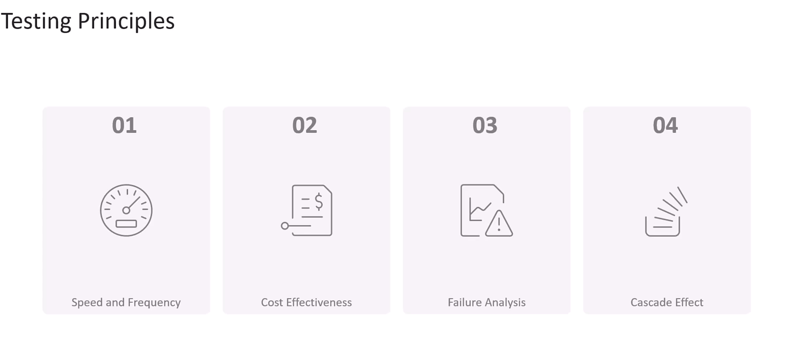
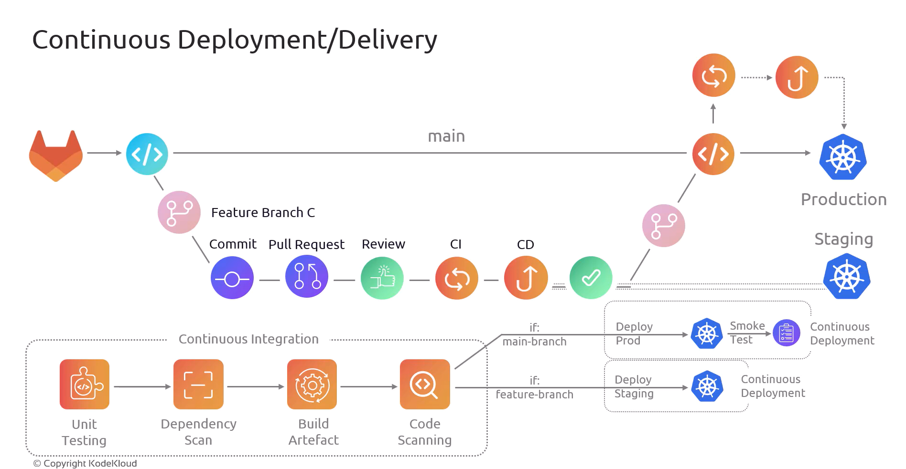

# ♾️ Basics of CI/CD

## 🧑🏻‍💻 Source Code Management System (SCMs)

   
   
   

---

## ♾️ CI/CD

   

---

### 🏗️ CI

   
   
   

---

## 🧪 Testing

   
   
   
   

---

### 🚀 CD

   

