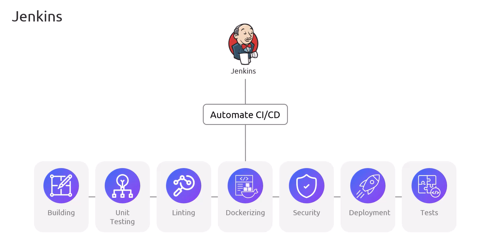
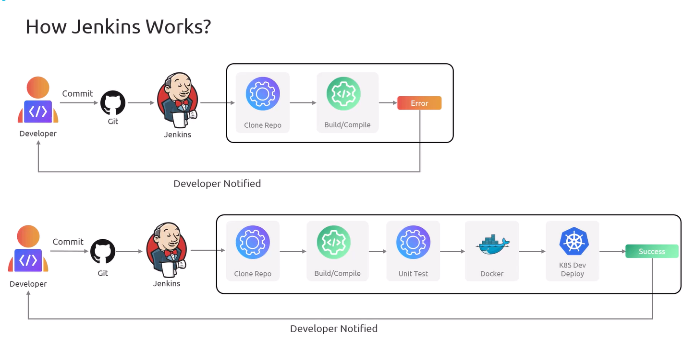
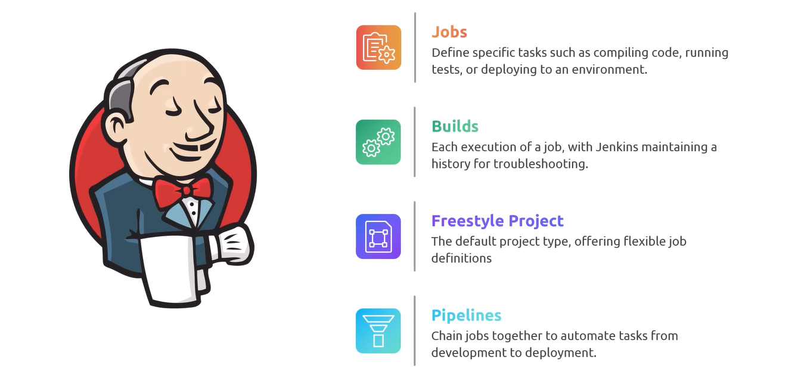
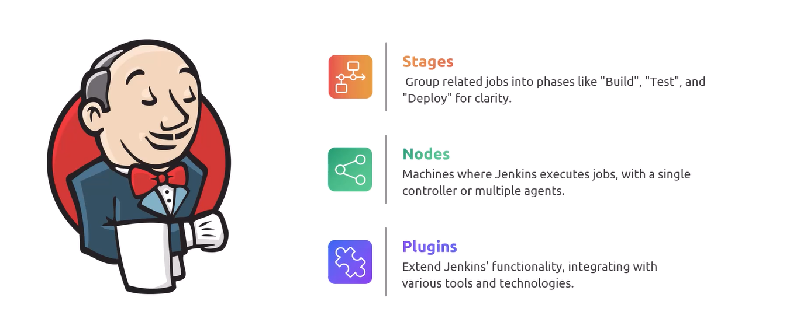
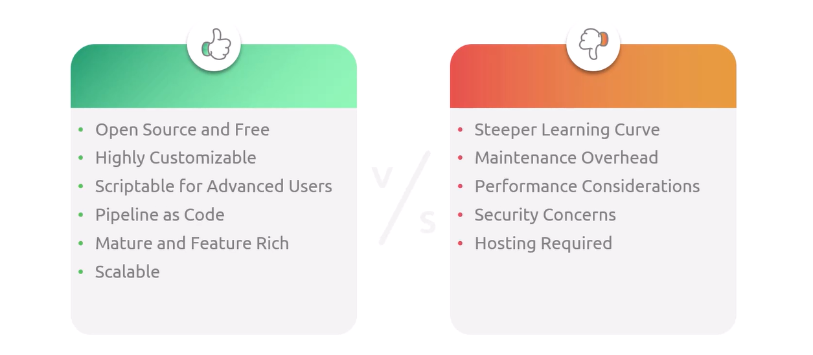

# 🧑🏻‍🍳 Jenkins Overview

_Jenkins is a Continuous Integration (CI) and Continuous Delivery (CD) server._

## 📖 What is Jenkins

   

---

   

---

## 🔖 Core Concepts

   
   

---

## ⚔️ Pro's and Con's

   

