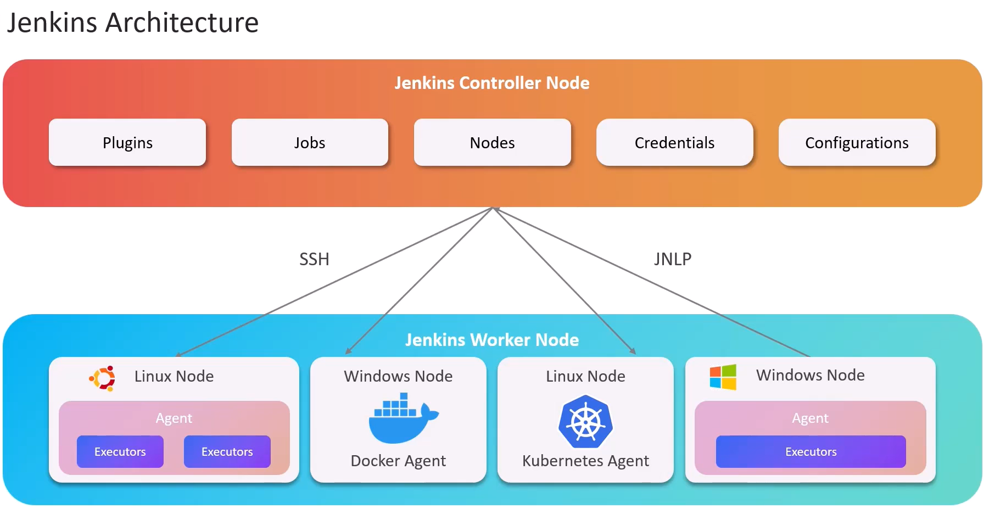
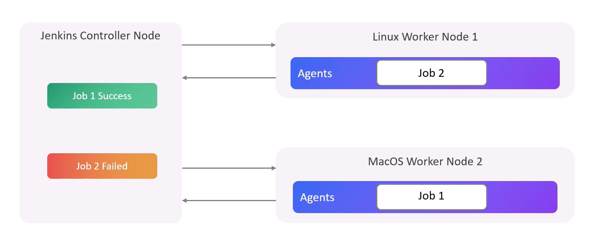
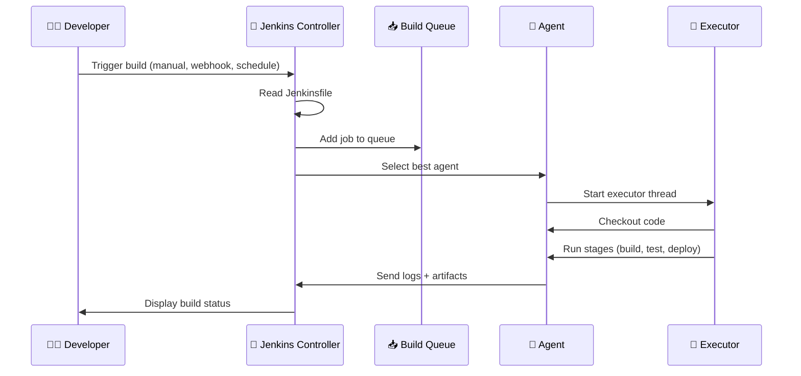
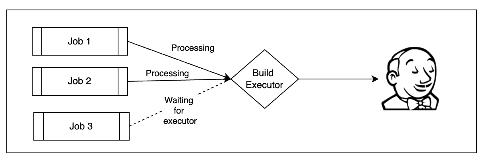
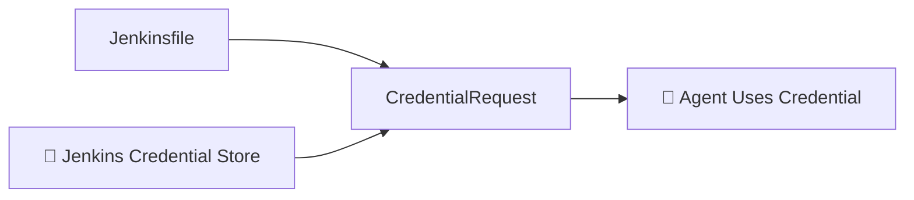
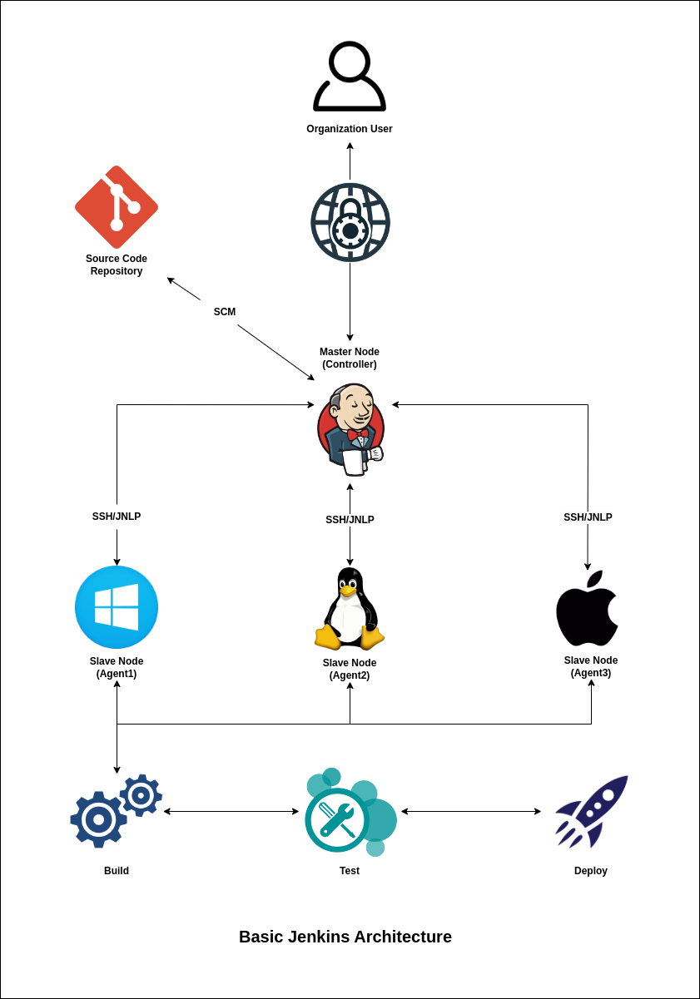

# 🏛️ **Jenkins Architecture**

## 📖 What Is Jenkins Really? (The Human Explanation)

Jenkins is not just a CI/CD tool. Think of it as:

> **🔥 A brain (controller) that manages a global army of workers (agents) to run automated tasks (builds, tests, deployments).**

Every task you configure in Jenkins becomes a workflow (Pipeline).
Every worker (agent) is a compute node that executes parts of that workflow.
The controller orchestrates everything: scheduling jobs, storing configs, managing plugins, logs, credentials, and build queues.

---

## 🏛️ High-Level Architecture Overview

### 🎯 Core Components

- **Jenkins Controller (Master)**
  The central management server. It _decides_ what to run, but should not _do_ the heavy work.

- **Jenkins Agents (Nodes/Slaves)**
  Machines that perform builds, tests, deployments, and scripts.

- **Build Queue**
  A waiting area for jobs before an agent becomes available.

- **Executors**
  Virtual "threads" on each agent that run jobs.

- **Plugins**
  Extend Jenkins' abilities for Git, Docker, Kubernetes, pipelines, notifications, cloud integration, and more.

Let’s visualize this.

---

### 🖼️ Jenkins Architecture Diagram (Visualized)

<div align="center" style="background-color:#fff; border-radius: 10px; border: 2px solid">
   
   
</div>

---

## 🧠 Jenkins Controller (Master)

The Jenkins Controller handles **ALL coordination**, **NO heavy lifting**.

### 🔧 Responsibilities of the Controller

#### 🗂️ 1. Manages configuration

- Pipeline definitions (Jenkinsfiles)
- Credentials management
- Plugins management
- System settings (security, agents, tools)

#### 📆 2. Schedules build jobs

- Keeps a **build queue**
- Chooses the best agent
- Dispatches tasks to available executors

#### 🔌 3. Manages plugins

Plugins transform Jenkins from "just CI" into:

- CI/CD platform
- Docker automation engine
- Kubernetes orchestrator
- Security scanner
- ChatOps bot
- And much more

#### 📊 4. Stores logs, metadata, and job history

Jenkins keeps:

- Console output
- Artifacts
- Test reports
- Build artifacts

#### 🧩 Should the controller run builds?

Technically yes.  
Practically NO.  
Best practice: **zero executors on the controller** using only agents for builds.

---

## 👷🏻‍♂️ Jenkins Agents (Nodes)

Agents are where the builds ACTUALLY run.

They can be:

### 🖥️ • Static Agents

Long-running VMs or bare-metal servers.

### ✨ • Dynamic Agents

Ephemeral instances created on demand by:

- Docker
- Kubernetes
- AWS EC2
- Azure VMSS
- Google Cloud

### 🔄 Agent Connections

Agents connect to the controller via:

| Protocol              | Notes                                         |
| --------------------- | --------------------------------------------- |
| **JNLP**              | Java Web Start agent (legacy)                 |
| **SSH**               | Most common for Linux agents                  |
| **Inbound TCP**       | Firewall-friendly, agent initiates connection |
| **Kubernetes Plugin** | Spins up pod agents automatically             |

Each agent contains:

- **Executors**
- **Workspace**
- **Tools** (JDK, Maven, .NET, Node, Docker, etc.)

---

<div align="center" style="background-color:#F8F8F8; border-radius: 10px; border: 2px solid">
   
</div>

---

## 🧵 Executors — The Workers Inside the Worker

An agent may run **multiple builds concurrently**, controlled by _executors_.

Example:

| Agent            | Executors | Meaning                         |
| ---------------- | --------- | ------------------------------- |
| Linux-Agent-01   | 4         | Can run 4 parallel jobs         |
| Windows-Agent-01 | 2         | Can run 2 jobs at the same time |

Executors allow Jenkins to fully consume hardware resources.

---

## 🔄 Job Execution Lifecycle

Let's walk through what happens when you click “Build Now”.



---

## 🪈 Jenkins Pipeline Architecture

There are two pipeline types:

### 1. Declarative Pipeline

Simple, structured, opinionated.

### 2. Scripted Pipeline

**Groovy-based**, flexible, fully programmable.

Both use:

- **Stages**
- **Steps**
- **Nodes**
- **Agents**
- **Libraries**

### Example of Declarative Pipeline:

```groovy
pipeline {
    agent { label 'linux' }

    stages {
        stage('Checkout') {
            steps {
                git 'https://github.com/repo.git'
            }
        }

        stage('Build') {
            steps {
                sh 'mvn clean package'
            }
        }

        stage('Test') {
            steps {
                sh 'mvn test'
            }
        }

        stage('Deploy') {
            steps {
                sh './deploy.sh'
            }
        }
    }
}
```

---

## 🌍 Jenkins Distributed Build Architecture

<div align="center" style="background-color:#fff; border-radius: 10px; border: 2px solid">
   
</div>

### Why distributed?

- ✔ Parallel builds
- ✔ Load distribution
- ✔ Language/platform diversity
- ✔ Better scalability
- ✔ No bottlenecks on controller

---

## 🔐 Credential Architecture

Jenkins stores credentials in:

- Keystore (encrypted)
- Credentials binding plugin
- Credentials scoped per folder/pipeline

Types include:

- Username/password
- SSH keys
- Secrets
- Tokens
- Certificates

Credentials flow:

<div align="center" style="background-color:#fff; border-radius: 10px; border: 2px solid">



</div>

---

## 🚀 Real-World Architecture Example

Let’s design a modern enterprise Jenkins setup.

### 🧠 Controller (small machine)

- 1–2 vCPUs
- 4–8 GB RAM
- No executors

### 🏋️ Agents

- Linux Build Agent
- Windows Build Agent
- Docker Cloud Agents
- Kubernetes Ephemeral Pods
- On-prem Agents for legacy applications

### 🗂 Storage

- NFS or S3 for artifacts
- External logging (ELK / Splunk)

### 🔒 Security

- RBAC
- LDAP/AD Integration
- Folder-level permissions
- Credentials scoped

---

## 🎯 Putting It All Together: Final Architecture Diagram

<div align="center" style="background-color:#fff; border-radius: 10px; border: 2px solid">
   
</div>

---

## 🔚 Short, Human Explanation to Remember

Think of Jenkins as:

> **A boss (controller) with many employees (agents).  
> The boss assigns tasks, workers do the tasks, and everyone reports back.**

- Controller = Manager
- Agents = Employees
- Executors = Employee hands
- Build Queue = Waiting room
- Pipelines = Task instructions
- Plugins = Extra skills
