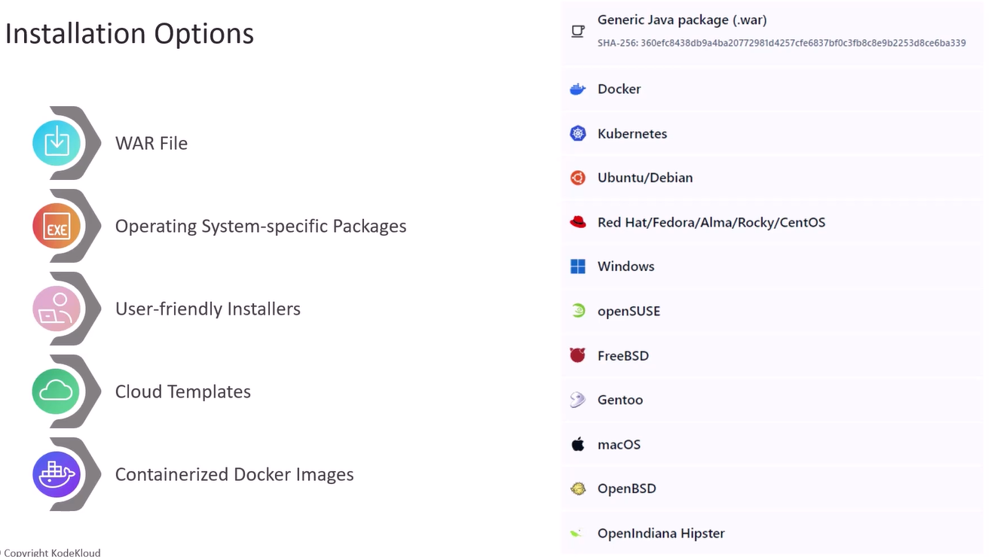
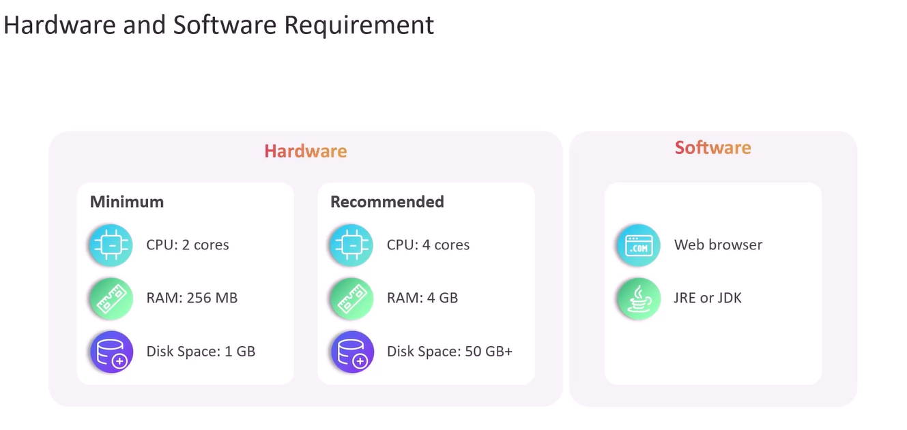
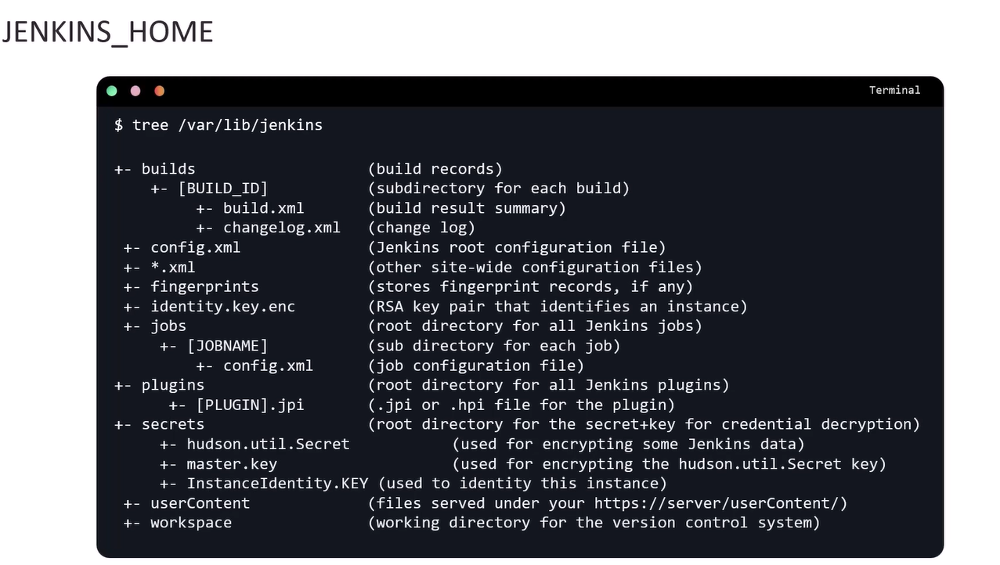
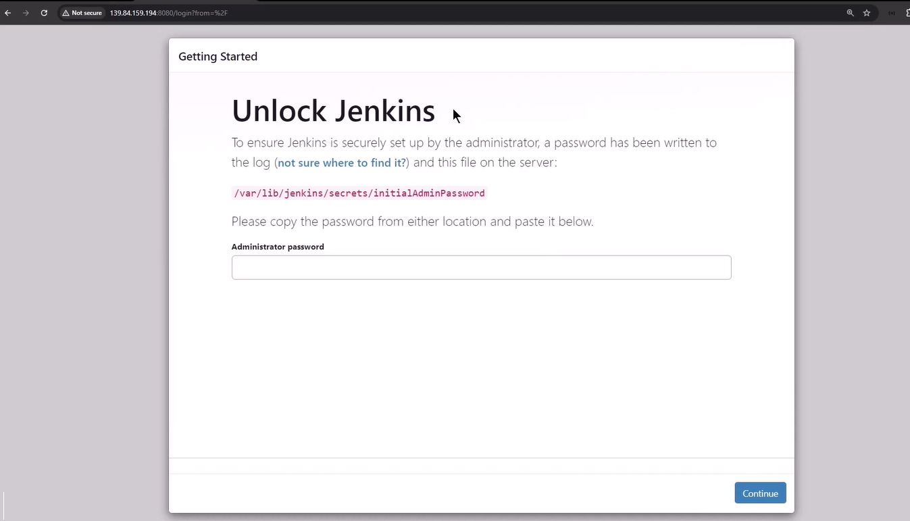
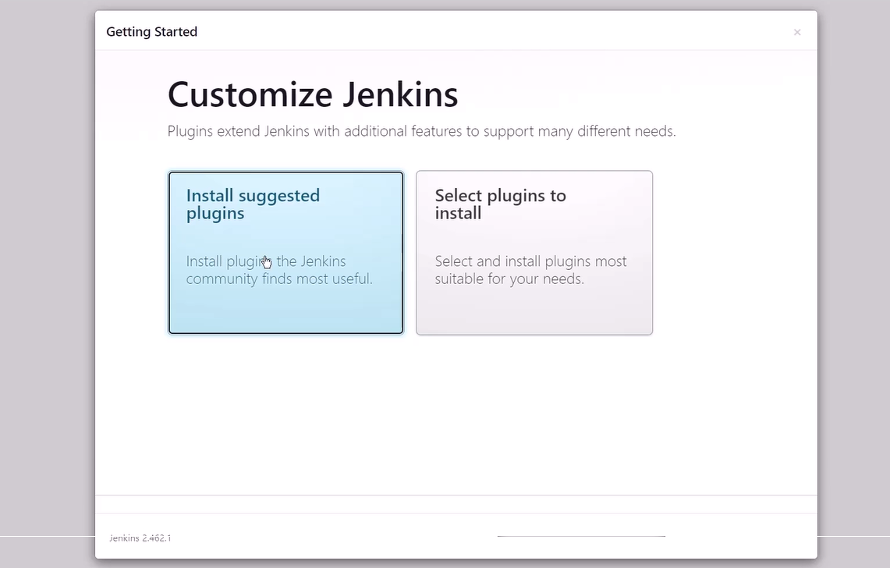
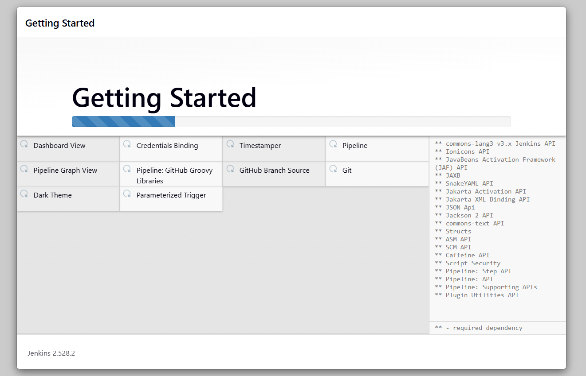

# Jenkins Installation Options

   
   

## 📦 Installation Options

### 1️⃣ **Ubuntu Server**

- [Debian/Ubuntu](https://www.jenkins.io/doc/book/installing/linux/#debianubuntu)

### 2️⃣ **Red Hat/Fedora**

- [Red Hat/Fedora](https://www.jenkins.io/doc/book/installing/linux/#redhatfedora)

### 3️⃣ **Windows**

- [Windows](https://www.jenkins.io/doc/book/installing/windows/)

### 4️⃣ **Docker**

- [Docker](https://www.jenkins.io/doc/book/installing/docker/)

### 5️⃣ **Kubernetes**

- [Kubernetes](https://www.jenkins.io/doc/book/installing/kubernetes/)

---

## 🗂️ JENKINS_HOME

`JENKINS_HOME` is the **root directory where Jenkins stores all of its configuration, build data, plugins, and logs**. It’s essentially the brain and memory of Jenkins—without it, Jenkins cannot function.

   

---

**Contents:**

- **Configuration files** (global settings, job configs, credentials)
- **Build history** (logs, artifacts, workspace data)
- **Plugins** (installed `.hpi` or `.jpi` files and their configs)
- **User data** (accounts, permissions, security settings)
- **Secrets** (encrypted credentials and keys)

Think of it as the **control tower** of Jenkins—every job, pipeline, and plugin relies on the data inside this directory.

---

### 📍 Default Locations

Depending on how Jenkins is installed, `JENKINS_HOME` lives in different places:

- **Windows installer:** `C:\ProgramData\Jenkins\.jenkins`
- **Running from .war file:** `~/.jenkins`
- **Debian/Ubuntu package:** `/var/lib/jenkins`
- **Red Hat/Fedora package:** `/var/lib/jenkins`

You can confirm the location in **Manage Jenkins → System → Home directory**.

---

### ⚙️ Why It Matters for a Senior DevOps Engineer

As someone aiming to master Jenkins, you need to treat `JENKINS_HOME` as **critical infrastructure**:

- **Backup Strategy:** Always back up `JENKINS_HOME` before upgrades or migrations. Losing it means losing jobs, pipelines, and credentials.
- **Disaster Recovery:** In case of server failure, restoring Jenkins is as simple as reinstalling Jenkins and pointing it to the backed-up `JENKINS_HOME`.
- **Scaling & Compliance:** For enterprise setups, you’ll often relocate `JENKINS_HOME` to a mounted volume, NFS share, or cloud storage for resilience and compliance.
- **Security:** Protect access to this directory—credentials and secrets are stored here. Mismanagement can expose sensitive data.

---

### 🚨 Risks & Trade-offs

- **Single Point of Failure:** If `JENKINS_HOME` is corrupted or deleted, Jenkins becomes unusable.
- **Performance Issues:** Storing large build artifacts here can slow Jenkins down; best practice is to archive artifacts externally (e.g., S3, Nexus).
- **Migration Complexity:** Moving `JENKINS_HOME` requires careful planning—especially with plugins and credentials.

---

## 🚀 Start

   
   
   

