# 🧩 Jenkins Project Types

Jenkins offers different **project types (job types)** based on how you want to automate, structure, and trigger your builds.  
Each project type solves a different problem and offers different flexibility levels.

---

<div align="center" style="background-color:#fff; border-radius: 10px; border: 2px solid">
   
</div>

---

## 🆓 1. Freestyle Project

> ✔ The "classic" Jenkins job  
> ✔ Perfect for quick tasks  
> ✔ GUI-driven configuration  
> ✔ Limited compared to Pipelines

---

### 🧠 What Is It?

A **Freestyle Project** is a simple job where you manually configure:

- Source code checkout
- Build steps
- Post-build actions
- Triggers
- Environment variables

All through the **Jenkins Web UI** — no scripting required.

---

### 🛠 Example Use Cases

- Run a shell/batch script
- Trigger a Maven/Gradle build
- Download files and process them
- Integrate with build tools like Ant
- Trigger deployments via scripts

---

### 🎯 Advantages

- Easy to create
- GUI-driven
- Good for beginners
- Good for simple workflows

---

### ⚠️ Limitations

- Hard to maintain for complex pipelines
- No code versioning of pipeline logic
- Cannot orchestrate complex CI/CD flows
- Not suitable for multi-branch or dynamic workflows

---

## 🌊 2. Pipeline Project

> ✔ The modern Jenkins job  
> ✔ Uses **Jenkinsfile**  
> ✔ Code-as-pipeline  
> ✔ Supports complex CI/CD

---

### 🧠 What Is It?

A **Pipeline Project** allows you to define your whole build, test, and deploy process **as code**, using Groovy-based syntax.

Stored in Jenkins or in your repository as `Jenkinsfile`.

---

### 🔥 Pipeline Types:

#### 1. Declarative Pipeline

- Structured, simple, recommended.

#### 2. Scripted Pipeline

- Fully Groovy, flexible, more advanced.

---

### 🧱 Example Jenkinsfile (Declarative)

```groovy
pipeline {
    agent any

    stages {
        stage('Build') {
            steps { sh 'mvn package' }
        }

        stage('Test') {
            steps { sh 'mvn test' }
        }

        stage('Deploy') {
            steps { sh './deploy.sh' }
        }
    }
}
```

---

### 🎯 Advantages

- Pipeline as code
- Versioned with source code
- Supports retries, conditions, agents per stage
- Works with Kubernetes, Docker, cloud agents
- Strong DevOps integration

---

### ⚠️ Limitations

- Requires writing Groovy-like syntax
- Harder for beginners
- Complex debugging for Scripted Pipelines

---

## 🌳 3. Multibranch Pipeline

> ✔ Automatically creates pipelines per branch  
> ✔ Perfect for Git Flow / Trunk-based development  
> ✔ Zero manual job creation per branch

---

### 🧠 What Is It?

A **Multibranch Pipeline** scans your Git repo and creates a **separate pipeline job** for each branch, PR, or tag that contains a Jenkinsfile.

---

### 🧩 Why Is This Important?

Imagine you have 50 branches.
You DO NOT want to create 50 pipeline jobs manually.

Multibranch automates ALL of this.

---

### 🔁 How It Works (Visualization)

```mermaid
flowchart LR
    Repo[Git Repository] --> Scan[🔍 Jenkins Branch Scan]

    Scan --> BranchA[Pipeline: feature/login]
    Scan --> BranchB[Pipeline: feature/payment]
    Scan --> BranchC[Pipeline: hotfix-001]
    Scan --> PR1[Pipeline: Pull Request #17]
```



Each of these will:

- Have its own build history
- Run its own Jenkinsfile
- Auto-delete when the branch is deleted

---

### 🎯 Advantages

- Full automation of branch pipelines
- Ideal for microservices and GitFlow
- Auto-discovers new branches/PRs
- Keeps pipelines isolated

---

### ⚠️ Limitations

- Requires repo structure to be clean
- Jenkinsfile must exist in every branch
- Scanning large repos may be slow

---

## 🏪 4. GitHub Organization / Bitbucket Organization Project

> ✔ Best for enterprises with many repos  
> ✔ Auto-discovers repos + branches  
> ✔ Basically Multibranch but across ENTIRE org

---

### 🧠 What Is It?

Jenkins connects to:

- GitHub Organization
- Bitbucket Team
- GitLab Group

It then automatically:

- Lists all repositories
- Finds which repos contain a Jenkinsfile
- Creates a multibranch pipeline for EACH repo

---

### 🏢 Example Scenario

A company with:

```ini
org/
 ├── payments-service
 ├── auth-service
 ├── analytics-service
 ├── mobile-app
 ├── frontend-react
```

Creating pipelines manually for 50+ repos = ❌ 
GitHub Organization job solves this = ✔

---

### 🎯 Advantages

- Automatic onboarding of new repositories
- Fully dynamic
- Zero manual configuration
- Great for microservices

---

### ⚠️ Limitations

- Requires proper repo permissions
- Scans may be expensive for large orgs
- Requires correct Jenkinsfile placement

---

## 🔄 5. External Job

> ✔ Used for jobs triggered outside Jenkins  
> ✔ Jenkins only collects results

---

### 🧠 What Is It?

An **External Job** is triggered OUTSIDE Jenkins (CLI/APIs), usually from:

- Cron jobs
- External systems
- Legacy apps

Jenkins only records:

- Whether it ran
- Logs
- Status

---

### 🎯 Example

Legacy system runs:

```ini
jenkins-cli build external-job-name
```

Jenkins shows results, but doesn’t run anything internally.

---

### ⚠️ Rarely used today

Most teams prefer:

- Pipelines
- Remote triggers via webhook

---

## 🐧 6. Maven Project

> ✔ Legacy job type for Maven builds  
> ✔ Offers special Maven integrations

---

### 🧠 What Is It?

A **Maven Project** automatically understands:

- Maven lifecycle
- Modules
- POM structure

This job type runs Maven goals and shows Maven-specific reports like:

- Test results
- Dependency graphs
- Module build times

---

### 💡 But modern Jenkins best practice?

Use **Pipeline Project** instead:

```groovy
sh 'mvn clean install'
```

Maven Project is now considered legacy.

---

## 🏋️ 7. Multi-Configuration Project (Matrix Job)

> ✔ Run same job across multiple configurations  
> ✔ OS matrix, JDK matrix, env matrix  
> ✔ Parallel execution

---

### 🧠 What Is It?

A **Matrix job** lets you run the same task across combinations of parameters.

Example matrix:

| OS      | JDK    | Browser |
| ------- | ------ | ------- |
| Linux   | JDK 11 | Chrome  |
| Linux   | JDK 17 | Firefox |
| Windows | JDK 17 | Chrome  |

Each combination becomes a separate job run.

---

### 🎯 Example Use Cases

- Test Python app on multiple versions
- Run tests on different OS
- Cross-browser testing
- Library builds per JDK

---

### 🛠 Visualization


---

### ⚠️ Limitations

- Old UI
- Hard to maintain
- Replaced by Pipeline + `matrix` directive

### Example:

```groovy
// this will create 4 jobs [Linux + JDK 11, Linux + JDK 17, Windows + JDK 11, Windows + JDK 17]
matrix {
    axes {
        axis { name 'JDK'; values '11', '17' }
        axis { name 'OS'; values 'linux', 'windows' }
    }
    stages {
        stage('Test') {
            steps {
                sh 'run-tests.sh'
            }
        }
    }
}
```

---

## 🗂️ 8. Folder

> ✔ Not a job type  
> ✔ But critical for organizing large Jenkins setups

---

### 🧠 Why Use Folders?

You can group pipelines and projects by:

- Team
- Microservice
- Environment
- Business unit

Folders also allow:

- Role-based security
- Credential scoping
- Better navigation in large setups

---

## 🧩 Summary Table

| Project Type                     | Best For               | UI or Code? | Modern Usage                         |
| -------------------------------- | ---------------------- | ----------- | ------------------------------------ |
| **Freestyle**                    | Simple jobs            | UI          | Medium                               |
| **Pipeline**                     | Modern CI/CD           | Code        | 🔥 HIGH                              |
| **Multibranch Pipeline**         | Branch automation      | Code        | 🔥🔥 VERY HIGH                       |
| **GitHub/Bitbucket Org**         | Auto-managing repos    | Code        | 🔥🔥 VERY HIGH                       |
| **External Job**                 | External triggers      | N/A         | Low                                  |
| **Maven Project**                | Maven builds           | UI          | Low (legacy)                         |
| **Multi-Configuration (Matrix)** | Testing across configs | UI          | Medium → Replaced by Pipeline Matrix |
| **Folder**                       | Organization           | N/A         | Essential                            |

---

## 🎉 Final Takeaway

Think of Jenkins project types like apps on your phone:

- **Freestyle = Simple Notes App**
- **Pipeline = Full IDE**
- **Multibranch = Auto-create IDE per branch**
- **GitHub Org = Auto-create IDE per repo**
- **Matrix Job = Testing lab**
- **Maven Project = Old Maven plugin**
- **Folders = Folders on your phone**
