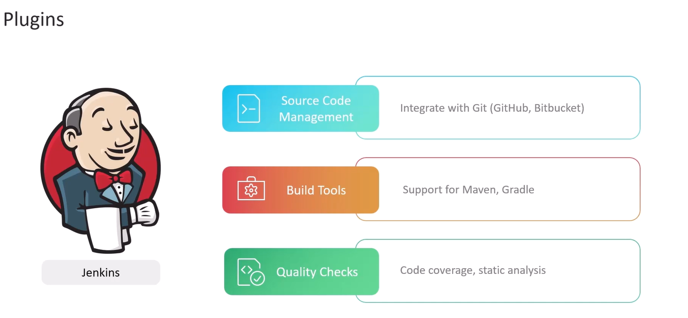
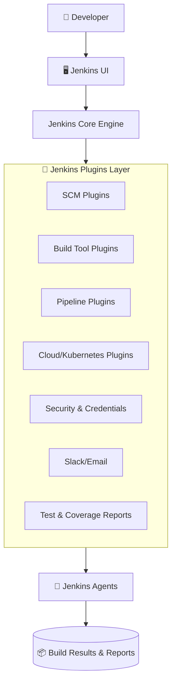

# 🔌 Jenkins Plugins

If Jenkins were a smartphone, **plugins are the apps** you install.  
Without plugins, Jenkins is a **minimal CI server**.  
WITH plugins, Jenkins becomes a **complete DevOps automation platform**, integrated with:

- GitHub / GitLab / Bitbucket
- Docker & Kubernetes
- AWS / Azure / GCP
- Slack / Teams
- Maven / Gradle / .NET
- Terraform / Ansible / Helm

**Plugins are what make Jenkins powerful, flexible, and enterprise-ready.**

---

<div align="center" style="background-color:#fff; border-radius: 10px; border: 2px solid">
   
   
   
</div>

## 📖 What Are Jenkins Plugins?

Jenkins plugins are add-ons that extend Jenkins’ built-in capabilities.

Think of the Jenkins core as a **lightweight engine**, and plugins as attachments that provide:

- ✔ New UI components
- ✔ New job types
- ✔ New steps in pipelines
- ✔ New integrations
- ✔ New credential types
- ✔ New build triggers
- ✔ New reports and dashboards

There are **1,800+ official plugins** maintained by Jenkins and the open-source community.

---

## 🤹 Categories of Jenkins Plugins

Below is a **complete breakdown** of the most important plugin categories.

- 🧑🏻‍💻 A. Source Code Management (SCM) Plugins
- ⚙️ B. Build Tool Plugins
- 🧪 C. Test Reporting Plugins
- 🐳 D. Container & Cloud Plugins (Modern DevOps Essentials)
- 🛠 E. Pipeline Plugins
- 🔔 F. Notification Plugins
- 🔐 G. Credential & Security Plugins
- 📊 H. UI & Visualization Plugins
- ⏸️ I. Triggers & Orchestration Plugins
- 🧵 J. Agent/Node Management Plugins
- 🤖 K. DevOps / CI/CD Integration Plugins

---

## 🧑🏻‍💻 A. Source Code Management (SCM) Plugins

These plugins allow Jenkins to interact with version control.

### Popular SCM Plugins:

- **Git Plugin** — Most used plugin in all of Jenkins
- **GitHub Plugin**
- **GitLab Plugin**
- **Bitbucket Plugin**
- **Subversion (SVN)**

### Capabilities Enabled:

- ✔ Clone repos
- ✔ Pull/push integrations
- ✔ Webhooks for build triggers
- ✔ OAuth and token authentication
- ✔ Multi-branch pipeline scanning

---

## ⚙️ B. Build Tool Plugins

Enable Jenkins to run build tools.

### Examples:

- Maven Integration Plugin
- Gradle Plugin
- Ant Plugin
- MSBuild Plugin (.NET Framework)
- NodeJS Plugin
- Python Plugin

### Adds:

- ✔ Build steps
- ✔ Tool installation config
- ✔ Reports (e.g., test results, Surefire reports)

---

## 🧪 C. Test Reporting Plugins

Plugins that produce detailed test reports.

### Examples:

- JUnit Plugin
- NUnit Plugin
- xUnit Plugin
- JaCoCo Plugin (code coverage)
- SonarQube Scanner Plugin

### Benefits:

- ✔ Test summaries
- ✔ Trend analysis
- ✔ Coverage visualization
- ✔ Quality gates

---

## 🐳 D. Container & Cloud Plugins (Modern DevOps Essentials)

### Docker Plugins:

- Docker Plugin (build/run containers)
- Docker Pipeline Plugin
- Docker Swarm Plugin

### Kubernetes Plugins:

- **Kubernetes Plugin (MOST IMPORTANT)**  
  Creates **ephemeral agents** (pods) on demand.

### Cloud Provider Plugins:

- AWS EC2 Plugin
- Azure VM Agents Plugin
- Google Compute Engine Plugin

### Capabilities:

- ✔ Create dynamic build agents
- ✔ Build inside containers
- ✔ Auto-scale Jenkins workloads
- ✔ Kubernetes-native pipelines

---

## 🔨 E. Pipeline Plugins

These plugins provide Jenkins Pipeline (Jenkinsfile) functionality.

### MUST KNOW Plugins:

#### 1. **Pipeline Plugin (Workflow)**

- The engine behind Jenkinsfile.

#### 2. **Pipeline: Declarative**

- Enables structured syntax like:

  ```groovy
  pipeline {
      agent any
  }
  ```

#### 3. **Pipeline: Groovy**

- Scripted syntax support.

#### 4. **Pipeline: Stage View Plugin**

- Creates graphical stage visualization.

---

## 🔔 F. Notification Plugins

Used to notify team members.

### Examples:

- Slack Notification Plugin
- Microsoft Teams Plugin
- Email Extension Plugin
- Discord Plugin

### Capabilities:

- ✔ Build status notifications
- ✔ Rich message formatting
- ✔ Pipeline-integrated alerts

Example:

```groovy
slackSend message: "Build finished!", color: 'good'
```

---

## 🔐 G. Credential & Security Plugins

Enhance Jenkins security and credential handling.

### Examples:

- Credentials Binding Plugin
- Azure Credentials Plugin
- HashiCorp Vault Plugin
- SSH Credentials Plugin
- Role-Based Authorization Strategy Plugin

These provide:

- ✔ Secure variable injection
- ✔ Secret storage
- ✔ Role-based authentication

---

## 📊 H. UI & Visualization Plugins

These improve the Jenkins visual experience.

### Examples:

- Blue Ocean UI Plugin
- Build Monitor View
- Test Results Analyzer
- Dark Theme Plugin

They display:

- ✔ Build trends
- ✔ Stage graphs
- ✔ Test dashboards

---

## ⏸️ I. Triggers & Orchestration Plugins

Enable advanced scheduling and automation.

### Examples:

- GitHub Integration Plugin
- GitHub Branch Source Plugin
- Bitbucket Branch Source
- Parameterized Trigger Plugin
- Build Flow Plugin

Capabilities:

- ✔ Multi-job triggering
- ✔ PR-based triggers
- ✔ Dependency orchestration
- ✔ Upstream/downstream workflows

---

## 🧵 J. Agent/Node Management Plugins

Plugins that help Jenkins manage build environments.

### Examples:

- SSH Build Agents Plugin
- Windows Agents Plugin
- Kubernetes Plugin
- Docker Plugin

Add abilities:

- ✔ Connect agents via SSH/JNLP
- ✔ Spin up ephemeral containers
- ✔ Create cloud-based agents on-demand

---

## 🤖 K. DevOps / CI/CD Integration Plugins

Enable deep integration with DevOps tools.

### Examples:

- SonarQube Plugin
- HashiCorp Vault Plugin
- Artifactory Plugin
- Nexus Plugin
- Terraform Plugin
- Ansible Plugin

They enable:

- ✔ Code quality scanning
- ✔ Dependency management
- ✔ Secrets retrieval
- ✔ Artifact publishing
- ✔ Infrastructure-as-Code automation

---

## 🧑🏻‍💼 The Jenkins Plugin Manager (Your Control Panel)

You manage plugins via:

**Manage Jenkins → Manage Plugins:**

The Plugin Manager has four tabs:

<div align="center" style="background-color:#fff; border-radius: 10px; border: 2px solid">
   
</div>

### 1. **Updates**

Shows plugins needing upgrades.

### 2. **Available**

Plugins you can install.

### 3. **Installed**

Plugins already installed.

### 4. **Advanced**

Manual upload + update URLs.

---

## ❓ How Plugins Affect Jenkins Configuration

Plugins can add:

| Component Added      | Example                            |
| -------------------- | ---------------------------------- |
| New **steps**        | `sh`, `powershell`, `docker build` |
| New **post actions** | Publish test results               |
| New **credentials**  | Azure service principal            |
| New **job types**    | Pipeline, Multibranch              |
| New **UI pages**     | Blue Ocean                         |
| New **triggers**     | GitHub PR trigger                  |

---

## ☠️ Risks & Best Practices

Plugins are powerful — but can break your Jenkins.

### ⚠️ Risks

- Plugin dependency conflicts
- Plugin vulnerabilities
- Outdated plugins
- Performance issues
- Security risk if plugin is abandoned

---

## ✅ Best Practices (Industry Standard)

<div align="center" style="background-color:#fff; border-radius: 10px; border: 2px solid">
   
</div>

### 1️⃣ Keep Jenkins core stable

- Never update core and plugins together unless tested.

### 2️⃣ Use an LTS version

- LTS = Long-Term Support, stable for enterprises.

### 3️⃣ Don’t install every plugin

- Each plugin increases risk.

### 4️⃣ Remove unused plugins

- Cleaner, faster, more secure Jenkins.

### 5️⃣ Use Configuration-as-Code

- Plugins + config stored in YAML for reproducibility.

### 6️⃣ Set up staging Jenkins

- Test plugin upgrades before production.

### 7️⃣ Check plugin dependencies before upgrading

- Sometimes plugin A needs plugin B updated first.

---

## 📝 Real Jenkins Plugin Stack

Here’s a typical DevOps Jenkins stack:

| Category      | Plugin                           |
| ------------- | -------------------------------- |
| SCM           | Git, GitHub Branch Source        |
| Build         | Maven, NodeJS, Docker            |
| CI/CD         | Pipeline, Blue Ocean, Stage View |
| Cloud Agents  | Kubernetes Plugin                |
| Security      | Role-Based Strategy, LDAP, Vault |
| Notifications | Slack Plugin                     |
| Reports       | JUnit, JaCoCo                    |
| Artifacts     | Artifactory Plugin               |

---

## 📊 Visual Overview Diagram

<div align="center" style="background-color: #191a1dff; border-radius: 10px; border: 2px solid;">



</div>

---

## 🎉 Final Summary (Human-Friendly)

Think of Jenkins plugins like superpowers:

- Want Jenkins to talk to GitHub? → **GitHub Plugin**
- Want containers? → **Docker Plugin**
- Want ephemeral Kubernetes agents? → **K8s Plugin**
- Want pretty UI? → **Blue Ocean**
- Want to send Slack alerts? → **Slack Plugin**
- Want CI/CD? → **Pipeline Plugin**

Plugins transform Jenkins from **basic CI** → **full DevOps platform**.
