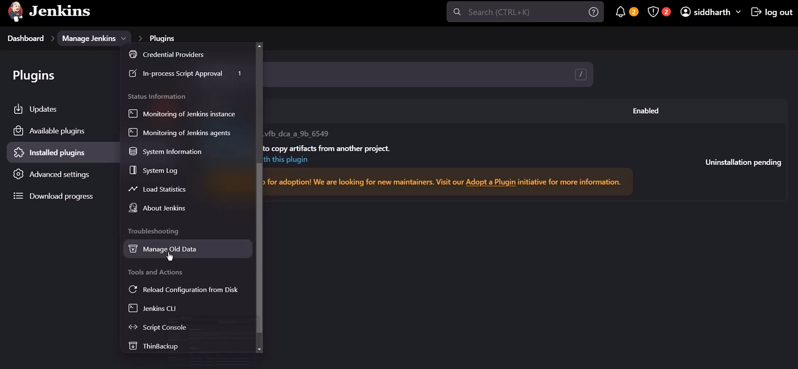

# 👵🏻 Manage Old Data

The **Manage Old Data** feature in Jenkins helps you detect and clean up **orphaned plugin configuration data** that remains in jobs or system settings after a plugin has been uninstalled or upgraded. It prevents Jenkins from carrying around unused or broken XML fragments that could cause errors or unexpected behavior.

---

   

---

## 🗂️ What “Manage Old Data” Does

- **Leftover Configurations:** When you uninstall or upgrade a plugin, Jenkins does not automatically remove its configuration from job XML files. For example, if you remove the **Copy Artifact plugin**, job configs may still contain `<hudson.plugins.copyartifact.CopyArtifact>` blocks.
- **Detection:** The **Manage Old Data** page scans Jenkins for these outdated fragments.
- **Cleanup:** It allows administrators to **remove or migrate** the old data safely.

---

## ⚙️ How to Use It

1. Navigate to **Manage Jenkins → Manage Old Data**.
2. Jenkins will list jobs or system configs containing obsolete plugin references.
3. You can choose to:
   - **Delete** the old data (recommended if the plugin is gone).
   - **Ignore** it (if you plan to reinstall the plugin).
   - **Migrate** it (if the plugin has changed its data format).

---

## 📊 Why It Matters for Senior DevOps Engineers

- **Stability:** Prevents Jenkins from throwing errors when encountering unknown XML tags.
- **Clean Configs:** Keeps job definitions lean and readable for onboarding engineers.
- **Compliance:** Ensures your CI/CD environment doesn’t retain unused or insecure plugin data.
- **Upgrade Safety:** Reduces risk when upgrading Jenkins or plugins by removing stale references.

---

## 🚨 Risks & Trade-offs

- **Accidental Data Loss:** Deleting old data may remove job steps that relied on the plugin.
- **Reinstallation Issues:** If you plan to reinstall the plugin, deleting its old data may force you to reconfigure jobs.
- **Manual Review Needed:** Always review the listed jobs before cleanup to avoid breaking pipelines.

---

## 🧭 Mentor’s Tip for You, Hady

Since you’re building **onboarding-ready documentation and recovery playbooks**, here’s how to leverage this feature:

- **Document Plugin Lifecycle:** Explain in your onboarding docs that uninstalling a plugin doesn’t remove its job configs.
- **Automate Checks:** Add a periodic audit step (e.g., monthly) to review **Manage Old Data**.
- **Version Control:** Export job configs before cleanup so you can roll back if needed.
- **Compliance Signal:** Show recruiters and auditors that your Jenkins environment is proactively cleaned and maintained.

---

✅ **In short:** _Manage Old Data_ is Jenkins’ way of helping you clean up **ghost configurations** left behind by plugins. As a senior DevOps engineer, mastering this ensures your Jenkins environment stays stable, secure, and onboarding-friendly.
