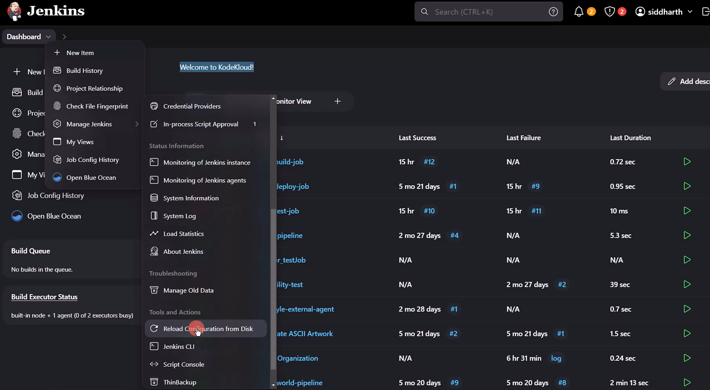

# 🔄 **Reload Configuration from Disk**

This option appears under **Manage Jenkins** in the Jenkins dashboard.

   

---

## 🗂️ What It Does

- Jenkins stores all of its configuration (system settings, job definitions, plugin configs) as **XML files** inside `JENKINS_HOME`.
- When you click **Reload Configuration from Disk**, Jenkins:
  - **Discards the in-memory configuration** it’s currently using.
  - **Re-reads all XML files** from disk (e.g., `config.xml` for jobs, `jenkins.xml` for system).
  - Applies those settings immediately without restarting the Jenkins process.

---

## ⚙️ Why It Exists

- **External Changes:** Sometimes admins or automation scripts modify job configs or system settings directly on disk (e.g., via GitOps, config management tools like Ansible, or manual edits).
- **Avoid Restart:** Instead of restarting Jenkins (which interrupts builds), you can reload configs on the fly.
- **Consistency:** Ensures Jenkins’ runtime state matches what’s stored on disk.

---

## 📊 Why It Matters for Senior DevOps Engineers

- **GitOps/Infra-as-Code:** If you store Jenkins job configs in Git and sync them to disk, this option lets Jenkins pick them up immediately.
- **Disaster Recovery:** After restoring `JENKINS_HOME` from backup, you can reload configs without a full restart.
- **Automation:** Useful in CI/CD pipelines where Jenkins configs are templated and updated externally.

---

## 🚨 Risks & Trade-offs

- **Job Interruptions:** Reloading does not restart Jenkins, but jobs running during reload may fail if their configs change mid-run.
- **Plugin State:** Reload only affects XML configs; plugin runtime state may not fully reset. Sometimes a full restart is safer.
- **Human Error:** Editing XML directly is risky — malformed configs can break Jenkins when reloaded.

---

## 🧭 Mentor’s Tip for You, Hady

Since you’re already strong in **ArgoCD and GitOps workflows**, here’s how to elevate this feature:

- **Pair with Git:** Keep Jenkins job configs in Git, sync them to `JENKINS_HOME`, then use reload for instant application.
- **Automate Reload:** Trigger reload via Jenkins CLI (`jenkins-cli reload-configuration`) after config sync jobs.
- **Document Recovery:** In your onboarding docs, explain when to use reload vs. restart — reload for config sync, restart for plugin upgrades.
- **Compliance:** Always validate XML before reload; malformed configs can cause downtime.

---

✅ **In short:** _Reload Configuration from Disk_ tells Jenkins to throw away its current in-memory settings and re-read everything from `JENKINS_HOME`. It’s a powerful tool for GitOps-style config management, but risky if configs are malformed.
