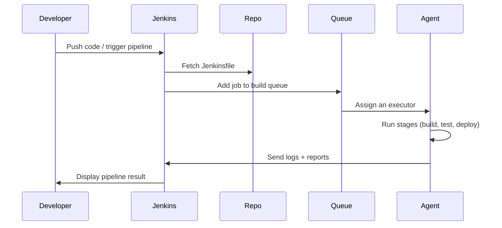

# 🚀 Jenkins Pipeline Project

A **Jenkins Pipeline Project** is the **modern, powerful, code-driven CI/CD job type** in Jenkins.
It allows you to write your build, test, and deployment logic using a **Jenkinsfile**, enabling full automation, modularity, reusability, version control, and DevOps-friendly workflows.

---

## 📖 What Is a Jenkins Pipeline Project?

A **Pipeline Project** is a Jenkins job where the entire workflow is defined **as code** using Groovy-based syntax.

You write your pipeline steps inside a **Jenkinsfile**, either:

- Stored in the Git repository (recommended)
- Or defined directly inside the Jenkins UI

Pipelines support:

- ✔ Multi-stage CI/CD
- ✔ Parallel execution
- ✔ Conditions & input approvals
- ✔ Docker/Kubernetes agents
- ✔ Retry logic & error handling
- ✔ Complex orchestration
- ✔ Integration with cloud, containers, SCM, and tools

---

## 🎭 Types of Jenkins Pipelines

Jenkins supports **two main pipeline styles**:

---

### 🟦 A. Declarative Pipeline (Recommended)

- ✔ Easy to read
- ✔ Structured
- ✔ Error-resistant
- ✔ Jenkinsfile-friendly
- ✔ Best for teams adopting DevOps

---

### 🟥 B. Scripted Pipeline

- ✔ Fully Groovy-based
- ✔ Very flexible
- ✔ Used for complex logic
- ✔ More advanced, less beginner-friendly

---

Let's break down each with full examples.

---

## 🟦 Declarative Pipeline

Declarative Pipeline uses **a simple, rule-based syntax**.

### ⭐ Basic Example

```groovy
pipeline {
    agent any

    stages {
        stage('Checkout') {
            steps {
                git 'https://github.com/example/app.git'
            }
        }

        stage('Build') {
            steps {
                sh 'mvn package'
            }
        }

        stage('Test') {
            steps {
                sh 'mvn test'
            }
        }

        stage('Deploy') {
            steps {
                sh 'echo "Deploying..."'
                sh './deploy.sh'
            }
        }
    }
}
```

---

### ⭐ Explanation of Each Component

#### 1️⃣ `pipeline { }`

- The outer wrapper — defines the start of the pipeline.

#### 2️⃣ `agent any`

- Tells Jenkins to run on any available agent.

- You can also specify labels:

  ```groovy
  agent { label 'linux' }
  ```

- Or Docker:

  ```groovy
  agent { docker { image 'node:18' } }
  ```

- Or Kubernetes (via plugin):

  ```groovy
  agent { kubernetes { yamlFile 'pod.yaml' } }
  ```

---

#### 3️⃣ `stages { }`

- A pipeline is divided into **stages** — like Build, Test, Deploy.

#### 4️⃣ `steps { }`

Inside each stage, steps are executed:

- Shell commands
- Pipeline commands
- Publish reports
- Deploy scripts

---

### ⭐ Pipeline Visualization


This is exactly what Jenkins Stage View shows.

---

### ⭐ Declarative Pipeline Features (with Examples)

#### ✔ Environment Variables

```groovy
environment {
    ENV = "dev"
    API_KEY = credentials('my-secret')
}
```

---

#### ✔ Post Actions

```groovy
post {
    success {
        echo "Build succeeded!"
    }
    failure {
        slackSend message: "Build failed!"
    }
}
```

---

#### ✔ Parallel Execution

```groovy
stage('Parallel Testing') {
    parallel {
        Backend: {
            sh 'npm test backend'
        }
        Frontend: {
            sh 'npm test frontend'
        }
    }
}
```

This allows CI/CD to finish MUCH faster.

---

#### ✔ Input Approval

```groovy
stage('Manual Approval') {
    steps {
        input message: "Deploy to Production?"
    }
}
```

---

#### ✔ Matrix (Multiple Configurations)

```groovy
matrix {
    axes {
        axis { name 'NODE_VERSION'; values '16', '18' }
        axis { name 'OS'; values 'linux', 'windows' }
    }
    stages {
        stage('Test') {
            steps {
                sh "echo Testing on OS=${OS}, Node=${NODE_VERSION}"
            }
        }
    }
}
```

---

## 🟥 Scripted Pipeline

Scripted Pipelines use **pure Groovy**, giving extreme flexibility.

---

### ⭐ Basic Scripted Example

```groovy
node {
    stage('Checkout') {
        git 'https://github.com/example/app.git'
    }

    stage('Build') {
        sh 'mvn package'
    }

    stage('Test') {
        sh 'mvn test'
    }

    stage('Deploy') {
        sh './deploy.sh'
    }
}
```

---

### 🔍 Key Differences from Declarative

| Feature        | Declarative  | Scripted                         |
| -------------- | ------------ | -------------------------------- |
| Syntax         | Structured   | Free-form Groovy                 |
| Learning curve | Easy         | Advanced                         |
| Flexibility    | Medium       | Unlimited                        |
| Best for       | Most cases   | Complex automation               |
| Example usage  | CI/CD builds | Dynamic logic, loops, conditions |

---

### ⭐ Scripted Example with Loops and Conditions

```groovy
node {
    def services = ['auth', 'payment', 'orders']

    stage('Build All') {
        services.each { svc ->
            sh "docker build -t myapp/${svc}:latest ${svc}/"
        }
    }
}
```

Scripted pipeline excels in **programmability**.

---

## 🎯 Where Is the Jenkinsfile Stored?

### ✔ Option A — In the Repository (BEST)

Jenkinsfile lives at the root of your project.

Advantages:

- Version-controlled pipeline
- Easier debugging
- Branch-specific pipelines
- Required for Multibranch pipeline
- Required for GitHub Organization jobs

---

### ✔ Option B — Inside Jenkins UI

You can paste the Jenkinsfile in the Pipeline config.

Not recommended for teams.

---

## 🎞️ Full End-to-End CI/CD Example

Let’s build a complete pipeline:

---

### ⭐ Complete Example Jenkinsfile

```groovy
pipeline {
    agent any

    environment {
        DOCKER_IMAGE = "myapp:${env.BUILD_NUMBER}"
    }

    stages {
        stage('Checkout') {
            steps {
                checkout scm
            }
        }

        stage('Build') {
            steps {
                sh 'mvn clean package -DskipTests'
            }
        }

        stage('Test') {
            steps {
                sh 'mvn test'
            }
        }

        stage('Build Docker Image') {
            steps {
                sh "docker build -t ${DOCKER_IMAGE} ."
            }
        }

        stage('Push to Registry') {
            steps {
                withCredentials([string(credentialsId: 'docker-token', variable: 'TOKEN')]) {
                    sh "docker login -u token -p ${TOKEN}"
                }
                sh "docker push ${DOCKER_IMAGE}"
            }
        }

        stage('Deploy to Dev') {
            steps {
                sh "kubectl apply -f k8s/dev-deployment.yaml"
            }
        }
    }

    post {
        always {
            junit '**/target/surefire-reports/*.xml'
        }
        failure {
            slackSend message: "Build failed!"
        }
        success {
            slackSend message: "Build succeeded!"
        }
    }
}
```

---

## ⚙️ How Jenkins Executes a Pipeline (Internal Flow)



---

## ✅ Key Advantages of Pipeline Projects

- ✔ Pipeline-as-Code — stored in Git
- ✔ Supports complex CI/CD flows
- ✔ Parallel builds & matrix tests
- ✔ Works with Docker & Kubernetes
- ✔ Supports approvals & rollbacks
- ✔ Fully automates software delivery

Pipeline is the **future-proof** Jenkins job type.

---

## 🔚 Final Summary

A Jenkins Pipeline Project lets you:

- Write build logic in a Jenkinsfile
- Break CI/CD into reusable stages
- Integrate with Docker, Kubernetes, cloud
- Run tests in parallel
- Deploy safely with approvals
- Create scalable and intelligent automation

In short:

> **Pipeline = Jenkins superpowers unlocked.**
