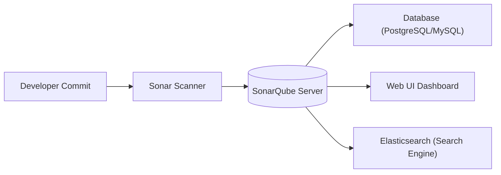
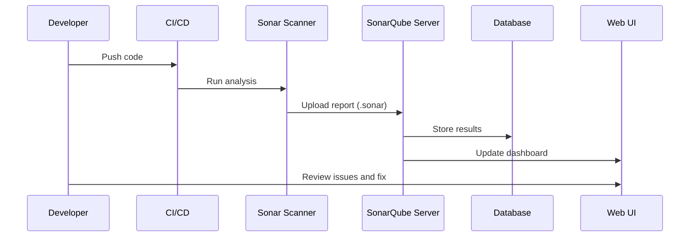
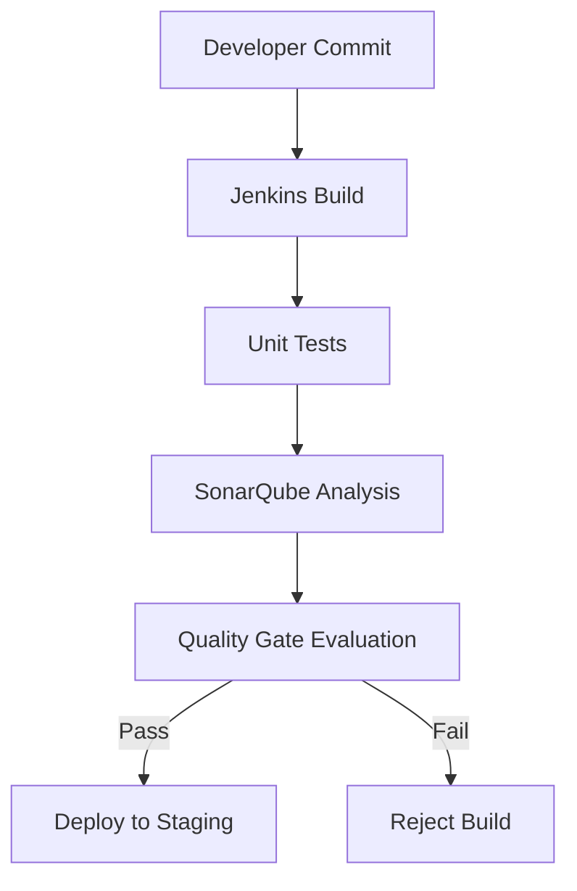

# 💂🏻 **SonarQube** — The Code Quality Gatekeeper

## 📖 **What Is SonarQube?**

**Official Definition (SonarSource):**

> SonarQube is an open-source platform for continuous inspection of code quality. It performs automatic reviews with static analysis to detect bugs, code smells, and security vulnerabilities in your codebase.

💡 **Simplified:**

- Think of SonarQube as your **code’s health inspector**.
- Every time you push or build, SonarQube checks your source code for hidden diseases — poor maintainability, potential bugs, security issues, or messy design — and gives you a clean (or scary) health report.

---

## 🧩 **The Core Concepts**

<div align="center" style="background-color: #141a19ff;color: #a8a5a5ff; border-radius: 10px; border: 2px solid">

| Concept             | Description                                                                                                                                     |
| ------------------- | ----------------------------------------------------------------------------------------------------------------------------------------------- |
| **Code Smell**      | Something that’s not technically a bug but indicates poor design or readability (e.g., a huge method or duplicate code).                        |
| **Bug**             | A real defect that may cause malfunction or incorrect behavior.                                                                                 |
| **Vulnerability**   | A potential security weakness (e.g., SQL injection risk, hardcoded credentials).                                                                |
| **Hotspot**         | A code section that’s _potentially_ risky but requires manual review.                                                                           |
| **Technical Debt**  | The estimated time required to fix all issues in the codebase.                                                                                  |
| **Quality Gate**    | A threshold of metrics that determine if your code is “healthy” enough to be released (like unit test coverage ≥ 80%, no blocker issues, etc.). |
| **Quality Profile** | A set of rules for a specific language (e.g., Java ruleset vs Python ruleset).                                                                  |
| **Project**         | A code repository or module analyzed by SonarQube.                                                                                              |
| **Issue**           | A problem detected in code — categorized as bug, vulnerability, or smell.                                                                       |

</div>

---

## ⚙️ **Architecture Overview**

SonarQube is a **client-server system** with scanners and a central dashboard.

<div align="center" style="background-color: #141a19ff;color: #a8a5a5ff; border-radius: 10px; border: 2px solid">



</div>

### 💡 Components Explained

<div align="center" style="background-color: #141a19ff;color: #a8a5a5ff; border-radius: 10px; border: 2px solid">

| Component             | Role                                                                          |
| --------------------- | ----------------------------------------------------------------------------- |
| **SonarQube Server**  | The central brain — hosts the web UI, stores results, enforces quality gates. |
| **SonarQube Scanner** | The agent that analyzes code (runs locally or in CI).                         |
| **Database**          | Stores analysis results, metrics, issues, and configurations.                 |
| **Elasticsearch**     | Powers search, reporting, and fast queries inside SonarQube.                  |
| **Web UI**            | Allows developers and leads to explore reports, metrics, and trends.          |

</div>

---

## 🧑‍💻 **How SonarQube Analyzes Code**

### Step-by-step Workflow

<div align="center" style="background-color: #141a19ff;color: #a8a5a5ff; border-radius: 10px; border: 2px solid">



</div>

### 💬 Example:

You commit your code → Jenkins pipeline runs → Sonar Scanner analyzes the code → uploads results to the SonarQube server → you open the web dashboard → and see whether your code passed the quality gate.

---

## 🏗️ **SonarQube Installation (Local Setup)**

### 🧰 Prerequisites

- Java 17+ (LTS)
- PostgreSQL (recommended)
- 2 GB+ RAM minimum
- Docker (optional but easiest)

### 🚀 Docker Command (Quick Setup)

```bash
docker run -d --name sonarqube \
  -p 9000:9000 \
  sonarqube:lts-community
```

Then visit:  
👉 **[http://localhost:9000](http://localhost:9000)**
Default credentials:
`admin / admin`

---

## 🏢 **Project Configuration**

You can analyze code either via:

### 🔹 A. Local CLI Scanner

```bash
sonar-scanner \
  -Dsonar.projectKey=my_project \
  -Dsonar.sources=. \
  -Dsonar.host.url=http://localhost:9000 \
  -Dsonar.login=your_token
```

### 🔹 B. Integrated with CI/CD (Recommended)

You can integrate SonarQube with:

- Jenkins 🧱
- GitHub Actions 🤖
- Azure DevOps 🧭
- GitLab CI 🦊
- Bitbucket Pipelines ⚙️

Example (Jenkinsfile):

```groovy
stage('Code Quality') {
  steps {
    withSonarQubeEnv('MySonarServer') {
      sh 'mvn sonar:sonar -Dsonar.projectKey=myapp'
    }
  }
}
```

---

## 📊 **The Quality Gate**

The **Quality Gate** decides whether your build passes or fails based on metrics.

### 📃 Default Conditions:

- No new **blocker/critical** issues.
- **Coverage** on new code ≥ 80%.
- **Duplicated lines** on new code ≤ 3%.
- **Maintainability rating** ≤ A.
- **Security rating** ≤ A.

### 💡 Example in Dashboard:

<div align="center" style="background-color: #141a19ff;color: #a8a5a5ff; border-radius: 10px; border: 2px solid">

| Metric          | Threshold | Status |
| --------------- | --------- | ------ |
| Bugs            | 0         | ✅     |
| Coverage        | 82%       | ✅     |
| Duplications    | 2%        | ✅     |
| Vulnerabilities | 1         | ❌     |

</div>

**Result:** ❌ Quality Gate failed.

---

## 🧠 **The Ratings System**

Each metric (Maintainability, Reliability, Security) gets a letter grade:

<div align="center" style="background-color: #141a19ff;color: #a8a5a5ff; border-radius: 10px; border: 2px solid">

| Grade | Description | Example           |
| ----- | ----------- | ----------------- |
| A     | Excellent   | No major issues   |
| B     | Good        | Few minor smells  |
| C     | Fair        | Needs improvement |
| D     | Poor        | Many issues       |
| E     | Awful       | You should cry 😭 |

</div>

---

## 🔍 **Rules and Profiles**

Each language has thousands of rules — for example:

<div align="center" style="background-color: #141a19ff;color: #a8a5a5ff; border-radius: 10px; border: 2px solid">

| Type          | Example Rule                           | Impact          |
| ------------- | -------------------------------------- | --------------- |
| Bug           | “Null pointer dereference”             | High            |
| Vulnerability | “SQL Injection risk”                   | Critical        |
| Code Smell    | “Method too complex (Cyclomatic > 10)” | Maintainability |

</div>

Projects use **Quality Profiles** that define which rules to apply.

You can:

- Use default profiles (Sonar way)
- Clone and customize them per team

---

## 🧰 **Supported Languages**

SonarQube supports **30+ languages**, including:

<div align="center" style="background-color: #141a19ff;color: #a8a5a5ff; border-radius: 10px; border: 2px solid">

| Category    | Examples                          |
| ----------- | --------------------------------- |
| JVM         | Java, Kotlin, Groovy, Scala       |
| .NET        | C#, VB.NET                        |
| Web         | JavaScript, TypeScript, HTML, CSS |
| Cloud/Infra | Terraform, Kubernetes YAML        |
| Scripting   | Python, PHP, Ruby                 |
| Others      | C/C++, Go, Swift, Objective-C     |

</div>

---

## 🔒 **Security Scanning (SAST)**

SonarQube includes **Static Application Security Testing (SAST)**.

### 📌 **Detects:**

- SQL Injection
- Cross-Site Scripting (XSS)
- Command injection
- Insecure cryptography
- Hardcoded secrets

### 📌 **Example:**

```python
cursor.execute("SELECT * FROM users WHERE name = '" + username + "'")
```

> ➡️ **SonarQube:** “Possible SQL Injection vulnerability — use parameterized query!”

---

## 🧮 **Technical Debt and Maintainability Index**

SonarQube converts issues into **time cost**.

<div align="center" style="background-color: #141a19ff;color: #a8a5a5ff; border-radius: 10px; border: 2px solid">

| Example              | Estimated Fix Time |
| -------------------- | ------------------ |
| Rename variable      | 2 minutes          |
| Refactor long method | 30 minutes         |
| Fix SQL Injection    | 60 minutes         |

</div>

> **Technical Debt Ratio** = (Remediation Cost / Development Cost) × 100

---

## ♾️ **Integration with CI/CD Pipelines**

<div align="center" style="background-color: #141a19ff;color: #a8a5a5ff; border-radius: 10px; border: 2px solid">

| Platform           | Integration Method                       |
| ------------------ | ---------------------------------------- |
| **Jenkins**        | SonarQube Plugin + Webhook               |
| **Azure DevOps**   | SonarQube Extension + Service Connection |
| **GitHub Actions** | sonar-scanner CLI or official Action     |
| **GitLab**         | Built-in template or scanner job         |
| **Bitbucket**      | REST API or custom pipelines             |

</div>

### 🧩 Example: GitHub Action Workflow

```yaml
name: SonarQube Analysis
on: [push]
jobs:
  analyze:
    runs-on: ubuntu-latest
    steps:
      - uses: actions/checkout@v3
      - name: SonarQube Scan
        uses: SonarSource/sonarqube-scan-action@v2
        with:
          projectBaseDir: .
          args: >
            -Dsonar.projectKey=myapp
            -Dsonar.host.url=${{ secrets.SONAR_URL }}
            -Dsonar.login=${{ secrets.SONAR_TOKEN }}
```

---

## 🤺 **SonarCloud vs SonarQube**

<div align="center" style="background-color: #141a19ff;color: #a8a5a5ff; border-radius: 10px; border: 2px solid">

| Feature     | SonarQube                   | SonarCloud                |
| ----------- | --------------------------- | ------------------------- |
| Deployment  | Self-hosted                 | SaaS                      |
| Pricing     | Free + Paid editions        | Subscription              |
| Integration | Any on-prem/CI              | GitHub, GitLab, Bitbucket |
| Database    | External DB required        | Managed                   |
| Ideal for   | Enterprises needing control | Teams wanting zero setup  |

</div>

---

## 🧮 **Editions Overview**

<div align="center" style="background-color: #141a19ff;color: #a8a5a5ff; border-radius: 10px; border: 2px solid">

| Edition         | Features                        |
| --------------- | ------------------------------- |
| **Community**   | Free, basic features            |
| **Developer**   | Branch analysis, PR decoration  |
| **Enterprise**  | Portfolio management, reporting |
| **Data Center** | Clustering, scalability, HA     |

</div>

---

## 🔧 **Common Configuration Properties**

<div align="center" style="background-color: #141a19ff;color: #a8a5a5ff; border-radius: 10px; border: 2px solid">

| Property           | Description                |
| ------------------ | -------------------------- |
| `sonar.projectKey` | Unique key for the project |
| `sonar.sources`    | Source directory path      |
| `sonar.exclusions` | Excluded paths             |
| `sonar.tests`      | Test directories           |
| `sonar.language`   | Language override          |
| `sonar.host.url`   | SonarQube server URL       |
| `sonar.login`      | Authentication token       |

</div>

---

## 📝 **Real Example**

`sonar-project.properties`

```ini
sonar.projectKey=MyDotNetApp
sonar.projectName=My .NET App
sonar.projectVersion=1.0
sonar.sources=.
sonar.language=cs
sonar.host.url=http://localhost:9000
sonar.login=token123
```

Build and analyze:

```bash
dotnet build
dotnet sonarscanner begin /k:"MyDotNetApp" /d:sonar.host.url="http://localhost:9000" /d:sonar.login="token123"
dotnet build
dotnet sonarscanner end /d:sonar.login="token123"
```

---

## ✅ **Best Practices**

- ✅ Always use **Quality Gates** in CI to block bad code
- ✅ Keep **Sonar rules** consistent across projects
- ✅ Enable **PR Decoration** so developers see issues directly in GitHub/GitLab
- ✅ Clean as you code — fix new issues first
- ✅ Treat **Technical Debt Ratio > 5%** as critical
- ✅ Integrate **security scanning** early

---

## 🧑🏻‍💻 **SonarLint (IDE Integration)**

SonarLint is the “local assistant” version of SonarQube.

- Works inside IDE (VS Code, IntelliJ, Visual Studio, Eclipse)
- Gives instant feedback on code smells
- Can connect to your SonarQube server for synchronized rules

Example:

> 🚨 “Method `ProcessData()` has a Cyclomatic Complexity of 12 — consider refactoring.”

---

## 📈 **Reporting and Dashboards**

The SonarQube dashboard shows:

- Issue trends over time
- Hotspots by component
- Code coverage chart
- Duplication map
- Maintainability trends

You can also generate **PDF reports** (Enterprise+) or export via **REST API**.

---

## 🌐 **SonarQube REST API (Automation)**

You can fetch metrics programmatically:

Example:

```bash
curl -u admin:token "http://localhost:9000/api/measures/component?component=myapp&metricKeys=bugs,vulnerabilities,coverage"
```

Returns JSON:

```json
{
  "component": {
    "key": "myapp",
    "measures": [
      { "metric": "bugs", "value": "3" },
      { "metric": "vulnerabilities", "value": "0" },
      { "metric": "coverage", "value": "84.2" }
    ]
  }
}
```

---

## 📝 **Real-World Example**

<div align="center" style="background-color: #141a19ff;color: #a8a5a5ff; border-radius: 10px; border: 2px solid">



</div>

---

## 🚫 **Common Pitfalls**

- 🚫 Running analysis before build completes (esp. .NET/Java)
- 🚫 Not cleaning workspace → old reports mixed in
- 🚫 Using old tokens (403 errors)
- 🚫 Ignoring rule updates → outdated scans
- 🚫 Excluding too many files → fake green build

---

## 🧾 **Summary — Why SonarQube Rocks**

<div align="center" style="background-color: #141a19ff;color: #a8a5a5ff; border-radius: 10px; border: 2px solid">

| Benefit                   | Description                                  |
| ------------------------- | -------------------------------------------- |
| **Improves Code Quality** | Enforces standards and catches bad practices |
| **Automates Review**      | No more manual static review headaches       |
| **Secures Code**          | Finds vulnerabilities before production      |
| **Tracks Trends**         | See improvements over time                   |
| **Integrates Everywhere** | Jenkins, Azure DevOps, GitHub, etc.          |
| **Prevents “Code Rot”**   | Quality Gate stops decay before merge        |

</div>

---

## 💾 **Quick Memory Recap**

- **SonarQube = Code Quality Platform**
- **Sonar Scanner = Client tool**
- **Quality Gate = Pass/Fail ruleset**
- **SonarLint = IDE plugin**
- **SonarCloud = SaaS version**
- **Metrics = Bugs, Smells, Coverage, Duplicates, Debt**
- **Integrations = Jenkins, Azure, GitHub, GitLab**
