perfect — here’s your **SonarQube + GitHub Actions** demo in your **enhanced, structured, emoji-rich style**: clean architecture, full YAML, coverage wiring, Quality Gate enforcement (fail the job), PR decoration notes, diagrams, and quick troubleshooting. copy–paste and you’re rolling. 🚀

---

# 🧭 SonarQube + GitHub Actions — End-to-End Demo (A→Z)

## 🧱 0) Prerequisites (one-time)

* ✅ **SonarQube server** up (self-hosted; Docker is fine).
* ✅ **Create a token** in SonarQube: *My Account → Security → Generate Tokens*.
* ✅ **GitHub repo secrets** → `Settings → Secrets and variables → Actions`:

  * `SONAR_HOST_URL` → e.g., `https://sonar.mycompany.com`
  * `SONAR_TOKEN` → your token
* ✅ (Optional) **PR decoration**: configure **ALM Integration → GitHub** in SonarQube (Developer+ editions), install the GitHub App on your org/repo, and bind the Sonar project to the repo.

---

## 🧠 1) What Actually Happens (the truth in 7 lines)

* The **scanner runs locally** on the **GitHub Actions runner**.
* It reads your source + build artifacts (DLLs/classes, coverage files).
* It generates an **analysis report** (issues, metrics, coverage, duplications).
* It uploads **the report** (⚠️ **NOT** your raw source code) to SonarQube.
* SonarQube **computes Quality Gate** (OK/FAILED).
* A **Quality Gate step** in the workflow **fails the job** if the gate = FAILED.
* (Optional) SonarQube **decorates PRs** with inline issues + gate status.

---

## 🗺️ 2) Architecture (visual)

```mermaid
sequenceDiagram
title ☁️ SonarQube + GitHub Actions Flow

actor Dev as 👩‍💻 Developer
participant GH as 🚀 GitHub Actions Runner
participant SQ as 🧠 SonarQube Server

Dev->>GH: Push / Open PR
GH->>GH: Build + Tests + Coverage
GH->>GH: Local static analysis (scanner)
GH->>SQ: Upload analysis REPORT (no raw source)
SQ-->>GH: Compute Quality Gate (OK / FAILED)
GH->>GH: Quality Gate step → pass/fail job
opt PR decoration configured
SQ->>Dev: Inline PR comments + gate badge
end
```



---

## 🧩 3) Ready-to-Use Workflows

### A) .NET 8 Web API — `/.github/workflows/sonar-dotnet.yml`

* Produces **OpenCover** coverage for SonarQube
* **Fails** the job if the **Quality Gate** fails

```yaml
name: SonarQube (.NET 8)

on:
  push:
    branches: [ main ]
  pull_request:
    branches: [ main ]

jobs:
  build-test-analyze:
    runs-on: windows-latest

    steps:
      - uses: actions/checkout@v4

      - uses: actions/setup-dotnet@v4
        with:
          dotnet-version: '8.0.x'

      - name: Restore
        run: dotnet restore

      - name: Build
        run: dotnet build --configuration Release --no-restore

      - name: Test (+OpenCover)
        run: >
          dotnet test --configuration Release --no-build
          /p:CollectCoverage=true
          /p:CoverletOutputFormat=opencover
          /p:CoverletOutput=./TestResults/Coverage/
          --logger trx

      # Run SonarQube scan (local scan + upload report)
      - name: SonarQube Scan
        uses: SonarSource/sonarqube-scan-action@v2
        env:
          SONAR_HOST_URL: ${{ secrets.SONAR_HOST_URL }}
          SONAR_TOKEN: ${{ secrets.SONAR_TOKEN }}
        with:
          args: >
            -Dsonar.projectKey=my_dotnet8_api
            -Dsonar.projectName=my_dotnet8_api
            -Dsonar.cs.vstest.reportsPaths=**/TestResults/*.trx
            -Dsonar.cs.opencover.reportsPaths=**/TestResults/Coverage/*.xml

      # Block/Fail the pipeline on bad Quality Gate
      - name: SonarQube Quality Gate
        uses: SonarSource/sonarqube-quality-gate-action@v1.1.0
        env:
          SONAR_HOST_URL: ${{ secrets.SONAR_HOST_URL }}
          SONAR_TOKEN: ${{ secrets.SONAR_TOKEN }}
```

---

### B) Java (Maven) — `/.github/workflows/sonar-maven.yml`

* Uses **JaCoCo** XML report for coverage

```yaml
name: SonarQube (Java Maven)

on:
  push: { branches: [ main ] }
  pull_request: { branches: [ main ] }

jobs:
  build-test-analyze:
    runs-on: ubuntu-latest
    steps:
      - uses: actions/checkout@v4

      - uses: actions/setup-java@v4
        with:
          distribution: temurin
          java-version: '21'

      - name: Build & Test (Jacoco)
        run: mvn -B clean verify

      - name: SonarQube Scan
        uses: SonarSource/sonarqube-scan-action@v2
        env:
          SONAR_HOST_URL: ${{ secrets.SONAR_HOST_URL }}
          SONAR_TOKEN: ${{ secrets.SONAR_TOKEN }}
        with:
          args: >
            -Dsonar.projectKey=my_java_app
            -Dsonar.projectName=my_java_app
            -Dsonar.java.binaries=**/target/classes
            -Dsonar.junit.reportPaths=**/target/surefire-reports
            -Dsonar.coverage.jacoco.xmlReportPaths=**/target/site/jacoco/jacoco.xml

      - name: Quality Gate
        uses: SonarSource/sonarqube-quality-gate-action@v1.1.0
        env:
          SONAR_HOST_URL: ${{ secrets.SONAR_HOST_URL }}
          SONAR_TOKEN: ${{ secrets.SONAR_TOKEN }}
```

---

### C) Node / TypeScript — `/.github/workflows/sonar-node.yml`

* Uses **lcov.info** coverage

```yaml
name: SonarQube (Node/TS)

on:
  push: { branches: [ main ] }
  pull_request: { branches: [ main ] }

jobs:
  build-test-analyze:
    runs-on: ubuntu-latest
    steps:
      - uses: actions/checkout@v4

      - uses: actions/setup-node@v4
        with:
          node-version: '20'

      - name: Install
        run: npm ci

      - name: Test (+coverage lcov)
        run: npm test -- --coverage

      - name: SonarQube Scan
        uses: SonarSource/sonarqube-scan-action@v2
        env:
          SONAR_HOST_URL: ${{ secrets.SONAR_HOST_URL }}
          SONAR_TOKEN: ${{ secrets.SONAR_TOKEN }}
        with:
          args: >
            -Dsonar.projectKey=my_node_app
            -Dsonar.projectName=my_node_app
            -Dsonar.sources=.
            -Dsonar.tests=.
            -Dsonar.test.inclusions=**/*.test.ts,**/*.spec.ts,**/*.test.js,**/*.spec.js
            -Dsonar.javascript.lcov.reportPaths=coverage/lcov.info
            -Dsonar.exclusions=**/node_modules/**,**/dist/**

      - name: Quality Gate
        uses: SonarSource/sonarqube-quality-gate-action@v1.1.0
        env:
          SONAR_HOST_URL: ${{ secrets.SONAR_HOST_URL }}
          SONAR_TOKEN: ${{ secrets.SONAR_TOKEN }}
```

---

## 🧪 4) “Fail on Bad Code” — how the gate stops your pipeline

The **Quality Gate** step checks SonarQube’s decision. If your **new code** violates the gate (e.g., critical vulnerabilities, coverage < threshold, high duplication), the step marks the job **❌ failed**, blocking further jobs (like deploy). Same effect as failing tests — but driven by **quality/security**.

> Clean-as-you-code tip: strict gate on **new code**, improve legacy gradually.

---

## 🎨 5) PR Decoration (optional but awesome)

* Enable **GitHub** in SonarQube ALM integrations and install the **GitHub App**.
* Link the Sonar project to your repo.
* Result: PRs show a **Quality Gate check**, inline **issue comments**, and a link to the Sonar dashboard.

---

## 🧰 6) Common Extras (drop-in args)

* Exclude generated or infra code:

  ```
  -Dsonar.exclusions=**/bin/**,**/obj/**,**/dist/**,**/*.g.cs,**/Migrations/**
  ```
* Limit to specific test globs (Node/TS):

  ```
  -Dsonar.test.inclusions=**/*.(test|spec).ts,**/*.(test|spec).js
  ```
* Multi-module projects: use distinct `sonar.projectKey` per module or aggregate at root.

---

## 🧯 7) Troubleshooting (fast & real)

| Symptom                                     | Root Cause                    | Fix                                                              |
| ------------------------------------------- | ----------------------------- | ---------------------------------------------------------------- |
| `Quality Gate` step times out               | Server is slow or busy        | Re-run; scale SonarQube; increase action timeout                 |
| No coverage in Sonar                        | Wrong report path/format      | Ensure OpenCover (C#), Jacoco XML (Java), lcov (JS); match globs |
| PR not decorated                            | ALM/GitHub app not configured | Configure GitHub integration + bind project                      |
| SSL/TLS error to Sonar                      | Custom cert                   | Provide root CA to runner or set `SONAR_ROOT_CERT` (action docs) |
| Analysis ok but job didn’t fail on bad code | Missing gate step             | Ensure final **Quality Gate** action is present                  |

---

## ✅ 8) Final Checklist

* [ ] `SONAR_HOST_URL` + `SONAR_TOKEN` secrets set
* [ ] Workflow includes **Scan** and **Quality Gate** steps
* [ ] Coverage reports produced in the **expected format**
* [ ] (Optional) PR decoration configured in SonarQube
* [ ] Gate rules tuned (coverage, bugs, vulnerabilities, duplications)

---

want me to bundle these three workflows into a **single monorepo matrix** (dotnet + java + node) with shared naming + badges, or tailor just the **.NET 8** one to your exact repo layout (src/tests folders, solution name, etc.)?
