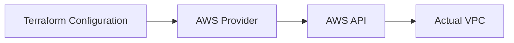
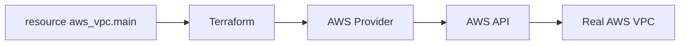
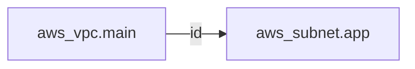
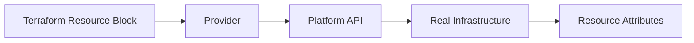

# Terraform Resource

## Index

1. What is a Terraform Resource?
2. Resource syntax
3. Resource type and name
4. Resource arguments
5. How Terraform creates a resource
6. Resource address and attributes
7. Resource vs Provider
8. Resource vs Data Source
9. Summary

---

## 1. What is a Terraform Resource?

A **resource** is an infrastructure object that you want Terraform to **create and manage**.

Examples include:

* AWS EC2 instance
* AWS VPC
* Azure Virtual Network
* Kubernetes Namespace
* DNS record
* S3 bucket

HashiCorp defines a resource as an infrastructure object that Terraform creates and manages. The available resource types depend mainly on the providers installed in your Terraform configuration. ([HashiCorp Developer][1])

For example, instead of manually creating an AWS VPC, you describe it:

```hcl
resource "aws_vpc" "main" {
  cidr_block = "10.0.0.0/16"
}
```

Terraform then works with the AWS provider to create the real VPC.



The important idea is:

> A **resource block describes infrastructure that Terraform should manage**.

---

## 2. Resource Syntax

The basic syntax is:

```hcl
resource "<RESOURCE_TYPE>" "<RESOURCE_NAME>" {
  argument = value
}
```

Example:

```hcl
resource "aws_instance" "web" {
  ami           = "ami-123456"
  instance_type = "t3.micro"
}
```

Breakdown:

```text
resource "aws_instance" "web"
            │             │
            │             └── Terraform resource name
            │
            └──────────────── Resource type
```

So this resource has:

```text
Type: aws_instance
Name: web
```

Together they form the resource address:

```text
aws_instance.web
```

Terraform uses the type and name to identify the resource in the configuration and state. ([HashiCorp Developer][2])

---

## 3. Resource Type and Resource Name

### Resource Type

The resource type tells Terraform **what kind of infrastructure object** you want.

Example:

```hcl
aws_instance
```

means:

> Manage an AWS EC2 instance.

Other examples:

```text
aws_vpc
aws_subnet
aws_s3_bucket
kubernetes_namespace
azurerm_virtual_network
```

Most resource types are implemented by providers. ([HashiCorp Developer][3])

---

### Resource Name

Consider:

```hcl
resource "aws_instance" "web" {
}
```

`web` is a **local Terraform name**.

It helps Terraform identify and reference this resource:

```hcl
aws_instance.web
```

It does **not** automatically become the name of the EC2 instance in AWS.

For example:

```hcl
resource "aws_instance" "web" {
  ami           = "ami-123456"
  instance_type = "t3.micro"

  tags = {
    Name = "production-web-server"
  }
}
```

Here:

| Item              | Value                   |
| ----------------- | ----------------------- |
| Terraform name    | `web`                   |
| Terraform address | `aws_instance.web`      |
| AWS `Name` tag    | `production-web-server` |

So:

> **Terraform resource name and cloud resource name are different concepts.**

---

## 4. Resource Arguments

The body of a resource contains configuration values called **arguments**.

Example:

```hcl
resource "aws_instance" "web" {
  ami           = "ami-123456"
  instance_type = "t3.micro"
}
```

Here:

```hcl
ami           = "ami-123456"
instance_type = "t3.micro"
```

are arguments.

They describe how you want the resource configured.

Conceptually:

```text
aws_instance.web
│
├── ami           = "ami-123456"
└── instance_type = "t3.micro"
```

Different resource types support different arguments, and their provider documentation defines which arguments are required or optional. ([HashiCorp Developer][2])

For example:

```hcl
resource "aws_vpc" "main" {
  cidr_block = "10.0.0.0/16"
}
```

Here:

```hcl
cidr_block
```

is an argument configuring the VPC.

---

## 5. How Terraform Creates a Resource

Suppose you write:

```hcl
resource "aws_vpc" "main" {
  cidr_block = "10.0.0.0/16"
}
```

Terraform does not create the VPC itself directly.

The flow is:



The roles are:

| Component               | Responsibility                        |
| ----------------------- | ------------------------------------- |
| Terraform configuration | Describes the desired infrastructure  |
| Terraform               | Calculates and coordinates changes    |
| Provider                | Understands the platform/resource API |
| AWS API                 | Creates the real object               |

This is why the **provider** and **resource** should not be confused.

---

## 6. Resource Address and Attributes

Once you declare:

```hcl
resource "aws_vpc" "main" {
  cidr_block = "10.0.0.0/16"
}
```

its address is:

```hcl
aws_vpc.main
```

Terraform resources also expose values that can be referenced elsewhere.

For example:

```hcl
aws_vpc.main.id
```

The pattern is:

```text
<resource_type>.<resource_name>.<attribute>
```

Example:

```text
aws_vpc.main.id
│       │    │
│       │    └── Attribute
│       └─────── Resource name
└─────────────── Resource type
```

Other examples:

```hcl
aws_instance.web.id
aws_instance.web.public_ip
aws_s3_bucket.logs.arn
```

Terraform treats a normal resource reference such as `<TYPE>.<NAME>` as the managed resource object, whose attributes can then be accessed. ([HashiCorp Developer][4])

This becomes important in the next topic: **Resource References and Dependencies**.

Example:

```hcl
resource "aws_subnet" "app" {
  vpc_id = aws_vpc.main.id
}
```

The subnet takes the VPC's `id` and uses it as its `vpc_id`.



---

## 7. Resource vs Provider

These concepts work together but have different responsibilities.

### Provider

A provider gives Terraform the ability to communicate with a platform.

Examples:

```text
AWS Provider
AzureRM Provider
Google Provider
Kubernetes Provider
```

### Resource

A resource represents a specific infrastructure object managed through that provider.

Example:

```text
AWS Provider
│
├── aws_vpc
├── aws_subnet
├── aws_instance
└── aws_s3_bucket
```

So:

> **Provider = how Terraform communicates with the platform.**

> **Resource = what Terraform manages.**

HashiCorp describes providers as plugins that expose resource types for cloud or on-premises platforms. ([HashiCorp Developer][1])

---

## 8. Resource vs Data Source

This distinction is also important.

### Resource

A resource represents infrastructure Terraform manages.

```hcl
resource "aws_vpc" "main" {
  cidr_block = "10.0.0.0/16"
}
```

Terraform can manage its lifecycle.

```text
Terraform
    │
    ▼
Create / Update / Destroy
    │
    ▼
VPC
```

### Data Source

A data source reads information from existing infrastructure instead of declaring a managed resource.

For example:

```hcl
data "aws_vpc" "existing" {
  id = "vpc-123456"
}
```

Conceptually:

```text
Resource
   ↓
Manage infrastructure

Data Source
   ↓
Read existing information
```

HashiCorp specifically distinguishes resources that Terraform provisions from data sources used to query existing infrastructure. ([HashiCorp Developer][1])

---

## 9. Summary

The resource block:

```hcl
resource "aws_instance" "web" {
  ami           = "ami-123456"
  instance_type = "t3.micro"
}
```

can be understood as:

```text
resource
│
├── Type
│   └── aws_instance
│
├── Name
│   └── web
│
├── Address
│   └── aws_instance.web
│
└── Arguments
    ├── ami
    └── instance_type
```

And after the resource exists, you can reference attributes such as:

```hcl
aws_instance.web.id
aws_instance.web.public_ip
```

### Core mental model



The key rule is:

> **A Terraform resource is a configuration block representing infrastructure that Terraform creates and manages through a provider.**

Once this is clear, the natural next topic is:

```text
Terraform Resource
       ↓
Resource Arguments & Attributes
       ↓
Resource References
       ↓
Resource Dependencies
```

[1]: https://developer.hashicorp.com/terraform/language/resources?utm_source=chatgpt.com "Create and manage resources overview | Terraform | HashiCorp Developer"
[2]: https://developer.hashicorp.com/terraform/language/block/resource?utm_source=chatgpt.com "resource block reference | Terraform | HashiCorp Developer"
[3]: https://developer.hashicorp.com/terraform/language/resources/configure?utm_source=chatgpt.com "Configure a resource | Terraform | HashiCorp Developer"
[4]: https://developer.hashicorp.com/terraform/language/expressions/references?utm_source=chatgpt.com "References to Values - Configuration Language | Terraform | HashiCorp Developer"
