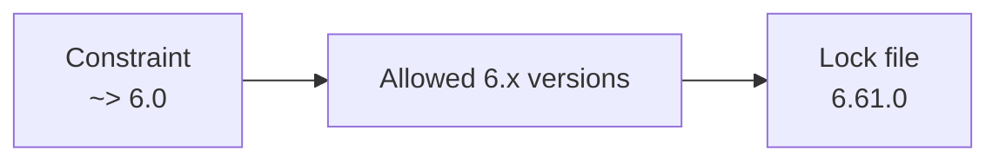

# Terraform Version Constraints

## Index

1. Terraform CLI version
    
2. Provider version
    
3. Lock file
    
4. Operators
    
5. Best practice
    

## 1. Terraform CLI Version

Use `required_version` to control which Terraform CLI versions can run the project.

```hcl
terraform {
  required_version = "~> 1.15.0"
}
```

Means:

```text
>= 1.15.0
<  1.16.0
```

So only Terraform `1.15.x` is allowed.

---

## 2. Provider Version

Use `required_providers` to control provider versions.

```hcl
terraform {
  required_providers {
    aws = {
      source  = "hashicorp/aws"
      version = "~> 6.0"
    }
  }
}
```

Means:

```text
AWS provider >= 6.0
AWS provider < 7.0
```

So any `6.x` version is allowed.

---

## 3. `.terraform.lock.hcl`

The constraint defines the **allowed range**.

The lock file stores the **exact selected provider version**.

Example:

```text
Constraint:
~> 6.0

Allowed:
6.0 ... 6.x

Lock file:
6.61.0
```



Commit this file to Git:

```text
.terraform.lock.hcl
```

---

## 4. Important Operators

|Constraint|Meaning|
|---|---|
|`= 6.2.0`|Exactly `6.2.0`|
|`>= 6.2.0`|`6.2.0` or newer|
|`< 7.0.0`|Anything below `7.0.0`|
|`>= 6.2, < 7.0`|Range|
|`~> 6.0`|Any `6.x`|
|`~> 6.3.0`|Only `6.3.x`|

Be careful:

```hcl
version = ">= 6.0"
```

also allows future:

```text
7.x
8.x
```

If you want only `6.x`, use:

```hcl
version = "~> 6.0"
```

---

## 5. Recommended Pattern

```hcl
terraform {
  required_version = "~> 1.15.0"

  required_providers {
    aws = {
      source  = "hashicorp/aws"
      version = "~> 6.0"
    }
  }
}
```

Then commit:

```text
.terraform.lock.hcl
```

Normal initialization:

```bash
terraform init
```

Intentional provider upgrade:

```bash
terraform init -upgrade
```

## Key Rule

> **Constraints define which versions are allowed. The lock file records which provider version is actually used.**