# Terraform Secrets Management

> [How to Manage Secrets in Terraform?](https://www.youtube.com/watch?v=3N0tGKwvBdA)

## Index

1. The secrets problem in Terraform
2. Approach 1 — Environment Variables
3. Approach 2 — Encrypted Files
4. Approach 3 — External Secret Store
5. `sensitive` vs `ephemeral` vs `write-only`
6. Comparing the three approaches
7. Recommended production patterns
8. Summary

---

## The Secrets Problem in Terraform

Terraform often needs sensitive values such as:

```text
Database passwords
API tokens
Private keys
Provider credentials
Certificates
Application secrets
```

The worst approach is hardcoding them:

```hcl
module "database" {
  source = "./modules/database"

  username = "admin"
  password = "SuperSecret123!"
}
```

because the secret can end up in:

```text
Git repository
Git history
Pull requests
CI logs
Terraform plans
Terraform state
```

Instead, the secret should come from an external source.

There are three common approaches:

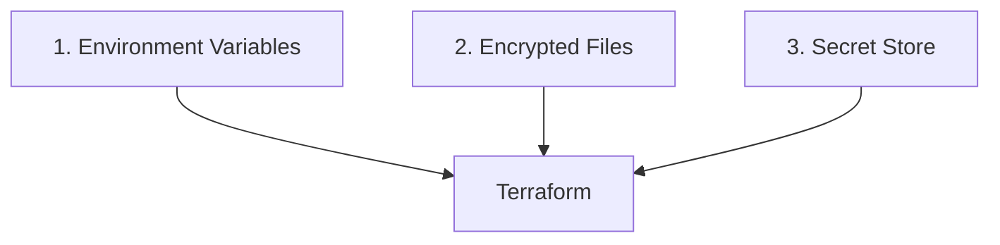

The difference is mainly:

> **Where is the secret stored before Terraform needs it?**

---

## Approach 1 — Environment Variables

### Concept

The secret exists outside Terraform configuration and is passed to Terraform as an environment variable.

Terraform supports variables using the special format:

```text
TF_VAR_<terraform_variable_name>
```

For example, define:

```hcl
variable "db_username" {
  type      = string
  sensitive = true
}

variable "db_password" {
  type      = string
  sensitive = true
}
```

Then use them:

```hcl
module "database" {
  source = "./modules/database"

  username = var.db_username
  password = var.db_password
}
```

Terraform does not contain the actual password.

Before running Terraform:

```bash
export TF_VAR_db_username="admin"
export TF_VAR_db_password="SuperSecret123!"
```

Then:

```bash
terraform plan
terraform apply
```

Terraform automatically maps:

```text
TF_VAR_db_password
        ↓
var.db_password
        ↓
module.database.password
```

Terraform officially supports the `TF_VAR_name` convention for supplying root-module variables from environment variables.

---

### CI/CD Example

Environment variables are particularly useful in CI/CD.

Suppose your CI platform has a protected secret:

```text
DB_PASSWORD
```

The pipeline can expose:

```bash
export TF_VAR_db_password="$DB_PASSWORD"

terraform apply
```

Architecture:


The password never needs to exist in:

```text
main.tf
variables.tf
terraform.tfvars committed to Git
```

---

## `sensitive = true`

You should normally mark sensitive inputs:

```hcl
variable "db_password" {
  type      = string
  sensitive = true
}
```

Then Terraform redacts it from normal output:

```text
password = (sensitive value)
```

But this is extremely important:

> `sensitive = true` means **hide the value from normal Terraform output**.

It does **not** mean:

```text
encrypt the value
```

and traditionally it does **not** mean:

```text
remove the value from Terraform state
```

Terraform documentation explicitly states that sensitive variables may still be stored in plan and state files.

---

### Advantages

```text
Simple
No additional secret-management tool required
Works well with CI/CD secret variables
No plaintext secret in Terraform files
```

### Disadvantages

```text
Secret exists in the process environment
Local developer workflows become harder to manage
Rotation must be handled elsewhere
No central secret lifecycle by itself
Secret may still enter Terraform state
```

---

### Best Use

Environment variables work well for:

```text
Small environments
Local development
CI/CD injected credentials
Short-lived credentials
Simple Terraform deployments
```

For production CI/CD, they are particularly useful when the CI system retrieves a short-lived credential first and exposes it temporarily to Terraform.

---

## Approach 2 — Encrypted Files

### Concept

Sometimes you want secret configuration stored alongside your infrastructure code, but you cannot store it as plaintext.

Instead of:

```yaml
db_username: admin
db_password: SuperSecret123!
```

you store an **encrypted file**.

The workflow becomes:

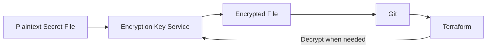

The Git repository contains ciphertext rather than the actual secret.

---

### 2.1 Raw Encryption Using KMS / Key Vault CLI

One option is to use a cloud encryption/key-management service directly.

Examples include:

```text
AWS KMS
Google Cloud KMS
Azure Key Vault / Managed HSM
HashiCorp Vault Transit
```

The basic idea is identical regardless of provider.

Start with:

```yaml
username: admin
password: SuperSecret123!
```

Encrypt it:

```text
credentials.yaml
       ↓
KMS / Key Vault CLI
       ↓
credentials.yaml.encrypted
```

Then Git contains:

```text
terraform/
├── main.tf
├── variables.tf
└── credentials.yaml.encrypted
```

instead of:

```text
credentials.yaml
```

---

#### Conceptual CLI Workflow

Encryption:

```bash
cloud-kms encrypt \
  --key terraform-secrets \
  --input credentials.yaml \
  --output credentials.yaml.encrypted
```

Decryption:

```bash
cloud-kms decrypt \
  --key terraform-secrets \
  --input credentials.yaml.encrypted \
  --output credentials.yaml
```

The exact command changes depending on:

```text
AWS
Azure
GCP
Vault
```

but the architecture is the same.

---

#### Problem With Raw CLI Encryption

It works, but editing becomes inconvenient.

Every update requires:

```text
Decrypt
   ↓
Edit
   ↓
Encrypt
   ↓
Commit
```

For many files:

```text
dev.yaml
stage.yaml
prod.yaml
database.yaml
application.yaml
monitoring.yaml
```

this becomes difficult to maintain.

This is where tools such as **SOPS** are useful.

---

### 2.2 SOPS — Better Encrypted File Management

SOPS is designed specifically for managing encrypted structured files.

It supports:

```text
YAML
JSON
ENV
INI
Binary files
```

and can use key-management systems such as:

```text
AWS KMS
Google Cloud KMS
Azure Key Vault
HashiCorp Vault Transit
age
PGP
```

SOPS remains actively maintained under the CNCF and supports these key-management backends.

Instead of completely hiding the file structure, SOPS can encrypt the values.

Plaintext:

```yaml
database:
  username: admin
  password: SuperSecret123!
```

Encrypted with SOPS conceptually becomes:

```yaml
database:
  username: ENC[...]
  password: ENC[...]

sops:
  # encryption metadata
```

You can still understand:

```text
database
├── username
└── password
```

without seeing the values.

---

#### SOPS Architecture

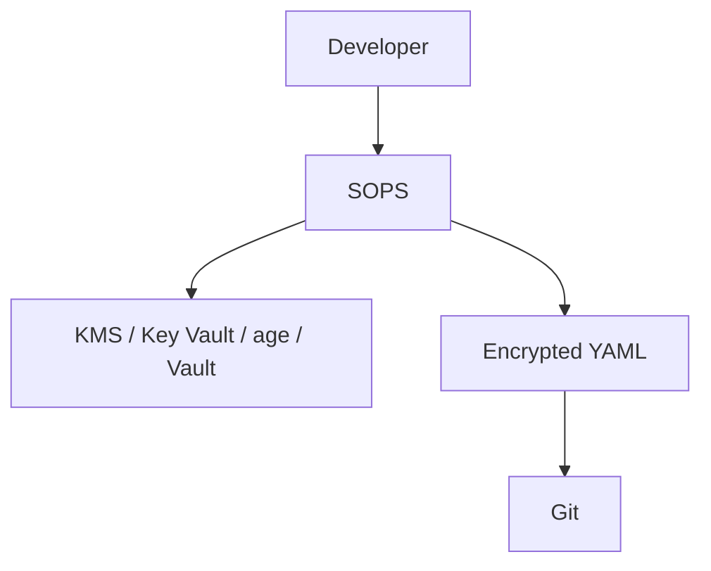

SOPS handles the file encryption.

The external key system protects the encryption key.

So:

```text
SOPS
     ↓
Encrypts secret files

KMS / Key Vault / age
     ↓
Controls who can decrypt them
```

---

#### Example

Edit securely:

```bash
sops secrets.yaml
```

SOPS decrypts the contents for editing and writes the file back encrypted.

Your repository contains:

```text
terraform/
├── main.tf
├── modules/
└── secrets.yaml    ← encrypted by SOPS
```

This is much cleaner than manually performing:

```bash
decrypt
edit
encrypt
```

for every change.

---

#### Terraform Integration

Terraform ultimately needs the decrypted value.

A wrapper such as Terragrunt can decrypt SOPS files:

```hcl
locals {
  secrets = yamldecode(
    sops_decrypt_file("secrets.yaml")
  )
}

inputs = {
  db_username = local.secrets.database.username
  db_password = local.secrets.database.password
}
```

Flow:

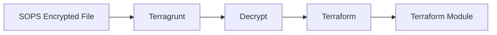

Other workflows decrypt the file in CI before Terraform executes.

---

#### Advantages

```text
Encrypted secrets can safely live beside infrastructure code
Git history contains ciphertext
Versioning and review are easy
Useful for GitOps
Works across cloud providers
SOPS provides good developer ergonomics
```

#### Disadvantages

```text
Key management is still required
Terraform eventually receives plaintext
Rotation usually requires changing the file
Not ideal for highly dynamic secrets
Secret may still enter Terraform state
```

---

#### Best Use

Encrypted files are useful for:

```text
GitOps repositories
Environment configuration
Bootstrap secrets
Small sets of relatively static secrets
Configurations that must be version controlled
```

---

## Approach 3 — External Secret Store

### Concept

Instead of keeping the secret in:

```text
Terraform code
environment variables
encrypted Git files
```

store it in a dedicated secrets-management platform.

Examples:

```text
HashiCorp Vault
Cloud secret managers
Enterprise password/secret platforms
Internal secret-management services
```

Terraform retrieves the value when required.

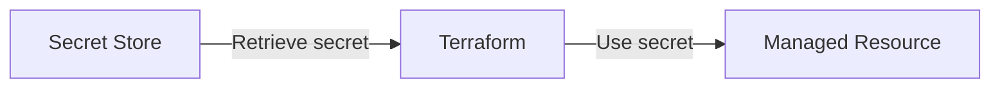

The secret store becomes the system responsible for:

```text
Storage
Encryption
Access control
Rotation
Auditing
Versioning
Expiration
```

rather than Terraform.

---

### 3.1 Example With a Generic Secret Store

Suppose the secret store contains:

```json
{
  "username": "admin",
  "password": "SuperSecret123!"
}
```

Conceptually Terraform retrieves:

```hcl
data "secret_store_secret" "database" {
  path = "production/database"
}
```

Then:

```hcl
locals {
  database_credentials = jsondecode(
    data.secret_store_secret.database.value
  )
}
```

And uses:

```hcl
module "database" {
  source = "./modules/database"

  username = local.database_credentials.username
  password = local.database_credentials.password
}
```

The exact data source depends on your secrets platform, but the architecture remains:

```text
Secret Store
      ↓
Terraform Provider/Data Source
      ↓
Terraform
      ↓
Target Resource
```

---

### 3.2 HashiCorp Vault Example

A concrete provider-neutral infrastructure example is Vault.

Terraform can retrieve secrets using the Vault provider.

Architecture:

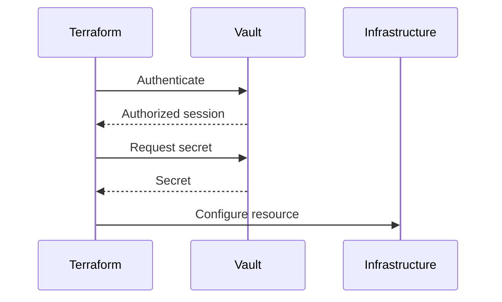

Vault can also generate **dynamic secrets**.

Instead of storing:

```text
username = terraform-user
password = permanent-password
```

Vault can generate:

```text
Temporary username
Temporary password
Expiration = 1 hour
```

This is considerably safer for infrastructure credentials because there is no permanent secret to distribute.

---

### 3.3 Static vs Dynamic Secrets

Secret stores can provide two important models.

#### Static Secret

```text
Vault / Secret Manager
        ↓
"SuperSecret123!"
        ↓
Terraform
```

The same secret remains until someone rotates it.

#### Dynamic Secret

```text
Terraform
    ↓
Vault
    ↓
Generate temporary credential
    ↓
Terraform uses it
    ↓
Credential expires
```

Dynamic credentials greatly reduce the impact of credential leakage.

HashiCorp specifically recommends short-lived/dynamic credentials where possible instead of distributing long-lived provider credentials.

---

### Advantages

```text
Centralized secret management
Strong access control
Audit logging
Independent rotation
Secret versioning
Potential dynamic/short-lived secrets
Better enterprise governance
```

### Disadvantages

```text
Additional infrastructure/service required
Terraform must authenticate to the secret store
More operational complexity
Secret may still enter Terraform state if consumed normally
```

---

## The Critical Terraform Question: Does the Secret Enter State?

This applies to **all three approaches**.

Suppose the secret comes from:

```text
Environment Variable
```

or:

```text
SOPS
```

or:

```text
Vault
```

If Terraform passes the secret into a normal resource argument:

```hcl
password = var.db_password
```

Terraform may persist that value in:

```text
terraform.tfstate
```

Therefore:

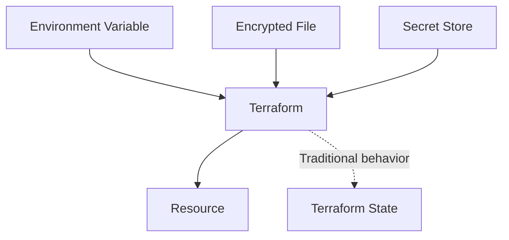

This means:

> Moving the secret out of Git does not automatically move it out of Terraform state.

Terraform state must therefore always be protected.

---

## Modern Terraform Secret Controls

Modern Terraform gives us three different concepts.

They solve different problems.

---

### `sensitive`

Example:

```hcl
variable "db_password" {
  type      = string
  sensitive = true
}
```

Purpose:

```text
Hide the value from normal CLI/UI output.
```

Terraform shows:

```text
password = (sensitive value)
```

But the secret can still be stored in state.

Think:

```text
sensitive
     ↓
Don't DISPLAY it
```

---

### `ephemeral`

Terraform 1.10+ supports ephemeral variables:

```hcl
variable "db_password" {
  type      = string
  sensitive = true
  ephemeral = true
}
```

Purpose:

```text
Do not persist the value in
plan/state artifacts.
```

Think:

```text
ephemeral
     ↓
Don't PERSIST it
```

There are restrictions on where ephemeral values can be used because Terraform cannot persist them for future comparisons.

---

### Write-Only Resource Arguments

Terraform 1.11+ supports **write-only arguments**, where the provider supports them.

Conceptually:

```hcl
resource "some_database" "main" {
  password_wo = var.db_password
}
```

Terraform sends:

```text
password
```

to the provider during the operation and then discards it.

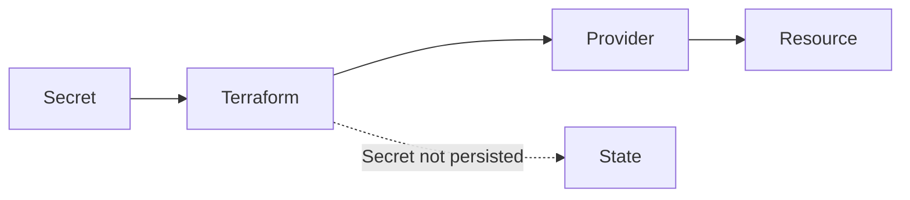

Write-only support is **provider and resource specific**.

Not every Terraform resource currently supports it.

---

### `sensitive` vs `ephemeral` vs `Write-Only`

| Feature             | Purpose                                             |
| ------------------- | --------------------------------------------------- |
| `sensitive = true`  | Hide secret from normal output                      |
| `ephemeral = true`  | Prevent value from being persisted in plan/state    |
| Write-only argument | Send secret to provider without storing it in state |

A strong modern pattern is:

```hcl
variable "db_password" {
  type      = string
  sensitive = true
  ephemeral = true
}
```

followed by a provider-supported write-only argument:

```hcl
resource "some_resource" "example" {
  secret_wo = var.db_password
}
```

Conceptually:

```text
Secret Store / CI
       ↓
Ephemeral Terraform Value
       ↓
Write-Only Provider Argument
       ↓
Target System

No secret persisted in Terraform state
```

This is one of the biggest improvements in Terraform secrets management compared with older tutorials.

---

## Comparing the Three Main Approaches

|                         | Environment Variables | Encrypted Files      | Secret Store                       |
| ----------------------- | --------------------- | -------------------- | ---------------------------------- |
| Secret in Git plaintext | No                    | No                   | No                                 |
| Easy locally            | Very easy             | Good                 | Moderate                           |
| Easy in CI/CD           | Excellent             | Good                 | Excellent                          |
| Central management      | No                    | No                   | Yes                                |
| Version controlled      | No                    | Yes                  | Secret versions handled externally |
| Rotation                | External/manual       | Usually manual       | Strong                             |
| Dynamic secrets         | No                    | No                   | Possible                           |
| Audit access            | Limited               | Key-system dependent | Strong                             |
| Good for GitOps         | Moderate              | Excellent            | Excellent                          |
| Enterprise scale        | Moderate              | Good                 | Excellent                          |
| State risk by itself    | Yes                   | Yes                  | Yes                                |

Important:

> None of these three approaches alone guarantees that Terraform will not persist the secret.

That depends on how Terraform consumes the value.

---

## When Should Each Approach Be Used?

### Environment Variables

Use when:

```text
CI/CD injects credentials
Credentials are temporary
Setup is simple
You don't need Git-versioned secrets
```

Example architecture:

```text
CI Secret
   ↓
TF_VAR_password
   ↓
Terraform
```

---

### Encrypted Files

Use when:

```text
Secrets/configuration should live in Git
GitOps is important
Secrets change relatively infrequently
Environment configuration should be versioned
```

Preferred pattern:

```text
Git
 ↓
SOPS encrypted YAML
 ↓
KMS / Key Vault / age
 ↓
Terraform workflow
```

---

### Secret Store

Use when:

```text
Production environment
Multiple teams
Many applications
Secrets rotate regularly
Auditing is important
Dynamic credentials are useful
Central governance is required
```

Architecture:

```text
Vault / Secret Manager
        ↓
Terraform
        ↓
Infrastructure
```

For mature production platforms, this is normally the strongest general-purpose model.

---

## Production Design

A mature design often uses **all three approaches**, because they solve different problems.

For example:

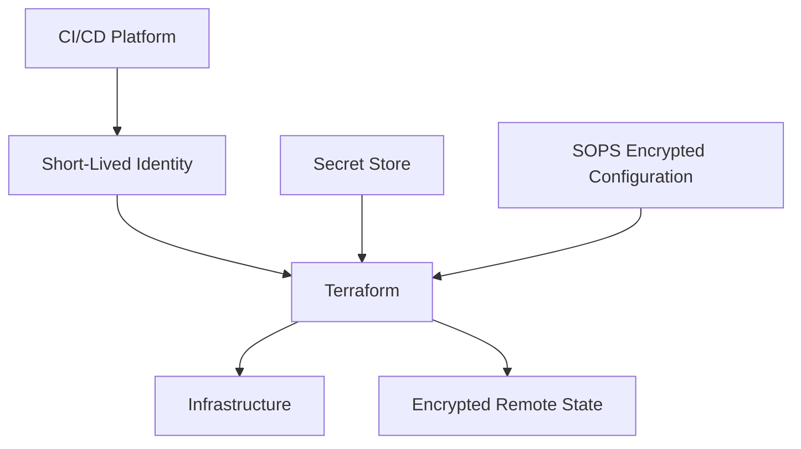

### Environment variables

Used for:

```text
Temporary CI values
Bootstrap information
Short-lived authentication
```

### SOPS encrypted files

Used for:

```text
Git-versioned sensitive configuration
Bootstrap configuration
GitOps secrets
```

### Secret store

Used for:

```text
Application secrets
Database credentials
API tokens
Dynamic credentials
Frequently rotated secrets
```

---

## Recommended Security Layers

Secrets management should be considered in layers:

```text
Layer 1
Don't hardcode secrets
        ↓
Layer 2
Choose secret source
ENV / encrypted file / secret store
        ↓
Layer 3
Mark sensitive values
sensitive = true
        ↓
Layer 4
Avoid persistence when supported
ephemeral = true
        ↓
Layer 5
Use provider write-only arguments
        ↓
Layer 6
Protect Terraform state
        ↓
Layer 7
Use short-lived identities and least privilege
```

Terraform state remains sensitive even if your current secrets use ephemeral mechanisms because state contains significant infrastructure metadata and may contain other sensitive resource attributes.

---

## Final Mental Model

Terraform secrets management is really two separate questions.

### Question 1 — Where does Terraform get the secret?

Three main approaches:

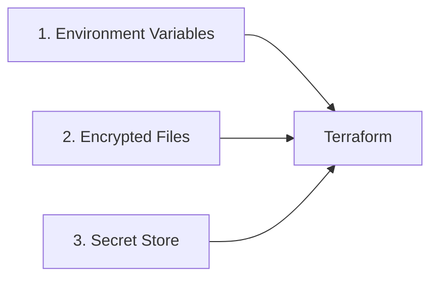

#### Environment Variables

```text
Secret
 ↓
TF_VAR_xxx
 ↓
Terraform
```

Simple and excellent for CI/CD.

#### Encrypted Files

```text
Secret
 ↓
SOPS / KMS / Key Vault encryption
 ↓
Encrypted Git file
 ↓
Decrypt during execution
 ↓
Terraform
```

Excellent when encrypted configuration needs to live in Git.

#### Secret Store

```text
Secret
 ↓
Vault / Secret Manager
 ↓
Terraform retrieves when needed
```

Best for centralized production secret lifecycle and dynamic credentials.

---

### Question 2 — What does Terraform do with the secret?

```text
sensitive
    ↓
Hide it from output

ephemeral
    ↓
Don't persist the Terraform value

write-only
    ↓
Send it to the provider without storing it
```

These are independent from **where the secret came from**.

So the complete architecture is:

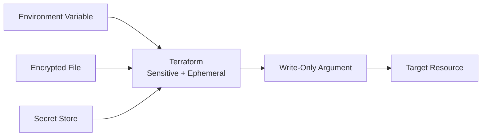

## Key Rule

> **Environment variables, encrypted files, and secret stores solve where a secret is kept and how Terraform receives it. `sensitive`, `ephemeral`, and write-only arguments solve how Terraform handles that secret after receiving it.**

For modern production Terraform, prefer:

```text
Short-lived identity
        +
External Secret Store
        +
Ephemeral values where possible
        +
Write-only resource arguments where supported
        +
Encrypted and access-controlled remote state
```
