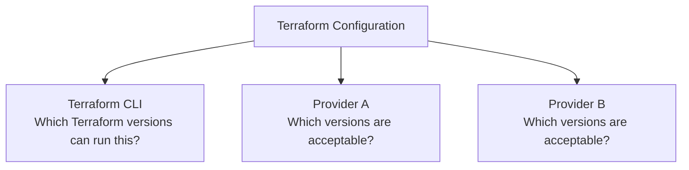
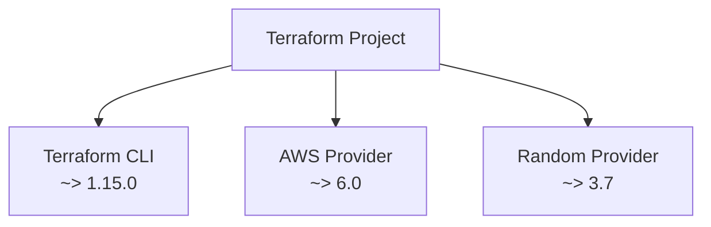
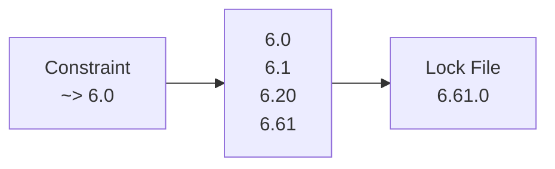
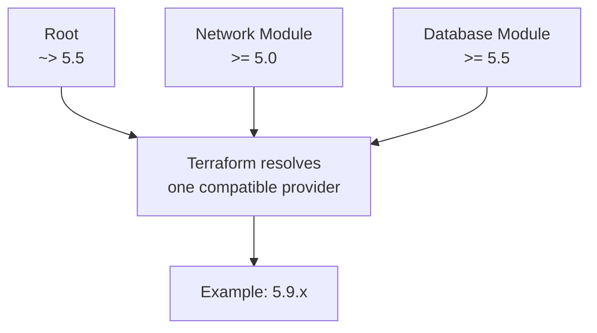
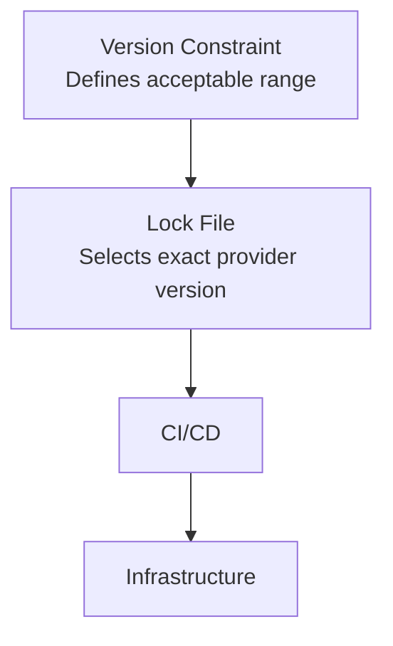
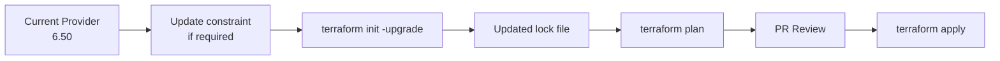
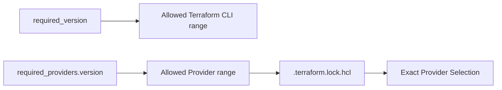

# Terraform Version & Provider Constraints

## Index

1. Why version constraints exist
2. Terraform CLI version constraint
3. Provider version constraints
4. Version constraint operators
5. How Terraform selects provider versions
6. `.terraform.lock.hcl`
7. Root module vs reusable module
8. Common mistakes
9. Recommended production pattern
10. Summary

---

## 1. Why Do We Need Version Constraints?

A Terraform project depends on at least two separately-versioned components:

```text
Terraform CLI
     +
Provider Plugins
```

For example:

```text
Terraform CLI
    v1.x

AWS Provider
    v6.x

Kubernetes Provider
    v2.x
```

Providers are released **independently** from Terraform itself. A new provider release can introduce new features, deprecations, or breaking changes. Terraform therefore lets you define which versions your configuration supports. ([HashiCorp Developer](https://developer.hashicorp.com/terraform/language/providers?utm_source=chatgpt.com 'Providers - Configuration Language | Terraform | HashiCorp Developer'))

Conceptually:



There are therefore **two different constraints** to understand:

| Constraint                       | Controls                |
| -------------------------------- | ----------------------- |
| `required_version`               | Terraform CLI version   |
| `required_providers` → `version` | Provider plugin version |

---

## 1. Terraform CLI Version Constraint

The Terraform CLI constraint goes inside:

```hcl
terraform {
}
```

using:

```hcl
required_version
```

Example:

```hcl
terraform {
  required_version = ">= 1.10.0"
}
```

This means:

> This configuration requires Terraform CLI 1.10.0 or newer.

If someone runs:

```bash
terraform version
```

and gets:

```text
Terraform v1.9.8
```

Terraform will reject operations because the installed CLI does not satisfy the configuration's constraint. `required_version` controls only the Terraform CLI; it does **not** control provider versions. ([HashiCorp Developer](https://developer.hashicorp.com/terraform/language/block/terraform?utm_source=chatgpt.com 'Terraform block reference for the Terraform configuration language | Terraform | HashiCorp Developer'))

---

### Example

```hcl
terraform {
  required_version = "~> 1.15.0"
}
```

This means:

```text
Allowed:

1.15.0
1.15.1
1.15.5
...

Not allowed:

1.14.x
1.16.0
2.0.0
```

Because:

```text
~> 1.15.0

means

>= 1.15.0
<  1.16.0
```

HashiCorp recommends constraints that allow compatible patch upgrades while preventing unplanned broader upgrades. ([HashiCorp Developer](https://developer.hashicorp.com/terraform/tutorials/configuration-language/versions?utm_source=chatgpt.com 'Manage Terraform versions | Terraform | HashiCorp Developer'))

---

## 2. Provider Version Constraints

Providers have their **own versions**.

Declare them under:

```hcl
required_providers
```

Example:

```hcl
terraform {
  required_providers {
    aws = {
      source  = "hashicorp/aws"
      version = "~> 6.0"
    }
  }
}
```

This tells Terraform:

```text
Provider local name:
aws

Provider source:
registry.terraform.io/hashicorp/aws

Acceptable versions:
6.x
```

`~> 6.0` means:

```text
>= 6.0
<  7.0
```

Terraform can therefore use:

```text
6.0
6.1
6.20
6.61
...
```

but not:

```text
7.0
```

Provider requirements contain the provider's source address and its acceptable version range. ([HashiCorp Developer](https://developer.hashicorp.com/terraform/language/providers/requirements?utm_source=chatgpt.com 'Provider Requirements - Configuration Language | Terraform | HashiCorp Developer'))

---

## Complete Example

A typical configuration might look like:

```hcl
terraform {
  required_version = "~> 1.15.0"

  required_providers {
    aws = {
      source  = "hashicorp/aws"
      version = "~> 6.0"
    }

    random = {
      source  = "hashicorp/random"
      version = "~> 3.7"
    }
  }
}
```

Think of it as:



The project says:

```text
Terraform CLI:
Use 1.15.x

AWS provider:
Use 6.x

Random provider:
Use 3.x starting from 3.7
```

---

## Version Constraint Operators

Terraform uses the same constraint syntax for Terraform versions, providers, and some module version selections. ([HashiCorp Developer](https://developer.hashicorp.com/terraform/language/expressions/version-constraints?utm_source=chatgpt.com 'Version Constraints - Configuration Language | Terraform | HashiCorp Developer'))

### Exact Version

```hcl
version = "= 6.4.2"
```

or simply:

```hcl
version = "6.4.2"
```

Only:

```text
6.4.2
```

is accepted.

---

### Minimum Version

```hcl
version = ">= 6.4.0"
```

Allows:

```text
6.4.0
6.5.0
7.0.0
8.0.0
...
```

This can be dangerous in a root production configuration because it has **no upper boundary**.

---

### Less Than

```hcl
version = "< 7.0.0"
```

Allows anything below:

```text
7.0.0
```

---

### Range

You can combine constraints with commas:

```hcl
version = ">= 6.4.0, < 7.0.0"
```

Both conditions must be true:

```text
        Allowed
          │
6.4 ───────────── 6.99
          │
          ▼

>= 6.4 AND < 7.0
```

---

### Exclude One Version

Suppose version `6.15.0` has a bug affecting your environment.

You could write:

```hcl
version = ">= 6.0, < 7.0, != 6.15.0"
```

So:

```text
6.14.0  ✅
6.15.0  ❌
6.16.0  ✅
```

---

## Understanding `~>` Correctly

This operator causes a lot of confusion.

It is called the **pessimistic constraint operator**.

### Example 1

```hcl
version = "~> 6.3.0"
```

means:

```text
>= 6.3.0
<  6.4.0
```

Allowed:

```text
6.3.0
6.3.1
6.3.20
```

Not allowed:

```text
6.4.0
7.0.0
```

---

### Example 2

```hcl
version = "~> 6.3"
```

means:

```text
>= 6.3
<  7.0
```

So these are allowed:

```text
6.3
6.4
6.20
6.99
```

but:

```text
7.0
```

is not.

HashiCorp summarizes the rule as allowing the **right-most specified version component to increment**. ([HashiCorp Developer](https://developer.hashicorp.com/terraform/language/expressions/version-constraints?utm_source=chatgpt.com 'Version Constraints - Configuration Language | Terraform | HashiCorp Developer'))

This distinction is important:

```text
~> 6.3.0
     │
     └── Only 6.3.x
```

versus:

```text
~> 6.3
     │
     └── 6.x starting at 6.3
```

---

## How Terraform Selects a Provider Version

Suppose you write:

```hcl
terraform {
  required_providers {
    example = {
      source  = "company/example"
      version = ">= 3.0, < 4.0"
    }
  }
}
```

Available versions are:

```text
2.9
3.0
3.1
3.5
3.9
4.0
```

Valid candidates are:

```text
3.0
3.1
3.5
3.9
```

Without an existing lock selection, Terraform generally chooses the newest available version satisfying all applicable constraints:

```text
3.9
```

during:

```bash
terraform init
```

HashiCorp documents this selection behavior explicitly. ([HashiCorp Developer](https://developer.hashicorp.com/terraform/language/expressions/version-constraints?utm_source=chatgpt.com 'Version Constraints - Configuration Language | Terraform | HashiCorp Developer'))

---

### But What Happens Next Time?

This is where:

```text
.terraform.lock.hcl
```

becomes important.

Suppose:

```hcl
version = ">= 3.0, < 4.0"
```

and today Terraform installs:

```text
3.9.0
```

Terraform writes that selection into:

```text
.terraform.lock.hcl
```

Conceptually:

```hcl
provider "registry.terraform.io/company/example" {
  version = "3.9.0"

  constraints = ">= 3.0, < 4.0"

  # checksums...
}
```

Now your team gets:

```text
Developer A ──┐
Developer B ──┼──► Provider 3.9.0
CI/CD       ──┘
```

rather than each environment selecting a different provider version.

HashiCorp recommends committing `.terraform.lock.hcl` to version control. ([HashiCorp Developer](https://developer.hashicorp.com/terraform/tutorials/configuration-language/provider-versioning?utm_source=chatgpt.com 'Lock and upgrade provider versions | Terraform | HashiCorp Developer'))

---

## Constraint vs Lock File

This distinction is extremely important.

Suppose you have:

```hcl
version = "~> 6.0"
```

This says:

> Any acceptable `6.x` provider is compatible with my configuration.

But `.terraform.lock.hcl` might say:

```text
Use 6.61.0
```

So:

```text
Version Constraint
       ↓
Defines ALLOWED range

~> 6.0
       ↓
6.x allowed


Lock File
       ↓
Records SELECTED version

6.61.0
```

Conceptually:



The constraint answers:

> Which versions **may** Terraform use?

The lock file answers:

> Which version **did we choose**?

---

## `terraform init` vs `terraform init -upgrade`

Suppose:

```hcl
version = "~> 6.0"
```

and the lock file currently contains:

```text
6.50.0
```

Later:

```text
6.61.0
```

becomes available.

Running:

```bash
terraform init
```

normally continues using:

```text
6.50.0
```

because it is locked and still satisfies the constraint.

To ask Terraform to reconsider locked selections within the allowed constraints:

```bash
terraform init -upgrade
```

Terraform can then select:

```text
6.61.0
```

and update:

```text
.terraform.lock.hcl
```

HashiCorp describes the lock file as the mechanism for making provider selections repeatable across future initialization runs. ([HashiCorp Developer](https://developer.hashicorp.com/terraform/tutorials/configuration-language/provider-versioning?utm_source=chatgpt.com 'Lock and upgrade provider versions | Terraform | HashiCorp Developer'))

---

## Terraform CLI Is NOT Stored in `.terraform.lock.hcl`

Another common misunderstanding:

```text
.terraform.lock.hcl
```

currently tracks **provider dependencies**.

It does not lock your Terraform CLI binary. ([HashiCorp Developer](https://developer.hashicorp.com/terraform/language/files/dependency-lock?utm_source=chatgpt.com 'Dependency Lock File (.terraform.lock.hcl) - Configuration Language | Terraform | HashiCorp Developer'))

So:

```hcl
required_version = "~> 1.15.0"
```

means:

> Refuse incompatible Terraform CLI versions.

It does not download Terraform `1.15.x` for you.

Your environment still needs to install an appropriate Terraform executable.

Conceptually:

```text
required_version
      ↓
Compatibility check

NOT

Terraform installer
```

---

## `required_providers` vs `provider`

These are also different.

### `required_providers`

Defines:

```text
What provider?
From where?
Which versions?
```

Example:

```hcl
terraform {
  required_providers {
    mycloud = {
      source  = "company/mycloud"
      version = "~> 3.0"
    }
  }
}
```

---

### `provider` block

Configures an installed provider:

```hcl
provider "mycloud" {
  region = "region-a"
}
```

Think:

```text
required_providers
        ↓
Which plugin should Terraform install?


provider
        ↓
How should Terraform configure that plugin?
```

HashiCorp specifically separates provider requirements from provider configuration. ([HashiCorp Developer](https://developer.hashicorp.com/terraform/language/providers/requirements?utm_source=chatgpt.com 'Provider Requirements - Configuration Language | Terraform | HashiCorp Developer'))

Do not put provider version configuration inside the normal `provider` block.

---

## What Happens With Modules?

This becomes important in real projects.

Suppose:

```text
Root Module
│
├── Network Module
└── Database Module
```

Each module can declare provider requirements.

For example:

### Network module

```hcl
terraform {
  required_providers {
    mycloud = {
      source  = "company/mycloud"
      version = ">= 5.0"
    }
  }
}
```

### Database module

```hcl
terraform {
  required_providers {
    mycloud = {
      source  = "company/mycloud"
      version = ">= 5.5"
    }
  }
}
```

### Root module

```hcl
terraform {
  required_providers {
    mycloud = {
      source  = "company/mycloud"
      version = "~> 5.5"
    }
  }
}
```

Terraform must find **one provider version** satisfying all constraints.

Conceptually:



Terraform considers requirements from the root and child modules together and selects a single compatible provider version. ([HashiCorp Developer](https://developer.hashicorp.com/terraform/language/modules/develop/providers?utm_source=chatgpt.com 'Providers Within Modules - Configuration Language | Terraform | HashiCorp Developer'))

---

## Reusable Module vs Root Module Constraints

This is one of the most useful production rules.

### Reusable Modules

For reusable modules, HashiCorp recommends generally specifying the **minimum compatible provider version**.

Example:

```hcl
terraform {
  required_providers {
    mycloud = {
      source  = "company/mycloud"
      version = ">= 5.5"
    }
  }
}
```

Why not:

```hcl
version = "~> 5.5"
```

inside every reusable module?

Because your module could unnecessarily prevent applications from moving to a newer provider.

Imagine:

```text
Module A → ~> 5.5
Module B → >= 6.0
```

There may be:

```text
NO provider version
```

that satisfies both.

HashiCorp recommends avoiding maximum-version constraints such as `~>` in reusable modules in most cases. ([HashiCorp Developer](https://developer.hashicorp.com/terraform/language/providers/requirements?utm_source=chatgpt.com 'Provider Requirements - Configuration Language | Terraform | HashiCorp Developer'))

---

### Root Module

The **root module** is where you actually run:

```bash
terraform plan
terraform apply
```

The root module should generally place tighter control around provider upgrades.

For example:

```hcl
terraform {
  required_version = "~> 1.15.0"

  required_providers {
    mycloud = {
      source  = "company/mycloud"
      version = "~> 6.0"
    }

    kubernetes = {
      source  = "hashicorp/kubernetes"
      version = "~> 2.38"
    }
  }
}
```

Then commit:

```text
.terraform.lock.hcl
```

This gives you two protection layers:



---

## Example Production Structure

You might keep a dedicated file:

```text
terraform/
├── versions.tf
├── providers.tf
├── main.tf
├── variables.tf
├── outputs.tf
└── .terraform.lock.hcl
```

### `versions.tf`

```hcl
terraform {
  required_version = "~> 1.15.0"

  required_providers {
    cloud = {
      source  = "company/cloud"
      version = "~> 6.0"
    }

    kubernetes = {
      source  = "hashicorp/kubernetes"
      version = "~> 2.38"
    }

    helm = {
      source  = "hashicorp/helm"
      version = "~> 3.0"
    }
  }
}
```

### `providers.tf`

```hcl
provider "cloud" {
  region = var.region
}

provider "kubernetes" {
  # authentication/configuration
}

provider "helm" {
  # authentication/configuration
}
```

The separation becomes:

```text
versions.tf
    ↓
Compatibility / versions

providers.tf
    ↓
Provider configuration

.terraform.lock.hcl
    ↓
Exact selected provider builds
```

---

## Common Mistakes

### Mistake 1 — No Provider Constraint

```hcl
cloud = {
  source = "company/cloud"
}
```

Terraform accepts any compatible published version.

A future `terraform init` without a lock file could select a significantly newer release.

Better:

```hcl
cloud = {
  source  = "company/cloud"
  version = "~> 6.0"
}
```

---

### Mistake 2 — Thinking `>= 6.0` Means Only 6.x

It does not.

```hcl
version = ">= 6.0"
```

could eventually accept:

```text
6.x
7.x
8.x
```

If you mean:

```text
6.x only
```

use:

```hcl
version = "~> 6.0"
```

or:

```hcl
version = ">= 6.0, < 7.0"
```

---

### Mistake 3 — Misunderstanding `~>`

These are different:

```hcl
~> 6.3
```

means:

```text
>= 6.3
< 7.0
```

while:

```hcl
~> 6.3.0
```

means:

```text
>= 6.3.0
< 6.4.0
```

---

### Mistake 4 — Not Committing the Lock File

Without:

```text
.terraform.lock.hcl
```

different environments may select different acceptable provider versions.

HashiCorp recommends committing it to version control. ([HashiCorp Developer](https://developer.hashicorp.com/terraform/language/files/dependency-lock?utm_source=chatgpt.com 'Dependency Lock File (.terraform.lock.hcl) - Configuration Language | Terraform | HashiCorp Developer'))

---

### Mistake 5 — Putting Tight Upper Bounds in Every Reusable Module

Avoid making reusable modules unnecessarily restrictive:

```hcl
version = "~> 6.2.0"
```

Prefer a minimum compatible version where appropriate:

```hcl
version = ">= 6.2.0"
```

Let the root module decide the deployment's tighter provider policy. ([HashiCorp Developer](https://developer.hashicorp.com/terraform/language/providers/requirements?utm_source=chatgpt.com 'Provider Requirements - Configuration Language | Terraform | HashiCorp Developer'))

---

## Recommended Production Pattern

For an application/root Terraform configuration:

```hcl
terraform {
  required_version = "~> 1.15.0"

  required_providers {
    cloud = {
      source  = "company/cloud"
      version = "~> 6.0"
    }
  }
}
```

and:

```text
✅ Commit .terraform.lock.hcl

✅ Upgrade intentionally

✅ Run terraform init -upgrade during controlled upgrades

✅ Review provider changelog/release notes

✅ Run terraform plan

✅ Review the plan in CI/CD

✅ Apply only after validation
```

Upgrade workflow:



Do not make provider upgrades an accidental side effect of running `terraform init`.

---

## Final Mental Model

Think of the three pieces separately:

```text
required_version
      ↓
Which Terraform CLI versions are allowed?


required_providers.version
      ↓
Which provider versions are allowed?


.terraform.lock.hcl
      ↓
Which exact provider version was selected?
```

Example:

```hcl
terraform {
  required_version = "~> 1.15.0"

  required_providers {
    cloud = {
      source  = "company/cloud"
      version = "~> 6.0"
    }
  }
}
```

and lock file:

```text
Terraform CLI
    ↓
1.15.x allowed

Provider
    ↓
6.x allowed

Lock file
    ↓
Example selected version: 6.61.0
```

## Rule to Remember

> **Constraints define compatibility. The lock file gives reproducibility.**

Or visually:



For reusable modules, keep constraints as flexible as compatibility allows. For root production configurations, constrain versions deliberately and commit `.terraform.lock.hcl`. This matches HashiCorp's current guidance. ([HashiCorp Developer](https://developer.hashicorp.com/terraform/language/expressions/version-constraints?utm_source=chatgpt.com 'Version Constraints - Configuration Language | Terraform | HashiCorp Developer'))
