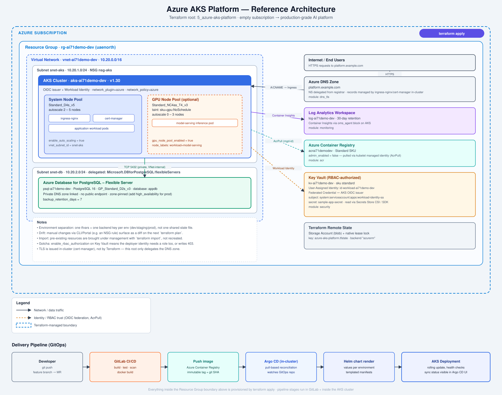

# Azure AKS Platform



A from-empty-subscription-to-production-grade-platform Terraform root, matching
the architecture:

```text
Empty Azure Subscription
        |
Resource Group + VNet / Subnets      (modules/network)
        |
Log Analytics Workspace              (modules/monitoring)
        |
ACR                                  (modules/acr)
        |
AKS (workload identity + ACR pull)   (modules/aks)
        |
Key Vault + Workload Identity        (modules/security)
        |
Postgres Flexible Server             (modules/database)
        |
DNS zone (TLS issued in-cluster)     (modules/dns_tls)
```

## Module dependency order

`main.tf` wires the modules in exactly this order because each one needs an
output from the last: `network` -> `monitoring` + `acr` -> `aks` (needs the
Log Analytics workspace ID and the ACR ID) -> `security` (needs the AKS OIDC
issuer URL to federate workload identity) -> `database` (needs the delegated
subnet and VNet ID) -> `dns_tls` (independent, but conceptually last since
ingress is the final piece the cluster exposes).

This is the same shape as delivering a customer environment end to end:
landing zone first, compute second, identity/secrets once the compute
identity exists, data and edge last.

## Where Terraform's job ends

TLS is **not** issued by this Terraform root. `modules/dns_tls` creates the
Azure DNS zone and stops - `cert-manager` and `ingress-nginx`, deployed via
Helm/Argo CD *inside* the cluster, own certificate issuance and the actual
DNS records. Mixing the two (e.g. provisioning a cert via `azurerm` and also
running cert-manager) is a common source of drift - pick one owner per
resource.

## Interview talking points this project exercises

- **Modules**: each Azure service is an isolated module with its own
  variables/outputs - composition happens only in the root `main.tf`.
- **Remote state + locking**: `providers.tf` backend block - an Azure
  Storage Account gives you both state storage and a native blob-lease lock,
  no separate lock table needed (unlike AWS's DynamoDB-based locking on
  older Terraform).
- **Environment separation**: don't reuse one `terraform.tfvars` for
  dev/staging/prod. Either give each environment its own `-backend-config`
  key (`dev.tfstate`, `prod.tfstate`) and `-var-file`, or use Terraform
  workspaces - this repo assumes separate state files per env, which is
  easier to reason about for blast-radius than workspaces.
- **Secrets**: `db_admin_password` is `sensitive` and has no default - it's
  injected via `TF_VAR_db_admin_password` or a CI secret store, never
  committed. Application secrets live in Key Vault, read by pods through
  workload identity (`modules/security`), not through Kubernetes Secrets.
- **Drift**: anything changed via `az` CLI or the portal after apply (e.g. a
  manually added NSG rule) shows up on the next `terraform plan` as a diff
  Terraform wants to revert - that's drift detection working as intended.
- **Import**: if a resource already exists in Azure (e.g. this VNet was
  created by hand before Terraform took over), `terraform import
  module.network.azurerm_virtual_network.this <resource-id>` brings it under
  management without recreating it.
- **A gotcha worth mentioning in interview**: `enable_rbac_authorization =
  true` on the Key Vault means the *deployer* (your CI identity or your own
  `az login`) also needs an RBAC role on the vault, or writing the sample
  secret fails with a 403 even though the vault deployed cleanly - see the
  `azurerm_role_assignment.deployer_secrets_officer` resource.

## Usage

```bash
cp terraform.tfvars.example terraform.tfvars
export TF_VAR_db_admin_password="<generate-one>"

terraform init   # -backend-config=backend-dev.hcl once you have a real backend
terraform plan
terraform apply

az aks get-credentials --resource-group $(terraform output -raw resource_group_name) \
  --name $(terraform output -raw aks_cluster_name)
```

## AWS equivalents

| Azure                          | AWS                                   |
| ------------------------------- | -------------------------------------- |
| Resource Group                  | (no direct equivalent - just tags/VPC) |
| VNet / Subnet                   | VPC / Subnet                           |
| AKS                              | EKS                                     |
| ACR                              | ECR                                     |
| Key Vault                        | Secrets Manager / Parameter Store      |
| Workload Identity (OIDC federation) | IRSA (IAM Roles for Service Accounts) |
| Postgres Flexible Server         | RDS for PostgreSQL                     |
| Azure DNS + cert-manager          | Route 53 + ACM + cert-manager          |
| Log Analytics / Container Insights | CloudWatch Logs / Container Insights |

See `../6_aws-eks-platform` for the AWS build of the same architecture.
