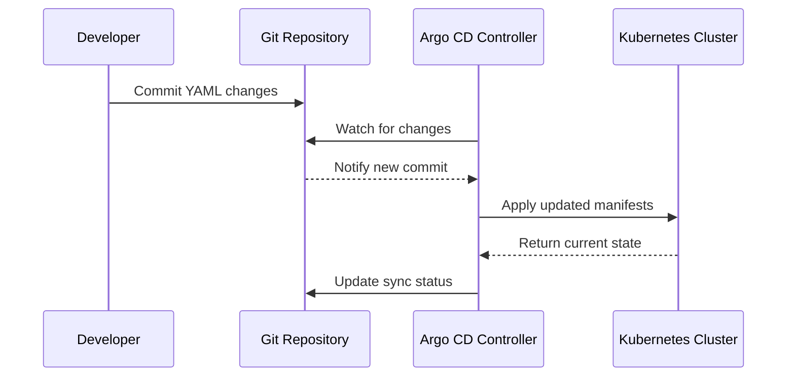

# 🚀 **GitOps**

## 📖 **What is GitOps?**

_GitOps can be considered an extention of IaC (Infrastructure as Code) that uses Git as the Version Control System._

### **Official Definition (by Weaveworks, who coined the term)**

> **GitOps is a modern operational framework** that uses **Git** as the _single source of truth_ for **infrastructure and application deployment automation** through **declarative configurations** and **continuous delivery (CD)**.

In short:

> “If it’s not in Git, it doesn’t exist in production.”

---

## 💡 **The Core Idea**

GitOps = **Git + DevOps**

It combines:

- 🧩 **Git** → for version control & audit trail
- ⚙️ **DevOps principles** → automation, CI/CD, monitoring, feedback loops

👉 Everything (infra + app configs) is **stored declaratively in Git**, and **automated agents** ensure what’s running in the cluster **matches Git’s declared state**.

---

## 🎯 **GitOps Goal**

To **automate infrastructure & app delivery** by:

1. Storing **desired state** in Git.
2. Watching Git for changes.
3. Automatically syncing changes to the runtime (like Kubernetes).
4. Reverting drift if reality ≠ desired state.

---

## 🏛️ **GitOps Pillars**

<div align="center" style="background-color: #141a19ff;color: #a8a5a5ff; border-radius: 10px; border: 2px solid">

| Pillar                         | Description                                                                     |
| ------------------------------ | ------------------------------------------------------------------------------- |
| **1. Declarative**             | Everything is described as code (YAML manifests, Terraform, Helm charts, etc.). |
| **2. Versioned & Immutable**   | Git maintains version history — every change is trackable.                      |
| **3. Automatically Applied**   | Tools sync changes automatically to environments.                               |
| **4. Continuously Reconciled** | Agents constantly ensure actual state matches Git’s desired state.              |

</div>

---

## 📐 **GitOps Architecture Overview**

Let’s visualize the core workflow:

```mermaid
flowchart LR
    subgraph "Developer Laptop 💻"
    A[Code & YAML changes] --> B[Git Push]
    end

    subgraph "Git Repository 🧾"
    B --> C["Infra & App Configs (desired state)"]
    end

    subgraph "GitOps Operator 🔄"
    C --> D[GitOps Controller polls repo]
    D -->|Detects change| E[Apply manifests to Kubernetes]
    E --> F[Cluster State updated]
    F --> D
    end
```

<div align="center" style="background-color: #2b3436ff; border-radius: 10px; border: 2px solid">



</div>

### **Key Principle**

> Git is the source of truth. The controller (like ArgoCD or Flux) continuously ensures the cluster matches Git.

---

## 🧩 **GitOps Components**

<div align="center" style="background-color: #141a19ff;color: #a8a5a5ff; border-radius: 10px; border: 2px solid">

| Component                 | Description                                        | Examples                                          |
| ------------------------- | -------------------------------------------------- | ------------------------------------------------- |
| **Git Repository**        | Stores declarative YAML/Helm/Terraform definitions | GitHub, GitLab, Bitbucket                         |
| **CI/CD Tool (optional)** | Builds & tests before updating Git                 | Jenkins, GitHub Actions, GitLab CI                |
| **GitOps Controller**     | Watches Git and syncs changes automatically        | **Argo CD**, **FluxCD**, **Fleet**, **Jenkins X** |
| **Kubernetes Cluster**    | Runtime environment to apply configurations        | EKS, AKS, GKE, Minikube                           |

</div>

---

## ⚙️ **GitOps Workflow** (Step-by-Step)

Let’s go through the **real GitOps lifecycle** 👇

---

### 🔹 1. Developer Workflow

1. Developer modifies YAML (like `deployment.yaml` or `values.yaml`).
2. Push changes to Git.
3. CI/CD validates syntax, runs tests, builds Docker image.
4. A new **Git commit or tag** triggers the GitOps controller.

---

### 🔹 2. Reconciliation Loop

GitOps controller (like ArgoCD) runs continuously:

1. Polls Git for updates.
2. Compares desired state (Git) with current state (cluster).
3. If differences → applies changes (`kubectl apply`).
4. If drift occurs → restores state to match Git.

This loop is continuous. ⚡

---

### 🔹 3. Drift Detection

If someone manually changes something in Kubernetes (say via `kubectl edit deployment`) — the GitOps controller detects that the **live state drifted** from Git, and automatically:

- Logs the drift 🚨
- Reverts to the Git state ✅

👉 **Immutable infrastructure enforcement.**

---

## 🧰 **Popular GitOps Tools**

<div align="center" style="background-color: #141a19ff;color: #a8a5a5ff; border-radius: 10px; border: 2px solid">

| Tool          | Description                                   | Key Feature                       |
| ------------- | --------------------------------------------- | --------------------------------- |
| **Argo CD**   | Declarative GitOps CD for Kubernetes          | UI Dashboard, Multi-Cluster Sync  |
| **Flux CD**   | CNCF project, lightweight GitOps toolkit      | Native GitOps for Helm, Kustomize |
| **Jenkins X** | Jenkins-based CI/CD with GitOps built-in      | Auto Preview Envs                 |
| **Fleet**     | Rancher’s GitOps for multi-cluster management | Scalable fleet orchestration      |

</div>

---

## 🧭 **Example: Argo CD GitOps Flow**

<div align="center" style="background-color: #2b3436ff; border-radius: 10px; border: 2px solid">



</div>

---

## 💡 **Declarative vs Imperative** (GitOps Magic)

<div align="center" style="background-color: #141a19ff;color: #a8a5a5ff; border-radius: 10px; border: 2px solid">

| Approach        | Description                             | Example                           |
| --------------- | --------------------------------------- | --------------------------------- |
| **Imperative**  | “Do this action.” (Procedural commands) | `kubectl create deployment myapp` |
| **Declarative** | “Here’s what I want.” (Desired state)   | `deployment.yaml` stored in Git   |

</div>

> 💡 GitOps **only uses declarative** — meaning it defines _what you want_, not _how to do it._

---

## ⚔️ **GitOps vs Traditional CI/CD**

<div align="center" style="background-color: #141a19ff;color: #a8a5a5ff; border-radius: 10px; border: 2px solid">

| Aspect                    | Traditional CI/CD        | GitOps                                         |
| ------------------------- | ------------------------ | ---------------------------------------------- |
| **Deployment Trigger**    | CI/CD pipeline job       | Git commit or tag                              |
| **Source of Truth**       | Pipeline definition      | Git repository                                 |
| **Rollback**              | Manual or semi-automated | `git revert` instantly restores previous state |
| **Infra Mgmt**            | Often external scripts   | Declarative IaC in Git                         |
| **Auditability**          | Partial                  | Full Git history provides audit trail          |
| **Kubernetes Management** | kubectl scripts          | Automated continuous sync                      |

</div>

---

## ✍🏻 **GitOps in Practice** — Example Setup

### ✅ Repository Structure

```ini
├── environments/
│   ├── dev/
│   │   └── kustomization.yaml
│   ├── prod/
│   │   └── kustomization.yaml
├── apps/
│   ├── frontend/
│   │   └── deployment.yaml
│   ├── backend/
│   │   └── deployment.yaml
```

### ✅ Workflow

1. Developer merges PR → main branch
2. GitOps controller detects new commit
3. Syncs all manifests → deploys to cluster
4. Drift detection ensures live = desired

---

## ⚡ **Advanced GitOps Concepts**

### 🔹 **Multi-Environment Promotion**

GitOps promotes releases between environments (like Dev → Staging → Prod) via PR merges:

- Dev branch auto-syncs to dev cluster
- Once validated → merge PR → prod branch
- GitOps tool syncs prod cluster automatically

### 🔹 **Multi-Cluster GitOps**

ArgoCD or Flux can manage multiple clusters from a **single Git repo**:

- Central controller manages all target clusters
- Each environment directory maps to a cluster

### 🔹 **GitOps + Terraform**

For infra provisioning (beyond Kubernetes):

- Store Terraform code in Git
- Use tools like **Atlantis** or **Terraform Cloud** to automate `plan` & `apply`
- Git remains single source of truth for infra + apps

---

## ⛔ **GitOps Anti-Patterns**

<div align="center" style="background-color: #141a19ff;color: #a8a5a5ff; border-radius: 10px; border: 2px solid">

| Anti-Pattern                         | Why It’s Bad                            |
| ------------------------------------ | --------------------------------------- |
| Manually editing live clusters       | Breaks Git as source of truth           |
| Keeping secrets in Git               | Security risk — use Vault/SealedSecrets |
| Using CI to push directly to cluster | Violates pull-based GitOps principle    |
| Not separating environments          | Harder rollback & drift handling        |

</div>

---

## 🛡️ **GitOps Security Best Practices**

1. ✅ Use **read-only deploy keys** for GitOps agents.
2. 🔒 Manage **secrets** via external tools (Sealed Secrets, HashiCorp Vault, SOPS).
3. 🧾 Enable **branch protection rules** (no force-push to main).
4. 🕵️‍♂️ Use **signed commits** (GPG).
5. ⚙️ Keep **RBAC minimal** for GitOps service accounts.

---

## ✅ **GitOps Benefits Summary**

<div align="center" style="background-color: #141a19ff;color: #a8a5a5ff; border-radius: 10px; border: 2px solid">

| Benefit          | Description                            |
| ---------------- | -------------------------------------- |
| **Auditability** | All changes tracked in Git             |
| **Rollback**     | Easy via `git revert`                  |
| **Consistency**  | Enforces same state everywhere         |
| **Automation**   | Continuous sync & drift correction     |
| **Security**     | No direct access to clusters needed    |
| **Scalability**  | Multi-cluster, multi-env orchestration |

</div>

---

## 🧠 **GitOps Mental Model**

```mermaid
graph TD
    subgraph "GitOps Core Loop 🔄"
    A[Developer pushes to Git] --> B[GitOps Controller detects change]
    B --> C[Controller applies changes to cluster]
    C --> D[Cluster reports actual state]
    D --> E[Controller reconciles drift]
    E --> B
    end
```

<div align="center" style="background-color: #2b3436ff; border-radius: 10px; border: 2px solid">



</div>

---

## 🚀 **Real-World Example**: Argo CD in Action

1. Developer commits to `main`
2. ArgoCD detects commit and auto-syncs
3. App gets deployed
4. Manual change in cluster? ArgoCD flags it 🔥
5. ArgoCD reverts the drift automatically

> ✅ Git is always the truth  
> ✅ No manual kubectl needed  
> ✅ CI/CD simplified with audit logs

---

## 🏁 **Summary**

<div align="center" style="background-color: #141a19ff;color: #a8a5a5ff; border-radius: 10px; border: 2px solid">

| Concept         | Key Idea                                              |
| --------------- | ----------------------------------------------------- |
| **GitOps**      | Manage everything (infra + apps) from Git             |
| **Declarative** | Define desired state (YAML/IaC)                       |
| **Controller**  | Keeps live cluster synced with Git                    |
| **Automation**  | Detect, apply, and revert automatically               |
| **Goal**        | Reliable, secure, auditable, reproducible deployments |

</div>

---

## ⁉️ **Advanced Integrations**

<div align="center" style="background-color: #141a19ff;color: #a8a5a5ff; border-radius: 10px; border: 2px solid">

| Integration                                       | Purpose                                    |
| ------------------------------------------------- | ------------------------------------------ |
| **GitOps + Helm**                                 | Package versioned charts in Git            |
| **GitOps + Policy as Code (OPA/Gatekeeper)**      | Enforce compliance before sync             |
| **GitOps + Observability (Prometheus, Grafana)**  | Monitor drift and sync status              |
| **GitOps + Secrets Mgmt (Vault, SOPS)**           | Secure deployments                         |
| **GitOps + Progressive Delivery (Argo Rollouts)** | Canary / Blue-Green with GitOps automation |

</div>

---

Would you like me to continue next with **“GitOps with ArgoCD hands-on setup and live workflow”** (including YAMLs, commands, UI walkthrough, and CI/CD pipeline integration)?
That part shows _exactly_ how to build a production-grade GitOps pipeline step-by-step.
