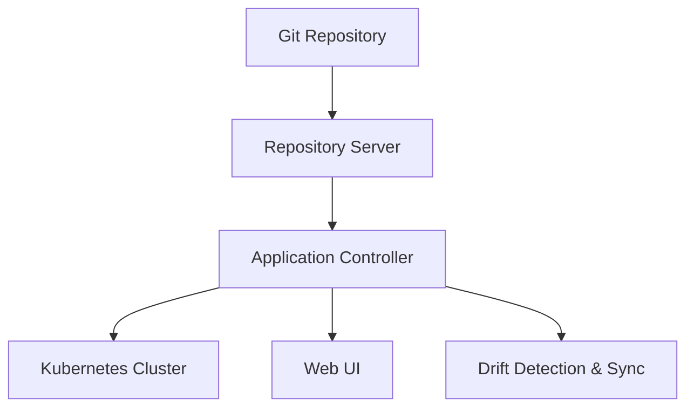

# 🚀 Argo CD

> _📖 GitOps-Based Continuous Delivery for Kubernetes._

**Argo CD** is a declarative, GitOps-centric **continuous delivery tool** designed specifically for **Kubernetes**. It ensures that your cluster’s live state always matches the desired state defined in Git — making deployments **auditable, automated, and scalable**. It’s part of the CNCF Argo project suite, which also includes Argo Workflows, Rollouts, and Events.

---

## 🧠 Architectural Overview

Argo CD follows a **controller-based architecture** with modular components:

| Component                     | Role                                                                |
| ----------------------------- | ------------------------------------------------------------------- |
| 🧑‍💻 **API Server**          | Exposes gRPC/REST APIs for CLI, UI, and CI/CD integrations.         |
| 📚 **Repository Server**      | Caches Git repos and renders manifests (Helm, Kustomize, etc.).     |
| 🔄 **Application Controller** | Continuously compares live vs desired state and triggers syncs.     |
| 🖥️ **Web UI**                 | Visual dashboard for app status, sync, health, and drift detection. |

Argo CD runs **inside your Kubernetes cluster**, and syncs resources based on Git commits — no manual `kubectl` needed.

---

## 📦 Key Features

- 🧬 **GitOps Workflow**: Git is the single source of truth for deployments.
- 🔁 **Auto & Manual Sync**: Choose between automated reconciliation or manual control.
- 🧪 **Drift Detection**: Flags out-of-sync resources and optionally auto-corrects.
- 🧰 **Multi-Repo & Multi-Cluster Support**: Manage apps across clusters and Git sources.
- 🧱 **Templating Support**: Native support for Helm, Kustomize, Jsonnet, and plain YAML.
- 🔐 **RBAC & SSO**: Fine-grained access control with LDAP, OIDC, GitHub, etc.
- 🧩 **Hooks & Lifecycle Events**: PreSync, Sync, PostSync hooks for custom logic.
- 📊 **Health Assessment**: Built-in checks for resource readiness and status.
- 🔄 **Rollback Support**: Revert to previous Git commits with one click.
- 📡 **Webhooks & Notifications**: GitHub, GitLab, Bitbucket integrations + alerting.

---

## 🚀 When to Use Argo CD

Argo CD is ideal for:

- 🧠 **GitOps-first teams** managing Kubernetes at scale.
- 🧰 **Multi-cluster orchestration** with centralized control.
- 🧪 **CI/CD pipelines** that need declarative, auditable deployments.
- 🔐 **Security-conscious environments** with RBAC and SSO.
- 📈 **Progressive delivery** (canary, blue-green) via Argo Rollouts.

It’s especially powerful when paired with **Argo Workflows** for CI and **Argo Events** for event-driven automation.

---

## ⚔️ Argo CD vs Flux: Strategic Comparison

| Feature           | 🚀 **Argo CD**                          | 🌊 **Flux**                                   |
| ----------------- | --------------------------------------- | --------------------------------------------- |
| UI Dashboard      | ✅ Rich Web UI                          | ❌ None (optional via Weave GitOps)           |
| Sync Strategy     | ✅ Manual & Auto                        | ✅ Auto only (reconciliation loop)            |
| Drift Detection   | ✅ Real-time                            | ✅ Periodic                                   |
| Helm Support      | ✅ Native + values override             | ✅ Native via Helm Controller                 |
| Secret Management | 🔶 External plugins (Vault, SOPS)       | ✅ Native SOPS integration                    |
| Rollbacks         | ✅ Built-in                             | 🔁 Manual via Git                             |
| Multi-Tenancy     | ✅ Namespaced App CRDs                  | ✅ Namespaced GitRepo/Kustomization           |
| Extensibility     | ✅ Hooks, plugins                       | ✅ Modular via GitOps Toolkit                 |
| Scalability       | 🔶 Monolithic controller                | ✅ Micro-controller architecture              |
| Resource Usage    | 🔶 Moderate (UI + controller)           | ✅ Lightweight                                |
| GitOps Ecosystem  | Argo CD + Rollouts + Workflows + Events | Flux Core + Flagger + Notification Controller |

**TL;DR**:

- Use **Argo CD** for **visual GitOps**, centralized app management, and onboarding ease.
- Use **Flux** for **lightweight, modular GitOps** with native secret handling and high-scale microservices.

---

## 🗺️ Visual Model (Mermaid-style)

This shows how Argo CD continuously monitors Git, renders manifests, and syncs them to your cluster.

---

## 🧩 Strategic Fit for You, Hady

- 🧠 **Architectural clarity**: Argo CD enforces GitOps principles with visual feedback and lifecycle hooks.
- 📁 **Portfolio-ready**: Showcase multi-cluster GitOps pipelines with rollback, drift detection, and Helm/Kustomize templating.
- 🧪 **Tool benchmarking**: Compare Argo CD vs Flux vs Jenkins X for GitOps CD in your CI/CD matrix.
- 🔐 **Security signaling**: Integrate Vault or SOPS for secrets, and demonstrate RBAC/SSO in onboarding diagrams.
- 📊 **Interview leverage**: Use Argo CD to model app-of-apps patterns, sync waves, and progressive delivery strategies.
