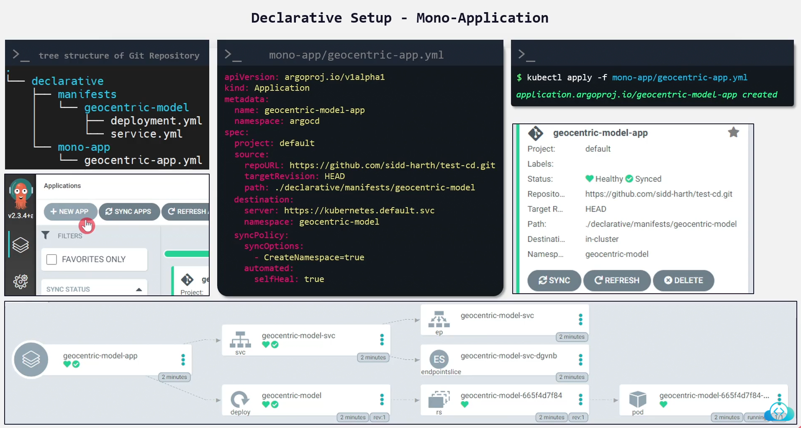
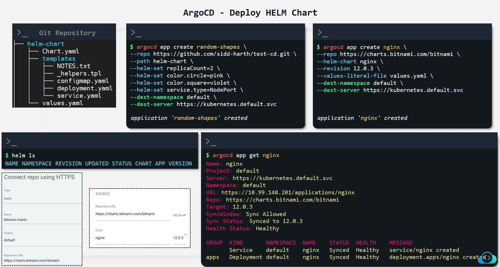

# 🚀 **Declarative Argo CD Application**

Argo CD is built around one core idea:

> **Everything is declarative.**
>
> That means Applications themselves are just **YAML** inside Git — no need to click in the UI.

A **Declarative Application** is an Argo CD `Application` object defined in Git and applied automatically using:

- App-of-Apps pattern
- ApplicationSet
- Argo CD auto-sync
- GitOps bootstrapping

Every environment (dev, stage, prod) pulls Applications from Git and keeps them synced.

---

## manifist

<div align="center" style="background-color:#F2F2F2; border-radius: 10px; border: 2px solid">
  
</div>

## helm

<div align="center" style="background-color:#F2F2F2; border-radius: 10px; border: 2px solid">
  
</div>

---

## 📦 **What Is a Declarative Application?**

A Declarative Argo CD Application is a CRD (`kind: Application`) that tells Argo CD:

1. **Where to fetch configuration from**
   (`repoURL`, `path`, `chart`, `targetRevision`)
2. **How to render it**
   (plain manifests, Kustomize, Helm)
3. **Where to deploy it**
   (`destination: cluster + namespace`)
4. **How to sync it**
   (`syncPolicy`)

All of this in **YAML**, committed to Git.

---

## 🧩 **General Structure of an Argo CD Application**

This is the template shared across all types:

```yaml
apiVersion: argoproj.io/v1alpha1
kind: Application
metadata:
  name: my-app
  namespace: argo-cd
spec:
  project: default

  source:
    repoURL: <GIT or HELM REPO>
    targetRevision: <GIT BRANCH or HELM VERSION>
    path: <PATH INSIDE REPO> # or "chart: <chart-name>"

  destination:
    server: https://kubernetes.default.svc
    namespace: my-namespace

  syncPolicy:
    automated:
      prune: true
      selfHeal: true
    syncOptions:
      - CreateNamespace=true
```

---

## 🟦 **TYPE 1 — Application Using Plain Kubernetes Manifests**

This is the simplest way.
Your Git repo contains YAML files directly:

```ini
repo/
  my-backend/
    deployment.yaml
    service.yaml
    configmap.yaml
```

### 👉 Argo CD Application

```yaml
apiVersion: argoproj.io/v1alpha1
kind: Application
metadata:
  name: my-backend-plain
  namespace: argo-cd
spec:
  project: default

  source:
    repoURL: https://github.com/example/app-configs.git
    path: my-backend
    targetRevision: main # Git branch

  destination:
    server: https://kubernetes.default.svc
    namespace: my-backend

  syncPolicy:
    automated:
      prune: true
      selfHeal: true
```

### ✔ When to use plain manifests?

- Small apps
- No need for templating
- You want full control over YAML
- You dislike Helm/Kustomize

---

## 🟩 **TYPE 2 — Application Using Kustomize**

If your repo uses Kustomize overlays:

```ini
repo/
  my-backend/
    base/
      deployment.yaml
      kustomization.yaml
    overlays/
      dev/
        kustomization.yaml
      prod/
        kustomization.yaml
```

### 👉 Argo CD Application

```yaml
apiVersion: argoproj.io/v1alpha1
kind: Application
metadata:
  name: my-backend-kustomize
  namespace: argo-cd
spec:
  project: default

  source:
    repoURL: https://github.com/example/app-configs.git
    path: my-backend/overlays/prod
    targetRevision: main
    kustomize:
      namePrefix: prod-
      commonLabels:
        env: prod

  destination:
    server: https://kubernetes.default.svc
    namespace: my-backend

  syncPolicy:
    automated:
      prune: true
      selfHeal: true
```

### ✔ When to use Kustomize?

- You want GitOps control layering (base → overlay)
- You want different params per environment
- You prefer pure-K8s approach
- You deploy same app to many envs

---

## 🟥 **TYPE 3 — Application Using Helm (Chart inside your Git repo)**

Your repo contains a Helm chart:

```ini
repo/
  my-backend/
    Chart.yaml
    templates/
    values.yaml
    values-prod.yaml
```

### 👉 Argo CD Application (source = Git repo with a Helm chart)

```yaml
apiVersion: argoproj.io/v1alpha1
kind: Application
metadata:
  name: my-backend-helm
  namespace: argo-cd
spec:
  project: default

  source:
    repoURL: https://github.com/example/backend-helm.git
    targetRevision: main
    path: my-backend # Chart folder in Git
    helm:
      valueFiles:
        - values-prod.yaml
      parameters:
        - name: replicaCount
          value: "3"

  destination:
    server: https://kubernetes.default.svc
    namespace: my-backend

  syncPolicy:
    automated:
      prune: true
      selfHeal: true
```

### ✔ When to use Helm?

- You want templating
- Parameterized deployments
- Shared Helm library charts
- You want clean CI with versioned deployments

---

## 🟧 **TYPE 4 — Application Using Community Helm Repo (Public / Remote Helm Chart)**

Here, you do NOT store Helm charts inside your repo.
Instead you reference external Helm repos like:

- Bitnami
- Prometheus community
- Ingress NGINX
- Argo Workflows

### Example Helm repo:

```ini
repoURL: https://charts.bitnami.com/bitnami
chart: redis
targetRevision: 18.3.2
```

### 👉 Argo CD Application (remote Helm repo)

```yaml
apiVersion: argoproj.io/v1alpha1
kind: Application
metadata:
  name: redis-community
  namespace: argo-cd
spec:
  project: default

  source:
    repoURL: https://charts.bitnami.com/bitnami
    chart: redis
    targetRevision: 18.3.2
    helm:
      parameters:
        - name: replica.replicaCount
          value: "2"

  destination:
    server: https://kubernetes.default.svc
    namespace: redis

  syncPolicy:
    automated:
      prune: true
      selfHeal: true
    syncOptions:
      - CreateNamespace=true
```

### ✔ When to use community Helm repo?

- You want production-grade charts
- You want version-controlled releases
- You don’t want to maintain the chart yourself
- You want fast GitOps deployments via charts like redis/prometheus/nginx

---

## 🟪 **Comparison Summary**

| Type           | What Argo CD Reads          | Best For                       |
| -------------- | --------------------------- | ------------------------------ |
| Plain Manifest | Raw YAML files              | Simple apps, full YAML control |
| Kustomize      | kustomization.yaml overlays | Environments, layering         |
| Helm (Git)     | Chart from your repo        | Custom charts, full control    |
| Community Helm | Chart from public repo      | Standard common infra tools    |

---

## 🟫 Full Visualization

```mermaid
flowchart LR
    A[Argo CD] --> B[Plain YAML Manifests]
    A --> C[Kustomize Overlay]
    A --> D[Helm Chart<br>(in your Git repo)]
    A --> E[Community Helm Chart<br>(remote repo)]
```

Argo CD renders → compares live → syncs → maintains drift.

---

## 🎯 Final Summary

A **Declarative Argo CD Application** is a YAML definition of:

- where to read configuration
- how to render it
- where to deploy it
- how to sync it

Argo CD supports four major declarative styles:

1. **Plain Kubernetes Manifests**
2. **Kustomize**
3. **Helm (Git-based charts)**
4. **Community Helm (external chart repos)**

Each has its strengths depending on your GitOps design.
