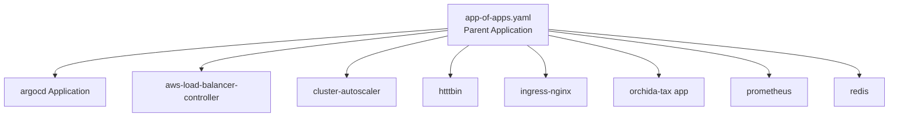

# ✍🏻 **Hands on App-of-Apps — Full Explanation**

You have this folder:

```ini
argocd/
  apps/
    argocd/
    aws-load-balancer-controller/
    cluster-autoscaler/
    httbin/
    ingress-nginx/
    orchida-tax/
    prometheus/
    redis/
  app-of-apps.yaml
```

And your **app-of-apps.yaml** is:

```yaml
apiVersion: argoproj.io/v1alpha1
kind: Application
metadata:
  name: app-of-apps
  namespace: argo-cd
  annotations:
    argocd.argoproj.io/sync-options: Prune=true,CreateNamespace=true
spec:
  project: default
  source:
    repoURL: https://github.com/OrchidaTax/helm-deployments.git
    path: argocd/apps
    targetRevision: main
    directory:
      recurse: true
  destination:
    server: https://kubernetes.default.svc
    namespace: argo-cd
  syncPolicy:
    automated:
      prune: true
      selfHeal: true
    syncOptions:
      - ServerSideApply=true
```

---

## 🧩 **What Your App-of-Apps Does**

Your **app-of-apps** Application points to the folder:

```ini
argocd/apps
```

inside your Git repo.

Inside that folder, each directory contains **one Argo CD Application YAML** (or multiple).

Because you set:

```yaml
directory:
  recurse: true
```

Argo CD will:

1. Scan **all subfolders** inside `argocd/apps`
2. For each folder, find the `Application.yaml` or any YAML containing an Application object
3. Create one Argo CD Application for each component

👍 **This is the classic App-of-Apps pattern.**

Your parent Application is “the root app”.
Your subfolders are “child apps”.

---

## 🌳 **Visual Diagram of Your Setup**



Argo CD syncs `app-of-apps` →  
creates all these child Applications automatically.

---

## ✨ **3. Why It Works — The Key Mechanism**

Argo CD reads your **directory** generator:

```yaml
directory:
  recurse: true
```

This means:

- Go inside the folder
- Look at every `.yaml` file
- If file contains **kind: Application** → create an Application CRD in Argo CD
- Sync those Applications

So every folder like:

```ini
argocd/apps/redis/application.yaml
argocd/apps/ingress-nginx/application.yaml
argocd/apps/cluster-autoscaler/app.yaml
```

becomes a deployed Argo CD Application.

---

## 🧩 **What Each Child App Likely Contains**

For example in:

```ini
argocd/apps/ingress-nginx/application.yaml
```

you likely have:

```yaml
apiVersion: argoproj.io/v1alpha1
kind: Application
metadata:
  name: ingress-nginx
spec:
  source:
    repoURL: https://github.com/OrchidaTax/helm-deployments.git
    path: ingress-nginx
  destination:
    server: https://kubernetes.default.svc
    namespace: ingress-nginx
```

Same pattern applies to:

- cluster-autoscaler
- prometheus
- redis
- httbin
- orchida-tax (your main app)

Each is a **child Application**.

Your parent App automatically manages them.

---

## ⚙️ **What Happens During Sync (Step-by-Step)**

Let's walk through it:

### 🔹 Step 1 — Argo CD syncs `app-of-apps`

- It reads `argocd/apps`
- Finds many Application manifests

### 🔹 Step 2 — It creates child Applications

For each folder:

- cluster-autoscaler → creates one Argo CD Application
- ingress-nginx → created
- redis → created
  … etc.

### 🔹 Step 3 — Each child app gets reconciled

Each Application:

- Pulls its chart from your repo
- Deploys to the cluster
- Self-heals
- Prunes unwanted resources

### 🔹 Step 4 — Parent monitors children

If a child app is deleted in Git → parent will prune it.

🎉 Fully declarative GitOps platform.

---

## ❗ **Important Settings in Your YAML (Explained)**

### ✔ `annotations: Prune=true,CreateNamespace=true`

- Allows Argo CD to prune (delete) and create namespaces automatically.

### ✔ `directory.recurse: true`

- This is **what makes App-of-Apps work**.
- Without this, it won't read child folders.

### ✔ `destination.server: https://kubernetes.default.svc`

- Deploy into **the same cluster** Argo CD is running in.

### ✔ `syncPolicy.automated.prune: true`

- Automatically delete resources removed from Git.

### ✔ `syncPolicy.automated.selfHeal: true`

- Fix drift without manual sync.

### ✔ `syncOptions: ServerSideApply=true`

- Makes large Helm charts more stable and reduces diff noise.

---

## ✨ **Why App-of-Apps Is Perfect for You**

This structure suggests you’re deploying:

- system components (nginx, autoscaler)
- monitoring stack (prometheus)
- databases (redis)
- ingress
- application workloads (orchida-tax)

This pattern gives you:

### ✔ Full GitOps bootstrap

- Create a new cluster and run:

  ```bash
  kubectl apply -f app-of-apps.yaml
  # 🎉 Your entire infra deploys automatically.
  ```

### ✔ Clean separation

- Each component is its own app.

### ✔ Team boundaries

- Platform team manages parent folder.
- Service teams manage service folders.

### ✔ Easy upgrades

- Update one of the child folders → Argo CD self-heals.

### ✔ Universal pattern

- Big companies like Red Hat, Platform Engineering teams, AWS EKS Blueprints all use this pattern.

---

## 🔥 **How Your Repo Actually Works**

Your repo structure:

```ini
argocd/apps/* = child Argo CD Applications
argocd/app-of-apps.yaml = parent Argo CD Application
```

Your parent app:

- Points to folder of child apps
- Reads all YAMLs recursively
- Creates Applications automatically
- Manages the entire GitOps platform

Your children:

- Deploy actual workloads into namespaces
- Handle their own sync, diff, drift, rollback, etc.

---

## 🎯 **Short Interview-Ready Explanation**

**The App-of-Apps pattern allows you to manage the entire cluster state from a single Git Application.  
My parent Application points to a folder that contains many child Application manifests.  
Argo CD reads them recursively and creates each child Application automatically.  
Each child app deploys a specific platform component.  
This gives full cluster bootstrapping, modular GitOps, and environment-as-code.**
