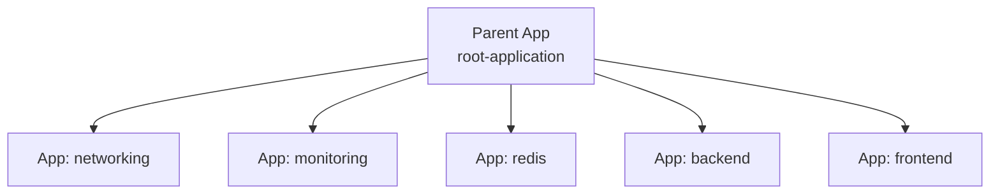

# Make argocd create argocd application automated (self managed)
Below is a **clear, structured, interview-ready, production-grade topic** explaining **App of Apps pattern in Argo CD**.
This is one of the most important Argo CD concepts — especially for real GitOps platforms, enterprise multi-team setups, and multi-cluster deployments.

---

# 🚀 **Argo CD “App of Apps” Pattern — Full Explanation**

The **App of Apps** pattern is a GitOps design where **one Argo CD Application manages many other Applications**.

Think of it as:

> **A parent application that creates and manages child applications — all driven from Git.**

This is the foundational pattern for:

* Multi-environment GitOps
* Multi-cluster GitOps
* Platform engineering
* Environment bootstrapping
* Fully declarative Argo CD configuration

Let’s break it down.

---

# 🧠 **1. Why App of Apps Exists**

Without the App of Apps pattern, you would need to manually create:

* app-dev.yaml
* app-stage.yaml
* app-prod.yaml
* app-monitoring.yaml
* app-networking.yaml
* app-ingress.yaml
* app-databases.yaml
* app-backend.yaml
* app-frontend.yaml

…hundreds of Application files
…manually applied to Argo CD.

This doesn't scale.

**App of Apps solves this by letting one parent app manage everything else.**

---

# 🌳 **2. What App of Apps Actually Means**

It simply means:

➡️ The parent Argo CD Application points to a **Git directory**
➡️ That directory contains **child Application YAML files**
➡️ Argo CD applies those child Applications
➡️ Each child Application then deploys its own app

### Visualized:



---

# 📦 **3. App of Apps Directory Structure Example**

```text
environments/
  prod/
    apps/
      ingress.yaml
      cert-manager.yaml
      monitoring.yaml
      backend.yaml
      frontend.yaml
  dev/
    apps/
      redis.yaml
      backend.yaml
      frontend.yaml
```

Each file above is **a full Argo CD Application object**.

---

# 🟦 **4. The Parent Application**

A simple example of the parent App:

```yaml
apiVersion: argoproj.io/v1alpha1
kind: Application
metadata:
  name: platform-root
spec:
  project: default
  source:
    repoURL: https://github.com/company/platform-config
    path: environments/prod/apps   # 🔥 contains all child apps
    targetRevision: main
  destination:
    server: https://kubernetes.default.svc
    namespace: argocd
  syncPolicy:
    automated:
      prune: true
      selfHeal: true
```

This parent app does **not** deploy workloads directly.
It only deploys **child Applications**.

---

# 🟥 **5. Child Application Example**

Inside `environments/prod/apps/backend.yaml`:

```yaml
apiVersion: argoproj.io/v1alpha1
kind: Application
metadata:
  name: backend
spec:
  project: default
  source:
    repoURL: https://github.com/company/backend
    path: k8s/overlays/prod
    targetRevision: main
  destination:
    server: https://prod.eks.amazonaws.com
    namespace: backend
  syncPolicy:
    automated:
      prune: true
      selfHeal: true
```

Argo CD will:

* Sync the parent → create `backend` Application
* Then sync the child → deploy actual backend resources

---

# 🧨 **6. Why App of Apps Is Amazing**

### ✔ Declarative bootstrapping

You can bootstrap a new cluster by applying **one** Application:

```bash
kubectl apply -f platform-root.yaml
```

Argo CD does the rest:

* Installs ingress
* Installs monitoring
* Installs apps
* Installs security stack
* Installs platform tools

### ✔ GitOps for Argo CD itself

Even the Applications in Argo CD are managed by Git.
No UI-clicking.

### ✔ Modular + Scalable

Each component is its own Application = perfect isolation.

### ✔ Environment separation

dev, stage, prod → each has its own root application.

### ✔ Team separation

each team owns their Application
platform team owns the parent folder.

---

# 🟩 **7. App of Apps + Multi-Cluster**

Very common real-world pattern:

```
cluster-bootstrap/
  dev/
    apps/*.yaml
  stage/
    apps/*.yaml
  prod/
    apps/*.yaml
```

Each cluster has a root app using its own folder.
This is used heavily in:

* multi-cluster EKS platforms
* multi-team Kubernetes environments
* platform engineering "Golden Path" setups

---

# 🧪 **8. App of Apps + ApplicationSet**

You can combine both patterns:

**Parent Application** → manages an **ApplicationSet** → generates **many Applications**

Example structure:

```text
platform/
  apps/
    applicationset.yaml
    networking/
    monitoring/
    redis/
    backend/
    frontend/
```

This is great when you want:

* Many microservices
* Many clusters
* Dynamic environment injection
* Auto-scaling deployments

---

# 🧠 **9. Common Pitfalls (And How to Avoid)**

### ❌ Pitfall: Argo CD out-of-sync when child apps change

**Fix:** Always manage child Apps in Git, not manually.

### ❌ Pitfall: Parent app overwrites manually edited children

**Fix:** Never modify Application CRs directly after sync.

### ❌ Pitfall: Using same namespace for parent and child apps

**Fix:** Put parent apps in `argocd` namespace
(other apps in their own namespaces)

### ❌ Pitfall: Child apps pointing to the same folder as the parent

**Fix:** Ensure each child points to **its own repo path**.

---

# 🎯 **10. Summary (Super Clean)**

### ✔ **App of Apps = One application that manages many other applications**

### ✔ Parent app points to a directory of Application YAMLs

### ✔ Child applications each deploy a specific microservice or stack

### ✔ Used for large-scale GitOps platforms

### ✔ Crucial for multi-cluster and environment bootstrapping

### ✔ Fully declarative cluster/platform configuration

### ✔ Combine with ApplicationSet for dynamic scalable GitOps

---

If you want next, I can create:

🔥 A full **App of Apps + ApplicationSet** combined architecture
🔥 A multi-cluster real repo layout
🔥 A full parent+child YAML repo
🔥 An interview-ready explanation you can say verbatim

Just tell me!
