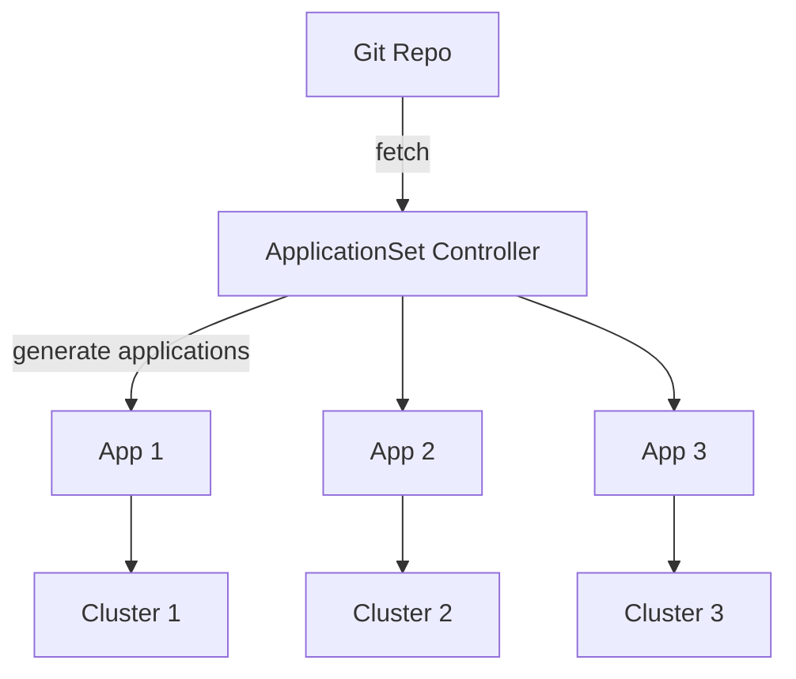

# 🪄 **Argo CD ApplicationSet**

Argo CD gives you a **GitOps controller**, but ApplicationSet gives you a **GitOps automation engine**.

With ApplicationSet, you can automatically create, update, and manage **many Argo CD Applications** from a single template.

---

## 📖 **What is ApplicationSet? (Simple Explanation)**

**ApplicationSet** is an Argo CD controller that generates **Argo CD Application objects** dynamically using:

- lists
- cluster labels
- directories
- git files
- pull requests
- Helm charts
- or any external data source

Instead of writing **many Applications**, you write **one ApplicationSet** that produces them automatically.

---

## 🎯 **Why ApplicationSet Exists**

Without ApplicationSet, you must manually create one Application per environment:

```ini
my-app-dev.yaml
my-app-staging.yaml
my-app-prod.yaml
```

Maintaining many apps becomes painful, repetitive, error-prone.

**ApplicationSet solves this by templating the Application.**

One template → many Applications.

---

## ✔ **What ApplicationSet Actually Does**

It continuously:

- **discovers inputs** (clusters, folders, lists, etc.)
- **generates Applications**
- **syncs differences**
- **self-heals missing apps**
- **updates apps when templates change**

It is literally a factory for Applications.

---

## 📦 **ApplicationSet Structure**

Every ApplicationSet consists of **two main sections**:

---

### 🟨 A. **Generators**

Generators define _how to produce the list_ of desired applications.

Examples:

<div align="center" style="background-color: #141a19ff;color: #a8a5a5ff; border-radius: 10px; border: 2px solid">

| Generator       | What It Does                  |
| --------------- | ----------------------------- |
| **list**        | explicit list of environments |
| **clusters**    | one app per cluster           |
| **git**         | one app per directory/file    |
| **matrix**      | combine multiple generators   |
| **scmProvider** | apps per GitHub PR / branch   |
| **directory**   | apps per subfolder            |

</div>

---

### 🟦 B. **Template**

Defines the **Application** object to be generated.

It includes:

- destination cluster
- namespace
- repo path
- Helm values
- syncPolicy
- project

---

## 🧩 **ApplicationSet Example**

```yaml
apiVersion: argoproj.io/v1alpha1
kind: ApplicationSet
metadata:
  name: example-appset
spec:
  generators:
    - list:
        elements:
          - env: dev
          - env: prod
  template:
    metadata:
      name: my-app-{{env}}
    spec:
      source:
        repoURL: https://github.com/myorg/app
        path: overlays/{{env}}
      destination:
        server: https://cluster.example.com
        namespace: my-app
      project: default
```

This generates two Applications:

- `my-app-dev`
- `my-app-prod`

---

## 🔥 **ApplicationSet Generators (Deep Breakdown)**

Let’s go through each commonly used generator.

---

### 🔹 **1. List Generator (explicit list)**

Best when each environment has unique values.

Example:

```yaml
generators:
  - list:
      elements:
        - name: redis-dev
          valuesFile: values-dev.yaml
          cluster: dev-api
        - name: redis-prod
          valuesFile: values-prod.yaml
          cluster: prod-api
```

You manually specify everything.

📌 **Most predictable and explicit generator.**

---

### 🔹 **2. Clusters Generator (one app per cluster)**

Deploys apps to multiple clusters based on labels.

Example:

```yaml
generators:
  - clusters:
      selector:
        matchLabels:
          env: dev
```

This automatically generates an Application per cluster with `env=dev`.

📌 **Best for multi-cluster GitOps.**

---

### 🔹 **3. Git Generator (one app per directory)**

Used when repo has many folders, each representing a component.

Example:

```yaml
generators:
  - git:
      repoURL: https://github.com/myorg/platform
      directories:
        - path: services/*
```

Generates one Application per service folder:

- services/user
- services/order
- services/payments

📌 **Best for microservices.**

---

### 🔹 **4. SCM Provider Generator**

Creates an app per GitHub branch, PR, etc.

Example:

```yaml
generators:
  - scmProvider:
      github:
        owner: myorg
        repo: myrepo
        tokenRef:
          key: token
```

Use case: **Preview Environments** per pull request.

---

### 🔹 **5. Matrix Generator (combine two generators)**

Example: generate for each _service_ × each _environment_.

```yaml
generators:
  - matrix:
      generators:
        - git:
            directories:
              - path: services/*
        - list:
            elements:
              - env: dev
              - env: prod
```

Creates:

- service A dev
- service A prod
- service B dev
- service B prod

📌 **Best for complex multi-service multi-env platforms.**

---

## 🟩 **Full ApplicationSet Example (Production Use Case)**

**Multi-cluster + Helm values per environment:**

```yaml
apiVersion: argoproj.io/v1alpha1
kind: ApplicationSet
metadata:
  name: redis-multicluster
spec:
  generators:
    - list:
        elements:
          - name: redis-dev
            namespace: orchida-tax-dev
            valuesFile: infra/redis/values-dev.yaml
            cluster: https://orchida-tax-dev.eks.us-east-1.amazonaws.com

          - name: redis-prod
            namespace: orchida-tax-production
            valuesFile: infra/redis/values-prod.yaml
            cluster: https://orchida-tax-production.eks.us-east-1.amazonaws.com

  template:
    metadata:
      name: "{{name}}"
    spec:
      project: default
      source:
        repoURL: https://github.com/company/platform-config
        targetRevision: main
        path: infra/redis
        helm:
          valueFiles:
            - "{{valuesFile}}"
      destination:
        server: "{{cluster}}"
        namespace: "{{namespace}}"
      syncPolicy:
        automated:
          prune: true
          selfHeal: true
        syncOptions:
          - CreateNamespace=true
```

This creates:

- **redis-dev** in the dev cluster
- **redis-prod** in the prod cluster

Each with its own values file and namespace.

---

## 🎨 **Visual Diagram — How ApplicationSet Works**

<div align="center" style="background-color: #141a19ff;color: #a8a5a5ff; border-radius: 10px; border: 2px solid">



</div>

---

## 🔍 **Why ApplicationSet is Essential in GitOps**

<div align="center" style="background-color: #141a19ff;color: #a8a5a5ff; border-radius: 10px; border: 2px solid">

| Feature                       | Application   | ApplicationSet |
| ----------------------------- | ------------- | -------------- |
| Single deployment             | ✔             | ✔              |
| Multiple clusters             | ⚠️ Manual     | ✔ Automated    |
| Per-env values                | ⚠️ Many files | ✔ Templated    |
| Multi-service platform        | ❌ Hard       | ✔ Easy         |
| Dynamic cluster discovery     | ❌            | ✔              |
| PR preview environments       | ❌            | ✔              |
| Self-heal Application objects | ❌            | ✔              |

</div>

---

ApplicationSet is **a scaling layer** on top of Application.

---

## 🧨 **The Biggest Real-World Use Cases**

### 1️⃣ Multi-cluster deployment

(dev → stage → prod; multi-region; multi-cloud)

### 2️⃣ Microservices platform

(1 service = 1 Application)

### 3️⃣ Preview environments

(1 PR = 1 Application)

### 4️⃣ Shared components deployed to all clusters

(Nginx ingress, Prometheus, Falco, Datadog, etc.)

### 5️⃣ App-per-directory deployments

(50+ microservices in a repo)

### 6️⃣ App-per-customer SaaS

(1 cluster per customer)

---

## 🟦 **11. Best Practices**

- ✔ Use **list generator** when environments differ greatly
- ✔ Use **clusters generator** for auto-deploy-everywhere behavior
- ✔ Use **git generator** for microservices
- ✔ Use **matrix generator** when envs × services multiply
- ✔ Keep templates simple
- ✔ Avoid embedding secrets
- ✔ Separate ApplicationSets by team or domain
- ✔ Always enable `CreateNamespace=true` for multi-cluster

---

## 🟢 **Final Summary**

### 🎯 **ApplicationSet = GitOps automation for large-scale Argo CD deployments**

It lets you:

- deploy the same app to many clusters
- deploy many apps from folders
- deploy apps dynamically based on Git branches
- deploy app versions based on cluster labels
- generate hundreds of Applications from one YAML

**One template → many Applications → fully automated GitOps.**
