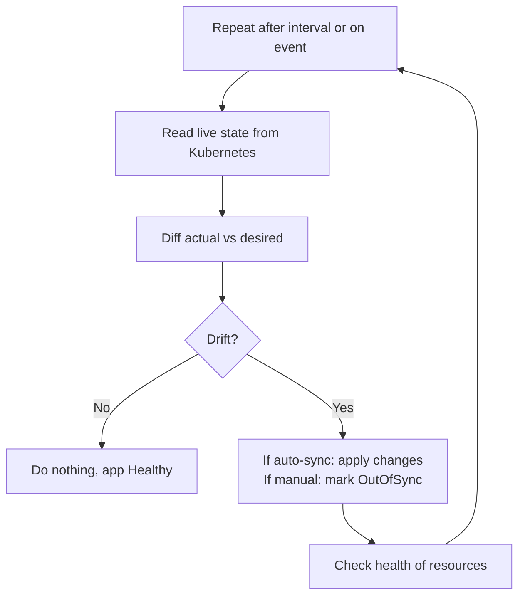
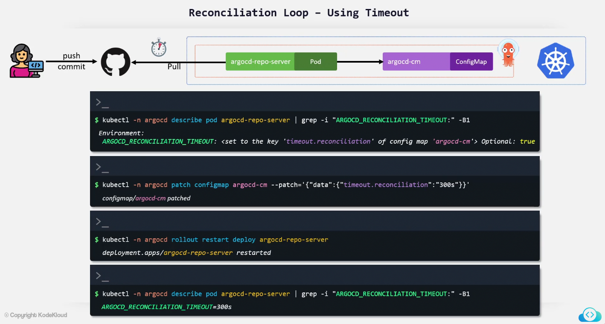
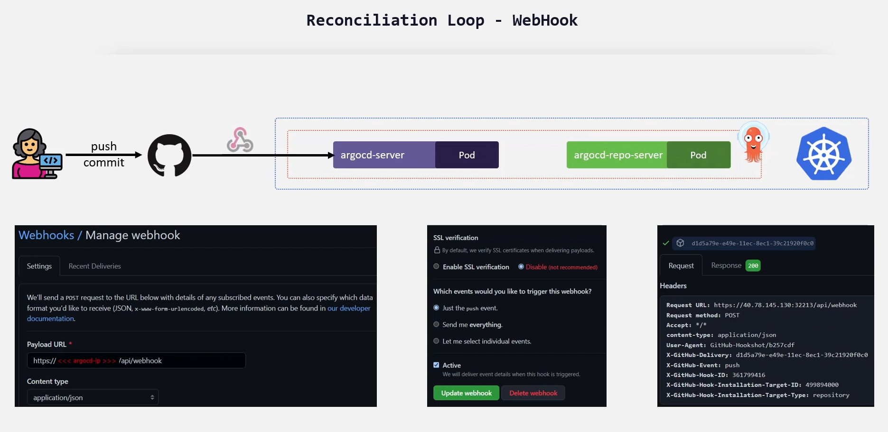
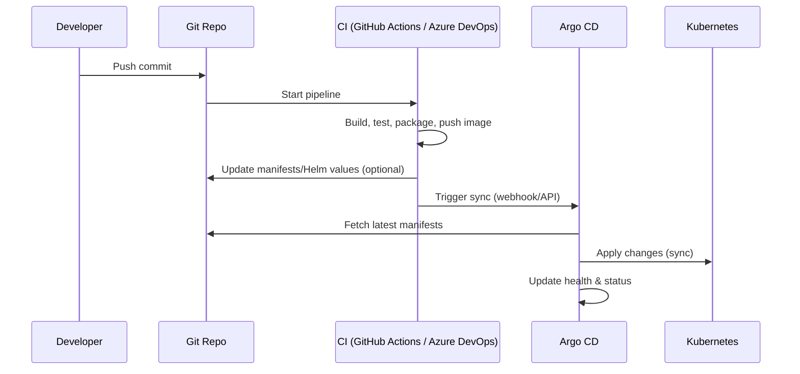

# ⏳ Reconciliation Loop

Reconciliation in Argo CD is basically:

> “Keep the **cluster** always matching **Git** – either by checking every X seconds (timeouts / polling) or by reacting immediately when something changes (webhooks / events).”

Let’s break it down in three parts:

1. 🧠 What the **reconciliation loop** is
2. ⏱ How it works with **timeouts / periodic polling**
3. 🌐 How to make it **event-driven with webhooks**, with concrete examples for **GitHub Actions** and **Azure DevOps**

---

## 📖 **What Is the Reconciliation Loop in Argo CD?**

Argo CD continuously runs a **control loop** per Application:

<div align="center" style="background-color: #141a19ff;color: #a8a5a5ff; border-radius: 10px; border: 2px solid">



</div>

---

For each Application:

1. **Desired state** = manifests/Helm/kustomize in Git (`spec.source`)
2. **Live state** = Kubernetes objects in the target cluster (`spec.destination`)
3. Argo CD diffs them
4. If they differ:

   - With **auto-sync** → Argo CD applies changes (sync)
   - With **manual sync** → Argo CD marks app as `OutOfSync` and waits

The question is **when** Argo CD repeats this loop:

- On a **timer** (timeouts / periodic reconciliation)
- On **events** (webhooks, `argocd app sync` from CI, etc.)

---

## ⏰ **Reconciliation Using Timeouts** (Periodic Polling)

<div align="center" style="background-color:#F2F2F2; border-radius: 10px; border: 2px solid">
  
</div>

---

By default, the **application-controller** periodically refreshes each Application.

- It re-fetches Git
- It re-reads Kubernetes
- It recomputes diff & health

### ⏱ Resync / Reconciliation Interval

There is a **resync interval** (often ~3 minutes by default) set on the application-controller, e.g.:

- Flag: `--app-resync 180`
- Or via Helm chart values (`controller.appResyncPeriod`)

That means:

> “Every 180 seconds, re-run the reconciliation loop for each app, even if no webhook fired.”

So even if nobody triggers anything, Argo CD will eventually:

- notice changes in Git
- notice changes in live cluster (manual `kubectl apply` drift)

### 🧪 Example: Shorter Reconciliation Interval

Controller deployment (conceptually):

```yaml
apiVersion: apps/v1
kind: Deployment
metadata:
  name: argocd-application-controller
spec:
  template:
    spec:
      containers:
        - name: argocd-application-controller
          image: argoproj/argocd
          args:
            - argocd-application-controller
            - --app-resync=60 # 🔁 re-check apps every 60 seconds
```

Effect:

- Every **60s**, controller runs the reconciliation loop
- If auto-sync is enabled for an app, changes from Git will be applied within ~60 seconds, even without webhooks

### 🕒 Operation Timeouts

There are also **per sync operation** timeouts (how long Argo CD waits for resources to become Healthy), e.g. via CLI:

```bash
argocd app sync my-app --timeout 600   # wait max 10 minutes
```

That controls the **max duration of one sync**, not the reconciliation interval itself.

---

## ⚡ **Reconciliation Using Webhooks** (Event-Driven)

<div align="center" style="background-color:#F2F2F2; border-radius: 10px; border: 2px solid">
  
</div>

Timeouts (polling) are fine, but they introduce **latency**:

- commit → wait up to N seconds until next reconciliation
- or manual drift → fixed only when controller checks again

To make this **instant**, you use **webhooks** or CI/CD calls:

> Something (Git provider / pipeline) notifies Argo CD **immediately** after a change.

There are two main patterns:

1. **Git provider webhooks → Argo CD `/api/webhook`**
2. **CI pipeline (GitHub Actions / Azure DevOps) → Argo CD API or CLI**

Let’s focus on what you asked:
**Webhooks & implementations for GitHub Actions and Azure DevOps.**

---

### 🕸️ High-Level Event-Driven Flow

<div align="center" style="background-color: #141a19ff;color: #a8a5a5ff; border-radius: 10px; border: 2px solid">



</div>

---

Key point:  
**CI (or Git’s webhook) tells Argo CD “something changed, sync now”, instead of waiting for timeout.**

---

### ✍🏻 Example: GitHub Actions → Argo CD (Webhook via API)

#### 🔐 Prerequisites

1. Expose Argo CD externally (Ingress or LoadBalancer), e.g.
   `https://argocd.mydomain.com`
2. Create an Argo CD user/API token:

   ```bash
   argocd account generate-token --account cicd > token.txt
   ```

3. Store token in GitHub repository secrets as `ARGOCD_TOKEN`
4. Decide the app name in Argo CD, e.g. `orchida-tax`

#### 🧾 GitHub Actions Workflow Example

```yaml
name: Build and Deploy via Argo CD

on:
  push:
    branches: [main]

jobs:
  build-and-deploy:
    runs-on: ubuntu-latest

    steps:
      - name: Checkout
        uses: actions/checkout@v4

      # ... your build / test / docker push steps here ...

      - name: Trigger Argo CD Sync
        env:
          ARGOCD_SERVER: argocd.mydomain.com
          ARGOCD_TOKEN: ${{ secrets.ARGOCD_TOKEN }}
          APP_NAME: orchida-tax
        run: |
          # Option 1: Use API directly
          curl -k \
            -H "Authorization: Bearer $ARGOCD_TOKEN" \
            -H "Content-Type: application/json" \
            -X POST \
            https://$ARGOCD_SERVER/api/v1/applications/$APP_NAME/sync \
            -d '{"prune":true,"dryRun":false,"strategy":{"hook":{}}}'
```

What this does:

- After CI is **successful**, it explicitly tells Argo CD:

  > “Sync Application `orchida-tax` **now**.”

- Argo CD:

  - Pulls latest Git revision
  - Runs reconciliation loop immediately
  - Applies changes to Kubernetes (because auto-sync OR explicit sync via API)

You can also instead call `/api/webhook` with repo info, but using `/applications/<name>/sync` is very explicit and easy to control.

---

### ✍🏻 Example: Azure DevOps → Argo CD (Webhook via API)

#### 🔐 Prerequisites (similar)

1. Argo CD exposed: `https://argocd.mydomain.com`
2. Argo CD API token, stored as Azure DevOps secret: `ARGOCD_TOKEN`
3. Variable `ARGOCD_SERVER` defined in variable group or pipeline

#### 🧾 Azure DevOps YAML Pipeline Example

```yaml
trigger:
  branches:
    include:
      - main

pool:
  vmImage: ubuntu-latest

variables:
  APP_NAME: orchida-tax

steps:
  - checkout: self

  # ... your build/test/docker push tasks here ...

  - script: |
      echo "Triggering Argo CD sync for $(APP_NAME)"
      curl -k \
        -H "Authorization: Bearer $(ARGOCD_TOKEN)" \
        -H "Content-Type: application/json" \
        -X POST \
        https://$(ARGOCD_SERVER)/api/v1/applications/$(APP_NAME)/sync \
        -d '{"prune":true,"dryRun":false,"strategy":{"hook":{}}}'
    displayName: "Trigger Argo CD Sync"
```

Now:

- When a commit is pushed to `main`, pipeline runs.
- After build/test succeeds, pipeline **calls Argo CD** to sync.
- No waiting for reconciliation timeout.

---

### ✍🏻 Alternative: Direct Git Webhooks (No CI)

Instead of CI calling Argo CD, you can let the **Git provider itself** send webhooks to Argo CD:

- GitHub/GitLab/Bitbucket/Azure Repos → webhook URL:
  `https://argocd.mydomain.com/api/webhook`

Argo CD parses the payload, finds apps whose `spec.source.repoURL` matches, and refreshes them. Then the reconciliation loop runs immediately.

This is good when:

- You don’t need builds/tests
- Git commit itself is the deploy trigger

But in most real-world setups you **want CI to succeed first**, which is why the **“CI calls Argo CD API”** pattern is extremely common.

---

## ⚔️ **Timeouts vs Webhooks**

### ⏰ **Timeouts / Polling**

- Controlled by controller’s resync interval (`--app-resync`)
- Argo CD periodically checks Git + cluster
- Good safety net, catches:

  - out-of-band changes in cluster
  - changes in Git even if webhooks fail

Downside: **latency** (you wait up to N seconds).

---

### ⚡ **Webhooks / Event-Driven**

Two main flavors:

1. **Git/SCM webhooks** → Argo CD `/api/webhook`
2. **CI webhooks (GitHub Actions / Azure DevOps)** → Argo CD `/api/v1/applications/<name>/sync`

Pros:

- Near **instant** reconciliation
- Can ensure **“deploy only after CI success”**
- Very natural fit for GitHub Actions & Azure DevOps

Best practice is usually:

> Use **event-driven sync via CI / webhooks** > **Keep periodic reconciliation enabled** as a fallback and drift detector.

---

## 🔚 **Summary**

- Reconciliation loop = Argo CD repeatedly comparing Git vs cluster and syncing.
- **Timeouts** = periodic resync every N seconds (polling).
- **Webhooks** = event-driven sync; Git/CI tells Argo CD to reconcile immediately.
- With **GitHub Actions** or **Azure DevOps**, you typically:

  - Build and test
  - Then call Argo CD API (`/applications/<app>/sync`) from the pipeline
  - So Argo CD reconciles immediately, not waiting for the timeout.
