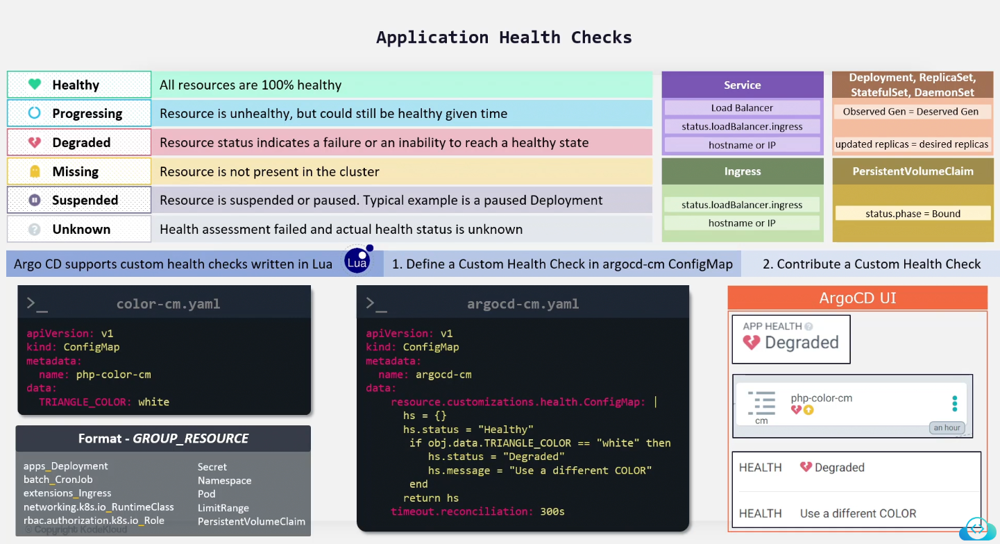
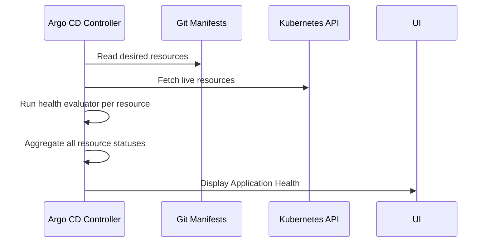

# 🚀 **Argo CD Application Health Checks — Full Topic**

Health in Argo CD answers a simple question:

> **“Is the resource healthy and operational?”**

Every Application in Argo CD has an aggregated health status based on all the Kubernetes resources it manages.

---

<div align="center" style="background-color:#F2F2F2; border-radius: 10px; border: 2px solid">
  
</div>

---

## 🎭 **Argo CD Health Status Types**

Argo CD defines **six** primary health statuses for resources and Applications.

<div align="center" style="background-color: #141a19ff;color: #a8a5a5ff; border-radius: 10px; border: 2px solid">

| Health Status   | Meaning                                                                                                           |
| --------------- | ----------------------------------------------------------------------------------------------------------------- |
| **Healthy**     | Resource is fully operational (Deployment rolled out, pods running, service available)                            |
| **Progressing** | Resource is in the process of becoming healthy (Deployment updating pods, Job running, StatefulSet creating PVCs) |
| **Degraded**    | Resource is in a bad state (pod crashloop, deployment rollback, failing probes, job failed)                       |
| **Missing**     | Resource defined in Git but not found in the cluster                                                              |
| **Suspended**   | Resource intentionally paused (CronJob suspended, Argo Rollout paused)                                            |
| **Unknown**     | Argo CD cannot determine status (CRD not recognized, missing health script)                                       |

</div>

---

## ⚙️ **How Argo CD Performs Health Checks (Internals)**

Argo CD has **per-resource health evaluators** that run on every reconciliation loop.

The evaluation happens like this:

<div align="center" style="background-color: #141a19ff;color: #a8a5a5ff; border-radius: 10px; border: 2px solid">



</div>

---

For each resource:

1. ArgoCD reads live resource status from Kubernetes
2. It checks the resource’s **kind**
3. It picks the health script for that resource
4. It evaluates readiness/conditions
5. The final health is aggregated to Application-level health

---

## 🟩 **Built-In Health Check Logic for Kubernetes Resources**

Argo CD has built-in health checks for the most common Kubernetes types.

### ✔ **Deployments**

Healthy when:

- `.status.updatedReplicas == .spec.replicas`
- `.status.availableReplicas == .spec.replicas`
- No condition `Progressing: False` with “timed out”

Progressing when:

- Pods are being rolled out

Degraded when:

- Pods crashloop
- Deployment timed out during rollout

---

### ✔ **StatefulSets**

Healthy when:

- `.status.readyReplicas == .spec.replicas`

Progressing when:

- PVCs provisioning
- Pods starting

Degraded when:

- Pod errors
- VolumeAttach errors

---

### ✔ **DaemonSets**

Healthy when:

- `.status.numberAvailable == .status.desiredNumberScheduled`

---

### ✔ **Jobs**

Healthy when:

- `status.succeeded >= 1`

Degraded when:

- `status.failed > 0` AND `.spec.backoffLimit` reached

---

### ✔ **Pods**

Healthy when:

- All containers are Running
- Readiness probes pass

Progressing when:

- Pulling images
- Init containers running

Degraded when:

- CrashLoopBackOff
- PodScheduled=False
- OutOfmemory, Node errors

---

### ✔ **Services**

Healthy = Always healthy
(Services cannot really be unhealthy themselves)

---

### ✔ **Ingress**

Healthy when:

- `.status.loadBalancer.ingress` exists

---

### ✔ **Custom Resources**

If Argo CD knows the CRD, it has built-in scripts (e.g., Argo Rollouts).

If not → Health = **Unknown**
(You must create a custom health check.)

---

## 🟪 **Application-Level Health Evaluation**

Application health is computed like this:

### ✔ **Healthy**

All child resources are:

- Healthy OR
- Ignored

### ✔ **Progressing**

At least one resource is still Progressing

### ✔ **Degraded**

Any resource is:

- Degraded
- Missing
- Failed

### ✔ **Unknown**

One or more resources have unknown health, and none are degraded

---

## 🟧 **When You Need Custom Health Checks**

You need custom checks when:

- You deploy **CRDs** that Argo CD doesn’t know about
- You want more accurate health conditions
- You want to treat certain warnings as degraded
- You want to evaluate the status of:

  - Operators (e.g., Istio Operator, Cert-Manager)
  - CRDs like:

    - Kafka (Strimzi)
    - MongoDB (Atlas Operator)
    - Redis Operator
    - Flux CRDs

  - Custom internal resources

By default → all unknown CRDs → health = **Unknown**

---

## 🟨 **How to Create Custom Health Checks in Argo CD**

You define custom health checks using the ConfigMap:

```ini
argocd-cm
```

with a key:

```ini
resource.customizations.health.<group>/<Kind>: |
```

Inside you write `Lua scripts` to evaluate `.status`.

---

### ✔ Example 1 — Custom Health Check for RedisCluster (CRD)

```yaml
apiVersion: v1
kind: ConfigMap
metadata:
  name: argocd-cm
  namespace: argo-cd
data:
  resource.customizations.health.redis.rediscluster: |
    hs = {}
    if obj.status == nil then
      hs.status = "Progressing"
      hs.message = "Waiting for status..."
    elseif obj.status.phase == "Running" then
      hs.status = "Healthy"
      hs.message = "Redis cluster is running"
    elseif obj.status.phase == "Failed" then
      hs.status = "Degraded"
      hs.message = "Redis cluster failed"
    else
      hs.status = "Progressing"
      hs.message = "Current state: " .. obj.status.phase
    end
    return hs
```

After applying:

```bash
kubectl apply -f argocd-cm.yaml
```

Argo CD will show RedisCluster health properly.

---

### ✔ Example 2 — Custom Health Check for CertManager Certificate

```yaml
data:
  resource.customizations.health.cert-manager.io/Certificate: |
    hs = {}
    if obj.status ~= nil and obj.status.conditions ~= nil then
      for _, cond in ipairs(obj.status.conditions) do
        if cond.type == "Ready" and cond.status == "True" then
          hs.status = "Healthy"
          hs.message = "Certificate is ready"
          return hs
        end
      end
      hs.status = "Progressing"
      hs.message = "Waiting for certificate"
      return hs
    else
      hs.status = "Progressing"
      hs.message = "No status yet"
      return hs
    end
```

---

### ✔ Example 3 — Custom Health Check for a Custom Internal Resource

Say you have a CRD:

```ini
spec:
  state: "Processing" | "Ready" | "Error"
```

Custom health check:

```yaml
data:
  resource.customizations.health.example.com/MyResource: |
    hs = {}
    if obj.status == nil then
      hs.status = "Progressing"
    elseif obj.status.state == "Ready" then
      hs.status = "Healthy"
    elseif obj.status.state == "Error" then
      hs.status = "Degraded"
    else
      hs.status = "Progressing"
    end
    return hs
```

---

## 🟥 **Valid Health Status Strings in Custom Checks**

Your script must return one of these:

```ini
Healthy
Progressing
Degraded
Suspended
Missing
Unknown
```

---

## 🟫 **Debugging Health Checks**

Useful commands:

Check raw resource status:

```bash
kubectl get <kind> <name> -o yaml
```

Check application health:

```bash
argocd app get <appname>
```

Check controller logs:

```bash
kubectl logs deploy/argocd-application-controller -n argo-cd
```

---

## 🟩 **Summary**

### ✔ Argo CD health = readiness evaluation of Kubernetes resources

### ✔ Built-in health evaluators exist for:

- Deployments
- StatefulSets
- DaemonSets
- Jobs
- Pods
- Ingress
- Argo Rollouts

### ✔ Custom CRDs = health = Unknown

→ must create custom Lua health script

### ✔ Custom health checks are written in:

```ini
resource.customizations.health.<group>/<Kind>
```

### ✔ Application health = aggregated health of all resources

---

If you want, I can generate:

🔥 A full **argocd-cm.yaml** containing multiple custom health checks
🔥 A diagram showing the entire health evaluation lifecycle
🔥 A cheat sheet of all built-in Argo CD health scripts
🔥 A **before vs after** example showing how health changes with custom logic

Just tell me!
