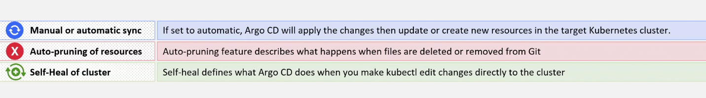

# 🔄️ **Synchronization in Argo CD**

## 🟦 1. **SYNC MODES** (Application-level)

These define **when** Argo CD applies changes.

<div align="center" style="background-color:#F2F2F2; border-radius: 10px; border: 2px solid">
  
</div>

### 1️⃣ Manual Sync (default)

You must run:

```bash
argocd app sync APP
```

### 2️⃣ Automatic Sync

Argo CD syncs whenever Git changes.

```yaml
syncPolicy:
  automated:
    prune: true
    selfHeal: true
```

- `prune=true` → delete resources removed from Git
- `selfHeal=true` → fix drift automatically

✔ Application-level ONLY
✔ Not used as annotations

---

## 🟩 2. **SYNC STRATEGIES** (Application-level)

These define **how** Argo CD applies manifests.

### 1️⃣ **Apply** (default)

- `kubectl apply`
- Merge changes into existing resources.

### 2️⃣ **Replace**

```yaml
syncOptions:
  - Replace=true
```

Deletes and recreates resources.

⚠ Use with caution — downtime for Deployments.

### 3️⃣ **Hooks**

Special workloads that run before/after sync.

Resource annotations:

```yaml
metadata:
  annotations:
    argocd.argoproj.io/hook: PreSync|Sync|PostSync|SyncFail
```

✔ Resource-level
✔ Triggers custom sync behavior

---

## 🟨 3. **SYNC OPTIONS** (Application-level)

These are modifiers that change sync behavior.

Inside:

```yaml
syncPolicy:
  syncOptions:
    - OPTION
```

### Available Options:

| Sync Option                                | Scope             | Meaning                                   |
| ------------------------------------------ | ----------------- | ----------------------------------------- |
| `CreateNamespace=true`                     | Application-level | Auto create missing namespace             |
| `Validate=false`                           | Application-level | Skip kubectl validation                   |
| `Prune=true` (via annotation or auto-sync) | Both              | Remove deleted resources                  |
| `PrunePropagationPolicy=foreground`        | Application       | Control delete behavior                   |
| `PruneLast=true`                           | Application       | Delete last                               |
| `ApplyOutOfSyncOnly=true`                  | Application       | Only apply changed resources              |
| `RespectIgnoreDifferences=true`            | Application       | Enforce ignore differences                |
| `ServerSideApply=true`                     | Application       | Use SSA (preferred for large Helm charts) |
| `Replace=true`                             | Application       | Force delete + recreate                   |
| `ApplyOnly=true`                           | Application       | Don’t run hooks                           |

✔ ALL of these belong in:  
**Application.spec.syncPolicy.syncOptions**

---

## 🟧 4. **RESOURCE-LEVEL SYNC ANNOTATIONS**

These apply to **individual Kubernetes resources**, NOT the whole Application.

### Common Annotations:

| Annotation                                   | Scope    | Purpose                           |
| -------------------------------------------- | -------- | --------------------------------- |
| `argocd.argoproj.io/sync-wave`               | Resource | Controls order of sync            |
| `argocd.argoproj.io/sync-options: Skip=true` | Resource | Skip resource during sync         |
| `argocd.argoproj.io/hook: <type>`            | Resource | Mark as PreSync, Sync, PostSync   |
| `argocd.argoproj.io/hook-delete-policy`      | Resource | Delete hook after success/failure |

---

## 🟥 5. **SYNC WAVES** (Resource-level only)

### Purpose:

Control **ordering** of resource application.

Lower → applied first.

Example:

```yaml
metadata:
  annotations:
    argocd.argoproj.io/sync-wave: "0"
```

Typical pattern:

| Wave | Resources           |
| ---- | ------------------- |
| `0`  | CRDs, Namespaces    |
| `1`  | ConfigMaps, Secrets |
| `2`  | Deployments         |
| `3`  | Services            |
| `4`  | Ingress             |

✔ Works across resources inside the same Application.

---

## 🟫 6. **HOOKS** (Resource-level)

Hooks allow you to run **custom logic** before, during, or after a sync.

Hooks override default sync behavior for a resource.

Example:

```yaml
metadata:
  annotations:
    argocd.argoproj.io/hook: PreSync
```

### YAML Example:

```yaml
apiVersion: batch/v1
kind: Job
metadata:
  name: migrate-db
  annotations:
    argocd.argoproj.io/hook: PreSync
spec:
  template:
    spec:
      containers:
        - name: migrate
          image: myapp:migrate
      restartPolicy: Never
```

### Hook types:

| Hook         | Meaning                        |
| ------------ | ------------------------------ |
| **PreSync**  | Run before resource apply      |
| **Sync**     | Run instead of normal sync     |
| **PostSync** | Run after resource apply       |
| **SyncFail** | Run only if sync fails         |
| **Skip**     | Ignore this resource from sync |

### Use cases:

- DB migrations
- Maintenance jobs
- Pause traffic before Deployment
- Cleanup tasks
- Canary analysis

### Optional delete policies:

```yaml
argocd.argoproj.io/hook-delete-policy: BeforeHookCreation|HookSucceeded|HookFailed
```

---

## 🟪 7. **PRUNE BEHAVIOR**

Argo CD removes resources deleted from Git.

### Enabling prune:

Two ways:

#### App-level:

```yaml
syncPolicy:
  automated:
    prune: true
```

#### Resource-level skip prune:

```yaml
metadata:
  annotations:
    argocd.argoproj.io/sync-options: SkipPrune=true
```

---

## 🟩 8. **WHERE EACH CONFIG BELONGS (Very Important)**

### ✔ APPLICATION-LEVEL (in Application.spec)

- `syncPolicy.automated`
- `syncPolicy.syncOptions`
- `prune`
- `selfHeal`
- `syncOptions: Replace, SSA, OutOfSyncOnly`
- Everything under `.spec`

### ✔ RESOURCE-LEVEL (in resource.metadata.annotations)

- sync waves
- hooks
- skip sync
- skip prune
- hook delete policies

### ✔ Controller-level (not per app)

- global timeouts
- retry behavior
- app-resync interval

---

## 🟦 9. **FULL VISUAL SUMMARY TABLE**

| Feature         | Scope    | YAML Location                      | Example                |
| --------------- | -------- | ---------------------------------- | ---------------------- |
| Manual Sync     | App      | N/A                                | `argocd app sync`      |
| Auto Sync       | App      | `.spec.syncPolicy.automated`       | prune, selfHeal        |
| Sync Strategy   | App      | `.spec.syncPolicy.syncOptions`     | `Replace=true`         |
| ServerSideApply | App      | `.spec.syncPolicy.syncOptions`     | `ServerSideApply=true` |
| CreateNamespace | App      | `.spec.syncPolicy.syncOptions`     | `CreateNamespace=true` |
| Sync Waves      | Resource | `metadata.annotations`             | `sync-wave: 1`         |
| Hooks           | Resource | `metadata.annotations`             | `hook: PreSync`        |
| Skip Prune      | Resource | `metadata.annotations`             | `SkipPrune=true`       |
| Skip Sync       | Resource | `metadata.annotations`             | `Skip=true`            |
| Prune           | App      | `.spec.syncPolicy.automated.prune` | true/false             |

---

## 🟧 10. **EXAMPLE Putting All in One Place**

### Application-level sync policies:

```yaml
syncPolicy:
  automated:
    prune: true
    selfHeal: true
  syncOptions:
    - CreateNamespace=true
    - ServerSideApply=true
    - ApplyOutOfSyncOnly=true
```

### Resource-level options:

```yaml
metadata:
  annotations:
    argocd.argoproj.io/sync-wave: "1"
    argocd.argoproj.io/hook: PreSync
    argocd.argoproj.io/hook-delete-policy: HookSucceeded
    argocd.argoproj.io/sync-options: SkipPrune=true
```

---

## 🎯 FINAL SUPER-SIMPLE OVERVIEW

### ❗ Application-Level Settings

Affect the _entire_ Application:

- auto-sync
- prune
- strategies
- server-side apply
- namespace creation
- replace
- out-of-sync-only

### ❗ Resource-Level Annotations

Affect _one resource only_:

- hooks
- sync waves
- skip prune
- skip sync
- hook delete policy

### ❗ Controller Settings

Affect _every_ app globally:

- resync timers
- operation retries
