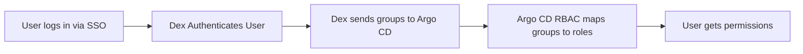

# 🚀 **Argo CD Management: RBAC, User Management, and Dex Connectors**

Argo CD is more than just “deploy from Git”.
Real production GitOps needs:

- **User accounts**
- **SSO (OIDC/SAML)**
- **RBAC policies**
- **Team-based access**
- **Token management**
- **SSO identity mapping**
- **LDAP/AD integration**

This topic explains **everything**, structured simply and cleanly.

---

## 🟦 PART 1 — **Argo CD RBAC (Role-Based Access Control)**

Argo CD uses **built-in RBAC** powered by two components:

1. The **argocd-rbac-cm** ConfigMap → defines roles & policies
2. The **argocd-cm** ConfigMap → maps user groups to roles

RBAC controls what each user/group can do.

---

<div align="center" style="background-color:#F2F2F2; border-radius: 10px; border: 2px solid">
  
</div>

---

## 🧩 **1.1. RBAC Concepts**

### ✔ Subjects

Who we are granting permissions to:

- Argo CD local user (`admin`, `dev1`)
- Dex/OIDC group (`oidc:team-dev`)
- GitHub team (`github:myorg/team-dev`)
- LDAP group

### ✔ Actions (verbs)

What the user can do:

- `get`, `update`, `create`, `delete`
- `sync`
- `override`
- `action` (resource actions like restart rollout)

### ✔ Scopes (objects)

What the user can access:

- `applications`
- `clusters`
- `projects`
- `certificates`
- `repositories`
- `accounts`

---

## 🟩 **1.2. RBAC Policy Format**

Inside **argocd-rbac-cm**:

```ini
p, <subject>, <resource>, <action>, <scope>
```

Example:

```ini
p, role:dev-team, applications, sync, my-app/*
p, role:dev-team, applications, get, my-app/*
p, role:dev-team, logs, get, my-app/*
```

---

## 🟧 **1.3. RBAC Example**

### 🔹 Step 1: Define a role in argocd-rbac-cm

```yaml
apiVersion: v1
kind: ConfigMap
metadata:
  name: argocd-rbac-cm
  namespace: argo-cd
data:
  policy.csv: |
    # DEV TEAM: can view + sync only their apps
    p, role:devs, applications, get, dev-*
    p, role:devs, applications, sync, dev-*
    p, role:devs, applications, logs, dev-*
    p, role:devs, applications, action/*, dev-*

    # OPS: full control
    p, role:ops, applications, *, *
    p, role:ops, clusters, *, *
    p, role:ops, projects, *, *

  scopes: "[groups]"
```

---

## 🟨 **1.4. RBAC Wildcards**

Argo CD supports:

```ini
dev-*       → only apps starting with dev-
*           → everything
prod/*      → all resources inside project prod
```

---

## 🟥 **1.5. RBAC Role Binding**

Binding roles is done in **argocd-cm**, not argocd-rbac-cm.

Example: Bind GitHub “team-dev” to “role:devs”

```yaml
data:
  dex.config: |
    connectors: [...etc...]

  policy.default: role:readonly

  # RBAC role bindings
  accounts.admin.enabled: "true"

  # map SSO groups to roles
  groups:
    - name: github:myorg/team-dev
      policies:
        - role:devs
```

---

## 🟦 PART 2 — **Argo CD User Management**

You can manage users in **two ways**:

1. **Local accounts** (built-in Argo CD users)
2. **SSO-based users** (Dex → OIDC/SAML/LDAP)

---

<div align="center" style="background-color:#F2F2F2; border-radius: 10px; border: 2px solid">
  
</div>

---

## 🧩 **2.1. Local Accounts**

Local users are defined in **argocd-cm** using:

```ini
accounts.<name>.enabled=true
accounts.<name>.password=<bcrypt>
accounts.<name>.tokens=<count>
```

### ✔ Create a new local user

```yaml
data:
  accounts.dev1.enabled: "true"
  accounts.dev1.password: "$bcrypt..."
  accounts.dev1.tokens: "5"
```

Generate bcrypt password:

```bash
argocd account bcrypt --password MyPassword
```

### ✔ Login as local user:

```bash
argocd login <ARGOCD_URL> --username dev1 --password MyPassword
```

### ✔ Disable user

```yaml
accounts.dev1.enabled: "false"
```

---

## 🟧 **2.2. Local User Permissions**

After creating a local user, bind RBAC role:

```yaml
data:
  policy.csv: |
    p, role:devs, applications, get, dev-*
    p, dev1, role, devs
```

---

## 🟩 **2.3. Token Management**

Users can create tokens via CLI:

```bash
argocd account generate-token --account dev1
```

Useful for:

- CI/CD pipelines
- GitHub Actions
- Azure Pipelines

---

## 🟪 **2.4. Best Practices for Local Users**

- Avoid local users in production
- Use local users only for break-glass access
- Prefer SSO + RBAC groups
- Rotate local user tokens
- Disable default `admin` after bootstrapping

---

## 🟧 PART 3 — **Dex Connector (SSO Integration)**

Argo CD uses **Dex as an identity broker**.
Dex supports:

- GitHub
- GitLab
- Azure AD
- Google
- OIDC providers
- LDAP
- SAML providers

Dex essentially maps **external identity → Argo CD user/group**.

---

<div align="center" style="background-color:#F2F2F2; border-radius: 10px; border: 2px solid">
  
</div>

---

## 🧩 **3.1. Dex Configuration Location**

Dex config is placed inside **argocd-cm**:

```yaml
data:
  dex.config: |
    connectors:
      - type: github
        id: github
        name: GitHub
        config: ...
```

---

## 🟥 **3.2. Example: GitHub SSO**

```yaml
data:
  dex.config: |
    connectors:
    - type: github
      id: github
      name: GitHub Login
      config:
        clientID: $argocd-github-client-id
        clientSecret: $argocd-github-client-secret
        orgs:
          - name: myorg
```

Argo CD will receive groups like:

```ini
github:myorg/team-dev
github:myorg/team-ops
```

Bind those to RBAC roles.

---

## 🟦 **3.3. Example: Azure AD SSO (enterprise)**

```yaml
data:
  dex.config: |
    connectors:
    - type: oidc
      id: azure
      name: Azure AD
      config:
        clientID: $azure_client_id
        clientSecret: $azure_client_secret
        tenant: <TENANT-ID>
        redirectURI: https://argocd.mycompany.com/api/dex/callback
        groupsClaim: groups
```

Then bind Azure groups:

```yaml
groups:
  - name: "aad:DevTeam"
    policies:
      - role:devs
```

---

## 🟩 **3.4. Example: LDAP**

```yaml
connectors:
  - type: ldap
    id: ldap
    name: LDAP
    config:
      host: ldap.mycompany.com:636
      bindDN: "cn=admin,dc=mycompany,dc=com"
      bindPW: $LDAP_PASSWORD
      userSearch:
        baseDN: "ou=users,dc=mycompany,dc=com"
        filter: "(objectClass=person)"
        username: uid
      groupSearch:
        baseDN: "ou=groups,dc=mycompany,dc=com"
        filter: "(objectClass=groupOfNames)"
        userMatchers:
          - userAttr: DN
            groupAttr: member
```

---

## 🟫 **Connecting Dex with RBAC**

This is the essence of User Management.

Flow:



You must:

1. Define **roles** in `argocd-rbac-cm`
2. Map **groups** to roles in `argocd-cm`
3. Let Dex authenticate & send those groups

---

## 🟧 **Complete Example (SSO + RBAC + User Management)**

```yaml
--- # ---- 1. User Mapping + Dex ----
apiVersion: v1
kind: ConfigMap
metadata:
  name: argocd-cm
data:
  dex.config: |
    connectors:
      - type: github
        id: github
        name: GitHub
        config:
          clientID: $github_clientid
          clientSecret: $github_secret
          orgs:
            - name: myorg

  # Default access
  policy.default: role:readonly

  # Map GitHub groups to roles
  groups:
    - name: "github:myorg/team-dev"
      policies:
        - role:devs

    - name: "github:myorg/team-ops"
      policies:
        - role:ops
```

```yaml
--- # ---- 2. RBAC roles & policies ----
apiVersion: v1
kind: ConfigMap
metadata:
  name: argocd-rbac-cm
data:
  policy.csv: |
    # DEV ROLE
    p, role:devs, applications, get, dev-*
    p, role:devs, applications, sync, dev-*
    p, role:devs, applications, logs, dev-*

    # OPS ROLE
    p, role:ops, applications, *, *
    p, role:ops, clusters, *, *
    p, role:ops, projects, *, *

  scopes: "[groups]"
```

---

## 🟩 **Best Practices for Argo CD Management**

### ✔ Use SSO whenever possible

Azure AD / GitHub Teams / LDAP / Okta / Keycloak

### ✔ Manage RBAC via Git

Never edit via UI.

### ✔ Disable default admin

After bootstrap:

```ini
accounts.admin.enabled: "false"
```

### ✔ Use groups, not individual user usernames

Group-based roles scale better.

### ✔ Separate “read-only” vs “sync” roles

Read-only should NOT sync accidentally.

### ✔ Use AppProjects for stronger boundaries

AppProjects + RBAC → strong multi-tenancy.

---

## 🎯 Final Summary

**Argo CD Management** consists of:

### ✔ RBAC

Defines _what_ a user/group can do.

### ✔ User Management

Local accounts + tokens + SSO.

### ✔ Dex Connectors

Connect Argo CD to identity providers (GitHub, Azure AD, LDAP, etc.)

Together, these give you:

- secure access
- team boundaries
- full GitOps automation
- production-grade governance

---

If you want, I can also create:

🔥 A diagram showing RBAC + Projects + SSO together
🔥 A “role design” for multi-team environments
🔥 Argo CD full security hardening guide
Just tell me!
