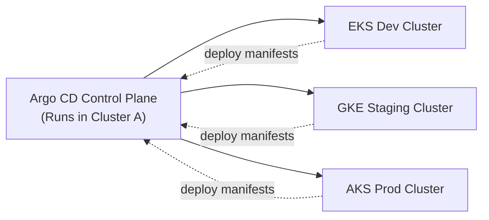

# 🌍 **Multi-Cluster Deployments with Argo CD**

Argo CD is designed from the ground up to manage **multiple Kubernetes clusters** from a **single Argo CD control plane**.  
This is one of Argo CD’s strongest features: a central GitOps controller that can **deploy apps to any number of clusters**.

---

## 📖 **What “Multi-Cluster” Means in Argo CD**

Argo CD always runs inside **one cluster** (the _control plane cluster_),  
but it can **deploy to many clusters** (called _target clusters_):

> - **Control plane cluster** = where Argo CD is installed.
> - **Target clusters** = where your applications are deployed.

Examples:

- Deploy frontend to `dev-cluster`
- Deploy backend to `staging-cluster`
- Deploy analytics jobs to `prod-cluster`
- Deploy monitoring stack to an EKS cluster but run Argo CD in AKS

Argo CD becomes the **orchestration brain** for all clusters.

---

## ⚙️ **How Argo CD Connects to Multiple Clusters**

> 📍 Argo CD uses the same mechanism as kubectl:
>
> - ⭐ Each cluster is registered as a **Kubernetes API endpoint** using a **kubeconfig context**.

You add a cluster like this:

```bash
argocd cluster add CONTEXT_NAME --kubeconfig KUBECONFIG_PATH --name CLUSTER_NAME
```

Example:

```bash
argocd cluster add my-eks-dev --kubeconfig my-eks-dev.kubeconfig --
argocd cluster add my-aks-prod --kubeconfig my-aks-prod.kubeconfig
argocd cluster add my-gke-staging --kubeconfig my-gke-staging.kubeconfig
```

Argo CD then:

- Creates a **ServiceAccount** in the target cluster
- Assigns it RBAC permissions
- Stores the cluster connection info in its own datastore

---

## 👷🏻 **Creating Argo CD Clusters**

- Argo CD itself runs in a **management cluster** (usually in `argo-cd` namespace).
- You can register **external clusters** so Argo CD can deploy apps into them.
- Each cluster is represented by a **Kubernetes Secret** in Argo CD, created via `argocd cluster add`.

---

### 🔹 Step 1: Log in to Argo CD CLI

- First, log in to your Argo CD API server:

  ```bash
  argocd login <ARGOCD_SERVER> \
    --username admin \
    --password <PASSWORD> \
    --insecure
  ```

- Options you’ll often use:

  - `--grpc-web` → if you’re behind certain proxies.
  - `--insecure` → skip TLS verification (common in dev).

---

### 🔹 Step 2: Add a Cluster

- Use `argocd cluster add` to register a target cluster.
- This command uses your local kubeconfig context.

  ```bash
  argocd cluster add <CONTEXT_NAME> \
    --name <CLUSTER_ALIAS> \
    --namespace <NAMESPACE> \
    --kubeconfig <KUBECONFIG_PATH>
  ```

  - `<CONTEXT_NAME>` → from `kubectl config get-contexts`.
  - `--namespace` → where Argo CD will create the ServiceAccount and RBAC (usually `kube-system`).
  - `--kubeconfig` → path to the kubeconfig file for the target cluster.
  - `--name` → friendly alias for Argo CD (e.g., `dev-cluster`, `prod-cluster`).

- 👉 Example:

  ```bash
  argocd cluster add arn:aws:eks:us-east-1:123456789012:cluster/prod-eks \
    --name prod-eks \
    --kubeconfig ~/.kube/prod-eks-config
  ```

---

### 🔹 Step 3: Verify Cluster Registration

- List all clusters Argo CD knows about:

  ```bash
  argocd cluster list
  ```

- You’ll see:

  - `NAME` → alias you gave.
  - `SERVER` → API endpoint.
  - `NAMESPACE` → where Argo CD manages RBAC.
  - `PROJECT` → optional scoping.

---

### 🔹 Step 4: Use Clusters in Applications

- When defining an Application manifest, set `spec.destination.server`:

  ```yaml
  apiVersion: argoproj.io/v1alpha1
  kind: Application
  metadata:
    name: my-app
  spec:
    project: default
    source:
      repoURL: https://github.com/example/repo.git
      path: apps/my-app
      targetRevision: main
    destination:
      server: https://<CLUSTER_API_SERVER>
      namespace: my-namespace
  ```

  - `server` → matches the cluster you registered.
  - `namespace` → target namespace in that cluster.

---

### 💼 Common Options You’ll Use

- `argocd cluster add <context>` → register cluster.
- `argocd cluster list` → check clusters.
- `argocd cluster rm <name>` → remove cluster.
- `argocd app create` → create app pointing to a specific cluster.
- `argocd app set <app> --dest-server <cluster>` → change target cluster.

---

### 🚀 Best Practice for Multi-Cluster

- **Name clusters clearly** (`dev-eks`, `prod-gke`, `staging-aks`).
- Keep separate kubeconfig files for **dev, staging, prod** clusters — easier to script and automate.
- Combine with `kubectl config use-context` for quick validation before registering.
- Store kubeconfigs securely (e.g., Vault, S3 with IAM) and mount them in CI/CD pipelines when running `argocd cluster add`.
- Use **Projects** in Argo CD to scope RBAC per cluster/team.

---

## 🎨 **Architecture Diagram**

<div align="center" style="background-color: #141a19ff;color: #a8a5a5ff; border-radius: 10px; border: 2px solid">



</div>

---

> Argo CD pulls from Git → applies manifests to the correct cluster.

---

## 🚀 **Deploying to a Specific Cluster**

Each Argo CD **Application** has a `.spec.destination` section.

Example:

```yaml
apiVersion: argoproj.io/v1alpha1
kind: Application
metadata:
  name: frontend
spec:
  destination:
    server: https://123.45.67.89 # API server of target cluster
    namespace: frontend
  source:
    repoURL: https://github.com/example/repo
    path: k8s/frontend
```

Argo CD deploys to whatever cluster the `server` points to.

### Common server values:

<div align="center" style="background-color: #141a19ff;color: #a8a5a5ff; border-radius: 10px; border: 2px solid">

| Type         | Example                                       |
| ------------ | --------------------------------------------- |
| In-cluster   | `https://kubernetes.default.svc`              |
| External AKS | `https://6A2C843F...hcp.eastus.azmk8s.io:443` |
| External EKS | Custom AWS API server URL                     |
| External GKE | Google endpoint                               |

</div>

---

## 🤹🏻 **Multi-Cluster GitOps Patterns**

### ✔ **Pattern A — One App, One Cluster**

Each environment is a separate Argo CD Application.

```ini
app-dev     ---→ deploy to dev cluster
app-staging ---→ deploy to staging cluster
app-prod    ---→ deploy to prod cluster
```

Most common.

---

### ✔ **Pattern B — One App, Deploy to ALL Clusters**

Useful for shared components:

- logging agents
- metrics agents
- ingress controllers
- security agents

Use **ApplicationSet** with the `clusters` generator:

```yaml
apiVersion: argoproj.io/v1alpha1
kind: ApplicationSet
metadata:
  name: logging-agents
spec:
  generators:
    - clusters: {}
  template:
    metadata:
      name: logging-{{name}}
    spec:
      destination:
        server: "{{server}}"
        namespace: monitoring
      source:
        repoURL: https://github.com/org/logging
        path: manifests
```

This deploys the same app to _every registered cluster_.

---

### ✔ **Pattern C — Multi-Cluster Environment Promotion**

Common in enterprise CI/CD:

```ini
dev cluster ---→ stage cluster ---→ prod cluster
```

Argo CD supports:

- per-cluster kustomization overlays
- per-cluster Helm values
- per-cluster Application files

Example repo structure:

```ini
environments/
  dev/
  stage/
  prod/
```

Each folder deploys to a different cluster.

---

## 🧨 **RBAC and Security for Multi-Cluster**

Argo CD gives fine-grained RBAC controls:

- which teams can deploy to which cluster
- which applications they can modify
- which projects they belong to

Example RBAC:

```json
{
  "p, dev-team, applications, sync, dev-cluster/*, allow",
  "p, ops-team, clusters, get, *, allow"
}
```

---

## ✍🏻 **Example Multi-Cluster Deployment (Real YAML)**

### Deploy frontend to dev cluster

```yaml
apiVersion: argoproj.io/v1alpha1
kind: Application
metadata:
  name: frontend-dev
spec:
  destination:
    server: https://dev.cluster
    namespace: web
  source:
    repoURL: https://github.com/example/frontend
    path: overlays/dev
  project: dev-project
```

### Deploy frontend to prod cluster

```yaml
apiVersion: argoproj.io/v1alpha1
kind: Application
metadata:
  name: frontend-prod
spec:
  destination:
    server: https://prod.cluster
    namespace: web
  source:
    repoURL: https://github.com/example/frontend
    path: overlays/prod
  project: prod-project
```

Same app → different clusters, different overlays.

---

## 🧪 **How Argo CD Validates Multiple Clusters**

Argo CD performs:

- cluster reachability checks
- cluster version checks
- permissions checks
- health checks
- sync status per cluster

Each cluster gets its own **health, sync status, and history**.

---

## ✍🏻 **Multi-Cluster Deployment Using ApplicationSet**

ApplicationSet is the **real power tool** for multi-cluster GitOps.

Examples:

### Deploy the same app to all clusters:

```yaml
generators:
  - clusters: {}
```

### Deploy based on cluster labels:

```yaml
generators:
  - clusters:
      selector:
        matchLabels:
          env: prod
```

### Deploy based on a cluster list YAML:

```yaml
generators:
  - git:
      repoURL: https://github.com/example/infra
      files:
        - cluster-list/*.yaml
```

---

## 🌐 **Real-World Use Cases**

<div align="center" style="background-color: #141a19ff;color: #a8a5a5ff; border-radius: 10px; border: 2px solid">

| Use Case                     | Why Multi-Cluster?   |
| ---------------------------- | -------------------- |
| Multi-region apps            | HA + DR              |
| Multi-cloud deployments      | AWS + Azure + GCP    |
| Teams with isolated clusters | Security, compliance |
| Cluster-per-environment      | dev/stage/prod       |
| Federated clusters           | Centralized GitOps   |

</div>

---

## 🎯 **Summary (Crystal Clear)**

- ✔ Argo CD can deploy to many Kubernetes clusters from one control plane
- ✔ Each cluster is added using `argocd cluster add`
- ✔ Each Argo CD Application has a `.spec.destination.server` → defines target cluster
- ✔ Multi-cluster GitOps is best done using **ApplicationSet**
- ✔ RBAC controls who can deploy to which clusters
- ✔ Common real-world patterns include per-env clusters & multi-region clusters
