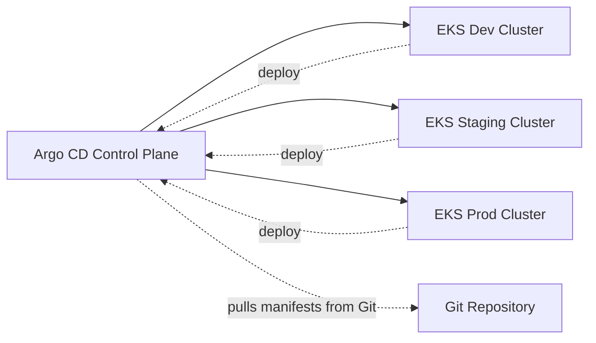

# 🌍 **Multi-Cluster GitOps with Argo CD ApplicationSet**

Argo CD is designed to manage **many Kubernetes clusters** from one central control plane. When you combine it with **ApplicationSet**, you unlock the most powerful deployment model in GitOps: **automated, scalable multi-cluster deployments**.

This topic teaches you:

- What multi-cluster GitOps means
- How Argo CD connects to multiple clusters
- How ApplicationSet automates per-cluster deployments
- When to use the **clusters generator**
- When to use the **list generator**
- Complete examples for both
- Real-world best practices

---

## 🧩 **Multi-Cluster GitOps — What It Really Means**

Argo CD runs in **one “management” cluster**, but deploys apps to **many clusters**:

- dev EKS cluster
- staging EKS cluster
- prod EKS cluster
- multi-region clusters
- multi-cloud clusters
- on-prem + cloud hybrid

Every cluster becomes a **GitOps target**.

---

## ⚙️ **How Argo CD Manages Multiple Clusters**

You connect clusters using:

```bash
argocd cluster add CLUSTER_CONTEXT
```

Argo CD then:

- Creates a service account in that cluster
- Stores the cluster’s API endpoint
- Applies RBAC
- Gives you a known context (name, server, labels)

Once a cluster is registered, Argo CD becomes capable of deploying apps into it via `.spec.destination.server`.

---

## 🎨 **3. Multi-Cluster Architecture Diagram**

<div align="center" style="background-color: #141a19ff;color: #a8a5a5ff; border-radius: 10px; border: 2px solid">



</div>

---

## 🟦 **4. The Role of ApplicationSet in Multi-Cluster GitOps**

Without ApplicationSet, you must **manually create an Application per cluster**:

- app-dev
- app-staging
- app-prod

ApplicationSet automates this by **generating Applications from templates**.

Two common generators are:

1. **clusters generator**
2. **list generator**

Both solve different problems.

---

## 🟢 **5. Multi-Cluster with the Clusters Generator**

### (Best for: auto-discovery, cluster labels, consistent structures)

The **clusters generator** creates one Application per cluster **automatically**, based on cluster labels stored inside Argo CD.

Example cluster labels:

<div align="center" style="background-color: #141a19ff;color: #a8a5a5ff; border-radius: 10px; border: 2px solid">

| Cluster         | Label       |
| --------------- | ----------- |
| dev-cluster     | env=dev     |
| staging-cluster | env=staging |
| prod-cluster    | env=prod    |

</div>

### 📌 Repository Structure

```text
my-app/
  overlays/
    dev/
    staging/
    prod/
```

### 📌 ApplicationSet (Clusters Generator Example)

```yaml
apiVersion: argoproj.io/v1alpha1
kind: ApplicationSet
metadata:
  name: my-app-multicluster
spec:
  generators:
    - clusters:
        selector:
          matchLabels:
            env: dev # Only deploy to dev clusters (optional)
  template:
    metadata:
      name: my-app-{{name}}
    spec:
      project: default
      source:
        repoURL: https://github.com/company/platform-config
        targetRevision: main
        path: my-app/overlays/{{labels.env}}
      destination:
        server: "{{server}}"
        namespace: my-app
      syncPolicy:
        automated:
          prune: true
          selfHeal: true
```

### ✔ **What This Achieves**

- Automatically discovers clusters labeled `env=dev`
- Creates one Application per cluster
- Picks `dev` overlay automatically (via `{{labels.env}}`)
- Deploys to that cluster automatically

### ✔ **Best Use Cases**

- Many clusters with same structure
- Clusters added dynamically
- Multi-region clusters
- Cluster per customer (SaaS)
- Want “deploy everywhere automatically” behavior

---

## 🟠 **6. Multi-Cluster with the List Generator**

### (Best for: explicit environment definitions, different values files)

The **list generator** is the best choice when:

- Each cluster uses **different values files**
- Not all clusters follow the same structure
- You want explicit control
- Cluster names do not map to folder names
- You have stable set of clusters (dev/prod/stage)

### 📌 Repository Structure

```text
infra/
  redis/
    values-dev.yaml
    values-prod.yaml
    Chart.yaml
```

### 📌 ApplicationSet (List Generator Example)

```yaml
apiVersion: argoproj.io/v1alpha1
kind: ApplicationSet
metadata:
  name: redis-multicluster
spec:
  generators:
    - list:
        elements:
          - name: redis-dev
            namespace: orchida-tax-dev
            valuesFile: infra/redis/values-dev.yaml
            cluster: https://orchida-tax-dev.eks.us-east-1.amazonaws.com

          - name: redis-prod
            namespace: orchida-tax-production
            valuesFile: infra/redis/values-prod.yaml
            cluster: https://orchida-tax-production.eks.us-east-1.amazonaws.com

  template:
    metadata:
      name: "{{name}}"
    spec:
      project: default
      source:
        repoURL: https://github.com/company/platform-config
        targetRevision: main
        path: infra/redis
        helm:
          valueFiles:
            - "{{valuesFile}}"
      destination:
        server: "{{cluster}}"
        namespace: "{{namespace}}"
      syncPolicy:
        automated:
          prune: true
          selfHeal: true
        syncOptions:
          - CreateNamespace=true
```

### ✔ **What This Achieves**

Creates these applications:

<div align="center" style="background-color: #141a19ff;color: #a8a5a5ff; border-radius: 10px; border: 2px solid">

| App Name   | Cluster  | Values File      | Namespace              |
| ---------- | -------- | ---------------- | ---------------------- |
| redis-dev  | dev EKS  | values-dev.yaml  | orchida-tax-dev        |
| redis-prod | prod EKS | values-prod.yaml | orchida-tax-production |

</div>

### ✔ **Best Use Cases**

- Dev & prod have different Helm values
- Cluster contexts are unrelated to folder names
- You want predictable, explicit YAML
- Small number of clusters
- App behavior differs significantly per cluster

---

## 🔍 **7. Clusters Generator vs List Generator — When to Use Which?**

<div align="center" style="background-color: #141a19ff;color: #a8a5a5ff; border-radius: 10px; border: 2px solid">

| Feature                         | Clusters Generator | List Generator |
| ------------------------------- | ------------------ | -------------- |
| Automatic cluster discovery     | ✔                  | ❌             |
| Requires cluster labels         | ✔                  | ❌             |
| Explicit environment configs    | ❌                 | ✔              |
| Different values files per env  | ⚠️ Complex         | ✔ Easy         |
| Best for >5 clusters            | ✔                  | ❌             |
| Best for static envs (dev/prod) | ⚠️                 | ✔              |
| Multi-region or per-customer    | ✔                  | ❌             |
| Predictability & clarity        | ⚠️                 | ✔✔✔            |

</div>

### 🚀 **Simple rule**

- Use **clusters generator** if cluster structure is consistent
- Use **list generator** if environments are unique

---

## 🧨 **8. Combining Both Generators (Advanced)**

Example:

- Deploy monitoring agents to ALL clusters → clusters generator
- Deploy app with unique config for each cluster → list generator
- Deploy tenants based on Git files → git generator

Argo CD ApplicationSet is composable.

---

## ✔ **Final Summary**

- Argo CD + ApplicationSet = Dynamic, scalable multi-cluster GitOps.

- Two main ways to automate multi-cluster deployments:

  1. 🟦 **Clusters Generator**

     **Best for: auto-discovery, labels, consistent patterns:**

     - Uses cluster labels (`env=dev`, `region=eu`)
     - Deploys same app across many clusters
     - Cleanest for large-scale multi-cluster platforms

  2. 🟠 **List Generator**

     **Best for: environment-specific, explicit definitions:**

     - Explicit values for each environment
     - Ideal for dev/stage/prod with different Helm values
     - More predictable and readable
     - Perfect when clusters have unique configurations
