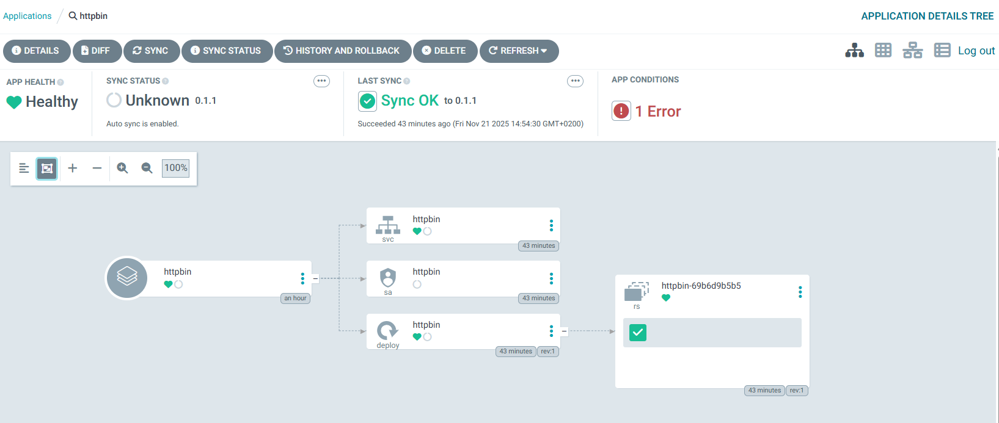
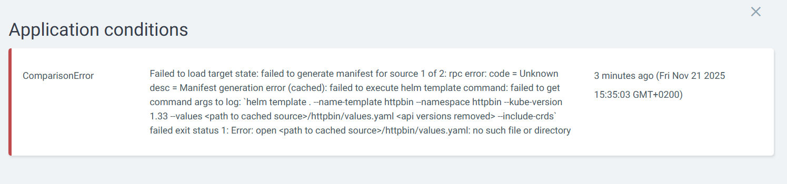

# 🐞 **Can't Define External values.yaml for Community Helm Chart**

<div align="center" style="background-color:#fff; border-radius: 10px; border: 2px solid">
  
</div>

---

<div align="center" style="background-color:#fff; border-radius: 10px; border: 2px solid">
  
</div>

---

## 🔴 **Wrong Argocd Application YAML**

```yaml
apiVersion: argoproj.io/v1alpha1
kind: Application
metadata:
  name: httpbin
  namespace: argo-cd
spec:
  project: default

  sources:
    - repoURL: https://matheusfm.dev/charts
      chart: httpbin
      targetRevision: 0.1.1
      helm:
        valueFiles:
          - $values/httpbin/values.yaml
    - repoURL: https://github.com/OrchidaTax/helm-deployments.git
      targetRevision: HEAD
      ref: values
      path: infra

  destination:
    server: https://kubernetes.default.svc
    namespace: httpbin

  syncPolicy:
    automated:
      prune: true
      selfHeal: true
    syncOptions:
      - CreateNamespace=true
```

---

## 🟢 **Correct Argocd Application YAML**

```yaml
apiVersion: argoproj.io/v1alpha1
kind: Application
metadata:
  name: httpbin
  namespace: argo-cd
spec:
  project: default

  sources:
    - repoURL: https://matheusfm.dev/charts
      chart: httpbin
      targetRevision: 0.1.1
      helm:
        valueFiles:
          - $values/path/httpbin/values.yaml
    - repoURL: https://github.com/OrchidaTax/helm-deployments.git
      targetRevision: HEAD
      ref: values

  destination:
    server: https://kubernetes.default.svc
    namespace: httpbin

  syncPolicy:
    automated:
      prune: true
      selfHeal: true
    syncOptions:
      - CreateNamespace=true
```

Great question – this is one of those Argo CD “gotchas” 😄
Let’s break down what’s happening.

---

## 1️⃣ What Argo CD is actually doing

Error:

> `Error: open <path to cached source>/httpbin/values.yaml: no such file or directory`

That tells us Argo CD tried to read:

```text
$values/httpbin/values.yaml  →  <repo root>/httpbin/values.yaml
```

and **that file does not exist** in your Git repo.

From the official docs:

- `$values` **always points to the root of the repo with `ref: values`**, not to the `path:` you set. ([argo-cd.readthedocs.io][1])
- Even if you set `path` in that source, `$values` still resolves from the **repo root**.

So:

```yaml
valueFiles:
  - $values/httpbin/values.yaml
```

means:

> “Look for `httpbin/values.yaml` at the root of the repo”

**It does NOT mean** “look inside `infra/httpbin/values.yaml` just because I set `path: infra`”.

---

## 2️⃣ Compare your two configs

### ❌ Failing one

```yaml
sources:
  - repoURL: https://matheusfm.dev/charts
    chart: httpbin
    targetRevision: 0.1.1
    helm:
      valueFiles:
        - $values/httpbin/values.yaml
  - repoURL: https://github.com/OrchidaTax/helm-deployments.git
    targetRevision: HEAD
    ref: values
    path: infra
```

- `$values/…` resolves to **repo root**, so Argo looks for:

  - `<repo root>/httpbin/values.yaml`

- But your file is (as you said earlier) something like:

  - `<repo root>/infra/httpbin/values.yaml`

- So Argo CD can’t find it → **file not found error**.

The `path: infra` here only tells Argo CD “also try to generate manifests from `infra/`”, but it **does not prefix** the `$values` path.

---

### ✅ Working one

```yaml
sources:
  - repoURL: https://matheusfm.dev/charts
    chart: httpbin
    targetRevision: 0.1.1
    helm:
      valueFiles:
        - $values/path/httpbin/values.yaml
  - repoURL: https://github.com/OrchidaTax/helm-deployments.git
    targetRevision: HEAD
    ref: values
```

Here:

- You **removed** `path: infra` from the second source → Argo CD uses that repo **only as a values source**.
- You set the value file to `$values/path/httpbin/values.yaml`, which matches a **real path in your repo**:

  - `<repo root>/path/httpbin/values.yaml` (apparently your actual folder).

So:

- `$values` → repo root
- `/path/httpbin/values.yaml` → correct relative path
- → **File found, everything works** ✅

The word `path` in `$values/path/httpbin/values.yaml` is just a **folder name** in your repo, it has nothing to do with the `path:` field in the source.

---

## 3️⃣ How to fix the “failing” style if you want to keep `path: infra`

If your real file is:

```text
infra/httpbin/values.yaml
```

then you need:

```yaml
sources:
  - repoURL: https://matheusfm.dev/charts
    chart: httpbin
    targetRevision: 0.1.1
    helm:
      valueFiles:
        - $values/infra/httpbin/values.yaml # 👈 include 'infra' here
  - repoURL: https://github.com/OrchidaTax/helm-deployments.git
    targetRevision: HEAD
    ref: values
    path: infra
```

Key points:

- `$values` → root of repo
- you must give the **full relative path** from repo root: `infra/httpbin/values.yaml`
- `path: infra` only controls whether Argo CD also tries to render stuff from `infra/` as manifests; it doesn’t change how `$values` resolves.

If you don’t care about rendering anything else from that repo, the simpler/cleaner way is:

```yaml
- repoURL: https://github.com/OrchidaTax/helm-deployments.git
  targetRevision: HEAD
  ref: values # no path
```

and keep:

```yaml
valueFiles:
  - $values/infra/httpbin/values.yaml
```

---

## 4️⃣ Short mental model to remember

- `$values` = always **repo root** of the source with `ref: values`
- `path:` = **where to render manifests from**, not where `$values` starts
- `valueFiles:` = **normal file paths**, relative to repo root

So if Argo says:

> `open <cached source>/httpbin/values.yaml: no such file or directory`

it’s literally telling you:
“I checked `<repo root>/httpbin/values.yaml` and it doesn’t exist”.

---

If you paste your **exact repo folder structure** (just the `infra`/`path`/`httpbin` part), I can write the precise `valueFiles` line(s) that match it 1:1.

[1]: https://argo-cd.readthedocs.io/en/latest/user-guide/multiple_sources/ "Multiple Sources for an Application - Argo CD - Declarative GitOps CD for Kubernetes"
