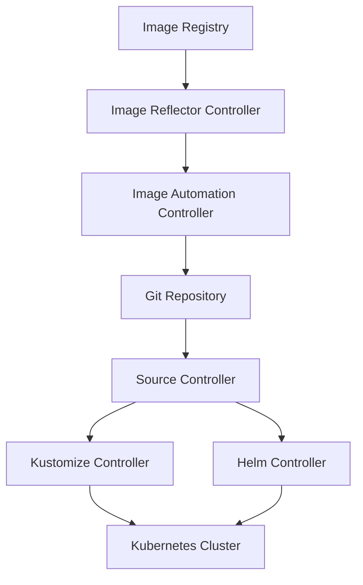

# 🌊 Flux

> _📖 GitOps-native Continuous Delivery for Kubernetes, built for scale and modularity._

**Flux** is a CNCF-graduated, open-source GitOps tool that automates **Kubernetes deployments** by continuously reconciling your cluster state with the desired state stored in Git. Unlike monolithic CD tools, Flux is built as a **modular set of Kubernetes controllers**, making it ideal for **microservice-heavy, multi-cluster environments** where security, scalability, and automation are paramount.

---

## 🧠 Architectural Overview

Flux is powered by the **GitOps Toolkit**, a collection of Kubernetes-native controllers:

| Component                                       | Role                                                              |
| ----------------------------------------------- | ----------------------------------------------------------------- |
| 📁 **Source Controller**                        | Pulls artifacts from Git, Helm repos, OCI registries, S3 buckets. |
| 🧩 **Kustomize Controller**                     | Applies Kustomize overlays to Kubernetes manifests.               |
| 🎛️ **Helm Controller**                          | Manages Helm chart lifecycles.                                    |
| 🔔 **Notification Controller**                  | Sends alerts to Slack, MS Teams, etc., and handles webhooks.      |
| 🧬 **Image Reflector & Automation Controllers** | Detect new container images and auto-update manifests in Git.     |
| 🧰 **Flux CLI**                                 | Bootstraps and manages Flux components.                           |

Flux runs **inside your cluster**, and uses **pull-based reconciliation** to ensure your live state matches Git — no manual `kubectl` or CI triggers needed.

---

## 📦 Key Features

- 🧬 **Declarative GitOps**: Git is the single source of truth for all deployments.
- 🔁 **Continuous Reconciliation**: Automatically detects and corrects drift.
- 🧰 **Multi-source Support**: Git, Helm, OCI, S3 — all supported natively.
- 🧱 **Modular Architecture**: Each controller handles a specific function, improving scalability.
- 🔐 **Security-first Design**: Least privilege, RBAC via impersonation, SOPS integration.
- 🧪 **Progressive Delivery**: Canary, blue-green via [Flagger](https://flagger.app).
- 📊 **Multi-tenancy**: Namespaced CRDs for team isolation and policy enforcement.
- 🔄 **Image Automation**: Auto-patch manifests in Git when new container versions are available.
- 🧾 **Policy Enforcement**: Integrates with OPA, Kyverno, and admission controllers.
- 🧩 **Terraform Integration**: Bootstrap Flux using Terraform/OpenTofu modules.

---

## 🚀 When to Use Flux

Flux is ideal for:

- 🧠 **Microservice-heavy environments** with many Git repos and teams.
- 🔐 **Security-conscious setups** needing encrypted secrets and RBAC.
- 🧰 **Multi-cluster orchestration** with Git as the control plane.
- 🧪 **Immutable infrastructure** with Git-tracked rollbacks and auditability.
- 🧱 **Cloud-native CD pipelines** that need modular, scalable GitOps tooling.

---

## ⚔️ Flux vs Argo CD: Strategic Comparison

| Feature                | 🌊 **Flux**                           | 🚀 **Argo CD**                          |
| ---------------------- | ------------------------------------- | --------------------------------------- |
| Architecture           | Modular (controller-per-function)     | Monolithic (single binary)              |
| UI Dashboard           | ❌ None (optional via Weave GitOps)   | ✅ Rich Web UI                          |
| Sync Strategy          | ✅ Auto only (reconciliation loop)    | ✅ Manual & Auto                        |
| Drift Detection        | ✅ Periodic reconciliation            | ✅ Real-time with visual feedback       |
| Helm/Kustomize Support | ✅ Native via controllers             | ✅ Native                               |
| Secret Management      | ✅ Native SOPS integration            | 🔶 External plugins                     |
| Rollbacks              | ✅ Git-based manual rollback          | ✅ Built-in rollback support            |
| Image Automation       | ✅ Native via controllers             | ❌ Requires external tool               |
| Multi-Tenancy          | ✅ Namespaced GitRepo/Kustomization   | ✅ Namespaced App CRDs                  |
| Notifications          | ✅ Native via Notification Controller | ✅ Argo Notifications addon             |
| Extensibility          | ✅ Controller SDK, custom CRDs        | ✅ Hooks, plugins                       |
| Resource Usage         | ✅ Lightweight                        | 🔶 Moderate (UI + controller)           |
| GitOps Ecosystem       | Flux Core + Flagger + GitOps Toolkit  | Argo CD + Rollouts + Workflows + Events |

**TL;DR**:

- Use **Flux** for **modular, secure, scalable GitOps** across clusters.
- Use **Argo CD** for **visual GitOps onboarding** and centralized app management.

---

## 🗺️ Visual Model (Mermaid-style)

This shows how Flux pulls from Git and registries, applies manifests, and even **writes back to Git** for image updates.

---

## 🧩 Strategic Fit for You, Hady

- 🧠 **Architectural clarity**: Flux’s modular controllers mirror your preferred design patterns — each function is isolated and composable.
- 📁 **Portfolio-ready**: Showcase multi-cluster GitOps pipelines with image automation, SOPS secrets, and policy enforcement.
- 🧪 **Tool benchmarking**: Compare Flux vs Argo CD vs Jenkins X for GitOps CD in your CI/CD matrix.
- 🔐 **Security signaling**: Use SOPS + RBAC + OPA to demonstrate enterprise-grade compliance.
- 📊 **Interview leverage**: Model cluster bootstrapping, sync dependencies, and progressive delivery with Flagger.
