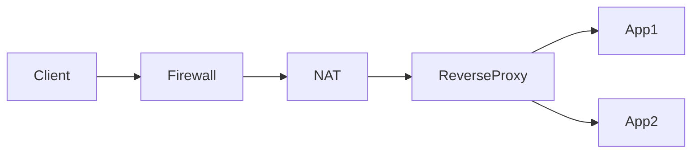
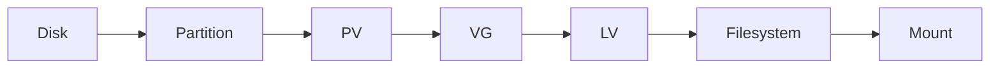
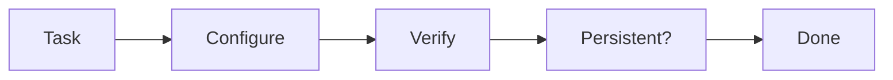

# LFCS

## Index

1. What LFCS actually looks like now
2. What you really need to study
3. My 7-day ASAP strategy
4. The smartest use of Killer.sh
5. Exam-time strategy
6. Commands you must be fast with
7. When I would book the exam

---

## 1. LFCS in 2026

Current official format:

| Item            | Current LFCS                      |
| --------------- | --------------------------------- |
| Type            | **100% performance-based**        |
| Questions/tasks | **17–20 tasks**                   |
| Time            | **2 hours**                       |
| Passing score   | **67%**                           |
| Retake          | **1 included retake**             |
| Simulator       | **2 Killer.sh attempts included** |
| Validity        | **2 years**                       |
| Distribution    | Distribution-agnostic             |
| Environment     | Linux command line over SSH       |

There are no multiple-choice questions. You actually configure and troubleshoot systems.

The official exam simulator contains **20–25 tasks**, gives you **36 hours of access after activating each attempt**, and the tasks remain the same between simulator attempts. :chatgpt-content-reference{index="2"}

So your preparation should look like:


Not:

```text
40 hours videos
      ↓
memorize commands
      ↓
hope for the best
```

---

## 2. What should you study?

This is the **current official weighting**:

| Domain                  | Weight | Priority |
| ----------------------- | -----: | -------- |
| Operations & Deployment |    25% | 🔥       |
| Networking              |    25% | 🔥       |
| Storage                 |    20% | 🔥       |
| Essential Commands      |    20% | 🔥       |
| Users & Groups          |    10% | Medium   |

Notice something important:

**Operations + Networking + Storage = 70% of the blueprint.**

That's where I'd spend most preparation time.

### A. Operations & Deployment — 25%

You need hands-on ability with:

```text
systemd
processes
kernel parameters
cron/systemd scheduling
apt/dnf
repositories
recovery
libvirt
containers
SELinux
```

Official objectives explicitly include **libvirt, containers, and SELinux**.

You should be comfortable doing things such as:

```bash
systemctl status nginx
journalctl -u nginx

ps aux
pgrep nginx
kill
nice
renice

sysctl net.ipv4.ip_forward
sysctl -p

crontab -e

apt install nginx
dnf install nginx

podman ps
podman run ...

virsh list
```

And especially troubleshooting:

```bash
systemctl status myservice
journalctl -xeu myservice
systemctl cat myservice
```

---

## 3. Networking — 25%

Do **not** underestimate this section.

The official objectives include:

- IPv4/IPv6
- DNS/hostname resolution
- time synchronization
- SSH
- packet filtering
- NAT
- port forwarding
- static routes
- bridges
- bonding
- reverse proxies
- load balancers

You should be fast with:

```bash
ip addr
ip link
ip route
ip neigh

ss -lntup

ping
curl
dig
getent hosts

hostnamectl

ssh
scp

iptables
nft

ip route add ...

timedatectl
```

And understand this flow:



This should be familiar territory for you conceptually. The important part for LFCS is doing it **directly on Linux**, without Kubernetes hiding the networking underneath.

---

## 4. Storage — 20%

This is probably one of the areas where I'd spend extra time even for experienced DevOps engineers.

You need:

```text
partitions
filesystems
mount
fstab
LVM
swap
NFS/remote filesystems
automount
storage troubleshooting
```

Typical workflow:



You should be able to do this almost from memory:

```bash
lsblk
blkid

pvcreate /dev/sdb
vgcreate vgdata /dev/sdb
lvcreate -L 5G -n lvapp vgdata

mkfs.ext4 /dev/vgdata/lvapp

mkdir /data
mount /dev/vgdata/lvapp /data
```

Then make it persistent:

```bash
blkid
vim /etc/fstab

mount -a
```

And know how to expand it:

```bash
lvextend -L +2G /dev/vgdata/lvapp
resize2fs /dev/vgdata/lvapp
```

For XFS:

```bash
xfs_growfs /mountpoint
```

I would drill LVM until you can do it without thinking.

---

## 5. Essential Commands — 20%

Interestingly, the current blueprint puts some fairly advanced things under this domain:

- basic Git
- create/configure/troubleshoot services
- performance troubleshooting
- application/service constraints
- disk-space troubleshooting
- SSL certificates :chatgpt-content-reference{index="6"}

Make sure these are second nature:

```bash
find
grep
sed
awk

tar
gzip

df
du

free
uptime
top

journalctl

openssl

git status
git add
git commit
git log
```

Example:

Disk full:

```bash
df -h
df -i
du -xhd1 /
du -xhd1 /var
```

Service broken:

```bash
systemctl status app
journalctl -u app
ss -lntp
curl localhost:8080
```

That's exactly the troubleshooting mindset you want.

---

## 6. Users & Groups — 10%

Small percentage, but usually relatively easy points if practiced.

Current objectives include:

````text
local users
groups
environment profiles
ulimits
ACL
LDAP-backed identities
``` :chatgpt-content-reference{index="7"}


Know:

```bash
useradd
usermod
userdel

groupadd
gpasswd

passwd
id
getent passwd

chmod
chown

setfacl
getfacl

ulimit
/etc/security/limits.conf
````

Don't sacrifice easy points here.

---

## 7. My ASAP plan for you

I'd target **7 days**.

Not seven days watching videos.

Seven days **touching Linux**.

### Day 1 — Diagnostic + commands

Spend about 3 hours.

Set up preferably two VMs.

Practice:

```text
find/grep/sed/awk
permissions
ACL
users/groups
systemd
journalctl
process management
cron
packages
```

Anything you cannot perform without Googling goes into a:

```text
LFCS Weakness List
```

---

### Day 2 — Storage

Spend nearly the whole session on:

```text
partitioning
LVM
ext4
XFS
fstab
swap
NFS
automount
disk troubleshooting
```

Create/destroy storage repeatedly.

Don't just read:

```bash
lvcreate
```

Actually create 10 LVs.

Break `/etc/fstab`.

Repair it.

Fill a filesystem.

Find why it's full.

---

### Day 3 — Networking

Practice:

```text
IP addressing
routes
DNS
SSH
firewall
NAT
port forwarding
bridge
bond
reverse proxy
time synchronization
```

Especially:

```bash
ip
ss
nft
iptables
ssh
curl
dig
```

---

### Day 4 — Services + SELinux + Containers + libvirt

Focus on the less frequently used sysadmin material:

```text
systemd unit files
SELinux
Podman/container engine
libvirt
kernel parameters
SSL
```

These are exactly the kinds of areas a Kubernetes engineer might conceptually understand but not configure manually every day.

---

### Day 5 — Killer.sh attempt #1

This is where the preparation becomes serious.

The LFCS purchase currently includes **two official simulator attempts**. :chatgpt-content-reference{index="8"}

Use the first attempt as a **diagnostic**, not as an ego test.

For every task:

```text
Task
 ↓
Could I solve it?
 ↓
YES ─────→ Was I fast?
             ↓
            NO → drill it

NO
 ↓
Why?
 ↓
Concept / syntax / troubleshooting?
```

Afterward create something like:

```text
❌ nftables NAT
❌ autofs
❌ SELinux contexts
⚠ LVM resize slow
⚠ OpenSSL syntax slow
✅ systemd
✅ users
✅ basic networking
```

Then study **only that list**.

This is the smart part.

---

### Day 6 — Fix weaknesses

Do not redo an entire course.

Suppose Killer.sh exposes:

```text
SELinux
autofs
iptables NAT
LVM
```

Your entire Day 6 becomes those four things.

Example:

```bash
man semanage
man restorecon
man mount
man autofs
man iptables
man lvextend
```

Then create your own scenarios.

---

### Day 7 — Killer.sh #2 + exam rehearsal

Use your second simulator attempt.

But treat it like the real exam:

```text
No Google
No ChatGPT
No notes
No stopping
2 hours
```

Recent LFCS candidates commonly report that Killer.sh feels **harder than the real exam**, while still being useful preparation. That's anecdotal rather than an official guarantee, but the pattern appears repeatedly in candidate reports from 2024–2026.

If you're comfortably handling the simulator, I'd book the real exam.

---

## 8. One VERY important LFCS trick: learn `man`

You **cannot rely on normal Internet documentation during the exam**.

Linux Foundation currently allows resources available inside the exam terminal such as:

- `man` pages
- distribution documentation such as `/usr/share`
- packages available from the distribution

Normal external research resources aren't allowed.

So this skill matters a lot:

```bash
man -k acl
```

or:

```bash
apropos acl
```

Then:

```bash
man setfacl
```

Inside man:

```text
/example
n
N
```

Also:

```bash
command --help
```

For example:

```bash
lvcreate --help
ip route help
openssl req -help
```

A recent successful LFCS candidate specifically reported that spending too much time searching man pages hurt their first simulator run, then improving lookup speed materially helped.

So don't memorize **every flag**.

Memorize:

```text
command → concept → where to find syntax quickly
```

That's much smarter.

---

## 9. Exam execution strategy

This matters almost as much as Linux knowledge.

You have only two hours for 17–20 tasks.

Use three passes.

### Pass 1

Do anything immediately recognizable.

```text
Easy → DO
Medium → maybe
Hard → skip
```

Don't burn 15 minutes fighting one firewall task.

### Pass 2

Come back for medium tasks.

### Pass 3

Use remaining time for hard tasks and verification.

Because LF says individual exam items can have **different point values**, don't assume every task is worth the same amount.

---

## 10. VERIFY everything

A task isn't finished because the command didn't give an error.

If asked to start a service:

```bash
systemctl is-active nginx
systemctl is-enabled nginx
```

Networking:

```bash
ip addr
ip route
ss -lntp
curl ...
```

Storage:

```bash
lsblk
df -h
findmnt
mount -a
```

User:

```bash
id bob
getent passwd bob
```

Firewall:

```bash
nft list ruleset
```

Think like:



**Configure → Verify → Persistence**

That should become automatic.

---

## 11. Know the exam environment beforehand

There are some easy-to-miss operational details.

Each exam task specifies a host. You connect from the `base` machine:

```bash
ssh node1
```

You can become root with:

```bash
sudo -i
```

When finished:

```bash
exit
```

and connect to the next requested host.

Nested SSH isn't supported, and Linux Foundation explicitly says **do not reboot the base host**.

Also remember:

```text
Terminal copy:  Ctrl+Shift+C
Terminal paste: Ctrl+Shift+V
```

Linux Foundation recommends one monitor, 1080p, and a screen of 15″ or larger for the exam UI.

---

## 12. What I would NOT waste time on

For your goal of passing ASAP, I would not:

```text
❌ Read a Linux book cover to cover
❌ Finish a 40-hour Udemy course
❌ Memorize every command option
❌ Learn Bash programming deeply
❌ Study Linux kernel internals
❌ Spend days on Git
❌ Study Kubernetes
```

Instead:

```text
LFCS objective
      ↓
Can I perform it?
      ↓
YES ───────────→ Next
NO
 ↓
20 min concept
 ↓
60 min practice
 ↓
break it
 ↓
fix it
```

---

## 13. One external resource I'd use

If Killer.sh exposes major gaps and you want structured labs, **KodeKloud LFCS** is the one additional resource I'd consider.

Recent candidate reports repeatedly mention KodeKloud labs/mocks as useful preparation, while using Killer.sh as the final harder rehearsal.

But for **you**, I would **not start by completing the whole KodeKloud course**.

Instead:

```text
Official LFCS objectives
        ↓
Hands-on diagnostic
        ↓
KodeKloud only for gaps
        ↓
Killer.sh
        ↓
Fix weaknesses
        ↓
Killer.sh
        ↓
EXAM
```

That's the highest-efficiency route.

---

## My recommended timeline

I would personally structure your next week like this:

| Day   | Focus                                |
| ----- | ------------------------------------ |
| **1** | Essential commands + users + systemd |
| **2** | Storage + LVM + filesystems          |
| **3** | Networking + firewall + SSH          |
| **4** | SELinux + containers + libvirt + SSL |
| **5** | 🔥 Killer.sh #1                      |
| **6** | Fix only weak areas                  |
| **7** | 🔥 Killer.sh #2 / full mock          |
| **8** | **LFCS exam**                        |

If Day 5 reveals that you're already strong, you can compress this further.

The official information worth bookmarking is the [current LFCS exam page](https://training.linuxfoundation.org/certification/linux-foundation-certified-sysadmin-lfcs/?utm_source=chatgpt.com) and the [official LFCS exam instructions](https://docs.linuxfoundation.org/tc-docs/certification/instructions-lfcs-and-lfce?utm_source=chatgpt.com).

**Next move:** I suggest we don't start with lessons at all. I can give you a **20-task LFCS diagnostic lab right here**, covering the current 2026 objectives. You solve them on your Ubuntu VM, send me your commands/results, and from that I'll tell you exactly what you need to study and what you can completely skip.
