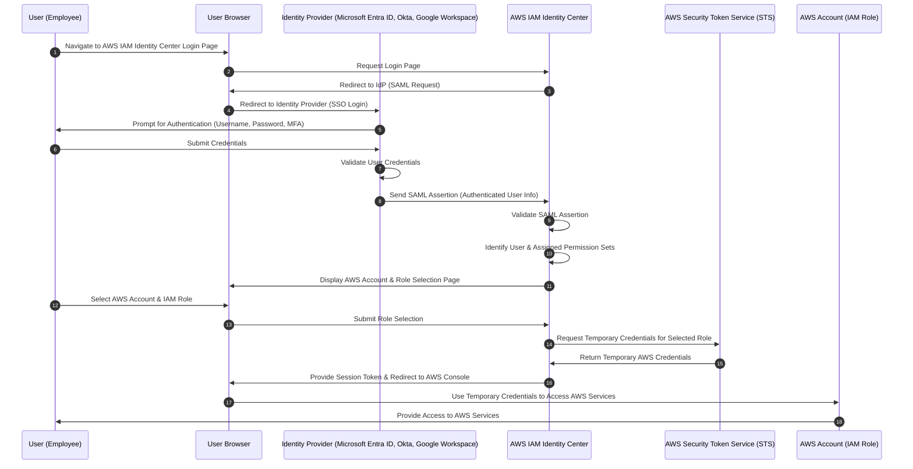
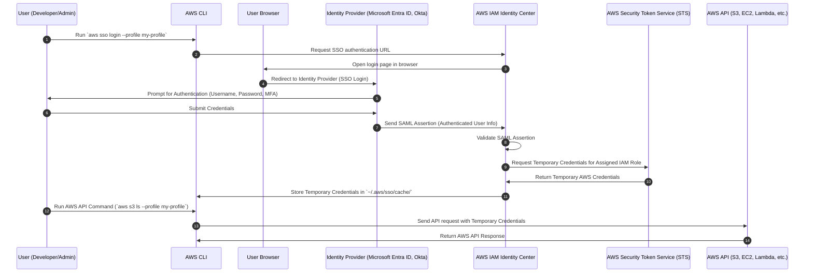

# AWS IAM Identity Center: Unified Access for Console & API Authentication

AWS **IAM Identity Center** (formerly AWS SSO) simplifies identity management and access control by providing **Single Sign-On (SSO)** for users accessing:

1. AWS Console (Web-Based Access)
1. AWS API & CLI (Programmatic Access)

| Authentication Method | Use Case                     | Session Type          |
| --------------------- | ---------------------------- | --------------------- |
| AWS Console Access    | AWS Web Console Login        | Web-Based Session     |
| AWS CLI/API Access    | CLI commands & SDK API calls | Temporary Credentials |

## 📟 **AWS Console Authentication Flow**

The diagram below outlines the **SSO authentication flow** using an external identity provider:



---

**1️⃣ User Initiates Login:**

- The **user navigates** to the **AWS IAM Identity Center login page**.
- AWS IAM Identity Center **redirects the user** to the external **Identity Provider (IdP)** for authentication.

**2️⃣ Identity Provider Authentication:**

- The **IdP prompts the user** for credentials (Username, Password, MFA).
- After authentication, the **IdP generates a SAML assertion** and sends it to **AWS IAM Identity Center**.

**3️⃣ AWS IAM Identity Center Processes the SAML Assertion:**

- IAM Identity Center **validates the SAML assertion**.
- IAM Identity Center **retrieves the user's assigned AWS accounts & IAM roles**.
- The user **selects an AWS account and IAM role**.

**4️⃣ AWS IAM Identity Center Requests Temporary AWS Credentials:**

- IAM Identity Center **requests temporary AWS credentials** from **AWS Security Token Service (STS)**.
- **STS returns short-lived credentials** that allow access to AWS services.

**5️⃣ User Gains Access to AWS Services:**

- IAM Identity Center **redirects the user** to the **AWS Management Console**.
- The **browser uses temporary credentials** to authenticate AWS API requests.
- The **user accesses AWS services** based on their assigned IAM role.

---

**✅ Security Enhancements:**

✔ **Use Multi-Factor Authentication (MFA)** for strong security.  
✔ **Limit session duration** for temporary credentials.  
✔ **Monitor login events** using **AWS CloudTrail logs**.  
✔ **Restrict access with AWS Organizations SCPs**.

---

---

## 🧑‍💻 **AWS Console Authentication Flow**

Here is the **detailed request flow** for **AWS API access via IAM Identity Center (SSO)**:



---

**1️⃣ User Logs in via AWS CLI:**

- The user **initiates authentication** by running:

  ```bash
  aws sso login --profile my-profile
  ```

- AWS CLI contacts **IAM Identity Center** to request an authentication URL.

**2️⃣ User Authenticates in Browser:**

- IAM Identity Center **redirects the user** to the **Identity Provider (IdP)**.
- The **user logs in** with **corporate credentials (Microsoft Entra ID, Okta, etc.)**.
- The **IdP verifies authentication** and sends a **SAML assertion** back to **IAM Identity Center**.

**3️⃣ IAM Identity Center Issues Temporary Credentials:**

- IAM Identity Center **validates the SAML assertion**.
- IAM Identity Center **requests temporary AWS credentials** from **AWS Security Token Service (STS)**.
- **STS issues temporary credentials**, which IAM Identity Center stores in:

  ```ini
  ~/.aws/sso/cache/
  ```

**4️⃣ User Runs AWS API Commands:**

- The user executes an **AWS CLI command**:

  ```bash
  aws s3 ls --profile my-profile
  ```

- AWS CLI **retrieves temporary credentials** from the cached session.
- The request is sent to the **AWS API (S3, EC2, Lambda, etc.)**.
- The **AWS API validates the request and returns the response**.

---

## 🚀 **Conclusion**

AWS IAM Identity Center provides a **secure and scalable** way to **authenticate users for AWS API access**. By using **SSO and temporary credentials**, organizations can:  
✔ Eliminate **hardcoded IAM user credentials**.  
✔ Enhance **security with SAML-based authentication**.  
✔ Control **multi-account access** using AWS Organizations.

🔹 **For AWS Console access** → IAM Identity Center provides **role-based login**.  
🔹 **For API/CLI access** → IAM Identity Center issues **short-lived credentials** for API requests.
