# 🔐 **AWS Cognito: User Pools & Identity Pools Architecture & Flow**

AWS Cognito provides **two main services**:

| **Component**     | **Purpose**                                                                                           | **Use Case**                                              |
| ----------------- | ----------------------------------------------------------------------------------------------------- | --------------------------------------------------------- |
| **User Pool**     | Manages **user authentication** (Sign-in, Sign-up, MFA, OAuth, Social Logins)                         | Secure authentication for applications                    |
| **Identity Pool** | Provides **temporary AWS credentials** to users from **any identity provider (including User Pools)** | Secure access to AWS services (S3, DynamoDB, API Gateway) |

🚀 **They can be used separately or together!**

---

## **1️⃣ AWS Cognito User Pool Architecture & Flow**

    

### **🔹 What is a User Pool?**

A **User Pool** is an authentication directory that provides:
✅ **Sign-in & Sign-up (Email, Username, Phone)**  
✅ **OAuth2, OpenID Connect, SAML Authentication (Google, Facebook, Apple, Custom OAuth)**  
✅ **Multi-Factor Authentication (MFA)**  
✅ **JWT Tokens (ID Token, Access Token, Refresh Token)**

---

### **✅ Corrected Sequence Diagram: User Pool Authentication (Direct & Federated Login)**

```mermaid
sequenceDiagram
    autonumber
    participant User as User
    participant Browser as User's Web Browser
    participant App as Web/Mobile App
    participant Cognito as AWS Cognito User Pool
    participant IdP as External Identity Provider (Google, Facebook, OAuth2)
    participant API as Protected Backend API

    User->>Browser: 1️⃣ Navigate to App Login Page
    Browser->>App: 2️⃣ Request Login UI
    App->>Cognito: 3️⃣ Redirect to Cognito Hosted UI

    alt Direct Cognito Authentication (Using User Pool Directory)
        Browser->>Cognito: 4️⃣ Enter Username/Password
        Cognito->>Cognito: 5️⃣ Authenticate User (Only for Cognito Directory)
    else Federated Authentication (Google, Facebook, Custom OAuth)
        Cognito->>IdP: 4️⃣ Redirect to External IdP (Google, Facebook, OAuth2)
        IdP->>User: 5️⃣ Prompt for Credentials
        User->>IdP: 6️⃣ Submit Credentials
        IdP->>Cognito: 7️⃣ Return OAuth2 Access Token
        Cognito->>Cognito: 8️⃣ Validate Token & Create Cognito User
    end

    Cognito->>Browser: 9️⃣ Return ID & Access Token (JWT)
    Browser->>App: 🔟 Pass Tokens to App
    App->>API: 11 Send API Request with Access Token
    API->>Cognito: 12 Validate Access Token
    Cognito->>API: 13 Token Valid / Expired Response
    API->>App: 14 Return Protected Data
    App->>User: 15 Display User Data
```

---

### **🛠️ How to Configure a Cognito User Pool in AWS**

1. **Go to AWS Cognito Console** → Click **Create User Pool**.
2. **Sign-in Options**:
   - Choose **Username, Email, or Phone Number**.
   - Enable **Multi-Factor Authentication (MFA)** if required.
3. **OAuth2 / Federated Authentication**:
   - Navigate to **App Integration** → **Identity Providers**.
   - Configure **Google, Facebook, Apple, or Custom OAuth Provider**.
4. **Enable Hosted UI for Authentication**.
5. **Create App Clients**:
   - **Disable Client Secret** for web/mobile apps.
   - Enable **ID, Access, and Refresh Tokens**.
6. **Save & Copy User Pool ID & App Client ID**.

---

## **2️⃣ AWS Cognito Identity Pool Architecture & Flow**

    

### **🔹 What is an Identity Pool?**

An **Identity Pool** is NOT an authentication service! Instead, it:  
✅ **Exchanges identity provider tokens (Google, Facebook, SAML, etc.) for AWS credentials**  
✅ **Maps users to IAM roles & grants AWS permissions**  
✅ **Does NOT authenticate users but relies on federated identities**

---

### **✅ Corrected Sequence Diagram: Identity Pool (Without User Pool)**

```mermaid
sequenceDiagram
    autonumber
    participant User as User
    participant Browser as User's Web Browser
    participant App as Web/Mobile App
    participant IdP as External Identity Provider (Google, Facebook, OAuth2)
    participant CognitoIdentity as Cognito Identity Pool
    participant STS as AWS Security Token Service (STS)
    participant AWS as AWS Resource (S3, DynamoDB, API Gateway)

    User->>Browser: 1️⃣ Navigate to App
    Browser->>App: 2️⃣ Request Home Page
    App->>IdP: 3️⃣ Sign-in via External IdP (Google, Facebook, OAuth2)
    IdP->>User: 4️⃣ Prompt for Credentials
    User->>IdP: 5️⃣ Submit Credentials
    IdP->>App: 6️⃣ Return OAuth2 Access Token

    App->>CognitoIdentity: 7️⃣ Exchange Token for AWS Credentials
    CognitoIdentity->>STS: 8️⃣ Request Temporary AWS Credentials
    STS->>CognitoIdentity: 9️⃣ Return AWS Credentials
    CognitoIdentity->>App: 🔟 Send Temporary AWS Credentials

    App->>AWS: 11 Access AWS Resources with Temporary Credentials
    AWS->>App: 12 Return Data
    App->>User: 13 Display Data
```

---

## **3️⃣ Using Cognito User Pool & Identity Pool Together**

    

### **Why Combine Both?**

✔ **User Pools handle authentication** (OAuth, Social, Email/Password).  
✔ **Identity Pools handle AWS IAM role management**.  
✔ **Prevents redundant identity federation configuration**.

---

### **✅ Corrected Sequence Diagram: Unified Authentication & AWS Access**

```mermaid
sequenceDiagram
    autonumber
    participant User as User
    participant Browser as User's Web Browser
    participant App as Web/Mobile App
    participant CognitoUser as Cognito User Pool (Authentication)
    participant CognitoIdentity as Cognito Identity Pool (Authorization)
    participant STS as AWS Security Token Service (STS)
    participant AWS as AWS Resource (S3, DynamoDB, API Gateway)

    User->>Browser: 1️⃣ Navigate to App
    Browser->>App: 2️⃣ Request Home Page
    App->>CognitoUser: 3️⃣ Sign-in via Cognito (Username/Password or OAuth)
    CognitoUser->>User: 4️⃣ Return ID Token

    User->>App: 5️⃣ Pass ID Token
    App->>CognitoIdentity: 6️⃣ Exchange ID Token for AWS Credentials
    CognitoIdentity->>STS: 7️⃣ Request Temporary AWS Credentials
    STS->>CognitoIdentity: 8️⃣ Return AWS Credentials
    CognitoIdentity->>App: 9️⃣ Send Temporary AWS Credentials

    App->>AWS: 🔟 Access AWS Resources with Temporary Credentials
    AWS->>App: 11 Return Data
    App->>User: 12 Display Data
```

---

## 🏆 **Final Thoughts**

AWS Cognito correctly separates:  
✔ **Authentication (User Pools - OAuth, Social, SAML, Custom Login)**  
✔ **Authorization (Identity Pools - IAM Role Mapping, AWS Access)**  
✔ **Using them together simplifies AWS permissions & access control**.

🚀 **Best Practice:**

- **Use User Pools for authentication**.
- **Use Identity Pools for AWS access**.
- **Avoid reconfiguring federated login in both places—use User Pools for identity management!**
